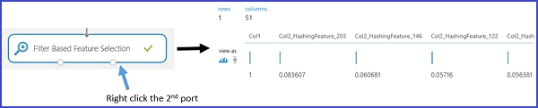

# Feature engineering and selection in Azure Machine Learning
This topic explains the purposes of feature engineering and feature selection in the data-enhancement process of machine learning. It illustrates what these processes involve by using examples provided by Azure Machine Learning Studio.

[!INCLUDE [machine-learning-free-trial](../../includes/machine-learning-free-trial.md)]

The training data used in machine learning can often be enhanced by the selection or extraction of features from the raw data collected. An example of an engineered feature in the context of learning how to classify the images of handwritten characters is a bit-density map constructed from the raw bit distribution data. This map can help locate the edges of the characters more efficiently than the raw distribution.

Engineered and selected features increase the efficiency of the training process, which attempts to extract the key information contained in the data. They also improve the power of these models to classify the input data accurately and to predict outcomes of interest more robustly. Feature engineering and selection can also combine to make the learning more computationally tractable. It does so by enhancing and then reducing the number of features needed to calibrate or train a model. Mathematically speaking, the features selected to train the model are a minimal set of independent variables that explain the patterns in the data and then predict outcomes successfully.

The engineering and selection of features is one part of a larger process, which typically consists of four steps:

* Data collection
* Data enhancement
* Model construction
* Post-processing

Engineering and selection make up the data enhancement step of machine learning. Three aspects of this process may be distinguished for our purposes:

* **Data pre-processing**: This process tries to ensure that the collected data is clean and consistent. It includes tasks such as integrating multiple data sets, handling missing data, handling inconsistent data, and converting data types.
* **Feature engineering**: This process attempts to create additional relevant features from the existing raw features in the data and to increase predictive power to the learning algorithm.
* **Feature selection**: This process selects the key subset of original data features to reduce the dimensionality of the training problem.

This topic only covers the feature engineering and feature selection aspects of the data enhancement process. For more information on the data pre-processing step, see [Pre-processing data in Azure Machine Learning Studio](https://azure.microsoft.com/documentation/videos/preprocessing-data-in-azure-ml-studio/).

## Creating features from your data--feature engineering
The training data consists of a matrix composed of examples (records or observations stored in rows), each of which has a set of features (variables or fields stored in columns). The features specified in the experimental design are expected to characterize the patterns in the data. Although many of the raw data fields can be directly included in the selected feature set used to train a model, additional engineered features often need to be constructed from the features in the raw data to generate an enhanced training data set.

What kind of features should be created to enhance the data set when training a model? Engineered features that enhance the training provide information that better differentiates the patterns in the data. You expect the new features to provide additional information that is not clearly captured or easily apparent in the original or existing feature set, but this process is something of an art. Sound and productive decisions often require some domain expertise.

When starting with Azure Machine Learning, it is easiest to grasp this process concretely by using samples provided in Machine Learning Studio. Two examples are presented here:

* A regression example ([Prediction of the number of bike rentals](http://gallery.cortanaintelligence.com/Experiment/Regression-Demand-estimation-4)) in a supervised experiment where the target values are known
* A text-mining classification example using [Feature Hashing][feature-hashing]

### Example 1: Adding temporal features for a regression model
To demonstrate how to engineer features for a regression task, let's use the experiment "Demand forecasting of bikes" in Azure Machine Learning Studio. The objective of this experiment is to predict the demand for the bikes, that is, the number of bike rentals within a specific month, day, or hour. The data set **Bike Rental UCI data set** is used as the raw input data.

This data set is based on real data from the Capital Bikeshare company that maintains a bike rental network in Washington DC in the United States. The data set represents the number of bike rentals within a specific hour of a day, from 2011 to 2012, and it contains 17379 rows and 17 columns. The raw feature set contains weather conditions (temperature, humidity, wind speed) and the type of the day (holiday or weekday). The field to predict is **cnt**, a count that represents the bike rentals within a specific hour and that ranges from 1 to 977.

To construct effective features in the training data, four regression models are built by using the same algorithm, but with four different training data sets. The four data sets represent the same raw input data, but with an increasing number of features set. These features are grouped into four categories:

1. A = weather + holiday + weekday + weekend features for the predicted day
2. B = number of bikes that were rented in each of the previous 12 hours
3. C = number of bikes that were rented in each of the previous 12 days at the same hour
4. D = number of bikes that were rented in each of the previous 12 weeks at the same hour and the same day

Besides feature set A, which already exists in the original raw data, the other three sets of features are created through the feature engineering process. Feature set B captures the recent demand for the bikes. Feature set C captures the demand for bikes at a particular hour. Feature set D captures demand for bikes at particular hour and particular day of the week. Each of the four training data sets includes feature sets A, A+B, A+B+C, and A+B+C+D, respectively.

In the Azure Machine Learning experiment, these four training data sets are formed via four branches from the pre-processed input data set. Except for the leftmost branch, each of these branches contains an [Execute R Script][execute-r-script] module in which a set of derived features (feature sets B, C, and D) is respectively constructed and appended to the imported data set. The following figure demonstrates the R script used to create feature set B in the second left branch.

The following table summarizes the comparison of the performance results of the four models. The best results are shown by features A+B+C. Note that the error rate decreases when additional feature sets are included in the training data. This verifies our presumption that the feature sets B and C provide additional relevant information for the regression task. Adding the D feature set does not seem to provide any additional reduction in the error rate.

###  Example 2: Creating features in text mining
Feature engineering is widely applied in tasks related to text mining, such as document classification and sentiment analysis. For example, when you want to classify documents into several categories, a typical assumption is that the words or phrases included in one document category are less likely to occur in another document category. In other words, the frequency of the word or phrase distribution is able to characterize different document categories. In text mining applications, the feature engineering process is needed to create the features involving word or phrase frequencies because individual pieces of text-contents usually serve as the input data.

To achieve this task, a technique called *feature hashing* is applied to efficiently turn arbitrary text features into indices. Instead of associating each text feature (words or phrases) to a particular index, this method functions by applying a hash function to the features and by using their hash values as indices directly.

In Azure Machine Learning, there is a [Feature Hashing][feature-hashing] module that creates these word or phrase features. The following figure shows an example of using this module. The input data set contains two columns: the book rating ranging from 1 to 5 and the actual review content. The goal of this [Feature Hashing][feature-hashing] module is to retrieve new features that show the occurrence frequency of the corresponding words or phrases within the particular book review. To use this module, you need to complete the following steps:

1. Select the column that contains the input text (**Col2** in this example).
2. Set *Hashing bitsize* to 8, which means 2^8=256 features are created. The word or phrase in the text is then hashed to 256 indices. The parameter *Hashing bitsize* ranges from 1 to 31. If the parameter is set to a larger number, the words or phrases are less likely to be hashed into the same index.
3. Set the parameter *N-grams* to 2. This retrieves the occurrence frequency of unigrams (a feature for every single word) and bigrams (a feature for every pair of adjacent words) from the input text. The parameter *N-grams* ranges from 0 to 10, which indicates the maximum number of sequential words to be included in a feature.  

The following figure shows what these new features look like.

## Filtering features from your data--feature selection
*Feature selection* is a process that is commonly applied to the construction of training data sets for predictive modeling tasks such as classification or regression tasks. The goal is to select a subset of the features from the original data set that reduces its dimensions by using a minimal set of features to represent the maximum amount of variance in the data. This subset of features contains the only features to be included to train the model. Feature selection serves two main purposes:

* Feature selection often increases classification accuracy by eliminating irrelevant, redundant, or highly correlated features.
* Feature selection decreases the number of features, which makes the model training process more efficient. This is particularly important for learners that are expensive to train such as support vector machines.

Although feature selection seeks to reduce the number of features in the data set used to train the model, it is not usually referred to by the term *dimensionality reduction.* Feature selection methods extract a subset of original features in the data without changing them.  Dimensionality reduction methods employ engineered features that can transform the original features and thus modify them. Examples of dimensionality reduction methods include principal component analysis, canonical correlation analysis, and singular value decomposition.

One widely applied category of feature selection methods in a supervised context is filter-based feature selection. By evaluating the correlation between each feature and the target attribute, these methods apply a statistical measure to assign a score to each feature. The features are then ranked by the score, which you can use to set the threshold for keeping or eliminating a specific feature. Examples of the statistical measures used in these methods include Pearson Correlation, mutual information, and the Chi-squared test.

Azure Machine Learning Studio provides modules for feature selection. As shown in the following figure, these modules include [Filter-Based Feature Selection][filter-based-feature-selection] and [Fisher Linear Discriminant Analysis][fisher-linear-discriminant-analysis].

For example, use the [Filter-Based Feature Selection][filter-based-feature-selection] module with the text mining example outlined previously. Assume that you want to build a regression model after a set of 256 features is created through the [Feature Hashing][feature-hashing] module, and that the response variable is **Col1** and represents a book review rating ranging from 1 to 5. Set **Feature scoring method** to **Pearson Correlation**, **Target column** to **Col1**, and **Number of desired features** to **50**. The module [Filter-Based Feature Selection][filter-based-feature-selection] then produces a data set containing 50 features together with the target attribute **Col1**. The following figure shows the flow of this experiment and the input parameters.

The following figure shows the resulting data sets. Each feature is scored based on the Pearson Correlation between itself and the target attribute **Col1**. The features with top scores are kept.

The following figure shows the corresponding scores of the selected features.

By applying this [Filter-Based Feature Selection][filter-based-feature-selection] module, 50 out of 256 features are selected because they have the most features correlated with the target variable **Col1** based on the scoring method **Pearson Correlation**.

## Conclusion
Feature engineering and feature selection are two steps commonly performed to prepare the training data when building a machine learning model. Normally, feature engineering is applied first to generate additional features, and then the feature selection step is performed to eliminate irrelevant, redundant, or highly correlated features.

It is not always necessarily to perform feature engineering or feature selection. Whether it is needed depends on the data you have or collect, the algorithm you pick, and the objective of the experiment.

<!-- Module References -->
[execute-r-script]: https://msdn.microsoft.com/library/azure/30806023-392b-42e0-94d6-6b775a6e0fd5/
[feature-hashing]: https://msdn.microsoft.com/library/azure/c9a82660-2d9c-411d-8122-4d9e0b3ce92a/
[filter-based-feature-selection]: https://msdn.microsoft.com/library/azure/918b356b-045c-412b-aa12-94a1d2dad90f/
[fisher-linear-discriminant-analysis]: https://msdn.microsoft.com/library/azure/dcaab0b2-59ca-4bec-bb66-79fd23540080/
