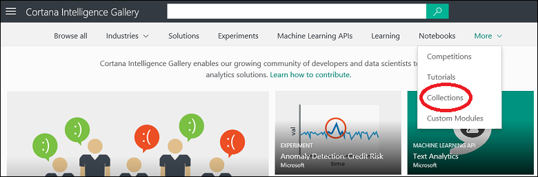

<properties
	pageTitle="Cortana Intelligence Gallery collections | Microsoft Azure"
	description="Discover and share collections in the Cortana Intelligence Gallery."
	services="machine-learning"
	documentationCenter=""
	authors="garyericson"
	manager="jhubbard"
	editor="cgronlun"/>

<tags
	ms.service="machine-learning"
	ms.workload="data-services"
	ms.tgt_pltfrm="na"
	ms.devlang="na"
	ms.topic="article"
	ms.date="10/13/2016"
	ms.author="roopalik;garye"/>

# Discover and share collections in the Cortana Intelligence Gallery

[AZURE.INCLUDE [machine-learning-gallery-item-selector](../../includes/machine-learning-gallery-item-selector.md)]

## Collections

A
**[Collection](https://gallery.cortanaintelligence.com/collections)**
allows you to group together experiments, APIs, and other Gallery items that address a specific solution or concept. These can be grouped together for later reference, use, or sharing.

## Discover

To browse for collections in the Gallery, open the [Gallery](http://gallery.cortanaintelligence.com), point your mouse at **More** at the top of the Gallery home page, and select **Collections**.

 The
**[Collections](https://gallery.cortanaintelligence.com/collections)**
 page displays a list of the most recently added and most popular
collections.
 Click **See all** to view all
collections.
 From this page you can browse all the
collections
 in the Gallery, or you can search by selecting filter criteria on the left of the page and entering search terms at the top.

 Click any
collection
 to open the
collection's
 details page and read more information about it.
 On this page you can comment, provide feedback, or ask questions through the comments section. You can even share it with friends or colleagues using the share capabilities of LinkedIn or Twitter. You can also email a link to the
experiment
 to invite other users to view the page.

## Contribute

You can create a collection that contains items that you own or items that have been contributed by the community. They can be any Gallery items that address a specific solution or concept

For example, you can use a collection to group together items on a specific topic, or you can group together a multi-step experiment that solves a complex problem.
The initial collections contributed by Microsoft consist of multi-step machine learning experiment templates for solving real world problems, such as online fraud detection, text classification, retail forecasting, and predictive maintenance.

### Create a collection

Follow these steps to create and contribute a collection to the Cortana Intelligence Gallery:

1. Sign in to the Gallery using your Microsoft account

- Click your image at the top of the window and then click your name

	

2. Click **New Item**

	

3. Select **Collection** for **Item Type**, then give the collection a name, a brief summary, a description, and any tags that will help users find the collection

	

4. Click **Next** - you can upload an image file, or select a stock image, that will be displayed with the collection; choose something that will help users identify the content and purpose of the collection

	

5. Click **Next** - you can decide whether the collection is **Public** (it can be viewed by anyone) or **Unlisted** (only people with a direct link can view the collection)

	> [AZURE.IMPORTANT] Once you set a collection to **Public**, you can not set it to **Unlisted**.

	

6. Click **Create**

Your collection is now part of the Cortana Intelligence Gallery. It will be listed on your account page under the **Collection** tab.

### Add items to a collection

You can add items to your collection by opening the collection, clicking **Edit**, and then clicking **Add Item**.

You'll be shown a list of items you've contributed to the Gallery, or you can search the Gallery for items to add. Click an item to select it. Every item you select is included in the set of items to add - the **Add** button indicates how many items have been selected.

Or, if you find an item while browsing through the Gallery that you want to include, just open the item, click **Add to collection**, and specify the collection you want to add it to.

You can change the summary, description, or tags of your collection by opening the collection and clicking **Edit**.
While you're editing your collection, you can also change the order of the items in the collection by using the arrow buttons next to an item to move it in the list. And you add notes to the items in your collection by clicking the upper-right corner of an item and selecting **Add/Edit note**. To remove an item from your collection, select **Remove**.

**[TAKE ME TO THE GALLERY >>](http://gallery.cortanaintelligence.com)**

[AZURE.INCLUDE [machine-learning-free-trial](../../includes/machine-learning-free-trial.md)]
