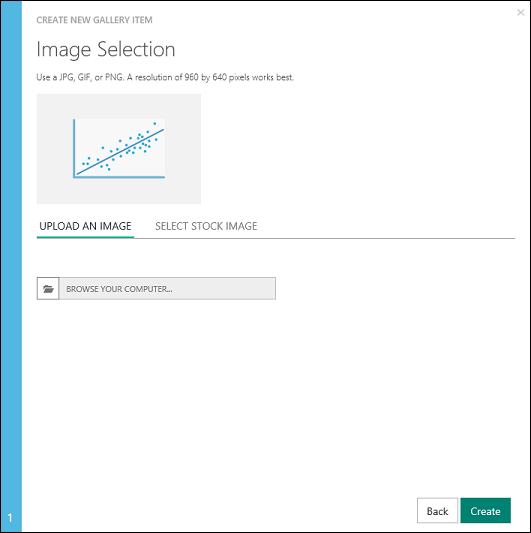

# Discover and share collections in the Cortana Intelligence Gallery
[!INCLUDE [machine-learning-gallery-item-selector](../../includes/machine-learning-gallery-item-selector.md)]

## Collections
You can use a **[collection](https://gallery.cortanaintelligence.com/collections)** to group experiments, APIs, and other Gallery items that you use for a specific solution or concept. You can group them for later reference or to share.

## Discover
To browse collections [in the Gallery](http://gallery.cortanaintelligence.com), under **More**, select **Collections**.

 The **[Collections](https://gallery.cortanaintelligence.com/collections)**  page displays a list of the most recently added and most popular collections.  Select the **See all** button to view all collections. To search for a specific collection, you can select filter criteria or enter search terms.

To read more information about a collection, you can click any collection to open the collection's details page. On a collection's details page, under **Comments**, you can comment, provide feedback, or ask questions. You can even share the collection with friends or colleagues on LinkedIn or Twitter. You also can email a link to the experiment, to invite other users to view the page.

## Contribute
You can create a collection that contains items that you own or items that have been contributed by the community. An item in a collection can be any Gallery item that addresses a specific solution or concept.

For example, you can use a collection to group items on a specific topic, or you can group a multi-step experiment that solves a complex problem. The initial collections contributed by Microsoft consist of multi-step machine learning experiment templates. The templates can be used for solving real-world problems, such as online fraud detection, text classification, retail forecasting, or predictive maintenance.

### Create a collection
To create and contribute a collection to the Cortana Intelligence Gallery, complete these steps:

1. Sign in to the Gallery by using your Microsoft account.

2.  Select your image at the top of the window, and then select your name.
  
    

3. Click **New Item**.
   
    
4. For **Item Type**, select **Collection**. Enter a name, a brief summary, a description, and any tags that might help users find the collection.
   
    
5. Select **Next**. You can select an image that will be displayed with the collection. You can upload your own image file, or select a stock image. Choose an image that might help users identify the content and purpose of the collection.
   
    
6. Select **Next**. You can choose whether the collection is **Public** (anyone can view the collection) or **Unlisted** (only people with a direct link can view the collection).
   
   > [!IMPORTANT]
   > If you set a collection to **Public** and select **Create**, you cannot later change it to **Unlisted**.
   > 
   > 
   
    
7. Select **Create**.

Your collection is now part of the Cortana Intelligence Gallery. Your collections are listed on your account page, on the **Collection** tab.

### Add items to a collection
To add items to your collection, open the collection, select **Edit**, and then select **Add Item**.

A list of items you've contributed to the Gallery is shown on your account page. You also can search the Gallery for items to add. Select the items you want to add. Every item that you select is included in the set of items to add. The **Add** button indicates how many items you have selected.

If you find an item that you want to add while you are browsing the Gallery, open the item, select **Add to collection**, and specify the collection you want to add it to.

To change the summary, description, or tags of your collection, open the collection, and then select **Edit**.
While you are editing your collection, you can change the order of the items in the collection. Use the arrow buttons next to an item to move it up or down in the list. To add notes to the items in your collection, select the upper-right corner of an item, and then select **Add/Edit note**. To remove an item from your collection, select **Remove**.

**[TAKE ME TO THE GALLERY >>](http://gallery.cortanaintelligence.com)**

[!INCLUDE [machine-learning-free-trial](../../includes/machine-learning-free-trial.md)]

