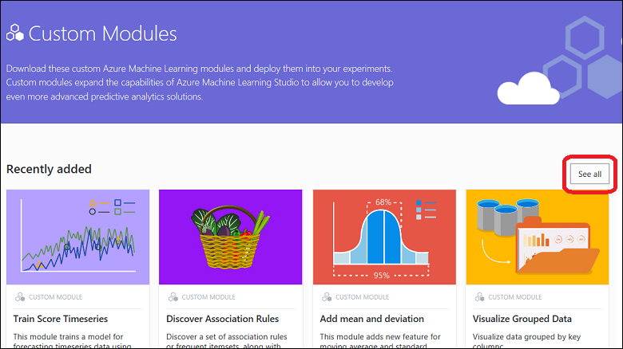

# Discover custom machine learning modules in Cortana Intelligence Gallery
[!INCLUDE [machine-learning-gallery-item-selector](../../includes/machine-learning-gallery-item-selector.md)]

## Custom modules for Machine Learning Studio
Cortana Intelligence Gallery offers several [custom modules](https://gallery.cortanaintelligence.com/customModules) that expand the capabilities of Azure Machine Learning Studio. You can import the modules to use in your experiments, so you can develop even more advanced predictive analytics solutions.

Currently, the Gallery offers modules on *time series analytics*, *association rules*, *clustering algorithms* (beyond k-means), and *visualizations*, and other workhorse utility modules.

## Discover
To browse custom modules [in the Gallery](http://gallery.cortanaintelligence.com), under **More**, select **Custom Modules**.

The **[Custom Modules](https://gallery.cortanaintelligence.com/customModules)** page displays a list of recently added and popular modules. To view all custom modules, select the **See all** button. To search for a specific custom module, select **See all**, and then select filter criteria. You also can enter search terms in the **Search** box at the top of the Gallery page.

### Understand

To understand how a published custom module works, select the custom module to open the module details page. The details page delivers a consistent and informative learning experience. For example, the details page highlights the purpose of the module, and it lists expected inputs, outputs, and parameters. The details page also has a link to the underlying source code, which you can examine and customize.

### Comment and share
On a custom module details page, in the **Comments** section, you can comment, provide feedback, or ask questions about the module. You can even share the module with friends or colleagues on Twitter or LinkedIn. You also can email a link to the module details page, to invite other users to view the page.

## Import
You can import any custom module from the Gallery to your own experiments.

Cortana Intelligence Gallery offers two ways to import a copy of the module:

* **From the Gallery**. When you import a custom module from the Gallery, you also get a sample experiment that gives you an example of how to use the module.
* **From within Machine Learning Studio**. You can import any custom module while you're working in Machine Learning Studio (in this case, you don't get the sample experiment).

### From the Gallery

1. In the Gallery, open the module details page. 
2. Select **Open in Studio**.
   
    
   
Each custom module includes a sample experiment that demonstrates how to use the module. When you select **Open in Studio**, the sample experiment opens in your Machine Learning Studio workspace. (If you're not already signed in to Studio, you are prompted to first sign in by using your Microsoft account.)

In addition to the sample experiment, the custom module is copied to your workspace. It's also placed in your module palette, with all your built-in or custom Machine Learning Studio modules. You can now use it in your own experiments, like any other module in your workspace.

### From within Machine Learning Studio

1. In Machine Learning Studio, select **NEW**.
2. Select **Module**. You can choose from a list of Gallery modules, or find a specific module by using the **Search** box.
3. Point your mouse at a module, and then select **Import Module**. (To get information about the module, select **View in Gallery**. This takes you to the module details page in the Gallery.)
   
    

The custom module is copied to your workspace and placed in your module palette, with your built-in or custom Machine Learning Studio modules. You can now use it in your own experiments, like any other module in your workspace.

## Use

Regardless of which method you choose to import a custom module, when you import the module, the module is placed in your module palette in Machine Learning Studio. From your module palette, you can use the custom module in any experiment in your workspace, just like any other module.

To use an imported module:

1. Create an experiment, or open an existing experiment.
2. To expand the list of custom modules in your workspace, in the module palette, select **Custom**. The module palette is to the left of the experiment canvas.
   
    
3. Select the module that you imported, and drag it to your experiment.

**[Go to the Gallery](http://gallery.cortanaintelligence.com)**

[!INCLUDE [machine-learning-free-trial](../../includes/machine-learning-free-trial.md)]

