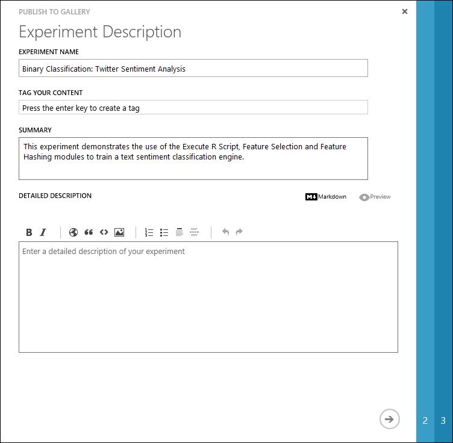
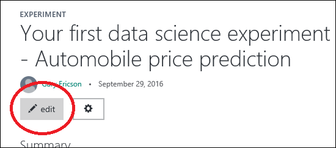

# Discover experiments in Cortana Intelligence Gallery
[!INCLUDE [machine-learning-gallery-item-selector](../../includes/machine-learning-gallery-item-selector.md)]

## Experiments for Machine Learning Studio
The Gallery has a wide variety of [experiments](https://gallery.cortanaintelligence.com/experiments) that have been developed in [Azure Machine Learning Studio](https://studio.azureml.net). Experiments range from quick proof-of-concept experiments that demonstrate a specific machine learning technique, to fully developed solutions for complex machine learning problems.

> [!NOTE]
> An ***experiment*** is a canvas in Machine Learning Studio that you can use to construct a predictive analysis model. You create the model by connecting data with various analytical modules. You can try different ideas, do trial runs, and eventually deploy your model as a web service in Azure. For an example of how to create a basic experiment, see [Machine learning tutorial: Create your first experiment in Azure Machine Learning Studio](machine-learning-create-experiment.md). For a more comprehensive walkthrough of how to create a predictive analytics solution, see [Walkthrough: Develop a predictive analytics solution for credit risk assessment in Azure Machine Learning](machine-learning-walkthrough-develop-predictive-solution.md).
>
>

## Discover
To browse experiments [in the Gallery](http://gallery.cortanaintelligence.com), at the top of the Gallery home page, select **Experiments**.

The **[Experiments](https://gallery.cortanaintelligence.com/experiments)** page displays a list of recently added and popular experiments. To see all experiments, select the **See all** button. To search for a specific experiment, select **See all**, and then select filter criteria. You also can enter search terms in the **Search** box at the top of the Gallery page.

You can get more information about an experiment on the experiment details page. To open an experiment details page, select the experiment. On an experiment details page, in the **Comments** section, you can comment, provide feedback, or ask questions about the experiment. You can even share the experiment with friends or colleagues on Twitter or LinkedIn. You also can mail a link to the experiment details page, to invite other users to view the page.

## Download
You can download a copy of any experiment in the Gallery to your Machine Learning Studio workspace. Then, you can modify your copy to create your own solutions.

Cortana Intelligence Gallery offers two ways to import a copy of an experiment:

* **From the Gallery**. If you find an experiment that you like in the Gallery, you can download a copy and then open it in your Machine Learning Studio workspace.
* **From within Machine Learning Studio**. In Machine Learning Studio, you can use any experiment in the Gallery as a template to create a new experiment.

### From the Gallery

1. In the Gallery, open the experiment details page.
2. Select **Open in Studio**.

    

When you select **Open in Studio**, the experiment opens in your Machine Learning Studio workspace. (If you're not already signed in to Machine Learning Studio, you are prompted to first sign in by using your Microsoft account.)

### From within Machine Learning Studio

1. In Machine Learning Studio, select **NEW**.
2. Select **Experiment**. You can choose from a list of Gallery experiments, or find a specific experiment by using the **Search** box.
3. Point your mouse at an experiment, and then select **Open in Studio**. (To see information about the experiment, select **View in Gallery**. This takes you to the experiment details page in the Gallery.)

    

You can customize, iterate, and deploy a downloaded experiment like any other experiment that you create in Machine Learning Studio.

## Contribute
When you sign in to the Gallery, you become a member of the Gallery community. As a member of the community, you can contribute your own experiments, so other users can benefit from the solutions that you've discovered.

### Publish your experiment to the Gallery

1. Sign in to Machine Learning Studio by using your Microsoft account.
2. Create your experiment, and then run it.
3. When you’re ready to publish your experiment in the Gallery, in the list of actions below the experiment canvas, select **Publish to Gallery**.

    
4. On the **Experiment Description** page, enter a title and tags. Make the title and tags descriptive. Highlight the techniques you used or the real-world problem you are solving. An example of a descriptive experiment title is “Binary Classification: Twitter Sentiment Analysis.”

    
5. In the **SUMMARY** box, enter a summary of your experiment. Briefly describe the problem the experiment solves, and how you approached it.
6. In the **DETAILED DESCRIPTION** box, describe the steps you took in each part of your experiment. Some useful topics to include are:
   * Experiment graph screenshot
   * Data sources and explanation
   * Data processing
   * Feature engineering
   * Model description
   * Results and evaluation of model performance

   You can use markdown to format your description. To see how your entries on the experiment description page will look when the experiment is published, select **Preview**.

   

   > [!TIP]
   > The text boxes provided for markdown editing and preview are small. We recommend that you write your experiment documentation in a markdown editor, copy it, and then paste the completed documentation in the text box in the Gallery. After you publish your experiment, you can make any corrections by using standard web-based tools that use markdown for edit and preview.

7. On the **Image Selection** page, choose a thumbnail image for your experiment. The thumbnail image appears at the top of the experiment details page and in the experiment tile. Other users will see the thumbnail image when they browse the Gallery. You can upload an image from your computer, or select a stock image from the Gallery.
     
    
8. On the **Settings** page, under **Visibility**, choose whether to publish your content publicly (**Public**) or to have it accessible only to people who have a link to the page (**Unlisted**).

    

    <!-- -->

   > [!TIP]
   > If you want to make sure your documentation looks correct before you release it publicly, you can first publish the experiment as **Unlisted**. Later, you can change the visibility setting to **Public** on the experiment details page.
   >
   >
9. To publish the experiment to the Gallery, select the **OK** check mark.

    

For tips on how to publish a high-quality Gallery experiment, see [Tips for documenting and publishing your experiment](#tips-for-documenting-and-publishing-your-experiment).

That’s it--you’re all done.

You can now view your experiment in the Gallery, and share the link with others. If you published your experiment by using the **Public** visibility setting, the experiment shows up in browse and search results in the Gallery. You can edit your experiment documentation on the experiment details page any time you are signed in to the Gallery.

To see the list of your contributions, select your image in the upper-right corner of any Gallery page. Then, select your name to open your account page.

### Update your experiment
If you need to, you can make changes to the workflow (modules, parameters, and so on) in an experiment that you published to the Gallery. In Machine Learning Studio, make any changes you'd like to make to the experiment, and then publish again. Your published experiment will be updated with your changes.

You can change any of the following information for your experiment directly in the Gallery:

* Experiment name
* Summary or description
* Tags
* Image
* Visibility setting (**Public** or **Unlisted**)

You also can delete the experiment from the Gallery.

You can make these changes, or delete the experiment, from the experiment details page or from your profile page in the Gallery.

#### From the experiment details page
On the experiment details page, to change the details for your experiment, select **Edit**.

The details page enters edit mode. To make changes, select **Edit** next to the experiment name, summary, or tags. When you're finished making changes, select **Done**.

To change the visibility settings for the experiment (**Public** or **Unlisted**), or to delete the experiment from the Gallery, select the **Settings** icon.

#### From your profile page
On your profile page, select the down arrow for the experiment, and then select **Edit**. This takes you to the details page for your experiment, in edit mode. When you are finished making changes, select **Done**.

To delete the experiment from the Gallery, select **Delete**.

### Tips for documenting and publishing your experiment
* You can assume that the reader has prior data science experience, but it can be helpful to use simple language. Explain things in detail whenever possible.
* Cortana Intelligence Suite is relatively new. Not all readers are familiar with how to use it. Provide enough information and step-by-step explanations to help readers navigate your experiment.
* Visuals can be helpful for readers to interpret and use your experiment documentation correctly. Visuals include experiment graphs and screenshots of data. For more information about how to include images in your experiment documentation, see the [Publishing Guidelines and Examples collection](https://gallery.cortanaintelligence.com/Collection/Publishing-Guidelines-and-Examples-1).
* If you include a data set in your experiment (that is, you're not importing the dataset through the Import Data module), the data set is part of your experiment and is published in the Gallery. Make sure that the data set you publish has licensing terms that allow sharing and downloading by anyone. Gallery contributions are covered under the Azure [Terms of Use](https://azure.microsoft.com/support/legal/website-terms-of-use/).

## Frequently asked questions
**What are the requirements for submitting or editing an image for my experiment?**

Images that you submit with your experiment are used to create an experiment tile for your contribution. We recommend that images be smaller than 500 KB, with an aspect ratio of 3:2, and a resolution of 960 &#215; 640.

**What happens to the data set I used in the experiment? Is the data set also published in the Gallery?**

If your data set is part of your experiment and is not being imported through the Import Data module, the data set is published in the Gallery as part of your experiment. Make sure that the data set that you publish with your experiment has the appropriate licensing terms. The licensing terms should allow anyone to share and download the data.

**I have an experiment that uses an Import Data module to pull data from Azure HDInsight or SQL Server. It uses my credentials to retrieve the data. Can I publish this kind of experiment? How can I be assured that my credentials won't be shared?**

Currently, you cannot publish an experiment that uses credentials in the Gallery.

**How do I enter multiple tags?**

After you enter a tag, to enter another tag, press the Tab key.

**[Go to the Gallery](http://gallery.cortanaintelligence.com)**

[!INCLUDE [machine-learning-free-trial](../../includes/machine-learning-free-trial.md)]
