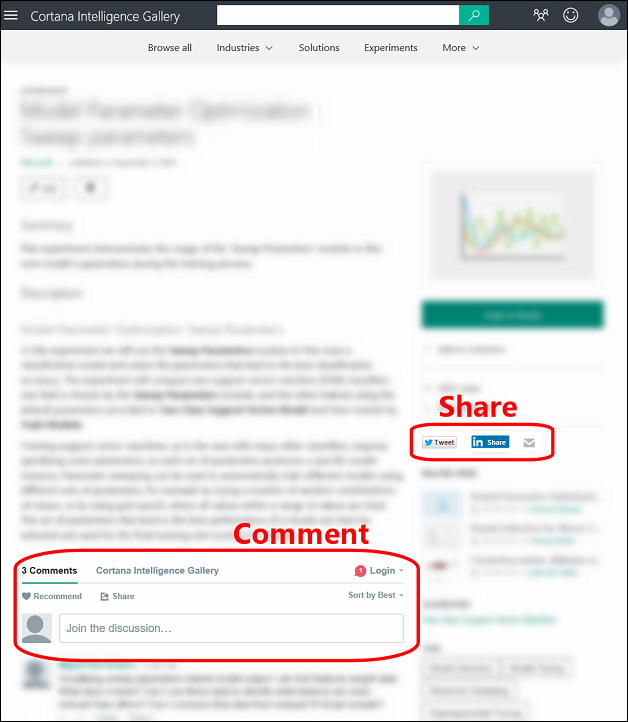
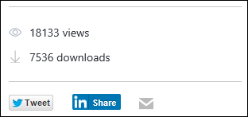
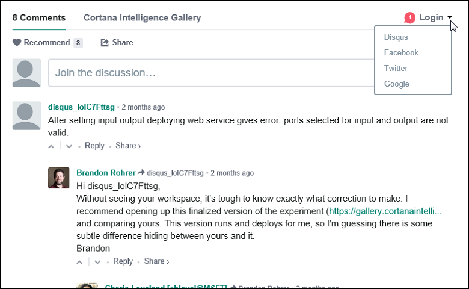

# Share and discover resources in the Cortana Intelligence Gallery
[!INCLUDE [gallery-item-selector](../../includes/machine-learning-gallery-item-selector.md)]

<!-- separating these 2 includes -->

[!INCLUDE [machine-learning-free-trial](../../includes/machine-learning-free-trial.md)]

## What can I find in the Gallery?
The Cortana Intelligence Gallery contains a variety of resources that you can use to develop your own analytics solutions.

* **[Experiments](machine-learning-gallery-experiments.md)** - The Gallery contains a wide variety of experiments that have been developed in Azure Machine Learning Studio. These range from quick proof-of-concept experiments that demonstrate a specific machine learning technique, to fully-developed solutions for complex machine learning problems.
* **[Jupyter Notebooks](machine-learning-gallery-jupyter-notebooks.md)** - Jupyter Notebooks include code, data visualizations, and documentation in a single, interactive canvas.
  Notebooks in the Gallery provide tutorials and detailed explanations of advanced machine learning techniques and solutions.

<!--
- **[Machine Learning APIs](https://machine-learning-gallery-apis.md)** - An experiment developed in Azure Machine Learning can be launched as a web service so that the analytics model can be accessed by others through a set of REST APIs. A variety of these APIs are available in the Gallery, such as a product recommendation engine or cloud-based face and speech recognition.
-->

* **[Solutions](machine-learning-gallery-solutions.md)** - Quickly build Cortana Intelligence Solutions from preconfigured solutions, reference architectures, and design patterns. Make them your own with the included instructions or with a featured partner.
* **[Tutorials](machine-learning-gallery-tutorials.md)** - A number of tutorials are available to walk you through machine learning technologies and concepts, or to describe advanced methods for solving various machine learning problems.

These basic Gallery resources can be grouped together logically in a couple different ways:

* **[Collections](machine-learning-gallery-collections.md)** - A collection allows you to group together experiments, APIs, and other Gallery items that address a specific solution or concept.
* **[Industries](machine-learning-gallery-industries.md)** - The Industries section of the Gallery brings together various resources that are specific to such industries as retail, manufacturing, banking, and healthcare.

Finally, **[Competitions](machine-learning-gallery-competitions.md)** provide an exciting opportunity to compete with the community of data scientsts to solve complex problems using Cortana Intelligence Suite.

## Discover and learn
Anyone can browse and search the different types of resources in the Gallery that have been contributed by Microsoft and the advanced analytics community.
Use these to learn more and get a head start on solving your own data analysis problems.
You can also download experiments and Jupyter notebooks to your own Machine Learning Studio workspace.

You can easily find recently published and popular resources in the Gallery, or you can search by name, tags, algorithms, and other attributes.
Click **Browse all** in the Gallery header, and then select search refinements on the left of the page and enter search terms at the top.

View contributions from a particular author by clicking the author name from within any of the tiles:

You can comment, provide feedback, or ask questions through the comments section on each resource page.
You can even share a resource of interest with friends or colleagues using the share capabilities of LinkedIn or Twitter.
You may also email links to these resources to invite other users to view the pages.

## Contribute to the Gallery
When you sign in you become a member of the Gallery community. This allows you to contribute your own Gallery items so that others can benefit from the solutions you've discovered.

As others come across your contribution in the Gallery, you can follow the number of views and downloads of your contribution:

Users can also add comments and share your contribution with other members of the data science community.
You can log in with a discussion tool such as Disqus and receive notifications for comments on your contributions.

You can contribute the following items to the Gallery - follow these links for more information:

* **[Collections](machine-learning-gallery-collections.md#contribute)**
* **[Experiments](machine-learning-gallery-experiments.md#contribute)**
* **[Tutorials](machine-learning-gallery-tutorials.md#contribute)**

## We want to hear from you!
We want the Gallery to be driven by our users and for our users. Use the smiley on the right to tell us what you love or hate about the Gallery.  

**[TAKE ME TO THE GALLERY >>](http://gallery.cortanaintelligence.com)**

