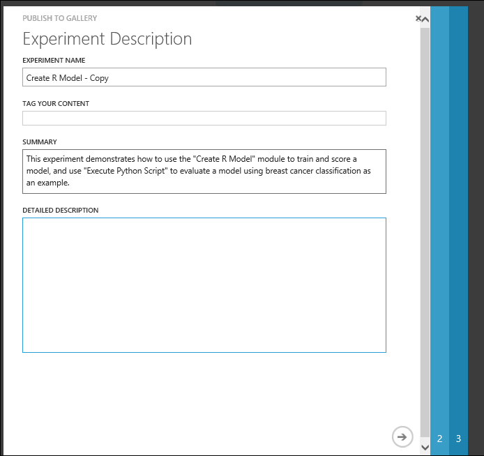
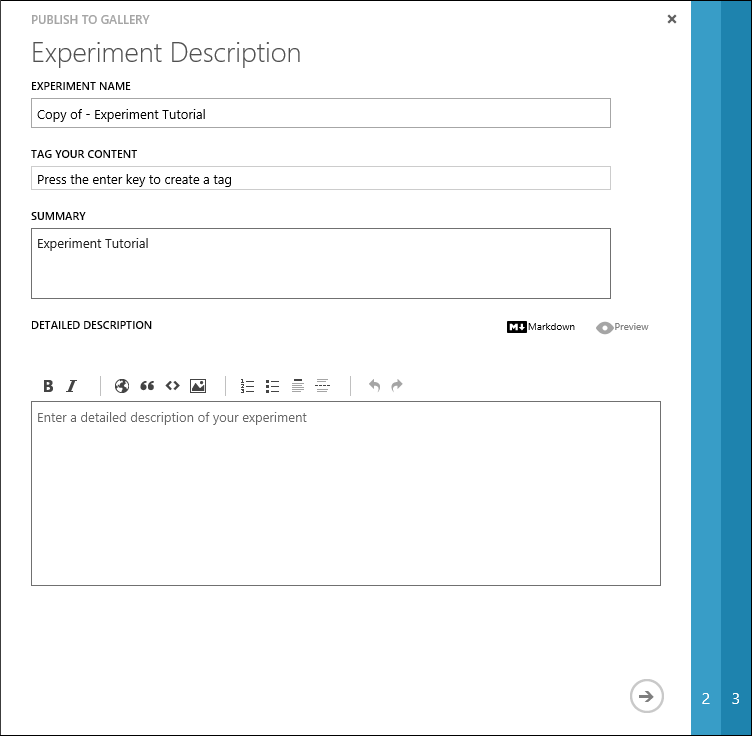

<properties
	pageTitle="Cortana Intelligence Gallery | Microsoft Azure"
	description="Share and discover analytics solutions and more in the Cortana Intelligence Gallery. Learn from others and make your own contributions to the community."
	services="machine-learning"
	documentationCenter=""
	authors="garyericson"
	manager="paulettm"
	editor="cgronlun"/>

<tags
	ms.service="machine-learning"
	ms.workload="data-services"
	ms.tgt_pltfrm="na"
	ms.devlang="na"
	ms.topic="article"
	ms.date="08/05/2016"
	ms.author="roopalik;garye"/>

# Share and discover solutions in the Cortana Intelligence Gallery

The Cortana Intelligence Gallery is a community driven site for discovering and sharing solutions built with the Cortana Intelligence Suite set of products. It is a destination for users looking to learn from others, to get started developing their own solutions, or to contribute their own work to the advanced analytics community.

**[TAKE ME TO THE GALLERY >>](http://gallery.cortanaintelligence.com)**

[AZURE.INCLUDE [machine-learning-free-trial](../../includes/machine-learning-free-trial.md)]

## What can I find in the Gallery?

The Cortana Intelligence Gallery contains a variety of resources that you can use to develop your own analytics solutions.

- **[Experiments](https://gallery.cortanaintelligence.com/experiments)** - The Gallery contains a wide variety of experiments that have been developed in Azure Machine Learning Studio. These range from quick proof-of-concept experiments that demonstrate a specific machine learning technique, to fully-developed solutions for complex machine learning problems.

- **[Jupyter Notebooks](https://gallery.cortanaintelligence.com/notebooks)** - Jupyter Notebooks include code, data visualizations, and documentation in a single, interactive canvas. 
Notebooks in the Gallery provide tutorials and detailed explanations of advanced machine learning techniques and solutions.

- **[Machine Learning APIs](https://gallery.cortanaintelligence.com/machineLearningAPIs)** - A solution developed in Azure Machine Learning can be launched as a web service so that the analytics model can be accessed by others through a set of REST APIs. A variety of these solutions are available in the Gallery, such as a product recommendation engine or cloud-based face and speech recognition.

-  **[Solution Templates](https://gallery.cortanaintelligence.com/solutionTemplates)** - A Solution Template provides a starting point to quickly build a complete end-to-end solution for an industry-specific problem. These templates include extensive documentation and all the tools you need to get you going on your own solution.

- **[Tutorials](https://gallery.cortanaintelligence.com/tutorials)** - A number of tutorials are available to walk you through machine learning technologies and concepts, or to describe advanced methods for solving various machine learning problems.

These basic Gallery resources can be grouped together logically in a couple different ways:

- **[Collections](https://gallery.cortanaintelligence.com/collections)** - A collection allows you to group together experiments, APIs, and other Gallery items that address a specific solution or concept.

- **[Industry-specific Solutions](https://gallery.cortanaintelligence.com/industries)** - The Industries section of the Gallery brings together various resources that are specific to such industries as retail, manufacturing, banking, and healthcare.

Finally, **[Competitions](https://gallery.cortanaintelligence.com/competitions)** provide an exciting opportunity to compete with the community of data scientsts to solve complex problems using Cortana Intelligence Suite.
  
## How can I use the Gallery?

Anyone can browse and search the solutions in the Gallery and learn from others.
If you log in using your Microsoft account, you can also download experiments to your own Machine Learning Studio workspace, and you can contribute your own solutions to the Gallery.

### Discover and learn

Search and browse the different types of solutions that have been contributed by Microsoft and the advanced analytics community. Use these to get a head start on solving your own data analysis problems.

You can easily find recently published and popular solutions in the Gallery, or you can search by name, tags, algorithms, and other attributes.
View contributions from a particular author by clicking the author name from within any of the tiles.

Click **Browse all** in the Gallery header, and then select search refinements on the left of the page and enter search terms at the top.

You can comment, provide feedback, or ask questions through the comments section on each solution page.
You can even share a solution of interest with friends or colleagues using the share capabilities of LinkedIn or Twitter.
You may also email links to these solutions to invite other users to view the pages.

### Download experiments

The Cortana Intelligence Gallery allows you to easily copy predictive analytics experiments to your Machine Learning Studio workspace with a single click and immediately start customizing and using it for your purpose.
If you're not already signed in while browsing, you will be prompted to sign in using your Microsoft account before the experiment is copied to your workspace.

### Contribute experiments and collections

When you sign in you become a member of the Gallery community. This allows you to contribute your own experiments and collections so that others can benefit from the solutions you've discovered.

See the section below, [Suggestions for Publishing and for Quality Documentation](#suggestions-for-publishing-and-for-quality-documentation), for more details and tips on how to create a quality gallery contribution.

#### Contribute experiments

An *experiment* is a canvas in Machine Learning Studio that lets you construct a predictive analysis model by connecting together data with various analytical modules. You can try different ideas, do trial runs, and eventually publish your model as a web service in Azure. For an example of creating a simple experiment, see [Machine learning tutorial: Create your first experiment in Azure Machine Learning Studio](machine-learning-create-experiment.md). For a more complete walkthrough of creating a predictive analytics solution, see [Walkthrough: Develop a predictive analytics solution for credit risk assessment in Azure Machine Learning](machine-learning-walkthrough-develop-predictive-solution.md).

Follow these steps to contribute an experiment to the Cortana Intelligence Gallery:

- Sign in to the Machine Learning Studio using your Microsoft account
- Create your experiment and run it
- When you’re ready to publish your experiment to the Gallery, click **Publish to Gallery** below the experiment canvas

See the section below, [Process for Publishing Azure ML Experiments](#process-for-publishing-azure-ml-experiments), for more details and tips on contributing an experiment.

#### Contribute collections

A *collection* is a list of related items from Cortana Intelligence Gallery that are grouped together for later reference, use, or sharing.
Your collection can contain items that you own or items that have been contributed by the community.

For example, you can use a collection to group together items on a specific topic, or you can group together a multi-step experiment that solves a complex problem.
The initial collections contributed by Microsoft consist of multi-step machine learning experiment templates for solving real world problems, such as online fraud detection, text classification, retail forecasting, and predictive maintenance.

Follow these steps to create and contribute a collection to the Cortana Intelligence Gallery:

- Sign in to the Gallery using your Microsoft account
- Click your image at the top of the window and click your name
- Click **New Collection**
- Give the collection a name, a brief summary, a description, and any tags that will help users find the collection
- Add an image to identify the collection
- Click **Create**

Your collection is now part of the Cortana Intelligence Gallery.

You can add items to your collection by opening the collection, clicking **Edit**, and then clicking **Add Item**. Or, if you find an item while browsing through the Gallery that you want to include, just open the item, click **Add to collection**, and specify the collection you want to add it to.

You can change the summary, description, or tags of your collection by opening the collection and clicking **Edit**.
While you're editing your collection, you can also change the order of the items in the collection by using the arrow buttons next to an item to move it in the list. And you add notes to the items in your collection by clicking the upper-right corner of an item and selecting **Add/Edit note**.

<!--

-->

## Suggestions for Publishing and for Quality Documentation

- While you can assume that the reader has prior data science experience, it still helps to simplify your language and explain things in detail wherever possible.
- Not all readers will be familiar with the Cortana Intelligence Suite, given that it is relatively new; therefore, provide enough information and step-by-step explanations to help such readers navigate through your work.
- Visuals including experiment graphs or screenshots of data can be very helpful for readers to interpret and use your content the right way. See [this collection](https://gallery.cortanaintelligence.com/Collection/Publishing-Guidelines-and-Examples-1) for more information on how to include images in your documentation.
- If your dataset is part of your experiment and not being imported through a reader module, it is part of your experiment and will get published to the Gallery. Therefore, ensure that the dataset you’re publishing has appropriate licensing terms for sharing and downloading by anyone. Gallery contributions are covered under the Azure [Terms of Use](https://azure.microsoft.com/support/legal/website-terms-of-use/).

## Process for Publishing Azure ML Experiments

When you are ready to publish to the Gallery, follow the five steps below.

1. Fill out the title and tags fields. Keep them descriptive, highlighting the techniques used or the real-world problem being solved, for instance, “Binary Classification: Twitter Sentiment Analysis”.
	

2. Write a summary of what your content covers. Briefly describe the problem being solved and how you approached it.

3. Use the detailed description box to step through the different parts of your experiment. Some useful topics to include here are:
	- Experiment graph screenshot.
	- Data sources and explanation.
	- Data processing.
	- Feature engineering.
	- Model description.
	- Results and evaluation of model performance.

	You can use Markdown to format as needed. Click the Preview icon to see how things will look when published. The examples in this collection show what to include and how you might organize the information.

	> [AZURE.TIP] The box provided for Markdown editing and preview box is quite small. We recommend that you write your documentation in a Markdown editor and paste the completed document into the text box.  After you have published your experiment, you can use standard web-based tools in Markdown for editing and preview, to make necessary tweaks and corrections.

4. Upload a thumbnail image for your gallery item. This will appear at the top of the item page and in the item tile when browsing the gallery. You can choose an image from your computer or select one of the stock images.

5. Choose whether to publish your content publicly, or have it only accessible to people with the link.

	> [AZURE.TIP] If you want to make sure your documentation looks right before releasing it publicly, you can publish it as unlisted first, and then switch it to Public from the item page.

That’s it – you’re all done.

You can now view your experiment in the Gallery and share the link with others. If you have published it publicly, your experiment will show up in browse and search results in the Gallery. You can also edit your documentation on the item page any time you are logged in.

> [AZURE.TIP] To make changes to the experiment you have published, go back to the experiment in Azure ML Studio, make changes, and publish again. By default, it will update your existing published content and not create a new one.

## We want to hear from you!
We want the Gallery to be driven by our users and for our users. Use the smiley on the right to tell us what you love or hate about the Gallery.  

## Frequently Asked Questions
**I would like to make changes to the workflow of the experiment I submitted to the Gallery. How can I do that?**

As of right now we do not support workflow updates to experiments you have already published to the Gallery. You may publish any such changes as a new experiment into the Gallery and delete your old one. We are actively working on enabling publishing updates to workflow for experiments already contributed to the Gallery.

**Will I need to publish a new experiment even if I have to edit only the tags or description?**

The following type of edits can be made to an experiment you have already contributed without having to publish it again:

- Experiment Name
- Summary Text
- Description Text
- Tags
- Images

In order to edit these fields, click the specific experiment you would like to edit (make sure you're signed in with your Microsoft account). This will open the experiment details page where you can see options to edit or delete. Clicking **Edit** allows you to edit any of the above fields.

**I just published my experiment to the Gallery. I don’t see my profile picture showing up with my name.**

It's possible that you're using an account other than @outlook, @msn, @live or @hotmail. If that's the case, you'll see a placeholder image instead of the profile picture from your Microsoft account configuration settings. Using a Microsoft account and re-submitting the experiment should help solve this issue.

**I updated my profile picture in my Microsoft account configuration settings. Why are my existing experiment contributions not reflecting this new profile picture?**

If you want to reflect the most recent profile change (profile picture, first name, or last name) for all your experiments, you should re-submit the older experiments to the Gallery. In doing so you'll need to delete the older copies that reflect the old profile settings.

**What are the image requirements when submitting or editing an image for my experiment?**

The images you submit along with your experiment will be used to create an experiment tile for your contribution. It's recommended that the images be < 500Kb in size, with an aspect ratio of 3:2. A resolution of 960x640 is recommended

**What happens to the dataset I have used in the experiment? Does the data set get published to the Gallery as well?**

If your dataset is part of your experiment and not being imported through a reader module, it's part of your experiment and gets published to the Gallery with your experiment. For this reason ensure that the dataset you're publishing with the experiment has the appropriate licensing terms that allow sharing and downloading by anyone.

**I have an experiment that uses an Import Data module to pull data from HDInsight or SQL. It uses my credentials to retrieve the data. How can I publish such an experiment and be assured that my credentials will not be shared?**

At this time we do not allow publishing of experiments that use credentials.

**How do I de-limit tags?**

You can use tab to de-limit tags.

**I see some experiments have rich descriptions with rich rendering capabilities. However when I try to provide a description, the description is presented in plain text.**

Rich description rendering is not available to all Gallery users widely. We're actively working on making this capability available by supporting markdown rendering.

**[TAKE ME TO THE GALLERY >>](http://gallery.cortanaintelligence.com)**
