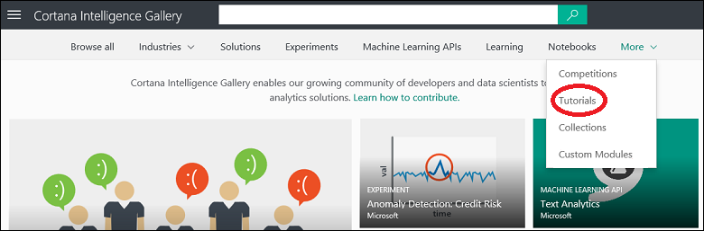

# Discover and share tutorials in Cortana Intelligence Gallery
[!INCLUDE [machine-learning-gallery-item-selector](../../includes/machine-learning-gallery-item-selector.md)]

## Tutorials
Cortana Intelligence Gallery offers several [tutorials](https://gallery.cortanaintelligence.com/tutorials) that can walk you through machine learning technologies and concepts. Tutorials also might describe advanced methods for solving machine learning problems.

## Discover
To browse tutorials [in the Gallery](http://gallery.cortanaintelligence.com), under **More**, select **Tutorials**.

The **[Tutorials](https://gallery.cortanaintelligence.com/tutorials)** page displays a list of recently added and popular tutorials. To see all tutorials, select the **See all** button. To search for a specific tutorial, select **See all**, and then select filter criteria. You also can enter search terms in the **Search** box at the top of the Gallery page.

You can get more information about a tutorial on the tutorial details page. To open a tutorial details page, select the tutorial. In the **Comments** section on a tutorial details page, you can comment, provide feedback, or ask questions about the tutorial. You can even share the tutorial with friends or colleagues on Twitter or LinkedIn. You also can email a link to the tutorial details page, to invite other users to view the page.

## Contribute
You can add a tutorial to the Gallery to help other users solve a problem or learn a concept.

### Create a tutorial

1. Sign in to the Gallery by using your Microsoft account.

2. Select your image at the top of the page, and then select your name.
  
    

3. Select **New Item**.
  
    

4. On the **Description** page, for **ITEM TYPE**, select **Tutorial**. Enter a name for your tutorial, a brief summary, a detailed description, and any tags that might help other users find your tutorial.
  
    
5. On the **Image Selection** page, select an image that is displayed with the collection. You can upload your own image file, or select a stock image. Choose an image that might help users identify the content and purpose of your tutorial.
  
    

6. On the **Settings** page, for **Visibility**, select whether the collection is **Public** (anyone can view the tutorial) or **Unlisted** (only people with a direct link to the tutorial can view it).
  
    > [!IMPORTANT]
    > After you set a tutorial to **Public** and then select **Create**, you cannot later change the tutorial to **Unlisted**.
    > 
    > 
  
    

7. Select **Create**.

Your tutorial is now in Cortana Intelligence Gallery. Your tutorials are listed on your account page, on the **Items** tab.

**[Go to the Gallery](http://gallery.cortanaintelligence.com)**

[!INCLUDE [machine-learning-free-trial](../../includes/machine-learning-free-trial.md)]

