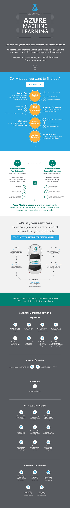

<properties
	pageTitle="Infographic of basic machine learning algorithm examples | Microsoft Azure"
	description="An infographic of machine learning basics, with examples of how algorithms can answer machine learning questions."
	keywords="machine learning basics,algorithm examples,machine learning for beginners,machine learning questions,popular algorithms"
	services="machine-learning"
	documentationCenter=""
	authors="garyericson"
	manager="paulettm"
	editor="cgronlun"/>

<tags
	ms.service="machine-learning"
	ms.workload="data-services"
	ms.tgt_pltfrm="na"
	ms.devlang="na"
	ms.topic="article"
	ms.date="02/10/2016"
	ms.author="garye" />

# Infographic of basic machine learning algorithm examples 

What are machine learning basics?
What machine learning questions can you answer using the most popular algorithms in Azure Machine Learning?
What are examples of machine learning algorithms?

[Azure Machine Learning Studio](https://studio.azureml.net/) comes with a large number of machine learning algorithms that you can use to solve predictive analytics problems. 
The infographic below demonstrates how the four types of machine learning algorithms - **regression**, **anomaly detection**, **clustering**, and **classification** - can be used to answer your machine learning questions.

## Download the infographic

You can download the infographic below as a PDF file. The PDF file contains embedded links to examples of each algorithm. 

**Download the infographic here: [Infographic of machine learning basic algorithms](http://download.microsoft.com/download/A/6/1/A613E11E-8F9C-424A-B99D-65344785C288/microsoft-machine-learning-algorithm-cheat-sheet-v6.pdf)**

## More help with algorithms

* For a deeper discussion of the different types of machine learning algorithms, how they're used, and how to choose the right one for your solution, see [How to choose algorithms for Microsoft Azure Machine Learning](machine-learning-algorithm-choice.md).
* For a list by category of all the machine learning algorithms available in Machine Learning Studio, see [Initialize Model][initialize-model] in the Machine Learning Studio Algorithm and Module Help.
* For a complete list of algorithms and modules in Machine Learning Studio, see [A-Z list of Machine Learning Studio modules][a-z-list] in Machine Learning Studio Algorithm and Module Help.
* To download and print a diagram that gives an overview of the capabilities of Machine Learning Studio, see [Overview diagram of Azure Machine Learning Studio capabilities](machine-learning-studio-overview-diagram.md).

[AZURE.INCLUDE [machine-learning-free-trial](../../includes/machine-learning-free-trial.md)]

<!-- Module References -->
[a-z-list]: https://msdn.microsoft.com/library/azure/dn906033.aspx
[initialize-model]: https://msdn.microsoft.com/library/azure/0c67013c-bfbc-428b-87f3-f552d8dd41f6/
[k-means-clustering]: https://msdn.microsoft.com/library/azure/5049a09b-bd90-4c4e-9b46-7c87e3a36810/
[one-vs-all-multiclass]: https://msdn.microsoft.com/library/azure/7191efae-b4b1-4d03-a6f8-7205f87be664/
