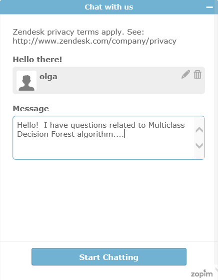

<properties 
    pageTitle="Get help from Machine Learning Live Chat Support | Microsoft Azure" 
    description="Get real-time help for Machine Learning in the cloud with the Live Chat Support feature." 
    services="machine-learning" 
    documentationCenter="" 
    authors="olgali" 
    manager="opapel" 
    editor="cgronlun"/>
<tags 
    ms.service="machine-learning" 
    ms.workload="data-services" 
    ms.tgt_pltfrm="na" 
    ms.devlang="na" 
    ms.topic="article" 
    ms.date="05/16/2016" 
    ms.author="olgali"/>
#Get help from Machine Learning Live Chat Support

[Azure Machine Learning Studio](machine-learning-what-is-ml-studio.md) provides an intuitive interface for building machine learning models. There is a [Gallery](machine-learning-gallery-how-to-use-contribute-publish.md) and [Forums](https://social.msdn.microsoft.com/forums/azure/home?forum=MachineLearning) to guide you along that way. 

But sometimes you just need to ask a quick question to unblock you. In [Studio](machine-learning-what-is-ml-studio.md) look for the chat icon in the top navigation.  If you see this icon, that means a member of the product team is online to help you in real time.

Type in your question and get your answers!

## Don't see the Live Chat Icon?
Members of the team are actually answering your question. If you don't see the live chat icon it is because it is not visible outside of working hours. 

[AZURE.INCLUDE [machine-learning-free-trial](../../includes/machine-learning-free-trial.md)] 
