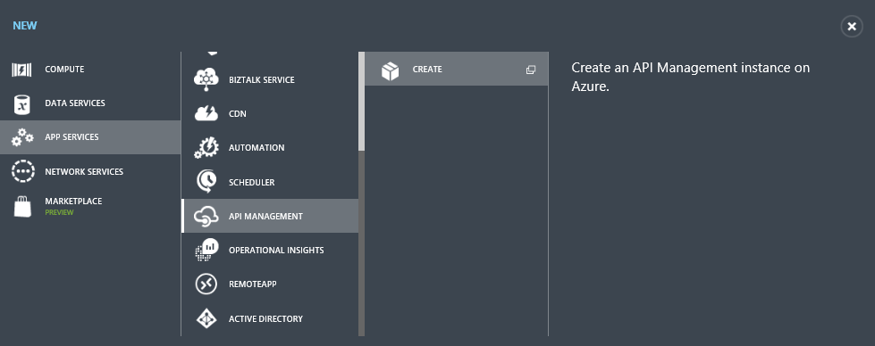
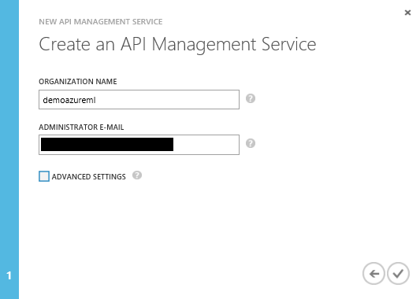
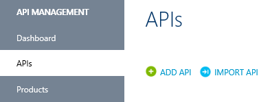
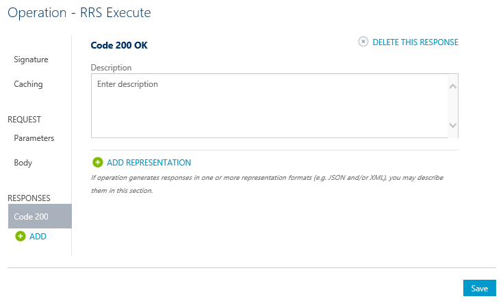
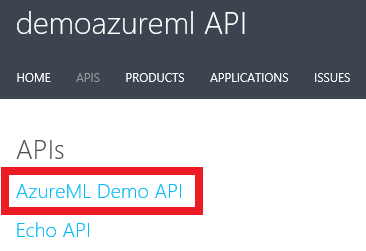
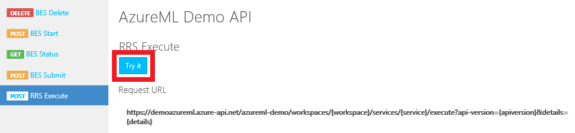
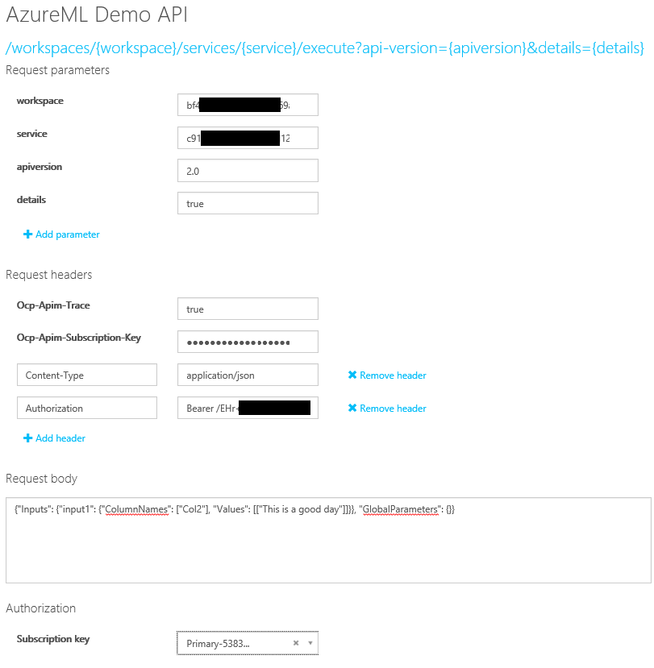
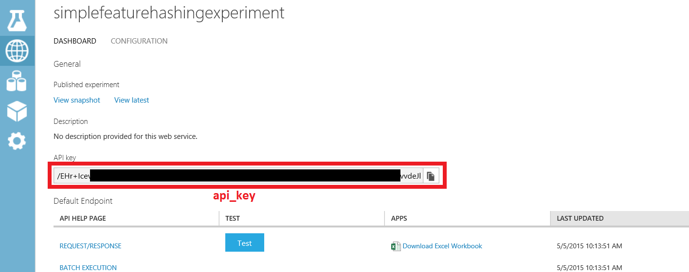
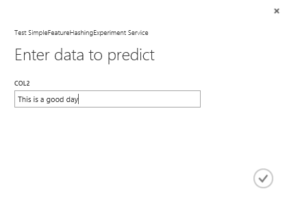

<properties
	pageTitle="Learn how to manage AzureML web services using API Management | Microsoft Azure"
	description="A guide showing how to manage AzureML web services using API Management."
	keywords="machine learning,api management"
	services="machine-learning"
	documentationCenter=""
	authors="roalexan"
	manager="paulettm"
	editor=""/>

<tags
	ms.service="machine-learning"
	ms.workload="data-services"
	ms.tgt_pltfrm="na"
	ms.devlang="na"
	ms.topic="article"
	ms.date="05/27/2016"
	ms.author="roalexan" />

# Learn how to manage AzureML web services using API Management

##Overview

This guide shows you how to quickly get started using API Management to manage your AzureML web services.

##What is Azure API Management?

Azure API Management is an Azure service that lets you manage your REST API endpoints by defining user access, usage throttling, and dashboard monitoring. Click [here](https://azure.microsoft.com/services/api-management/) for details on Azure API Management. Click [here](../api-management/api-management-get-started.md) for a guide on how to get started with Azure API Management. This other guide, which this guide is based on, covers more topics, including notification configurations, tier pricing, response handling, user authentication, creating products, developer subscriptions, and usage dashboarding.

##What is AzureML?

AzureML is an Azure service for machine learning that enables you to easily build, deploy, and share advanced analytics solutions. Click [here](https://azure.microsoft.com/services/machine-learning/) for details on AzureML.

##Prerequisites

To complete this guide, you need:

* An Azure account. If you don’t have an Azure account, click [here](https://azure.microsoft.com/pricing/free-trial/) for details on how to create a free trial account.
* An AzureML account. If you don’t have an AzureML account, click [here](https://studio.azureml.net/) for details on how to create a free trial account.
* The workspace, service, and api_key for an AzureML experiment deployed as a web service. Click [here](machine-learning-create-experiment.md) for details on how to create an AzureML experiment. Click [here](machine-learning-publish-a-machine-learning-web-service.md) for details on how to deploy an AzureML experiment as a web service. Alternately, Appendix A has instructions for how to create and test a simple AzureML experiment and deploy it as a web service.

##Create an API Management instance

Below are the steps for using API Management to manage your AzureML web service. First create a service instance. Log in to the [Classic Portal](https://manage.windowsazure.com/) and click **New** > **App Services** > **API Management** > **Create**.

Specify a unique **URL**. This guide uses **demoazureml** – you will need to choose something different. Choose the desired **Subscription** and **Region** for your service instance. After making your selections, click the next button.

Specify a value for the **Organization Name**. This guide uses **demoazureml** – you will need to choose something different. Enter your email address in the **administrator e-mail** field. This email address is used for notifications from the API Management system.

Click the check box to create your service instance. *It takes up to thirty minutes for a new service to be created*.

##Create the API

Once the service instance is created, the next step is to create the API. An API consists of a set of operations that can be invoked from a client application. API operations are proxied to existing web services. This guide creates APIs that proxy to the existing AzureML RRS and BES web services.

APIs are created and configured from the API publisher portal, which is accessed through the Azure Classic Portal. To reach the publisher portal, select your service instance.

Click **Manage** in the Azure Classic Portal for your API Management service.

Click **APIs** from the **API Management** menu on the left, and then click **Add API**.

Type **AzureML Demo API** as the **Web API name**. Type **https://ussouthcentral.services.azureml.net** as the **Web service URL**. Type **azureml-demo** as the **Web API URL suffix**. Check **HTTPS** as the **Web API URL** scheme. Select **Starter** as **Products**. When finished, click **Save** to create the API.

##Add the operations

Click **Add operation** to add operations to this API.

The **New operation** window will be displayed and the **Signature** tab will be selected by default.

##Add RRS Operation

First create an operation for the AzureML RRS service. Select **POST** as the **HTTP verb**. Type **/workspaces/{workspace}/services/{service}/execute?api-version={apiversion}&details={details}** as the **URL template**. Type **RRS Execute** as the **Display name**.

Click **Responses** > **ADD** on the left and select **200 OK**. Click **Save** to save this operation.

##Add BES Operations

Screenshots are not included for the BES operations as they are very similar to those for adding the RRS operation.

###Submit (but not start) a Batch Execution job

Click **add operation** to add the AzureML BES operation to the API. Select **POST** for the **HTTP verb**. Type **/workspaces/{workspace}/services/{service}/jobs?api-version={apiversion}** for the **URL template**. Type **BES Submit** for the **Display name**. Click **Responses** > **ADD** on the left and select **200 OK**. Click **Save** to save this operation.

###Start a Batch Execution job

Click **add operation** to add the AzureML BES operation to the API. Select **POST** for the **HTTP verb**. Type **/workspaces/{workspace}/services/{service}/jobs/{jobid}/start?api-version={apiversion}** for the **URL template**. Type **BES Start** for the **Display name**. Click **Responses** > **ADD** on the left and select **200 OK**. Click **Save** to save this operation.

###Get the status or result of a Batch Execution job

Click **add operation** to add the AzureML BES operation to the API. Select **GET** for the **HTTP verb**. Type **/workspaces/{workspace}/services/{service}/jobs/{jobid}?api-version={apiversion}** for the **URL template**. Type **BES Status** for the **Display name**. Click **Responses** > **ADD** on the left and select **200 OK**. Click **Save** to save this operation.

###Delete a Batch Execution job

Click **add operation** to add the AzureML BES operation to the API. Select **DELETE** for the **HTTP verb**. Type **/workspaces/{workspace}/services/{service}/jobs/{jobid}?api-version={apiversion}** for the **URL template**. Type **BES Delete** for the **Display name**. Click **Responses** > **ADD** on the left and select **200 OK**. Click **Save** to save this operation.

##Call an operation from the Developer Portal

Operations can be called directly from the Developer portal, which provides a convenient way to view and test the operations of an API. In this guide step you will call the **RRS Execute** method that was added to the **AzureML Demo API**. Click **Developer portal** from the menu at the top right of the Classic Portal.

Click **APIs** from the top menu, and then click **AzureML Demo API** to see the operations available.

Select **RRS Execute** for the operation. Click **Try It**.

For Request parameters, type your **workspace**,  **service**, **2.0** for the **apiversion**, and  **true** for the **details**. You can find your **workspace** and **service** in the AzureML web service dashboard (see **Test the web service** in Appendix A).

For Request headers, click **Add header** and type **Content-Type** and **application/json**, then click **Add header** and type **Authorization** and **Bearer <YOUR AZUREML SERVICE API-KEY>**. You can find your **api key** in the AzureML web service dashboard (see **Test the web service** in Appendix A).

Type **{"Inputs": {"input1": {"ColumnNames": ["Col2"], "Values": [["This is a good day"]]}}, "GlobalParameters": {}}** for the request body.

Click **Send**.

After an operation is invoked, the developer portal displays the **Requested URL** from the back-end service, the **Response status**, the **Response headers**, and any **Response content**.

##Appendix A - Creating and testing a simple AzureML web service

###Creating the experiment

Below are the steps for creating a simple AzureML experiment and deploying it as a web service. The web service takes as input a column of arbitrary text and returns a set of features represented as integers. For example:

Text | Hashed Text
--- | ---
This is a good day | 1 1 2 2 0 2 0 1

First, using a browser of your choice, navigate to: [https://studio.azureml.net/](https://studio.azureml.net/) and enter your credentials to log in. Next, create a new blank experiment.

Rename it to **SimpleFeatureHashingExperiment**. Expand **Saved Datasets** and drag **Book Reviews from Amazon** onto your experiment.

Expand **Data Transformation** and **Manipulation** and drag **Select Columns in Dataset** onto your experiment. Connect **Book Reviews from Amazon** to **Select Columns in Dataset**.

Click **Select Columns in Dataset** and then click **Launch column selector** and select **Col2**. Click the checkmark to apply these changes.

Expand **Text Analytics** and drag **Feature Hashing** onto the experiment. Connect **Select Columns in Dataset** to **Feature Hashing**.

Type **3** for the **Hashing bitsize**. This will create 8 (23) columns.

At this point, you may want to click **Run** to test the experiment.

###Create a web service

Now create a web service. Expand **Web Service** and drag **Input** onto your experiment. Connect **Input** to **Feature Hashing**. Also drag **output** onto your experiment. Connect **Output** to **Feature Hashing**.

Click **Publish web service**.

Click **Yes** to publish the experiment.

###Test the web service

An AzureML web service consists of RSS (request/response service) and BES (batch execution service) endpoints. RSS is for synchronous execution. BES is for asynchronous job execution. To test your web service with the sample Python source below, you may need to download and install the Azure SDK for Python (see: [How to install Python](../python-how-to-install.md)).

You will also need the **workspace**, **service**, and **api_key** of your experiment for the sample source below. You can find the workspace and service by clicking either **Request/Response** or **Batch Execution** for your experiment in the web service dashboard.

You can find the **api_key** by clicking your experiment in the web service dashboard.

####Test RRS endpoint

#####Test button

An easy way to test the RRS endpoint is to click **Test** on the web service dashboard.

Type **This is a good day** for **col2**. Click the checkmark.

You will see something like

#####Sample Code

Another way to test your RRS is from your client code. If you click **Request/response** on the dashboard and scroll to the bottom, you will see sample code for C#, Python, and R. You will also see the syntax of the RRS request, including the request URI, headers, and body.

This guide shows a working Python example. You will need to modify it with the **workspace**, **service**, and **api_key** of your experiment.

	import urllib2
	import json
	workspace = "<REPLACE WITH YOUR EXPERIMENT’S WEB SERVICE WORKSPACE ID>"
	service = "<REPLACE WITH YOUR EXPERIMENT’S WEB SERVICE SERVICE ID>"
	api_key = "<REPLACE WITH YOUR EXPERIMENT’S WEB SERVICE API KEY>"
	data = {
    "Inputs": {
        "input1": {
            "ColumnNames": ["Col2"],
            "Values": [ [ "This is a good day" ] ]
        },
    },
    "GlobalParameters": { }
	}
	url = "https://ussouthcentral.services.azureml.net/workspaces/" + workspace + "/services/" + service + "/execute?api-version=2.0&details=true"
	headers = {'Content-Type':'application/json', 'Authorization':('Bearer '+ api_key)}
	body = str.encode(json.dumps(data))
	try:
    	req = urllib2.Request(url, body, headers)
    	response = urllib2.urlopen(req)
    	result = response.read()
    	print "result:" + result
			except urllib2.HTTPError, error:
    	print("The request failed with status code: " + str(error.code))
    	print(error.info())
    	print(json.loads(error.read()))

####Test BES endpoint
Click **Batch execution** on the dashboard and scroll to the bottom. You will see sample code for C#, Python, and R. You will also see the syntax of the BES requests to submit a job, start a job, get the status or results of a job, and delete a job.

This guide shows a working Python example. You need to modify it with the **workspace**, **service**, and **api_key** of your experiment. Additionally, you need to modify the **storage account name**, **storage account key**, and **storage container name**. Lastly, you will need to modify the location of the **input file** and the location of the **output file**.

	import urllib2
	import json
	import time
	from azure.storage import *
	workspace = "<REPLACE WITH YOUR WORKSPACE ID>"
	service = "<REPLACE WITH YOUR SERVICE ID>"
	api_key = "<REPLACE WITH THE API KEY FOR YOUR WEB SERVICE>"
	storage_account_name = "<REPLACE WITH YOUR AZURE STORAGE ACCOUNT NAME>"
	storage_account_key = "<REPLACE WITH YOUR AZURE STORAGE KEY>"
	storage_container_name = "<REPLACE WITH YOUR AZURE STORAGE CONTAINER NAME>"
	input_file = "<REPLACE WITH THE LOCATION OF YOUR INPUT FILE>" # Example: C:\\mydata.csv
	output_file = "<REPLACE WITH THE LOCATION OF YOUR OUTPUT FILE>" # Example: C:\\myresults.csv
	input_blob_name = "mydatablob.csv"
	output_blob_name = "myresultsblob.csv"
	def printHttpError(httpError):
	print("The request failed with status code: " + str(httpError.code))
	print(httpError.info())
	print(json.loads(httpError.read()))
	return
	def saveBlobToFile(blobUrl, resultsLabel):
	print("Reading the result from " + blobUrl)
	try:
		response = urllib2.urlopen(blobUrl)
	except urllib2.HTTPError, error:
		printHttpError(error)
		return
	with open(output_file, "w+") as f:
		f.write(response.read())
	print(resultsLabel + " have been written to the file " + output_file)
	return
	def processResults(result):
	first = True
	results = result["Results"]
	for outputName in results:
		result_blob_location = results[outputName]
		sas_token = result_blob_location["SasBlobToken"]
		base_url = result_blob_location["BaseLocation"]
		relative_url = result_blob_location["RelativeLocation"]
		print("The results for " + outputName + " are available at the following Azure Storage location:")
		print("BaseLocation: " + base_url)
		print("RelativeLocation: " + relative_url)
		print("SasBlobToken: " + sas_token)
		if (first):
			first = False
			url3 = base_url + relative_url + sas_token
			saveBlobToFile(url3, "The results for " + outputName)
	return

	def invokeBatchExecutionService():
	url = "https://ussouthcentral.services.azureml.net/workspaces/" + workspace +"/services/" + service +"/jobs"
	blob_service = BlobService(account_name=storage_account_name, account_key=storage_account_key)
	print("Uploading the input to blob storage...")
	data_to_upload = open(input_file, "r").read()
	blob_service.put_blob(storage_container_name, input_blob_name, data_to_upload, x_ms_blob_type="BlockBlob")
	print "Uploaded the input to blob storage"
	input_blob_path = "/" + storage_container_name + "/" + input_blob_name
	connection_string = "DefaultEndpointsProtocol=https;AccountName=" + storage_account_name + ";AccountKey=" + storage_account_key
	payload =  {
		"Input": {
			"ConnectionString": connection_string,
			"RelativeLocation": input_blob_path
		},
		"Outputs": {
			"output1": { "ConnectionString": connection_string, "RelativeLocation": "/" + storage_container_name + "/" + output_blob_name },
		},
		"GlobalParameters": {
		}
	}
		body = str.encode(json.dumps(payload))
	headers = { "Content-Type":"application/json", "Authorization":("Bearer " + api_key)}
	print("Submitting the job...")
	# submit the job
	req = urllib2.Request(url + "?api-version=2.0", body, headers)
	try:
		response = urllib2.urlopen(req)
	except urllib2.HTTPError, error:
		printHttpError(error)
		return
	result = response.read()
	job_id = result[1:-1] # remove the enclosing double-quotes
	print("Job ID: " + job_id)
	# start the job
	print("Starting the job...")
	req = urllib2.Request(url + "/" + job_id + "/start?api-version=2.0", "", headers)
	try:
		response = urllib2.urlopen(req)
	except urllib2.HTTPError, error:
		printHttpError(error)
		return
	url2 = url + "/" + job_id + "?api-version=2.0"

	while True:
		print("Checking the job status...")
		# If you are using Python 3+, replace urllib2 with urllib.request in the follwing code
		req = urllib2.Request(url2, headers = { "Authorization":("Bearer " + api_key) })
		try:
			response = urllib2.urlopen(req)
		except urllib2.HTTPError, error:
			printHttpError(error)
			return
		result = json.loads(response.read())
		status = result["StatusCode"]
		print "status:" + status
		if (status == 0 or status == "NotStarted"):
			print("Job " + job_id + " not yet started...")
		elif (status == 1 or status == "Running"):
			print("Job " + job_id + " running...")
		elif (status == 2 or status == "Failed"):
			print("Job " + job_id + " failed!")
			print("Error details: " + result["Details"])
			break
		elif (status == 3 or status == "Cancelled"):
			print("Job " + job_id + " cancelled!")
			break
		elif (status == 4 or status == "Finished"):
			print("Job " + job_id + " finished!")
			processResults(result)
			break
		time.sleep(1) # wait one second
	return
	invokeBatchExecutionService()
