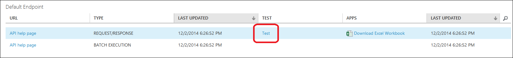

<properties
	pageTitle="Deploy a Machine Learning Web service | Microsoft Azure"
	description="How to convert a training experiment to a predictive experiment, prepare it for deployment, then deploy it as an Azure Machine Learning Web service."
	services="machine-learning"
	documentationCenter=""
	authors="garyericson"
	manager="jhubbard"
	editor="cgronlun"/>

<tags
	ms.service="machine-learning"
	ms.workload="data-services"
	ms.tgt_pltfrm="na"
	ms.devlang="na"
	ms.topic="article"
	ms.date="10/04/2016"
	ms.author="garye"/>

# Deploy an Azure Machine Learning Web service

Azure Machine Learning enables you to build, test, and deploy predictive analytic solutions.

From a high-level point-of-view, this is done in three steps:

- **[Create a training experiment]** - Azure Machine Learning Studio is a collaborative visual development environment that you use to train and test a predictive analytics model using training data that you supply.
- **[Convert it to a predictive experiment]** - Once your model has been trained with existing data and you're ready to use it to score new data, you prepare and streamline your experiment for predictions.
- **Deploy it as a Web service** - You can deploy your predictive experiment as a [new] or [classic] Azure Web service. Users can send data to your model and receive your model's predictions.

[AZURE.INCLUDE [machine-learning-free-trial](../../includes/machine-learning-free-trial.md)]

## Create a training experiment

To train a predictive analytics model, you use Azure Machine Learning Studio to create a training experiment where you include various modules to load training data, prepare the data as necessary, apply machine learning algorithms, and evaluate the results. You can iterate on an experiment and try different machine learning algorithms to compare and evaluate the results.

The process of creating and managing training experiments is covered more thoroughly elsewhere. For more information, see these articles:

- [Create a simple experiment in Azure Machine Learning Studio](machine-learning-create-experiment.md)
- [Develop a predictive solution with Azure Machine Learning](machine-learning-walkthrough-develop-predictive-solution.md)
- [Import your training data into Azure Machine Learning Studio](machine-learning-data-science-import-data.md)
- [Manage experiment iterations in Azure Machine Learning Studio](machine-learning-manage-experiment-iterations.md)

## Convert the training experiment to a predictive experiment

Once you've trained your model, you're ready to convert your training experiment into a predictive experiment to score new data.

By converting to a predictive experiment, you're getting your trained model ready to be deployed as a scoring Web service. Users of the Web service can send input data to your model and your model will send back the prediction results. As you convert to a predictive experiment, keep in mind how you expect your model to be used by others.

To convert your training experiment to a predictive experiment, click **Run** at the bottom of the experiment canvas, click **Set Up Web Service**, then select **Predictive Web Service**.

For more information on how to perform this conversion, see [Convert a Machine Learning training experiment to a predictive experiment](machine-learning-convert-training-experiment-to-scoring-experiment.md).

The following steps describe deploying a predictive experiment as a New Web service. You can also deploy the experiment as Classic Web service.

## Deploy the predictive experiment as a New Web service

Now that the predictive experiment has been prepared, you can deploy it as an Azure Web service. Using the Web service, users can send data to your model and the model will return its predictions.

To deploy your predictive experiment, click **Run** at the bottom of the experiment canvas. Once the experiment has finished running, click **Deploy Web Service** and select **Deploy Web Service [New]**.  The deployment page of the Machine Learning Web Service portal opens. 

### Machine Learning Web Service portal Deploy Experiment Page

On the Deploy Experiment page, enter a name for the Web service.
Select a pricing plan. If you have an existing pricing plan you can select it, otherwise you must create a new price plan for the service. 

1.	In the **Price Plan** drop down, select an existing plan or select the **Select new plan** option.
2.	In **Plan Name**, type a name that will identify the plan on your bill.
3.	Select one of the **Monthly Plan Tiers**. The plan tiers default to the plans for your default region and your Web service is deployed to that region.

Click **Deploy** and the **Quickstart** page for your Web service opens.

The Web service Quickstart page gives you access and guidance on the most common tasks you will perform after creating a Web service. From here, you can easily access both the Test page and Consume page.

<!-- -->

### Test your Web service

To test your new Web service, click **Test Web service** under common tasks. On the Test page, you can test your Web service as a Request-Response Service (RRS) or a Batch Execution service (BES). 

The RRS test page displays the inputs, outputs, and any global parameters that you have defined for the experiment. To test the Web service, you can manually enter appropriate values for the inputs or supply a comma separated value (CSV) formatted file containing the test values. 

To test using RRS, from the list view mode, enter appropriate values for the inputs and click **Test Request-Response**. Your prediction results  display in the output column to the left.

To test your BES, click **Batch**. On the Batch test page, click Browse under your input and select a CSV file containing appropriate sample values. If you don't have a CSV file, and you created your predictive experiment using Machine Learning Studio, you can download the data set for your predictive experiment and use it.

To download the data set, open Machine Learning Studio. Open your predictive experiment and right click the input for your experiment. From the context menu, select **dataset** and then select **Download**. 

Click **Test**. The status of your Batch Execution job displays to the right under **Test Batch Jobs**.

<!---->

On the **CONFIGURATION** page, you can change the description, title, update the storage account key, and enable sample data for your Web service.

Once you've deployed the Web service, you can:

- **Access** it through the Web service API.
- **Manage** it through Azure Machine Learning Web services portal or the Azure classic portal. 
- **Update** it if your model changes.

### Access the Web service

Once you deploy your Web service from Machine Learning Studio, you can send data to the service and receive responses programmatically.

The **Consume** page provides all the information you need to access your Web service. For example, the API key is provided to allow authorized access to the service. 

For more information about accessing a Machine Learning Web service, see [How to consume a deployed Azure Machine Learning Web service](machine-learning-consume-Web-services.md).

### Manage your new Web service

You can manage your classic Web services Machine Learning Web Services portal. From the [main portal page](https://services.azureml-test.net/), click **Web Services**. From the Web services page, you can delete or copy a service. To monitor a specific service, click the service and then click **Dashboard**. To monitor batch jobs associated with the Web service, click **Batch Request Log**.

## Deploy the predictive experiment as a Classic Web service

Now that the predictive experiment has been sufficiently prepared, you can deploy it as an Azure Web service. Using the Web service, users can send data to your model and the model will return its predictions.

To deploy your predictive experiment, click **Run** at the bottom of the experiment canvas and then click **Deploy Web Service**. The Web service is set up and you are placed in the Web service dashboard.

To test the Web service, click the **Test** link in the Web service dashboard. A dialog pops up to ask you for the input data for the service. These are the columns expected by the scoring experiment. Enter a set of data and then click **OK**. The results generated by the Web service are displayed at the bottom of the dashboard.

You can click the **Test** preview link to test your service in the Azure Machine Learning Web Services portal as shown previously in the New Web service section.

On the **CONFIGURATION** page, you can change the display name of the service and give it a description. The name and description is displayed in the [Azure classic portal](http://manage.windowsazure.com/) where you manage your Web services.

You can provide a description for your input data, output data, and Web service parameters by entering a string for each column under **INPUT SCHEMA**, **OUTPUT SCHEMA**, and **Web SERVICE PARAMETER**. These descriptions are used in the sample code documentation provided for the Web service.

You can enable logging to diagnose any failures that you're seeing when your Web service is accessed. For more information, see [Enable logging for Machine Learning Web services](machine-learning-web-services-logging.md).

You can also configure the endpoints for the Web service in the Azure Machine Learning Web Services portal similar to the procedure shown previously in the New Web service section. The options are different, you can add or change the service description, enable logging, and enable sample data for testing.

### Access the Web service

Once you deploy your Web service from Machine Learning Studio, you can send data to the service and receive responses programmatically.

The dashboard provides all the information you need to access your Web service. For example, the API key is provided to allow authorized access to the service, and API help pages are provided to help you get started writing your code.

For more information about accessing a Machine Learning Web service, see [How to consume a deployed Azure Machine Learning Web service](machine-learning-consume-Web-services.md).

### Manage the Web service

There are various of actions you can perform to monitor a Web service. You can update it, and delete it. You can also add additional endpoints to a Classic Web service in addition to the default endpoint that is created when you deploy it.

For more information, see [Manage an Azure Machine Learning workspace](machine-learning-manage-workspace.md) and [Manage a Web service using the Azure Machine Learning Web Services portal](machine-learning-manage-new-webservice.md).
  
<!-- When this article gets published, fix the link and uncomment
For more information on how to manage Azure Machine Learning Web service endpoints using the REST API, see **Azure machine learning Web service endpoints**.
-->

## Update the Web service

You can make changes to your Web service, such as updating the model with additional training data, and deploy it again, overwriting the original Web service.

To update the Web service, open the original predictive experiment you used to deploy the Web service and make an editable copy by clicking **SAVE AS**. Make your changes and then click **Deploy Web Service**. 

Because you've deployed this experiment before, you are asked if you want to overwrite (Classic Web Service) or update (New Web service) the existing service. Clicking **YES** or **Update** stops the existing Web service and deploys the new predictive experiment is deployed in its place.

> [AZURE.NOTE] If you made configuration changes in the original Web service, for example, entering a new display name or description, you will need to enter those values again.

One option for updating your Web service is to retrain the model programmatically. For more information, see [Retrain Machine Learning models programmatically](machine-learning-retrain-models-programmatically.md).

<!-- internal links -->
[Create a training experiment]: #create-a-training-experiment
[Convert it to a predictive experiment]: #convert-the-training-experiment-to-a-predictive-experiment
[new]: #deploy-the-predictive-experiment-as-a-new-Web-service
[classic]: #deploy-the-predictive-experiment-as-a-new-Web-service
[Access]: #access-the-Web-service
[Manage]: #manage-the-Web-service-in-the-azure-management-portal
[Update]: #update-the-Web-service
