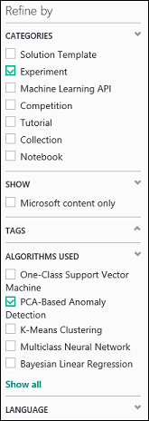
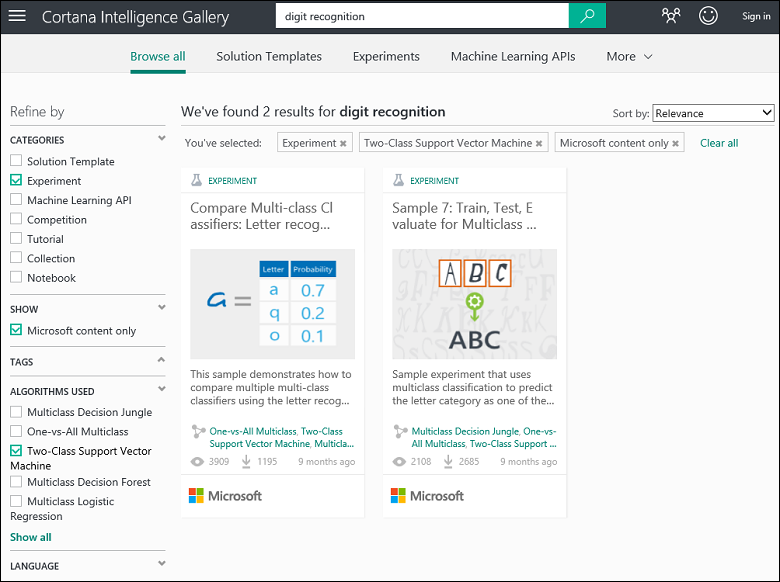

<properties
    pageTitle="Use sample experiments to create new experiments | Microsoft Azure"
    description="Create new Azure Machine Learning experiments from sample experiments and experiments shared by the community."
    services="machine-learning"
    documentationCenter=""
    authors="cjgronlund"
    manager="paulettm"
    editor="cgronlun"/>

<tags
    ms.service="machine-learning"
    ms.workload="data-services"
    ms.tgt_pltfrm="na"
    ms.devlang="na"
    ms.topic="get-started-article"
    ms.date="04/28/2016"
    ms.author="chhavib;olgali"/>

# Use sample experiments to create new experiments
When you want to create an experiment, look for examples in the [Cortana Intelligence Gallery](http://gallery.cortanaintelligence.com/). You can find sample experiments that have been contributed by the Machine Learning team as well as those shared by the broader Machine Learning community. You also can ask questions or post comments about experiments.

[AZURE.INCLUDE [machine-learning-free-trial](../../includes/machine-learning-free-trial.md)]

## Browse the Cortana Intelligence Gallery
To see what experiments are available in the Gallery, go to the [Gallery](http://gallery.cortanaintelligence.com/) and click **Experiments** at the top of the page.
On this page you can view **Recently added** experiments, look at **What's popular**, or see the latest **Popular Microsoft experiments**.

To browse all experiments:

1. Click **Browse all** at the top of the page.
2. Under **Refine by** select **Experiment** to see all the experiments in the Gallery.
3. You can further refine the list by selecting filters on the left. For example, to browse experiments that use a PCA-based anomaly detection algorithm, select **Experiment** under **Categories**, and **PCA-Based Anomaly Detection** under **Algorithms Used**  (if you don't see that algorithm, click **Show all** at the bottom of the list).  
 
4. You can use the search box to further narrow your choices. For example, to find experiments contributed by Microsoft related to digit recognition that use a two-class support vector machine algorithm, enter "digit recognition" in the search box and select **Experiment**, **Microsoft content only**, and **Two-Class Support Vector Machine**:
 
5. Click an experiment to learn more about it. To run and/or modify the experiment, click **Open in Studio** on the experiment's page.

> [AZURE.NOTE] To open an experiment in Machine Learning Studio, you'll need to sign in with your Microsoft account credentials. If you don’t have a Machine Learning workspace yet, a free trial workspace is created. [Learn what’s included in the Machine Learning free trial](https://azure.microsoft.com/pricing/details/machine-learning/)

 

## Use a template in Machine Learning Studio

You also can create a new experiment in Machine Learning Studio using a Gallery sample as a template.

1. Sign in with your Microsoft account credentials to the [Studio](https://studio.azureml.net), and then click **New*** to create a new experiment.
2. Browse through the sample content and click one.

A new experiment is created in your workspace using the sample experiment as a template. 

## Next steps
- [Prepare your data](machine-learning-data-science-import-data.md)
- [Try using R in your experiment](machine-learning-r-quickstart.md)
- [Review sample R experiments](machine-learning-r-csharp-web-service-examples.md)
- [Create an web service API](machine-learning-publish-a-machine-learning-web-service.md)
- [Browse ready-to-use applications](https://datamarket.azure.com/browse?query=machine+learning)
