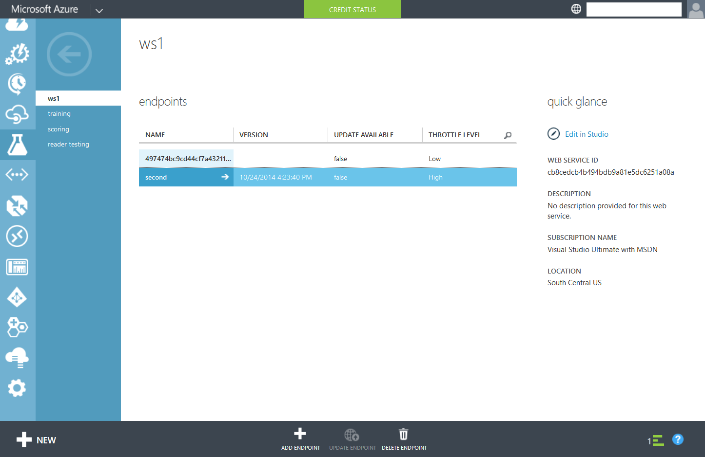

<properties 
	pageTitle="Scaling API Endpoints | Microsoft Azure" 
	description="Scaling web service endpoints in Azure Machine Learning" 
	services="machine-learning"
	documentationCenter="" 
	authors="hiteshmadan" 
	manager="padou" 
	editor=""/>

<tags
	ms.service="machine-learning"
	ms.devlang="multiple"
	ms.topic="article"
	ms.tgt_pltfrm="na"
	ms.workload="tbd" 
	ms.date="05/25/2016"
	ms.author="himad"/>

# Scaling API Endpoints

Web service endpoints in Azure Machine Learning have selectable throttle levels to match the rate at which the endpoint will be consumed.

To control the amount of throttling on the endpoint, use the slider on Azure Classic Portal to set the max concurrent calls between 20-200 

The synchronous APIs are typically used in situations where a low latency is desired. Latency here implies the time it takes for the API to complete one request, and doesn't account for any network delays. Let's say you have an API with a 50ms latency. To fully consume the available capacity with throttle level High and Max Concurrent Calls = 20, you need to call this API 20 * 1000 / 50 = 400 times per second. Extending this further, a Max Concurrent Calls of 200 will allow you to call the API 4000 times per second, assuming a 50ms latency.

If you plan to call the API with a higher load than what Max Concurrent Calls of 200 will support, then you should create multiple endpoints on the same web service and randomly distribute your load across all of them.

Keep in mind that using a very high concurrency count can be detrimental if you're not hitting the API with a correspondingly high rate. You might see sporadic timeouts and/or spikes in the latency if you put a relatively low load on an API configured for high load.

Note that tweaking throttle settings only influences the behavior of the Synchronous API (RRS). You should tweak these settings if you see frequent 503 Service Unavailable responses on the Synchronous API.

The management UI allows to provide a custom concurrency number for scaling the endpoint beyond default concurrency of 20.

1. Open up manage.windowsazure.com
2. Navigate to the Machine Learning tab
3. Click on your workspace.
4. Navigate to the web service which has your endpoint

5. Click on the endpoint, and then click on the Configure tab

6. Change the slider to increase the level of concurrency and click on Save.

 
