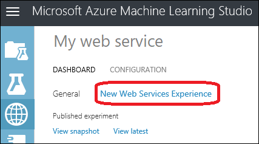
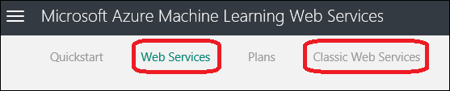
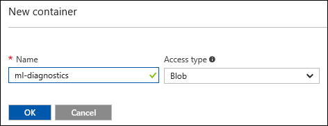

# Enable logging for Machine Learning web services
This document provides information on the logging capability of Machine Learning web services. Logging provides additional information, beyond just an error number and a message, that can help you troubleshoot your calls to the Machine Learning APIs.  

## How to enable logging for a Web service

You enable logging from the [Azure Machine Learning Web Services](https://services.azureml.net) portal. 

1. Sign in to the Azure Machine Learning Web Services portal at [https://services.azureml.net](https://services.azureml.net). For a Classic web service, you can also get to the portal by clicking **New Web Services Experience** on the Machine Learning Web Services page in Machine Learning Studio .

   

2. On the top menu bar, click **Web Services** for a New web service, or click **Classic Web Services** for a Classic web service.

   

3. For a New web service, click the web service name. For a Classic web service, click the web service name and then on the next page click the appropriate endpoint.

4. On the top menu bar, click **Configure**.

5. Set the **Enable Logging** option to *Error* (to log only errors) or *All* (for full logging).

   

6. Click **Save**.

All web service logs are kept in a blob container named **ml-diagnostics** in the storage account associated with the web service. For New web services, this container is created the first time you access the web service.

For Classic web services, you'll need to create the container if it doesn't already exist. 

1. In the [Azure Management portal](https://portal.azure.com), go to the storage account associated with the web service.

2. Under **Blob Service**, click **Containers**.

3. If the container **ml-diagnostics** doesn't exist, click **+Container**, give the container the name "ml-diagnostics", and select the **Access type** as "Blob". Click **OK**.

   

> [!TIP]
>
> The Web Services Dashboard in Machine Learning Studio has a switch to enable logging. However, you need to enable logging from the Web Services Portal. If you already enabled logging in Studio, then in the Web Services Portal, just disable logging and then enable it again.

## The effects of enabling logging
When logging is enabled, all the diagnostics and errors from the selected endpoint are logged to the Azure Storage Account linked with the user’s workspace. You can see this storage account in the Azure classic portal Dashboard view (bottom of the Quick Glance section) of their workspace.  

The logs can be viewed using any of the several tools available to explore an Azure Storage Account. The easiest may be to simply navigate to the Storage Account in the Azure classic portal and then click **CONTAINERS**. There you'll see the container **ml-diagnostics** container. This container holds all the diagnostics information for all the web service endpoints for all the workspaces associated with this Storage account. 

## Log blob detail information
Each blob in the container holds the diagnostics info for exactly one of the following:

* An execution of the Batch-Execution method  
* An execution of the Request-Response method  
* Initialization of a Request-Response container

The name of each blob has a prefix of the following form: 

    {Workspace Id}-{Web service Id}-{Endpoint Id}/{Log type}  

Where Log type is one of the following values:  

* batch  
* score/requests  
* score/init  

