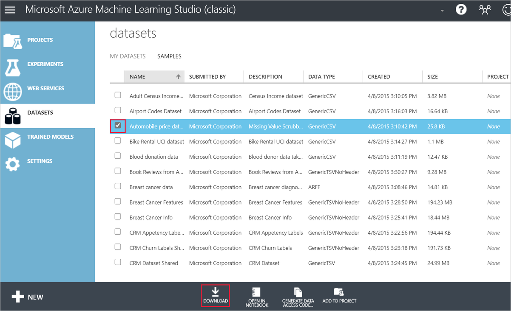
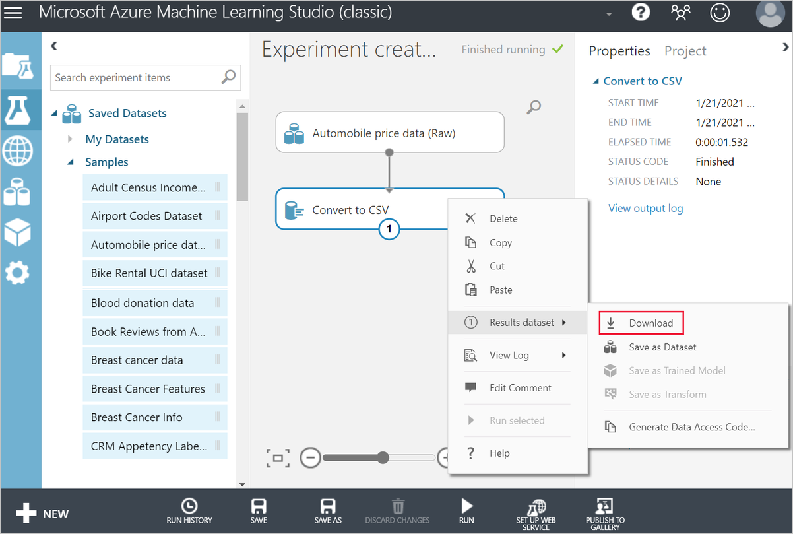
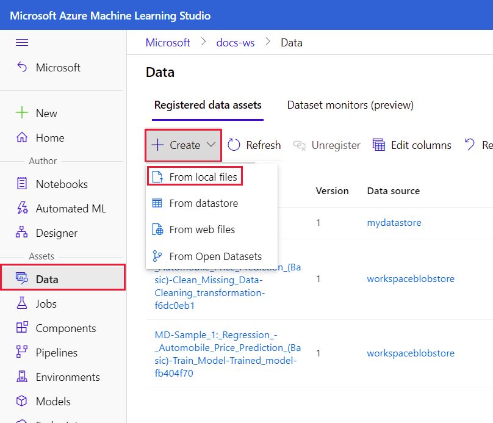

# Migrate a Studio (classic) dataset to Azure Machine Learning

In this article, you learn how to migrate a Studio (classic) dataset to Azure Machine Learning. For more information on migrating from Studio (classic), see [the migration overview article](migrate-overview.md).

You have three options to migrate a dataset to Azure Machine Learning. Read each section to determine which option is best for your scenario.

|Where is the data? | Migration option  |
|---------|---------|
|In Studio (classic)     |  Option 1: [Download the dataset from Studio (classic) and upload it to Azure Machine Learning](#download-the-dataset-from-studio-classic).      |
|Cloud storage     | Option 2: [Register a dataset from a cloud source](#import-data-from-cloud-sources).     Option 3: [Use the Import Data module to get data from a cloud source](#import-data-from-cloud-sources).        |

> [!NOTE]
> Azure Machine Learning also supports [code-first workflows](how-to-create-register-datasets.md) for creating and managing datasets. 

## Prerequisites

- An Azure account with an active subscription. [Create an account for free](https://azure.microsoft.com/free/?WT.mc_id=A261C142F).
- An Azure Machine Learning workspace. [Create an Azure Machine Learning workspace](how-to-manage-workspace.md#create-a-workspace).
- A Studio (classic) dataset to migrate.

## Download the dataset from Studio (classic)

The simplest way to migrate a  Studio (classic) dataset to Azure Machine Learning is to download your dataset and register it in Azure Machine Learning. This creates a new copy of your dataset and uploads it to an Azure Machine Learning datastore.

You can download the following Studio (classic) dataset types directly.

* Plain text (.txt)
* Comma-separated values (CSV) with a header (.csv) or without (.nh.csv)
* Tab-separated values (TSV) with a header (.tsv) or without (.nh.tsv)
* Excel file
* Zip file (.zip)

To download datasets directly:
1. Go to your Studio (classic) workspace ([https://studio.azureml.net](https://studio.azureml.net)).
1. In the left navigation bar, select the **Datasets** tab.
1. Select the dataset(s) you want to download.
1. In the bottom action bar, select **Download**.

    

For the following data types, you must use the **Convert to CSV** module to download datasets.

* SVMLight data (.svmlight) 
* Attribute Relation File Format (ARFF) data (.arff) 
* R object or workspace file (.RData)
* Dataset type (.data). Dataset type is  Studio(classic) internal data type for module output.

To convert your dataset to a CSV and download the results:

1. Go to your Studio (classic) workspace ([https://studio.azureml.net](https://studio.azureml.net)).
1. Create a new experiment.
1. Drag and drop the dataset you want to download onto the canvas.
1. Add a **Convert to CSV** module.
1. Connect the **Convert to CSV** input port to the output port of your dataset.
1. Run the experiment.
1. Right-click the **Convert to CSV** module.
1. Select **Results dataset** > **Download**.

    

### Upload your dataset to Azure Machine Learning

After you download the data file, you can register the dataset in Azure Machine Learning:

1. Go to Azure Machine Learning studio ([ml.azure.com](https://ml.azure.com)).
1. In the left navigation pane, select the **Datasets** tab.
1. Select **Create dataset** > **From local files**.
    
1. Enter a name and description.
1. For **Dataset type**, select **Tabular**.

    > [!NOTE]
    > You can also upload ZIP files as datasets. To upload a ZIP file, select **File** for **Dataset type**.

1. **For Datastore and file selection**, select the datastore you want to upload your dataset file to.

    By default, Azure Machine Learning stores the dataset to the default workspace blobstore. For more information on datastores, see [Connect to storage services](how-to-access-data.md).

1. Set the data parsing settings and schema for your dataset. Then, confirm your settings.

## Import data from cloud sources

If your data is already in a cloud storage service, and you want to keep your data in its native location. You can use either of the following options:

|Ingestion method|Description|
|---| --- |
|Register an Azure Machine Learning dataset|Ingest data from local and online data sources (Blob, ADLS Gen1, ADLS Gen2, File share, SQL DB).   Creates a reference to the data source, which is lazily evaluated at runtime. Use this option if you repeatedly access this dataset and want to enable advanced data features like data versioning and monitoring.
|Import Data module|Ingest data from online data sources (Blob, ADLS Gen1, ADLS Gen2, File share, SQL DB).    The dataset is only imported to the current designer pipeline run.

>[!Note]
> Studio (classic) users should note that the following cloud sources are not natively supported in Azure Machine Learning:
> - Hive Query
> - Azure Table
> - Azure Cosmos DB
> - On-premises SQL Database
>
> We recommend that users migrate their data to a supported storage services using Azure Data Factory.  

### Register an Azure Machine Learning dataset

Use the following steps to register a dataset to Azure Machine Learning from a cloud service: 

1. [Create a datastore](how-to-connect-data-ui.md#create-datastores), which links the cloud storage service to your Azure Machine Learning workspace. 

1. [Register a dataset](how-to-connect-data-ui.md#create-datasets). If you are migrating a Studio (classic) dataset, select the **Tabular** dataset setting.

After you register a dataset in Azure Machine Learning, you can use it in designer:
 
1. Create a new designer pipeline draft.
1. In the module palette to the left, expand the **Datasets** section.
1. Drag your registered dataset onto the canvas. 

### Use the Import Data module

Use the following steps to import data directly to your designer pipeline:

1. [Create a datastore](how-to-connect-data-ui.md#create-datastores), which links the cloud storage service to your Azure Machine Learning workspace. 

After you create the datastore, you can use the [**Import Data**](algorithm-module-reference/import-data.md) module in the designer to ingest data from it:

1. Create a new designer pipeline draft.
1. In the module palette to the left, find the **Import Data** module and drag it to the canvas.
1. Select the **Import Data** module, and use the settings in the right panel to configure your data source.

## Next steps

In this article, you learned how to migrate a Studio (classic) dataset to Azure Machine Learning. The next step is to [rebuild a Studio (classic) training pipeline](migrate-rebuild-experiment.md).

See the other articles in the Studio (classic) migration series:

1. [Migration overview](migrate-overview.md).
1. **Migrate datasets**.
1. [Rebuild a Studio (classic) training pipeline](migrate-rebuild-experiment.md).
1. [Rebuild a Studio (classic) web service](migrate-rebuild-web-service.md).
1. [Integrate an Azure Machine Learning web service with client apps](migrate-rebuild-integrate-with-client-app.md).
1. [Migrate Execute R Script](migrate-execute-r-script.md).
