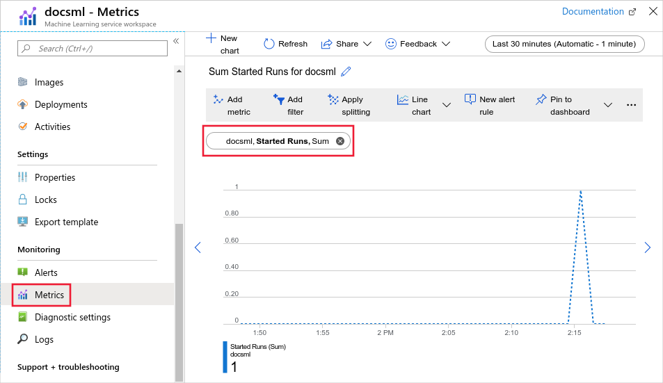

# Monitor Azure Machine Learning

When you have critical applications and business processes relying on Azure resources, you want to monitor those resources for their availability, performance, and operation. This article describes the monitoring data generated by Azure Machine Learning and how to analyze and alert on this data with Azure Monitor.

> [!TIP]
> The information in this document is primarily for __administrators__, as it describes monitoring for the Azure Machine Learning service and associated Azure services. If you are a __data scientist__ or __developer__, and want to monitor information specific to your *model training runs*, see the following documents:
>
> * [Start, monitor, and cancel training runs](how-to-track-monitor-analyze-runs.md)
> * [Log metrics for training runs](how-to-log-view-metrics.md)
> * [Track experiments with MLflow](how-to-use-mlflow.md)
> * [Visualize runs with TensorBoard](how-to-monitor-tensorboard.md)
>
> If you want to monitor information generated by models deployed as web services or IoT Edge modules, see [Collect model data](how-to-enable-data-collection.md) and [Monitor with Application Insights](how-to-enable-app-insights.md).

## What is Azure Monitor?

Azure Machine Learning creates monitoring data using [Azure Monitor](../azure-monitor/overview.md), which is a full stack monitoring service in Azure. Azure Monitor provides a complete set of features to monitor your Azure resources. It can also monitor resources in other clouds and on-premises.

Start with the article [Monitoring Azure resources with Azure Monitor](../azure-monitor/essentials/monitor-azure-resource.md), which describes the following concepts:

- What is Azure Monitor?
- Costs associated with monitoring
- Monitoring data collected in Azure
- Configuring data collection
- Standard tools in Azure for analyzing and alerting on monitoring data

The following sections build on this article by describing the specific data gathered for Azure Machine Learning. These sections also provide examples for configuring data collection and analyzing this data with Azure tools.

> [!TIP]
> To understand costs associated with Azure Monitor, see [Usage and estimated costs](../azure-monitor//usage-estimated-costs.md). To understand the time it takes for your data to appear in Azure Monitor, see [Log data ingestion time](../azure-monitor/logs/data-ingestion-time.md).

## Monitoring data from Azure Machine Learning

Azure Machine Learning collects the same kinds of monitoring data as other Azure resources that are described in [Monitoring data from Azure resources](../azure-monitor/essentials/monitor-azure-resource.md#monitoring-data). 

See [Azure Machine Learning monitoring data reference](monitor-resource-reference.md) for a detailed reference of the logs and metrics created by Azure Machine Learning.

<a id="configuration"></a>

## Collection and routing

Platform metrics and the Activity log are collected and stored automatically, but can be routed to other locations by using a diagnostic setting.  

Resource Logs are not collected and stored until you create a diagnostic setting and route them to one or more locations.

See [Create diagnostic setting to collect platform logs and metrics in Azure](../azure-monitor/essentials/diagnostic-settings.md) for the detailed process for creating a diagnostic setting using the Azure portal, CLI, or PowerShell. When you create a diagnostic setting, you specify which categories of logs to collect. The categories for Azure Machine Learning are listed in [Azure Machine Learning monitoring data reference](monitor-resource-reference.md#resource-logs).

> [!IMPORTANT]
> Enabling these settings requires additional Azure services (storage account, event hub, or Log Analytics), which may increase your cost. To calculate an estimated cost, visit the [Azure pricing calculator](https://azure.microsoft.com/pricing/calculator).

You can configure the following logs for Azure Machine Learning:

| Category | Description |
|:---|:---|
| AmlComputeClusterEvent | Events from Azure Machine Learning compute clusters. |
| AmlComputeClusterNodeEvent | Events from nodes within an Azure Machine Learning compute cluster. |
| AmlComputeJobEvent | Events from jobs running on Azure Machine Learning compute. |

> [!NOTE]
> When you enable metrics in a diagnostic setting, dimension information is not currently included as part of the information sent to a storage account, event hub, or log analytics.

The metrics and logs you can collect are discussed in the following sections.

## Analyzing metrics

You can analyze metrics for Azure Machine Learning, along with metrics from other Azure services, by opening **Metrics** from the **Azure Monitor** menu. See [Getting started with Azure Metrics Explorer](../azure-monitor/essentials/metrics-getting-started.md) for details on using this tool.

For a list of the platform metrics collected, see [Monitoring Azure Machine Learning data reference metrics](monitor-resource-reference.md#metrics).

All metrics for Azure Machine Learning are in the namespace **Machine Learning Service Workspace**.



For reference, you can see a list of [all resource metrics supported in Azure Monitor](../azure-monitor/essentials/metrics-supported.md).

> [!TIP]
> Azure Monitor metrics data is available for 90 days. However, when creating charts only 30 days can be visualized. For example, if you want to visualize a 90 day period, you must break it into three charts of 30 days within the 90 day period.
### Filtering and splitting

For metrics that support dimensions, you can apply filters using a dimension value. For example, filtering **Active Cores** for a **Cluster Name** of `cpu-cluster`. 

You can also split a metric by dimension to visualize how different segments of the metric compare with each other. For example, splitting out the **Pipeline Step Type** to see a count of the types of steps used in the pipeline.

For more information of filtering and splitting, see [Advanced features of Azure Monitor](../azure-monitor/essentials/metrics-charts.md).

<a id="analyzing-log-data"></a>
## Analyzing logs

Using Azure Monitor Log Analytics requires you to create a diagnostic configuration and enable __Send information to Log Analytics__. For more information, see the [Collection and routing](#collection-and-routing) section.

Data in Azure Monitor Logs is stored in tables, with each table having its own set of unique properties. Azure Machine Learning stores data in the following tables:

| Table | Description |
|:---|:---|
| AmlComputeClusterEvent | Events from Azure Machine Learning compute clusters. |
| AmlComputeClusterNodeEvent | Events from nodes within an Azure Machine Learning compute cluster. |
| AmlComputeJobEvent | Events from jobs running on Azure Machine Learning compute. |

> [!IMPORTANT]
> When you select **Logs** from the Azure Machine Learning menu, Log Analytics is opened with the query scope set to the current workspace. This means that log queries will only include data from that resource. If you want to run a query that includes data from other databases or data from other Azure services, select **Logs** from the **Azure Monitor** menu. See [Log query scope and time range in Azure Monitor Log Analytics](../azure-monitor/logs/scope.md) for details.

For a detailed reference of the logs and metrics, see [Azure Machine Learning monitoring data reference](monitor-resource-reference.md).

### Sample Kusto queries

> [!IMPORTANT]
> When you select **Logs** from the [service-name] menu, Log Analytics is opened with the query scope set to the current Azure Machine Learning workspace. This means that log queries will only include data from that resource. If you want to run a query that includes data from other workspaces or data from other Azure services, select **Logs** from the **Azure Monitor** menu. See [Log query scope and time range in Azure Monitor Log Analytics](../azure-monitor/logs/scope.md) for details.

Following are queries that you can use to help you monitor your Azure Machine Learning resources: 

+ Get failed jobs in the last five days:

    ```Kusto
    AmlComputeJobEvent
    | where TimeGenerated > ago(5d) and EventType == "JobFailed"
    | project  TimeGenerated , ClusterId , EventType , ExecutionState , ToolType
    ```

+ Get records for a specific job name:

    ```Kusto
    AmlComputeJobEvent
    | where JobName == "automl_a9940991-dedb-4262-9763-2fd08b79d8fb_setup"
    | project  TimeGenerated , ClusterId , EventType , ExecutionState , ToolType
    ```

+ Get cluster events in the last five days for clusters where the VM size is Standard_D1_V2:

    ```Kusto
    AmlComputeClusterEvent
    | where TimeGenerated > ago(4d) and VmSize == "STANDARD_D1_V2"
    | project  ClusterName , InitialNodeCount , MaximumNodeCount , QuotaAllocated , QuotaUtilized
    ```

+ Get nodes allocated in the last eight days:

    ```Kusto
    AmlComputeClusterNodeEvent
    | where TimeGenerated > ago(8d) and NodeAllocationTime  > ago(8d)
    | distinct NodeId
    ```

## Alerts

You can access alerts for Azure Machine Learning by opening **Alerts** from the **Azure Monitor** menu. See [Create, view, and manage metric alerts using Azure Monitor](../azure-monitor/alerts/alerts-metric.md) for details on creating alerts.

The following table lists common and recommended metric alert rules for Azure Machine Learning:

| Alert type | Condition | Description |
|:---|:---|:---|
| Model Deploy Failed | Aggregation type: Total, Operator: Greater than, Threshold value: 0 | When one or more model deployments have failed |
| Quota Utilization Percentage | Aggregation type: Average, Operator: Greater than, Threshold value: 90| When the quota utilization percentage is greater than 90% |
| Unusable Nodes | Aggregation type: Total, Operator: Greater than, Threshold value: 0 | When there are one or more unusable nodes |

## Next steps

- For a reference of the logs and metrics, see [Monitoring Azure Machine Learning data reference](monitor-resource-reference.md).
- For information on working with quotas related to Azure Machine Learning, see [Manage and request quotas for Azure resources](how-to-manage-quotas.md).
- For details on monitoring Azure resources, see [Monitoring Azure resources with Azure Monitor](../azure-monitor/essentials/monitor-azure-resource.md).
