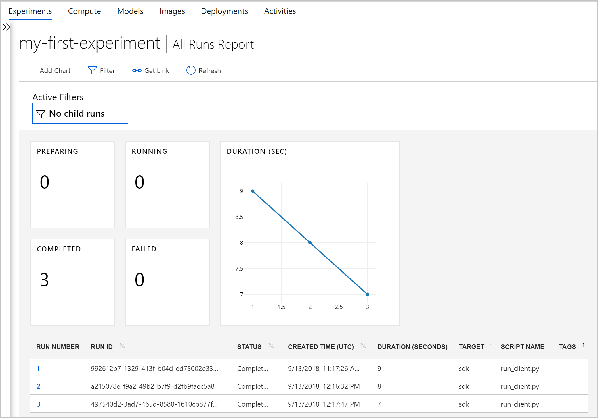

# What happened to Azure Machine Learning Workbench?

The Azure Machine Learning Workbench application and some other early features were deprecated and replaced in the **September 2018** release to make way for an improved [architecture](concept-azure-machine-learning-architecture.md).

To improve your experience, the release contains many significant updates prompted by customer feedback. The core functionality from experiment runs to model deployment hasn't changed. But now, you can use the robust <a href="https://docs.microsoft.com/python/api/overview/azure/ml/intro?view=azure-ml-py" target="_blank">Python SDK</a>, R SDK, and the [Azure CLI](reference-azure-machine-learning-cli.md) to accomplish your machine learning tasks and pipelines.

Most of the artifacts that were created in the earlier version of Azure Machine Learning are stored in your own local or cloud storage. These artifacts won't ever disappear.

In this article, you learn about what changed and how it affects your pre-existing work with the Azure Machine Learning Workbench and its APIs.

>[!Warning]
>This article is not for Azure Machine Learning Studio users. It is for Azure Machine Learning customers who have installed the Workbench (preview) application and/or have experimentation and model management preview accounts.


## What changed?

The latest release of Azure Machine Learning includes the following features:
+ A [simplified Azure resources model](concept-azure-machine-learning-architecture.md).
+ A [new portal UI](how-to-track-experiments.md) to manage your experiments and compute targets.
+ A new, more comprehensive Python <a href="https://docs.microsoft.com/python/api/overview/azure/ml/intro?view=azure-ml-py" target="_blank">SDK</a>.
+ The new expanded [Azure CLI extension](reference-azure-machine-learning-cli.md) for machine learning.

The [architecture](concept-azure-machine-learning-architecture.md) was redesigned for ease of use. Instead of multiple Azure resources and accounts, you only need an [Azure Machine Learning Workspace](concept-workspace.md). You can create workspaces quickly in the [Azure portal](how-to-manage-workspace.md). By using a workspace, multiple users can store training and deployment compute targets, model experiments, Docker images, deployed models, and so on.

Although there are new improved CLI and SDK clients in the current release, the desktop workbench application itself has been retired. Experiments can be managed in the [workspace dashboard in Azure Machine Learning studio](how-to-track-experiments.md#view-the-experiment-in-the-web-portal). Use the dashboard to get your experiment history, manage the compute targets attached to your workspace, manage your models and Docker images, and even deploy web services.

<a name="timeline"></a>

## Support timeline

On January 9th, 2019 support for Machine Learning Workbench, Azure Machine Learning Experimentation and Model Management accounts, and their associated SDK and CLI ended.

All the latest capabilities are available by using this <a href="https://docs.microsoft.com/python/api/overview/azure/ml/intro?view=azure-ml-py" target="_blank">SDK</a>, the [CLI](reference-azure-machine-learning-cli.md), and the [portal](how-to-manage-workspace.md).

## What about run histories?

Older run histories are no longer accessible, how you can still see your runs in the latest version.

Run histories are now called **experiments**. You can collect your model's experiments and explore them by using the SDK, the CLI, or the Azure Machine Learning studio.

The portal's workspace dashboard is supported on Microsoft Edge, Chrome, and Firefox browsers only:

[](./media/overview-what-happened-to-workbench/image001.png#lightbox)

Start training your models and tracking the run histories using the new CLI and SDK. You can learn how with the [Tutorial: train models with Azure Machine Learning](tutorial-train-models-with-aml.md).

## Will projects persist?

You won't lose any code or work. In the older version, projects are cloud entities with a local directory. In the latest version, you attach local directories to the Azure Machine Learning workspace by using a local config file. See a [diagram of the latest architecture](concept-azure-machine-learning-architecture.md).

Much of the project content was already on your local machine. So you just need to create a config file in that directory and reference it in your code to connect to your workspace. To continue using the local directory containing your files and scripts, specify the directory's name in the ['experiment.submit'](https://docs.microsoft.com/python/api/azureml-core/azureml.core.experiment.experiment?view=azure-ml-py) Python command or using the `az ml project attach` CLI command.  For example:
```python
run = exp.submit(source_directory=script_folder,
                 script='train.py', run_config=run_config_system_managed)
```

[Create a workspace](how-to-manage-workspace.md) to get started.

## What about my registered models and images?

The models that you registered in your old model registry must be migrated to your new workspace if you want to continue to use them. To migrate your models, download the models and re-register them in your new workspace.

The images that you created in your old image registry cannot be directly migrated to the new workspace. In most cases, the model can be deployed without having to create an image. If needed, you can create an image for the model in the new workspace. For more information, see [Manage, register, deploy, and monitor machine learning models](concept-model-management-and-deployment.md).

## What about deployed web services?

Now that support for the old CLI has ended, you can no longer redeploy models or manage the web services you originally deployed with your Model Management account. However, those web services will continue to work for as long as Azure Container Service (ACS) is still supported.

In the latest version, models are deployed as web services to Azure Container Instances (ACI) or Azure Kubernetes Service (AKS) clusters. You can also deploy to FPGAs and to Azure IoT Edge.

Learn more in these articles:
+ [Where and how to deploy models](how-to-deploy-and-where.md)
+ [Tutorial: Deploy models with Azure Machine Learning](tutorial-deploy-models-with-aml.md)

## Next steps

Learn about the [latest architecture for Azure Machine Learning](concept-azure-machine-learning-architecture.md).

For an overview of the service, read [What is Azure Machine Learning?](overview-what-is-azure-ml.md).

Create your first experiment with your preferred method:
  + [Use Python notebooks](tutorial-1st-experiment-sdk-setup.md)
  + [Use R Markdown](tutorial-1st-r-experiment.md) 
  + [Use automated machine learning](tutorial-designer-automobile-price-train-score.md) 
  + [Use the designer's drag & drop capabilities](tutorial-first-experiment-automated-ml.md) 
  + [Use the ML extension to the CLI](tutorial-train-deploy-model-cli.md)
