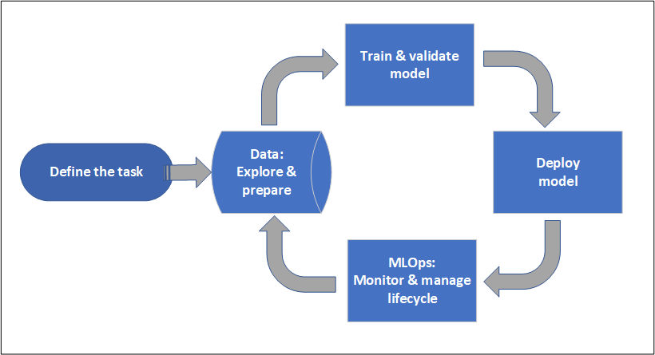
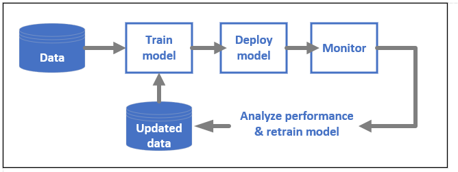

# What is Azure Machine Learning?

Azure Machine Learning is a cloud service for accelerating and managing the machine learning project lifecycle. Machine learning professionals, data scientists, and engineers can use it in their day-to-day workflows: Train and deploy models, and manage MLOps.

You can create a model in Azure Machine Learning or use a model built from an open-source platform, such as Pytorch, TensorFlow, or scikit-learn. MLOps tools help you monitor, retrain, and redeploy models. 

> [!Tip]
> **Free trial!**  If you don’t have an Azure subscription, create a free account before you begin. [Try the free or paid version of Azure Machine Learning](https://azure.microsoft.com/free/machine-learning/search/). You get credits to spend on Azure services. After they're used up, you can keep the account and use [free Azure services](https://azure.microsoft.com/free/). Your credit card is never charged unless you explicitly change your settings and ask to be charged.

## Who is Azure Machine Learning for?

Azure Machine Learning is for individuals and teams implementing MLOps within their organization to bring machine learning models into production in a secure and auditable production environment.

Data scientists and ML engineers will find tools to accelerate and automate their day-to-day workflows. Application developers will find tools for integrating models into applications or services. Platform developers will find a robust set of tools, backed by durable Azure Resource Manager APIs, for building advanced ML tooling.

Enterprises working in the Microsoft Azure cloud will find familiar security and role-based access control (RBAC) for infrastructure. You can set up a project to deny access to protected data and select operations.

### Collaboration for machine learning teams

Machine learning projects often require a team with varied skillsets to build and maintain. Azure Machine Learning has tools that help enable collaboration, such as:

- Shared notebooks, compute resources, data, and environments
- Tracking and auditability that shows who made changes and when
- Asset versioning

### Tools for developers

Developers find familiar interfaces in Azure Machine Learning, such as:

- [Python SDK](/python/api/overview/azure/ml/)
- [Azure Resource Manager REST APIs (preview)](/rest/api/azureml/)
- [CLI v2 (preview)](/cli/azure/ml)

### Studio UI 

The Azure Machine Learning studio is a graphical user interface for a project workspace. In the studio, you can:

- View runs, metrics, logs, outputs, and so on.
- Author and edit notebooks and files.
- Manage common assets, such as
    - Data credentials
    - Compute
    - Environments
- Visualize run metrics, results, and reports.
- Visualize pipelines authored through developer interfaces.
- Author AutoML jobs.

Plus, the designer has a drag-and-drop interface where you can train and deploy models. 

## Enterprise-readiness and security

Azure Machine Learning integrates with te Azure cloud platform to add security to ML projects. 

Security integrations include:

- Azure Virtual Networks (VNets) with network security groups 
- Azure Key Vault where you can save security secrets, such as access information for storage accounts
- Azure Container Registry set up behind a VNet

See [Tutorial: Set up a secure workspace](tutorial-create-secure-workspace.md).

## Azure integrations for complete solutions

Other integrations with Azure services support a machine learning project from end-to-end. They include:

- Azure Synapse Analytics to process and stream data with Spark
- Azure Arc, where you can run Azure services in a Kubernetes environment
- Storage and database options, such as Azure SQL Database, Azure Storage Blobs, and so on
- Azure App Service allowing you to deploy and manage ML-powered apps

## Machine learning project workflow

Typically models are developed as part of a project with an objective and goals. Projects often involve more than one person. When experimenting with data, algorithms, and models, development is iterative. 

### Project lifecycle

While the project lifecycle can vary by project, it will often look like this:

A workspace organizes a project and allows for collaboration for many users all working toward a common objective. Users in a workspace can easily share the results of their runs from experimentation in the studio user interface or use versioned assets for jobs like environments and storage references.

For more information, see [Manage Azure Machine Learning workspaces](how-to-manage-workspace.md?tabs=python).

When a project is ready for operationalization, users' work can be automated in a machine learning pipeline and triggered on a schedule or HTTPS request.

Models can be deployed to the managed inferencing solution, for both real-time and batch deployments, abstracting away the infrastructure management typically required for deploying models.

## Train models

In Azure Machine Learning, you can run your training script in the cloud or build a model from scratch. Customers often bring models they've built and trained in open-source frameworks, so they can operationalize them in the cloud. 

### Open and interoperable

Data scientists can use models in Azure Machine Learning that they've created in common Python frameworks, such as: 

- PyTorch
- TensorFlow
- scikit-learn
- XGBoost
- LightGBM

Other languages and frameworks are supported as well, including: 
- R
- .NET

See [Open-source integration with Azure Machine Learning](concept-open-source.md).

### Automated featurization and algorithm selection (AutoML)

In a repetitive, time-consuming process, in classical machine learning data scientists use prior experience and intuition to select the right data featurization and algorithm for training. Automated ML (AutoML) speeds this process and can be used through the studio UI or Python SDK.

See [What is automated machine learning?](concept-automated-ml.md)

### Hyperparameter optimization

Hyperparameter optimization, or hyperparameter tuning, can be a tedious task. Azure Machine Learning can automate this task for arbitrary parameterized commands with little modification to your job definition. Results are visualized in the studio.

See [How to tune hyperparameters](how-to-tune-hyperparameters.md).

### Multinode distributed training

Efficiency of training for deep learning and sometimes classical machine learning training jobs can be drastically improved via multinode distributed training. Azure Machine Learning compute clusters offer the latest GPU options.

Supported via Azure Arc-attached Kubernetes (preview) and Azure ML compute clusters:

- PyTorch
- TensorFlow
- MPI

The MPI distribution can be used for Horovod or custom multinode logic. Additionally, Apache Spark is supported via Azure Synapse Analytics Spark clusters (preview).

See [Distributed training with Azure Machine Learning](concept-distributed-training.md).

### Embarrassingly parallel training

Scaling a machine learning project may require scaling embarrassingly parallel model training. This pattern is common for scenarios like forecasting demand, where a model may be trained for many stores.

## Deploy models

To bring a model into production, it is deployed. Azure Machine Learning's managed endpoints abstract the required infrastructure for both batch or real-time (online) model scoring (inferencing).

### Real-time and batch scoring (inferencing)

*Batch scoring*, or *batch inferencing*, involves invoking an endpoint with a reference to data. The batch endpoint runs jobs asynchronously to process data in parallel on compute clusters and store the data for further analysis.

*Real-time scoring*, or *online inferencing*, involves invoking an endpoint with one or more model deployments and receiving a response in near-real-time via HTTPs. Traffic can be split across multiple deployments, allowing for testing new model versions by diverting some amount of traffic initially and increasing once confidence in the new model is established.    

See:
 - [Deploy a model with a real-time managed endpoint](how-to-deploy-managed-online-endpoints.md)
 - [Use batch endpoints for scoring](how-to-use-batch-endpoint.md) 

## MLOps: DevOps for machine learning 

DevOps for machine learning models, often called MLOps, is a process for developing models for production. A model's lifecycle from training to deployment must be auditable if not reproducible.

### ML model lifecycle 

Learn more about [MLOps in Azure Machine Learning](concept-model-management-and-deployment.md).

### Integrations enabling MLOPs

Azure Machine Learning is built with the model lifecycle in mind. You can audit the model lifecycle down to a specific commit and environment. 

Some key features enabling MLOps include:

- `git` integration
- MLflow integration
- Machine learning pipeline scheduling
- Azure Event Grid integration for custom triggers
- Easy to use with CI/CD tools like GitHub Actions or Azure DevOps

Also, Azure Machine Learning includes features for monitoring and auditing:
- Job artifacts, such as code snapshots, logs, and other outputs
- Lineage between jobs and assets, such as containers, data, and compute resources

## Next steps

Start using Azure Machine Learning:
- [Set up an Azure Machine Learning workspace](/quickstart-create-resources.md)
- [Tutorial: Build a first machine learning project](tutorial-1st-experiment-hello-world.md)
- [Preview: Run model training jobs with the v2 CLI](how-to-train-cli.md)
