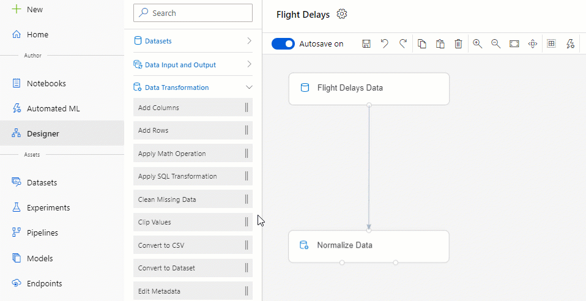

# What is Azure Machine Learning?

In this article, you learn about Azure Machine Learning, a cloud-based environment you can use to train, deploy, automate, manage, and track ML models. 

Azure Machine Learning can be used for any kind of machine learning, from classical ml to deep learning, supervised, and unsupervised learning. Whether you prefer to write Python or R code or zero-code/low-code options such as the [designer](tutorial-designer-automobile-price-train-score.md), you can build, train, and track highly accurate machine learning and deep-learning models in an Azure Machine Learning Workspace. 

Start training on your local machine and then scale out to the cloud. 

The service also interoperates with popular open-source tools, such as PyTorch, TensorFlow, and scikit-learn.

> [!VIDEO https://channel9.msdn.com/Events/Connect/Microsoft-Connect--2018/D240/player]

> [!Tip]
> **Free trial!**  If you don’t have an Azure subscription, create a free account before you begin. Try the [free or paid version of Azure Machine Learning](https://aka.ms/AMLFree) today. You get credits to spend on Azure services. After they're used up, you can keep the account and use [free Azure services](https://azure.microsoft.com/free/). Your credit card is never charged unless you explicitly change your settings and ask to be charged.

## What is machine learning?

Machine learning is a data science technique that allows computers to use existing data to forecast future behaviors, outcomes, and trends. By using machine learning, computers learn without being explicitly programmed.

Forecasts or predictions from machine learning can make apps and devices smarter. For example, when you shop online, machine learning helps recommend other products you might want based on what you've bought. Or when your credit card is swiped, machine learning compares the transaction to a database of transactions and helps detect fraud. And when your robot vacuum cleaner vacuums a room, machine learning helps it decide whether the job is done.

## Machine learning tools to fit each task 

Azure Machine Learning provides all the tools developers and data scientists need for their machine learning workflows, including:
+ The [Azure Machine Learning designer](tutorial-designer-automobile-price-train-score.md) (preview): drag-n-drop modules to build your experiments and then deploy pipelines.

+ Jupyter notebooks: use our [example notebooks](https://aka.ms/aml-notebooks) or create your own notebooks to leverage our <a href="https://docs.microsoft.com/python/api/overview/azure/ml/intro?view=azure-ml-py" target="_blank">SDK for Python</a> samples for your machine learning. 

+ R scripts or notebooks in which you use the <a href="https://azure.github.io/azureml-sdk-for-r/reference/index.html" target="_blank">SDK for R</a> to write your own code, or use the R modules in the designer.

+ [Visual Studio Code extension](tutorial-setup-vscode-extension.md)

+ [Machine learning CLI](reference-azure-machine-learning-cli.md)

+ Open-source frameworks such as PyTorch, TensorFlow, and scikit-learn and many more

You can even use [MLflow to track metrics and deploy models](how-to-use-mlflow.md) or Kubeflow to [build end-to-end workflow pipelines](https://www.kubeflow.org/docs/azure/).

## Build ML models in Python or R

Start training on your local machine using the Azure Machine Learning <a href="https://docs.microsoft.com/python/api/overview/azure/ml/intro?view=azure-ml-py" target="_blank">Python SDK</a> or <a href="https://azure.github.io/azureml-sdk-for-r/reference/index.html" target="_blank">R SDK</a>. Then, you can scale out to the cloud. 

With many available [compute targets](how-to-set-up-training-targets.md), like Azure Machine Learning Compute and [Azure Databricks](/azure/azure-databricks/what-is-azure-databricks), and with [advanced hyperparameter tuning services](how-to-tune-hyperparameters.md), you can build better models faster by using the power of the cloud.

You can also [automate model training and tuning](tutorial-auto-train-models.md) using the SDK.

## Build ML models with no-code tools

For code-free or low-code training and deployment, try:

+ **Azure Machine Learning designer (preview)**

  Use the designer to prep data, train, test, deploy, manage, and track machine learning models without writing any code. There is no programming required, you visually connect datasets and modules to construct your model. Try out the [designer tutorial](tutorial-designer-automobile-price-train-score.md).

  Learn more in [the Azure Machine Learning designer overview article](concept-designer.md). 

  

+ **Automated machine learning UI**

  Learn how to create [automated ML experiments](tutorial-first-experiment-automated-ml.md) in the easy-to-use interface. 

  

## MLOps: Deploy & lifecycle management
When you have the right model, you can easily use it in a web service, on an IoT device, or from Power BI. For more information, see the article on [how to deploy and where](how-to-deploy-and-where.md).

Then you can manage your deployed models by using the [Azure Machine Learning SDK for Python](https://aka.ms/aml-sdk), [Azure Machine Learning studio](https://ml.azure.com), or the [machine learning CLI](reference-azure-machine-learning-cli.md).

These models can be consumed and return predictions in [real time](how-to-consume-web-service.md) or [asynchronously](how-to-use-parallel-run-step.md) on large quantities of data.

And with advanced [machine learning pipelines](concept-ml-pipelines.md), you can collaborate on each step from data preparation, model training and evaluation, through deployment. Pipelines allow you to:

* Automate the end-to-end machine learning process in the cloud
* Reuse components and only rerun steps when needed
* Use different compute resources in each step
* Run batch scoring tasks

If you want to use scripts to automate your machine learning workflow, the [machine learning CLI](reference-azure-machine-learning-cli.md) provides command-line tools that perform common tasks, such as submitting a training run or deploying a model.

To get started using Azure Machine Learning, see [Next steps](#next-steps).

## Integration with other services

Azure Machine Learning works with other services on the Azure platform, and also integrates with open source tools such as Git and MLFlow.

+ Compute targets such as __Azure Kubernetes Service__, __Azure Container Instances__, __Azure Databricks__, __Azure Data Lake Analytics__, and __Azure HDInsight__. For more information on compute targets, see [What are compute targets?](concept-compute-target.md).
+ __Azure Event Grid__. For more information, see [Consume Azure Machine Learning events](concept-event-grid-integration.md).
+ __Azure Monitor__. For more information, see [Monitoring Azure Machine Learning](monitor-azure-machine-learning.md).
+ Data stores such as __Azure Storage accounts__, __Azure Data Lake Storage__, __Azure SQL Database__, __Azure Database for PostgreSQL__, and __Azure Open Datasets__. For more information, see [Access data in Azure storage services](how-to-access-data.md) and [Create datasets with Azure Open Datasets](how-to-create-register-datasets.md#create-datasets-with-azure-open-datasets).
+ __Azure Virtual Networks__. For more information, see [Secure experimentation and inference in a virtual network](how-to-enable-virtual-network.md).
+ __Azure Pipelines__. For more information, see [Train and deploy machine learning models](/azure/devops/pipelines/targets/azure-machine-learning).
+ __Git repository logs__. For more information, see [Git integration](concept-train-model-git-integration.md).
+ __MLFlow__. For more information, see [MLflow to track metrics and deploy models](how-to-use-mlflow.md) 
+ __Kubeflow__. For more information, see [build end-to-end workflow pipelines](https://www.kubeflow.org/docs/azure/).

### Secure communications

Your Azure Storage account, compute targets, and other resources can be used securely inside a virtual network to train models and perform inference. For more information, see [Secure experimentation and inference in a virtual network](how-to-enable-virtual-network.md).

## Basic & Enterprise editions

Azure Machine Learning offers two editions tailored for your machine learning needs:
+ Basic (generally available)
+ Enterprise (preview)

These editions determine which machine learning tools are available to developers and data scientists from their workspace.   

Basic workspaces allow you to continue using Azure Machine Learning and pay for only the Azure resources consumed during the machine learning process. Enterprise edition workspaces will be charged only for their Azure consumption while the edition is in preview. Learn more about what's available in the Azure Machine Learning [edition overview & pricing page](https://azure.microsoft.com/pricing/details/machine-learning/). 

You assign the edition whenever you create a workspace. And, pre-existing workspaces have been converted to the Basic edition for you. Basic edition includes all features that were already generally available as of October 2019. Any experiments in those workspaces that were built using Enterprise edition features will continue to be available to you in read-only until you upgrade to Enterprise. Learn how to [upgrade a Basic workspace to Enterprise edition](how-to-manage-workspace.md#upgrade). 

Customers are responsible for costs incurred on compute and other Azure resources during this time.

## Next steps

- Create your first experiment with your preferred method:
  + [Use Python notebooks to train & deploy ML models](tutorial-1st-experiment-sdk-setup.md)
  + [Use R Markdown to train & deploy ML models](tutorial-1st-r-experiment.md) 
  + [Use automated machine learning to train & deploy ML models](tutorial-first-experiment-automated-ml.md) 
  + [Use the designer's drag & drop capabilities to train & deploy](tutorial-designer-automobile-price-train-score.md) 
  + [Use the machine learning CLI to train and deploy a model](tutorial-train-deploy-model-cli.md)

- Learn about [machine learning pipelines](concept-ml-pipelines.md) to build, optimize, and manage your machine learning scenarios.

- Read the in-depth [Azure Machine Learning architecture and concepts](concept-azure-machine-learning-architecture.md) article.
