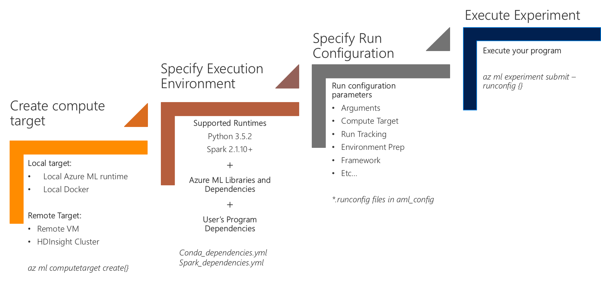
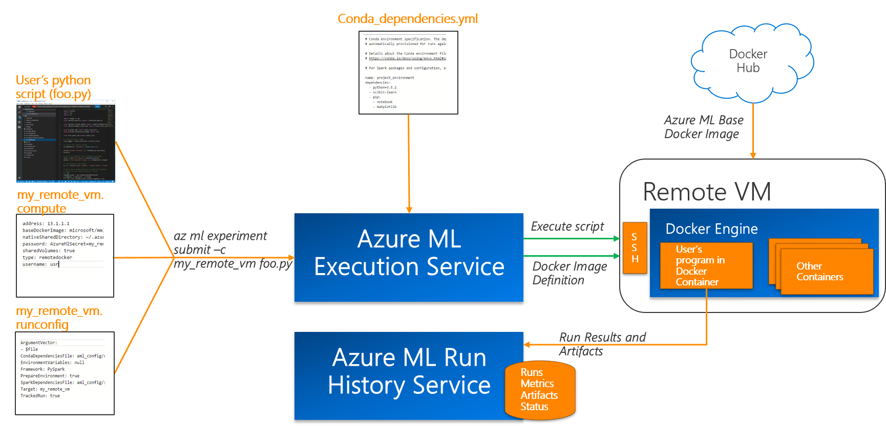

# Overview of Azure Machine Learning Experiment Execution Service
Azure ML (Azure Machine Learning) experiment execution service enables data scientists to execute their experiments using Azure ML's execution and run management capabilities. It provides a framework for agile experimentation with fast iterations. Azure ML Workbench allows you to start with local runs on your machine and an easy path for scaling up and out to other environments such as remote Data Science VMs with GPU or HDInsight Clusters running Spark.

Experiment Execution Service is built for providing reproducible and consistent runs of your experiments. It helps you manage your compute targets, execution environments, and run configurations. Using Azure ML Workbench execution and run management capabilities, you can easily move  between different environments . 

You can execute a Python or PySpark script in an Azure ML Workbench project locally or at scale in the cloud. 

You can run your scripts on: 

* Python (3.5.2) environment on your local computer installed by Azure ML Workbench.
* Conda Python environment inside of a Docker container on local computer
* Conda Python environment inside of a Docker container on a remote Linux machine. For example, an [Ubuntu-based DSVM on Azure](https://azuremarketplace.microsoft.com/marketplace/apps/microsoft-ads.linux-data-science-vm-ubuntu)
* [HDInsight for Spark](https://azure.microsoft.com/services/hdinsight/apache-spark/) on Azure

>Azure ML Execution Service currently supports Python 3.5.2 and Spark 2.1.10+ as Python and Spark runtime versions, respectively. 


## Key Concepts in Azure ML Experiment Execution
It is important to understand the following concepts in Azure ML experiment execution. In the subsequent sections, we discuss how to manage these concepts in detail. 
### Compute Target
Compute target specifies where to execute user's program such as user's desktop, remote Docker on a VM, or a cluster. Compute target is addressable and accessible by the user for further configuration. Azure ML Workbench gives you the ability to create compute targets and manage them using the Workbench application and the CLI. 

>_az ml computetarget attach_ command in CLI enables you to create a compute target that you can use in your runs.

### Supported compute targets are:
* Local Python (3.5.2) environment on your computer installed by Azure ML Workbench.
* Local Docker on your computer
* Remote Docker on Linux VMs. For example, an [Ubuntu-based DSVM on Azure](https://azuremarketplace.microsoft.com/marketplace/apps/microsoft-ads.linux-data-science-vm-ubuntu)
* [HDInsight for Spark cluster](https://azure.microsoft.com/services/hdinsight/apache-spark/) on Azure

>Azure ML Execution Service currently supports Python 3.5.2 and Spark 2.1.10+ as Python and Spark runtime versions, respectively. 

> Windows VMs running Docker are **NOT** supported as remote compute targets.

### Execution Environment
Execution environment defines the run time configuration and the dependencies needed to run the program in Azure ML Workbench.

User manages local execution environment using their favorite tools and package managers if running on Azure ML Workbench default runtime. 

Conda is used to manage local Docker and remote Docker executions as well as HDInsigh-based executions. For these compute targets, execution environment configuration is managed through **Conda_dependencies.yml** and **Spark_dependencies.yml files**. These files are in **aml_config** folder inside your project.

**Supported runtimes for execution environments are:**
* Python 3.5.2
* Spark 2.1.10+

### Run Configuration
In addition to compute target and execution environment, Azure ML provides a framework to define and change run configurations. Different executions of your experiment may require different configuration as part of iterative experimentation. You may be sweeping different parameter ranges, using different data sources, and may turn off run tracking for performance. Azure ML execution service provides a framework for managing run configuration.

>Running _az ml computetarget attach_ command produces two files in your **aml_config** folder in your project: remotevm.compute and remotevm.runconfig following this convention: _<your_computetarget_name>.compute_ and _<your_computetarget_name>.runconfig_. The .runconfig file is automatically created for your convenience when you create a compute target. You can create and manage other run configurations using _az ml runconfigurations_ command in CLI. 


_Following figure shows the high-level flow for initial experiment run:_


## Azure ML Experiment Execution Scenarios
In this section, we dive into execution scenarios and learn about how Azure ML runs experiments, specifically running an experiment locally, on a remote VM, and on an HDInsight Cluster. This section is a walkthrough starting from creating a compute target to executing your experiments.

>For the rest of this article we are using the CLI (Command-line interface) commands to show the concepts and the capabilities. Capabilities described here can also be used from the Workbench desktop application.

## Launching the CLI
An easy way to launch the CLI is opening a project in the Azure ML Workbench desktop application and navigating to **File-->Open Command Prompt**.


This command launches a terminal window in which you can enter commands to execute scripts in the current project folder. This terminal window is configured with the Python 3.5.2 environment which is installed by the Workbench.

>[!NOTE]
> When you execute any _az ml_ command from the command window, you need to be authenticated against Azure. CLI uses an independent authentication cache then the desktop app and so logging in to the Workbench desktop app doesn't mean you are authenticated in your CLI environment. To authenticate, follow the steps below. Authentication token is cached locally for a period of time so you only need to repeat these steps when the token expires. When the token expires or if you are seeing authentication errors, execute the following commands:

```
# to authenticate 
$ az login

# to list subscriptions
$ az account list -o table

# to set current subscription to a particular subscription ID 
$ az account set -s <subscription_id>

# to verify your current Azure subscription
$ az account show
```

>[!NOTE] 
>When you run _az ml_ command within a project folder, make sure that the project belongs to an Azure ML Experimentation account on the _current_ Azure subscription. Otherwise you may encounter execution errors.


## Running Scripts and Experiments
With Azure ML Workbench, you can execute your Python and PySpark scripts on various compute targets using the _az ml experiment submit_ command. This command requires a run configuration definition. 

Azure ML Workbench creates a corresponding .runconfig file when you create a compute target, but you can create additional run configurations using _az ml runconfiguration  create_ command. You can also manually edit the run configuration files.

Run configurations show up as part of experiment run experience in the Workbench application. 

>You can learn more about the run configuration file in the [Experiment Execution Configuration Reference](Experiment-Execution-Configuration-Reference.md) Section.

## Running a script locally on Azure ML Workbench-installed runtime
Azure ML Workbench enables you to run your scripts directly against the Azure ML Workbench-installed Python 3.5.2 runtime. This default runtime is installed at Azure ML Workbench set-up time and includes Azure ML libraries and dependencies. Run results and artifacts for local executions are still saved in Run History Service in the cloud.

>[!NOTE]
> Unlike Docker-based executions, this configuration is _not_ managed by Conda. You need to manually provision package dependencies for your local Azure ML Workbench Python environment.

You can execute the following command to run your script locally on Workbench-installed Python environment. 

```
$az ml experiment submit -c local myscript.py
```

You can find the path to the default Python environment by typing the following command in the Azure ML Workbench CLI window.
```
$ conda env list
```

>[!NOTE]
>Running PySpark locally directly against local Spark environments is currently _not_ supported. Azure ML Workbench does support PySpark scripts running on local Docker. Azure ML base Docker image comes with Spark 2.1.10 pre-installed. 

_Overview of local execution for a Python script:_


## Running a script on local Docker
You can also run your projects on a Docker container on your local machine through Azure ML Execution Service. Azure ML Workbench provides a base Docker image that comes with Azure ML libraries and as well as Spark 2.1.10 runtime to make local Spark executions easy. 

>Docker needs to be already running on the local machine.

For running your Python or PySpark script on local Docker, you can execute the following commands in CLI.

```
$az ml experiment submit -c docker myscript.py

or

az ml experiment submit --run-configuration docker myscript.py
```

Execution environment on local Docker is prepared using the Azure ML base Docker image. Azure ML Workbench downloads this image when running for the first time and overlays it with packages specified in user's conda_dependencies.yml file. This operation makes the initial run slower but subsequent runs are considerably faster thanks to Workbench reusing cached layers. 

>If running a PySpark script on Spark, spark_dependencies.yml is also used in addition to conda_dependencies.yml.

Running your scripts on a Docker image gives you the following benefits:

1. It ensures that your script can be reliably executed in other execution environments. Running on a Docker container helps you discover and avoid any local references that may impact portability. 

2. It allows you to quickly test code on runtimes and frameworks that are complex to install and configure, such as Apache Spark, without having to install them yourself.


_Overview of local Docker execution for a Python script:_


## Running a script on a remote Docker
In some cases, resources available on user's local machine may not be enough to train the desired model. In this situation, Azure ML Execution Service allows an easy way to run your Python or PySpark scripts on more powerful VMs using remote Docker execution. 

Remote VM should satisfy the following requirements:
* Remote VM needs to be running Linux-Ubuntu and should be accessible through SSH. 
* Remote VM needs to have Docker running.

> Windows VMs running Docker is **NOT** supported as remote compute targets


You can use the following command to create both the compute target definition and run configuration for a remote Docker-based executions.

```
az ml computetarget attach --name "remotevm" --address "remotevm_IP_address" --username "sshuser" --password "sshpassword" --type remotedocker
```

Once you configure the compute target, you can use the following command to run your script.
```
$ az ml experiment submit -c remotevm myscript.py
```
[!NOTE]
>Keep in mind that execution environment is configured using the specifications in conda_dependencies.yml. spark_dependencies.yml is also used if PySpark framework is specified in .runconfig file. 

The Docker construction process for remote VMs is exactly the same as the process for local Docker runs so you should expect a similar execution experience.

If you prefer to avoid the latency introduced by building the Docker image for your first run, you can use the following command to prepare the compute target before executing your script. 

```
az ml experiment prepare -c remotevm
```

_Overview of remote vm execution for a Python script:_



## Running a script on HDInsight Cluster
HDInsight is a popular platform for big-data analytics supporting Apache Spark. Azure ML Workbench enables experimentation on big data using HDInsight Spark clusters. 

You can create a compute target and run configuration for an HDInsight Spark cluster using the following command:

```
$ az ml computetarget attach --name "myhdi" --address "<IP address>" --username "sshuser" --password "sshpassword" --type cluster 
```

>[!NOTE]
>If want to use FQDN instead of an IP address and your HDI Spark cluster is named _foo_, the SSH endpoint is on the driver node named _foo-ssh.azurehdinsight.net_. Don't forget the **-ssh** postfix in the server name when using this for _--address_ parameter.


Once you have the compute context, you can run the following command to execute your PySpark script.

```
$ az ml experiment submit -c myhdi myscript.py
```

Azure ML Workbench prepares and manages execution environment on HDInsight cluster using Conda. Configuration is managed by _conda_dependencies.yml_ and _spark_dependencies.yml_ configuration files. 

>User needs SSH access to the HDInsight cluster in order to execute experiments in this mode. 

>Supported configuration is HDInsight Spark clusters running Linux (Ubuntu with Python/PySpark 3.5.2 and Spark 2.1.10+).

_Overview of HDInsight-based execution for a PySpark script_


## Running a script on GPU
To run your scripts on GPU, you can follow the guidance in this article:["How to use GPU in Azure Machine Learning"](how-to-use-gpu.md)

## Next steps
* [Quick Start Tutorial](quick-start-iris.md)
* [Model Management](model-management-overview.md)