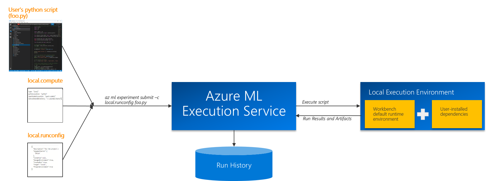

# Overview of Azure ML Experiment Execution Service
Azure ML experiment execution service enables data scientists to execute their experiments using Azure ML's execution and run management capabilities. It provides a framework for agile experimentation with fast iterations starting with local runs and an easy path for scaling up and out to other environments such as a remote Data Science VM with GPUs or an HDInsight Cluster running Spark.

Experiment Execution Service is built for providing reproducable and consistent runs of your experiments by helping you manage your compute targets, execution environments, and run configurations and lets you move between different environments easily with its run management and execution capabilities. 

Users can choose to execute a Python or PySpark script in an Azure ML Workbench project either locally or at scale in the cloud. 

Users can run their scripst on: 

* Python (3.5.2) environment on your local computer installed by Azure ML Workbench.
* Conda Python environment inside of a Docker container on local computer
* Conda Python environment inside of a Docker container on a remote Linux machine such as an [Ubuntu-based DSVM on Azure](https://azuremarketplace.microsoft.com/marketplace/apps/microsoft-ads.linux-data-science-vm-ubuntu)
* [HDInsight for Spark](https://azure.microsoft.com/services/hdinsight/apache-spark/) on Azure

>Azure ML Execution Service currently supports Python 3.5.2 and Spark 2.1.10+ as Python and Spark runtime versions, respectively. 

## Key Concepts in Azure ML Experiment Execution
It is important to understand the following concepts in Azure ML experiment execution. In the subsequent sections, we will discuss in detail how to manage these concepts. 
### Compute Target
Compute target is the resource that is provisioned or assigned to execute user's program such as user's desktop, a remove VM, or a cluster. Compute target is addressable and accessible by the user (or the admin) for further configuration and deployment. Azure ML provides you the capability to create compute targets and manage them using the Workbench application, CLI, and the .compute files. 

#### Supported compute targets are:
* Local machine
    * Python (3.5.2) environment on your local computer installed by Azure ML Workbench.
    * Conda Python environment inside of a Docker container on local computer
* Remote Linux (Ubuntu) VM
    * Conda Python environment inside of a Docker container on a remote Linux machine
* Remote HDInsight Cluster
    * Conda environment running on HDInsight

### Execution Environment
Execution environment defines the run time configuration and the dependencies needed to run the program. In Azure ML, user has the ability to manage local execution environment using their favorite tools and package managers and Conda is used to manage docker-based local and remote executions as well as HDInsigh-based executions. Execution environment configurations are managed through Conda_dependencies.yml
Spark_dependencies.yml files in aml_config folder in Azure ML projects.

#### Supported runtime environments are:
* Python 3.5.2
* Spark 2.1.10+

### Run Configuration
In addition to compute target and execution environment, Azure ML provides a framework to define and change run configuration. Different execution of your experiment may require different configuration and parameters as part of iterative experimentation such as paramaters to be swept, data sources, run tracking and Azure ML execution service provides a framework for managing run configuration.

Figure below shows the high-level flow for initial experiment run:

# Azure ML Experiment Execution Scenarios
In the previous section, we touched upon some of the key concepts in Azure ML experiment execution service and  supported configurations. In this section, we will dive into execution scenarios and learn about how Azure ML runs experiments.

## Running experiments locally
Azure ML allows users to run their experiments locally against Azure ML installed Python 3.5.2 runtime or on a local docker container.

### Running a script locally on Azure ML Workbench-installed runtime
Azure ML enables users to run their scripts directly against the Azure ML Workbench-installed runtime. This default runtime is installed at Azure Ml Workbench set-up time and includes Azure ML libraries and dependecies.

This configuration, unlike docker-based executions, is _not_ managed by Conda and the user needs to manage dependencies using their preferred tools and package managers. 

