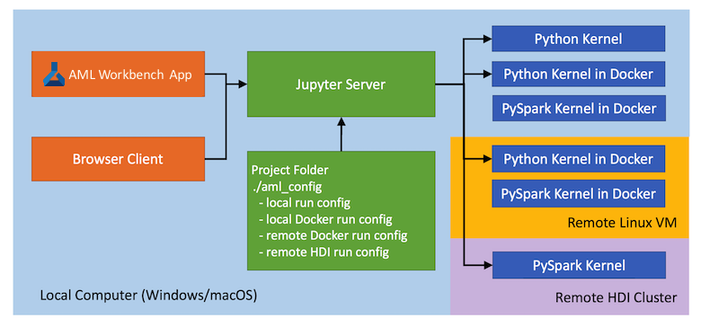
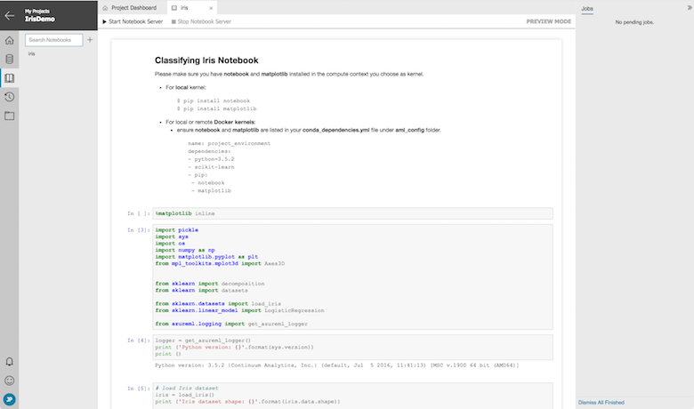
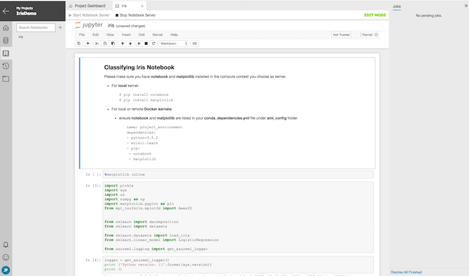
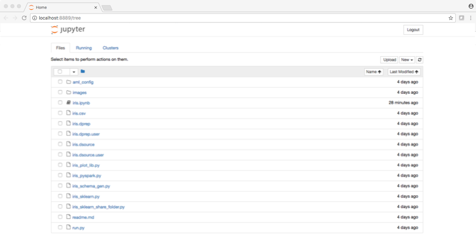
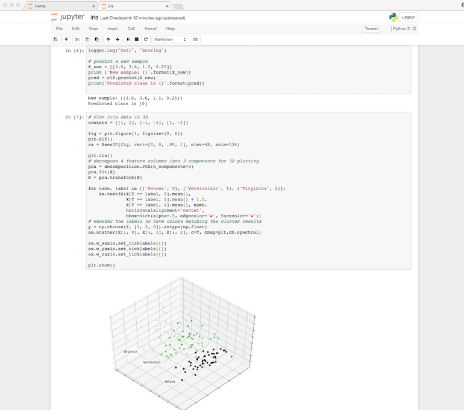

# How to use Jupyter notebook in Azure Machine Learning Workbench

## Introduction
Azure Machine Learning Workbench supports interactive data science experimentation via its integration of Jupyter notebook. This article describes how to make effective use of this feature to increase the rate and the quality of your interactive data science experimentation.

## Prerequisites
- [Provision and install Azure Machine Learning](/machine-learning/preview/quick-start-installation.md).
- Be already familiar with [Jupyter notebook](http://jupyter.org/). Note this article is not about teaching user how to use Jupyter.

## Jupyter notebook architecture
At a high level, Jupyter notebook architecture includes three components, each can run in different compute environments:

- **Client**: receives user input and displays rendered output
- **Server**: web server hosting the notebook files (.ipynb files)
- **Kernel**: the runtime environment where the actual execution of the notebook cells happens

For more details, please reference the official [Jupyter documentation](http://jupyter.readthedocs.io/en/latest/architecture/how_jupyter_ipython_work.html). Fowllowing is a diagram depicting how this client, server, and kernel architecture map to the components in Azure ML.



## Kernels in Azure ML Workbench notebook
You can access many different kernels in Azure ML Workbench by simply configure run configurations and compute targets in the `aml_config` folder in your project. Adding a new compute target by issuing `az ml computetarget attach` command is the equivalent of adding a new kernel.

>[!NOTE]
>Review the [Configure Execution](experiment-execution-configuration.md) for more details on run configurations and compute targets.

### Kernel naming convention
The kernels are typically named in the format of "\<project name> \<run config name>". For example, if you have a run configuration named _docker-python_ in a project named _myIris_, you can find a kernel named "myIris docker-python" in the kernel list when you open a Jupyter notebook.

Currently, the Workbench supports the following types of kernels.

### Local Python kernel
This Python kernel supports execution on local machine. It is integrated with Azure Machine Learning's Run History support. The name of the kernel is typically "my_project_name local".

### Python Kernel in Docker (local or remote)
This Python kernel runs in a Docker container either on your local machine, or in a remote Linux VM. The name of the kernel is typically "my_project docker". The associated `docker.runconfig` file has the `Framework` field set to `Python`.

### PySpark kernel in Docker (local or remote)
This PySpark kernel executes scripts in a Spark context running inside of Docker container, either on your local machine, or on a remote Linux VM. The kernel name is typically "my_project docker". The associated `docker.runconfig` file has the `Framework` field set to `PySpark`.

### PySpark kernel on HDInsight cluster
This kernel runs in the remote HDInsight cluster that you attached as a compute target for your project. The kernel name is typically "my_project my_hdi". 

>[!IMPORTANT]
>In the `.compute` file of the HDI compute target, you must change the `yarnDeployMode` field to `client` (the default value is `cluster`) in order to use this kernel. 

## Start Jupyter Server from the Workbench
From Azure Machine Learning Workbench, notebooks can be accessed via the Workbench's  **Notebooks** tab. The _Classifying Iris_ sample project includes an `iris.ipynb` sample notebook.


When a notebook is opened in Azure Machine Learning Workbench, it is displayed in its own document tab in **Preview Mode**. This is a read-only view that doesn't require a running Jupyter server and kernel.



Clicking **Start Notebook Server** button launches Jupyter server, and switches the notebook into **Edit Mode**. The familiar Jupyter notebook user interface appears embedded in the Workbench. You can now set a kernel from the **Kernel**  menu and start your interactive notebook session. 

>[!NOTE]
>Note for non-local kernels, it can take a minute or two to start if you are using it for the first time. You can execute `az ml experiment prepare` command from CLI window to prepare the compute target so the kernel can start much faster after the compute target is prepared.



This is a fully interactive Jupyter notebook experience. All regular notebook operations and keyboard shortcuts are supported from this window with the exception of some file operations, since they can be done via the Workbench **Notebooks** tab and **File** tab.

## Start Jupyter Server from command line
You can also launch a notebook session by issuing an `az ml notebook start` from the command-line window:
```
$ az ml notebook start
[I 10:14:25.455 NotebookApp] The port 8888 is already in use, trying another port.
[I 10:14:25.464 NotebookApp] Serving notebooks from local directory: /Users/johnpelak/Desktop/IrisDemo
[I 10:14:25.465 NotebookApp] 0 active kernels 
[I 10:14:25.465 NotebookApp] The Jupyter Notebook is running at: http://localhost:8889/?token=1f0161ab88b22fc83f2083a93879ec5e8d0ec18490f0b953
[I 10:14:25.465 NotebookApp] Use Control-C to stop this server and shut down all kernels (twice to skip confirmation).
[C 10:14:25.466 NotebookApp] 
    
    Copy/paste this URL into your browser when you connect for the first time,
    to login with a token:
        http://localhost:8889/?token=1f0161ab88b22fc83f2083a93879ec5e8d0ec18490f0b953
[I 10:14:25.759 NotebookApp] Accepting one-time-token-authenticated connection from ::1
[I 10:16:52.970 NotebookApp] Kernel started: 7f8932e0-89b9-48b4-b5d0-e8f48d1da159
[I 10:16:53.854 NotebookApp] Adapting to protocol v5.1 for kernel 7f8932e0-89b9-48b4-b5d0-e8f48d1da159
```
Your default browser is automatically launched with Jupyter server pointing to the project home directory. You can also use the URL and token displayed in the CLI window to launch other browser windows locally. 



You can now click on a `.ipynb` notebook file, open it, and set the kernel (if it hasn't been set), and start your interactive session.



## Next Steps
- To learn how to use Jupyter notebook, visit the [Jupyter official documentation](http://jupyter-notebook.readthedocs.io/en/latest/).    
- To gain a deeper understanding of Azure ML experimentation execution environment, review [Overview of Azure Machine Learning experiment execution service](experiment-execution-configuration.md)

