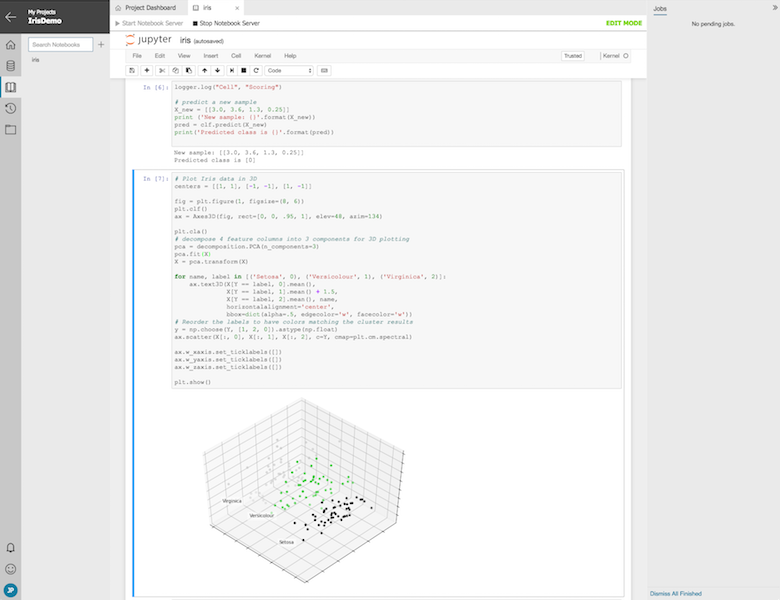

# How to Use Jupyter Notebooks in Azure Machine Learning Workbench

## Introduction
Azure Machine Learning Workbench supports interactive data science experimentation via its integration of **Jupyter Notebooks**.
This article describes how to make effective use of these features to increase the rate and the quality of your data science experimentation.


## Prerequisites
To step through this how-to guide, you need to:
- [Install AML Workbench](doc-template-how-to.md)


## Notebook Basics
Notebooks live in the notebooks tab.
They’re shown according to the project’s folder hierarchy


When the user clicks on an existing notebook, they get a read-only preview


Clicking Start Notebook Server switches the notebook into Edit Mode.


This is a full interactive Juptyer Notebook experience _in place_, complete with code output.


and plotting too.



This is a nice feature.


## Command Line Interface
We have a command-line Interface, first with help page.
```
johns-mbp:IrisDemo johnpelak$ pwd
/Users/johnpelak/Desktop/IrisDemo
johns-mbp:IrisDemo johnpelak$ az ml notebook -h

Group
    az ml notebook: Start a notebook server.

Commands:
    start: Execute run.

johns-mbp:IrisDemo johnpelak$ az ml notebook start -h

Command
    az ml notebook start: Execute run.

Arguments
    --project -p: Path to the project.

Global Arguments
    --debug     : Increase logging verbosity to show all debug logs.
    --help -h   : Show this help message and exit.
    --output -o : Output format.  Allowed values: json, jsonc, table, tsv.  Default: json.
    --query     : JMESPath query string. See http://jmespath.org/ for more information and examples.
    --verbose   : Increase logging verbosity. Use --debug for full debug logs.
johns-mbp:IrisDemo johnpelak$ 

```

Now, here's how to use it.

```
$ az ml notebook start
[I 10:14:25.455 NotebookApp] The port 8888 is already in use, trying another port.
[I 10:14:25.464 NotebookApp] Serving notebooks from local directory: /Users/johnpelak/Desktop/IrisDemo
[I 10:14:25.465 NotebookApp] 0 active kernels 
[I 10:14:25.465 NotebookApp] The Jupyter Notebook is running at: http://localhost:8889/?token=1f0161ab88b22fc83f2083a93879ec5e8d0ec18490f0b953
[I 10:14:25.465 NotebookApp] Use Control-C to stop this server and shut down all kernels (twice to skip confirmation).
[C 10:14:25.466 NotebookApp] 
    
    Copy/paste this URL into your browser when you connect for the first time,
    to login with a token:
        http://localhost:8889/?token=1f0161ab88b22fc83f2083a93879ec5e8d0ec18490f0b953
[I 10:14:25.759 NotebookApp] Accepting one-time-token-authenticated connection from ::1
[W 10:16:52.692 NotebookApp] 404 GET /nbextensions/widgets/notebook/js/extension.js?v=20170911101425 (::1) 6.80ms referer=http://localhost:8889/notebooks/iris.ipynb
[I 10:16:52.970 NotebookApp] Kernel started: 7f8932e0-89b9-48b4-b5d0-e8f48d1da159
[I 10:16:53.854 NotebookApp] Adapting to protocol v5.1 for kernel 7f8932e0-89b9-48b4-b5d0-e8f48d1da159
```

## Notebook User Experience via CLI Launch
When launched from the CLI, a Juptyer Notebook user experience is available from standalone web browser.
You can see the file system.


You can also see the Notebook itself.


## Next Steps
These features are available to assist with the process of interactive data science experimentation.
We hope that you find them to be useful, and would greatly appreciate your feedback.
This is just our initial implementation, and we have a great deal of enhancements planned.
We look forward to continuously delivering them to the Azure Machine Learning Workbench. 

