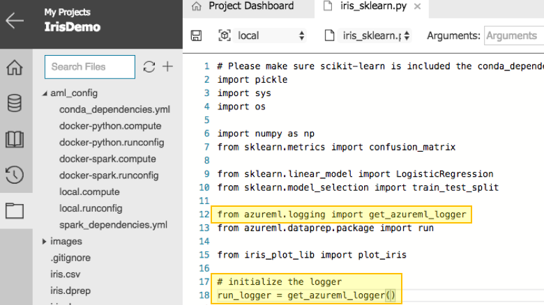
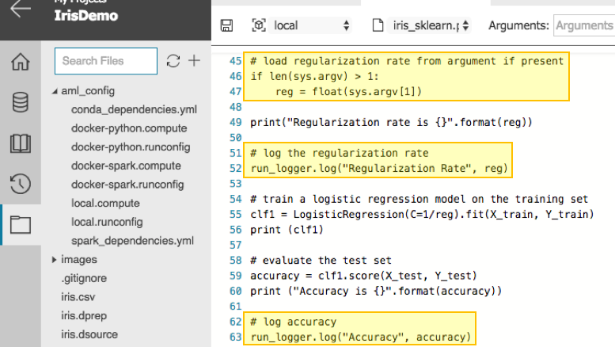
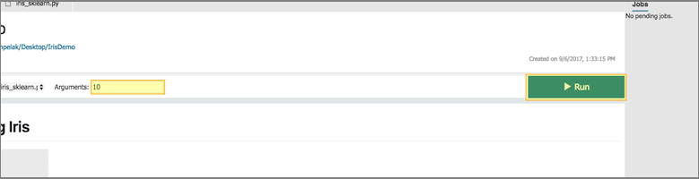
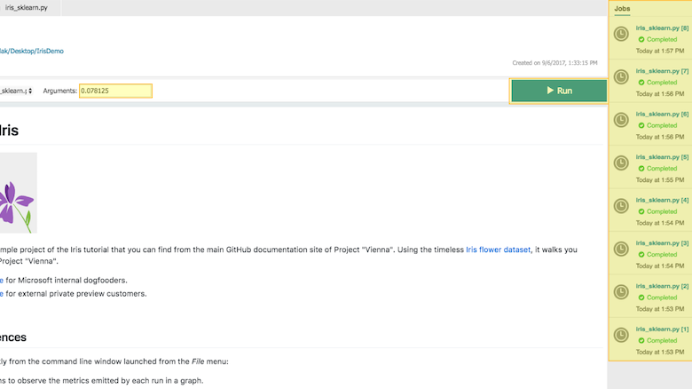
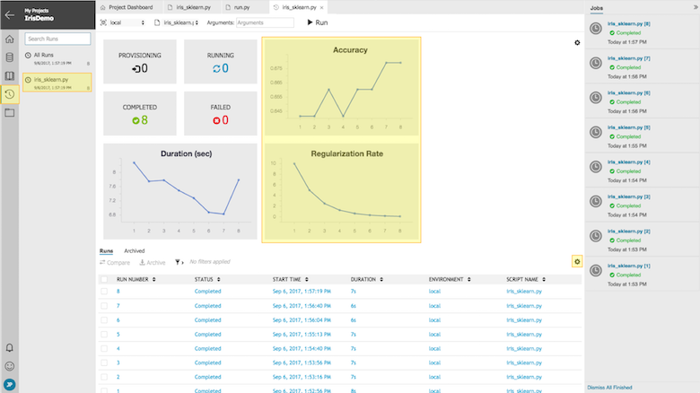
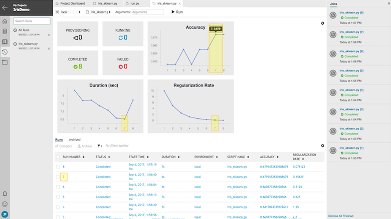
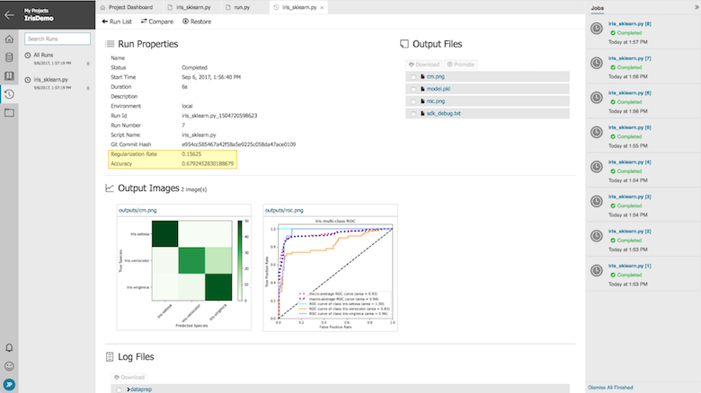
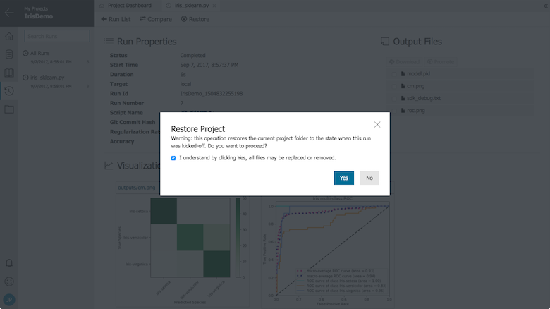

# How to Use Run History and Model Metrics in Azure Machine Learning Workbench

## Introduction
Azure Machine Learning Workbench supports data science experimentation via its **Run History** and **Model Metrics** features.
**Run History** provides a means to track the outputs of your machine learning experiments, and then enables filtering and comparison of their results.
**Model Metrics** can be logged from any point of your scripts, tracking whatever values are most important in your data science experiments.
This article describes how to make effective use of these features to increase the rate and the quality of your data science experimentation.

## Prerequisites
To step through this how-to guide, you need to:
- [Install AML Workbench](doc-template-how-to.md)


## Azure ML Logging API Overview
The Azure ML Logging API is available via the **azureml.logging** module in Python (which is installed with the Azure ML Workbench.)
After importing this module, you can use the **get_azureml_logger** method to instantiate a **logger** object.
Then, you can use the logger's **log** method to store key/value pairs produced by your Python scripts.
Currently, logging model metrics of scalar, dictionary, list, dataframe types are supported as shown.

```Python
# create a logger instance in already set up environment 
from azureml.logging import get_azureml_logger
logger = get_azureml_logger()

# log scalar (any integer or floating point type is fine)
logger.log("simple value", 7)

# log dictionary
logger.log("range", {"min":5, "max":7})

# log list
logger.log("all values", [5, 6, 7])

# log dataframe
import pandas
df = pandas.DataFrame.from_records([(1,2),(3,4)],columns=["a","b"])
logger.log("dataframe", df)
```
It is easy to use the logger within your Azure ML Workbench projects, and this article shows you how to do so.

## Create a Project in Azure ML Workbench
Effective use of the Azure ML Workbench **Run History** feature begins with a solid project, and a project based on the **Classifying Iris** template provides a great foundation for exploration.
You can create such a project by completing the **Create New Project dialogue**.
For a detailed walkthrough of creating a project using the Classifying Iris template, see the Iris Tutorial for Machine Learning Server.
Once the project creation is complete, the *Project Dashboard* (which serves as the home page of your project) appears and is now available for your use (as shown.)


This template provides nice examples of Azure ML's *data preparation*, *experimentation*, and *operationalization* capabilities (for further discussion of its features, see the [Iris Quickstart for Machine Learning Server](quick-start-iris.md).)
From the **Project Dashboard**, you can open the **iris_sklearn.py** script (as shown.)


You can use this script as a guide for expected implementation of model metric logging in Azure ML.

## Parameterize and Log Model Metrics from Script
In the **iris_sklearn.py** script, **Lines 12 through 18** show the expected pattern to import and construct the logger in Python.



The creation pattern can be reduced to the following lines of code.

```Python
from azureml.logging import get_azureml_logger
run_logger = get_azureml_logger()
```

Once created, you can invoke the **log** method with a name/value pair as shown in **lines 52 and 63**.
When script development is complete, it is often useful to parameterize scripts so that values can be passed in via the command line.
**Lines 46 and 47** show how to accept command-line parameters (when present) using standard Python libraries.
This script takes a single parameter for the Regularization Rate (*reg*) used to fit a classification model in an effort to increase *accuracy* without overfitting.
These variables are then logged as *Regularization Rate* and *Accuracy* so that the model with optimal results can be easily identified.



The parsing and logging actions can be captured in the following lines of code.

```Python
#presuming reg and run_logger have been initialized before these statements
import sys
if len(sys.argv) > 1:
    reg = float(sys.argv[1])

run_logger.log("Regularization Rate", reg)

# compute accuracy value, then...

run_logger.log("Accuracy", accuracy)
```

Taking these steps in your scripts enable them to make optimal usage of **Run History**.

## Launch Runs from Project Dashboard
Returning to the **Project Dashboard**, you can launch a **tracked run** by selecting the **iris_sklearn.py** script and entering the **regularization rate** parameter in the **Arguments** edit box.



Since launching tracked runs does not block Azure ML Workbench, several can be launched in parallel.
The status of each tracked run is visible in the **Jobs Panel** as shown.



This enables optimal resource utilization without requiring each job to run in serial.

## View Results in Run History
Progress and results of tracked runs are available for analysis in Azure ML Workbench's **Run History**.
**Run History** provides three distinct views:
- Dashboard
- Details
- Comparison

The **Dashboard** view displays data across all runs of a given script, rendered in both graphical, and tabular forms.
The **Details** view displays all data generated from a specific run of a given script, including logged metrics and output files (such as rendered plots.)
The **Comparison** view enables results of two or three runs to be viewed side-by-side, also including logged metrics and output files.

Across eight tracked runs of **iris_sklearn.py**, values for the **regularization rate** parameter and **accuracy** result were logged to illustrate how to use the Run History views.

### Run History Dashboard
The results of all eight runs are visible in the **Run History Dashboard**.
As **iris_sklearn.py** logs *Regularization Rate* and *Accuracy*, the **Run History Dashboard** displays charts for these values by default.



The **Run History Dashboard** can be customized so that logged values also appear in the grid.  Clicking the **customize** icon displays the **List View Customization** dialogue as shown.


Any values logged during tracked runs are available for display, and selecting **Regularization Rate** and **Accuracy** adds them to the grid.


It is easy to find interesting runs by hovering over points in the charts.  In this case, Run 7 yielded a good accuracy coupled with a low duration.



Clicking a point associated with Run 7 in any chart or the link to Run 7 in the grid displays the **Run History Details**.

### Run History Details
From this view, full results of the Run 7 along with any artifacts produced by Run 7 are displayed.



The **Run History Details** view also provides the capability to **download** any files written to the **./outputs** folder (these files are backed by Azure ML Workbench's cloud storage for Run History, which is the subject of another article.)

Finally, **Run History Details** provides a means to restore your project its state at the time of this run.
Clicking the **Restore** button displays a confirmation dialogue as shown.



If confirmed, files may be overwritten or removed, so use this feature carefully.

### Run History Comparison
Selecting two or three runs in the **Run History Dashboard** and clicking **Compare** brings you to the **Run History Comparison** view.
Alternatively, clicking **Compare** and selecting a run within the **Run History Details** view also brings you to the **Run History Comparison** view.
In either case, the **Run History Comparison** view provides a means to see the logged results and artifacts of two or three runs side by side.


This view is especially useful for comparison of plots.

## Next Steps
These features are available to assist with the process of data science experimentation.
We hope that you find them to be useful, and would greatly appreciate your feedback.
This is just our initial implementation, and we have a great deal of enhancements planned.
We look forward to continuously delivering them to the Azure Machine Learning Workbench. 
