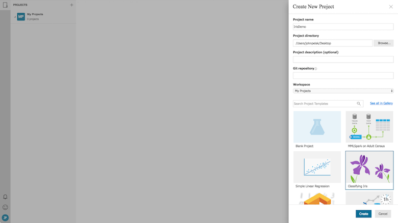

# How to Use Run History and Model Metrics in Azure Machine Learning Workbench

## Introduction

Azure Machine Learning Workbench supports data science experimentation via its Run History and Model Metrics features.
This article describes how to make effective use of these features to increase the rate and the quality of your experimentation.

## Prerequisites
To step through this how-to guide, you need to:
- [Install AML Workbench](doc-template-how-to.md)

## Create a Project in Azure ML Workbench
Effective use of the **Azure ML Workbench Run History feature** begins with a solid project, and a project based on the **Classifying Iris** template provides a great foundation for exploration.
You can create such a project from Workbench's **+New Project menu** - when selected, the **Create New Project dialogue** is displayed as shown.

Once you choose the **Classifying Iris** template and provide a **Project name** and **Project directory**, you can then complete the dialogue.

The **Project Dashboard**, which serves as the *home page* of your project, is displayed and now available for your use.

This template provides nice examples of Azure ML's *data preparation*, *experimentation*, and *operationalization* capabilities.  For further discussion of its features, see this [article](quick-start-iris.md).

## Parameterize and Log Model Metrics from Script
Azure ML allows you to log numeric and string values from your scripts via classes provided by the **azureml.logging** module.
The **iris_sklearn.py** illustrates how to instantiate the Azure ML logger.

**Lines 12 through 18** show the expected pattern to import and construct the logger in Python.

Once created, invoke the **log** method with a name/value pair you would like to log as shown in **lines 52 and 63**.
When development is complete, it is often useful to parameterize scripts so that values can be passed in via the command line.
**Lines 46 and 47** show how to accept command-line parameters when present using standard Python libraries.
The script takes a single parameter for the *regularization rate* used to fit a *classification model* in an effort to increase model accuracy without overfitting.
*Regularization rate* and *accuracy* are tracked so that the model with optimal results can be identified.

Taking these steps in your scripts enable them to make optimal usage of **Run History**.

## Launch Runs from Project Dashboard
Returning to the **Project Dashboard**, you can launch a *tracked run* by selecting the **iris_sklearn.py** script and entering the *regularization rate* in the **Arguments** edit box.

These *tracked runs* can be launched in parallel, and their status is visible in the **Jobs Panel** as shown.

Resource utilization can thus be optimized without requiring jobs to run in serial.

## View Results in Run History
Results of completed runs are available for analysis in *Run History*.
Across eight *tracked runs* of **iris_sklearn.py**, values for the *regularization rate* parameter and *accuracy* result were logged as shown in the **Run History Dashboard**.

The **Run History Dashboard** can be customized so that logged values appear in the grid.  Clicking the *customize* icon displays the List View Customization dialogue as shown.

Any values logged during *tracked runs* are available for display, and selecting *accuracy* and *regularization rate* adds them to the grid.

It is easy to find interesting runs by hovering over points in the charts.  In this case, Run 7 yielded a good *accuracy* coupled with a low *duration*.

Clicking a point associated with Run 7 in any chart or the link to Run 7 in the grid displays the *Run Details*.

From this view, full results of the Run 7 along with any artifacts produced by Run 7 are displayed.

## Next steps
Results of *tracked runs* can also be compared, as we will explore in a future article.
