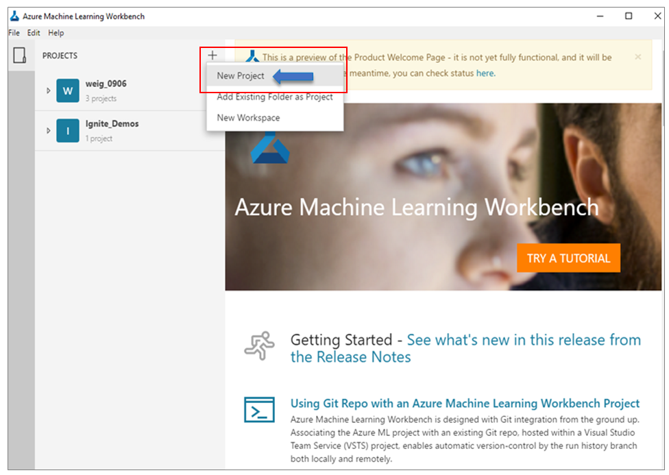
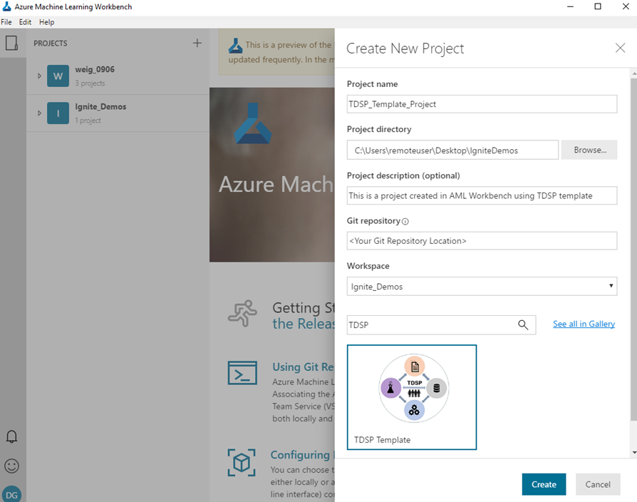
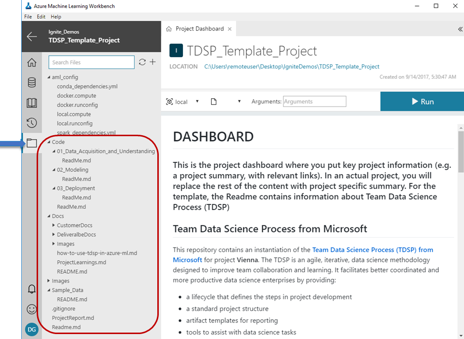
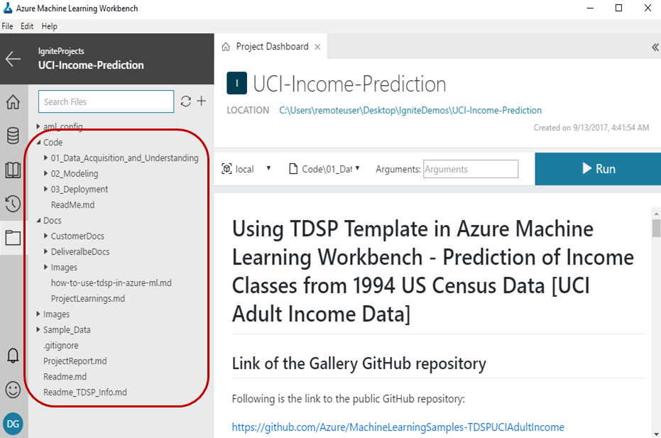

# Structure Projects with Team Data Science Process Template

This document provides instructions on how to create a data science projects in Azure Machine Learning with Team Data Science Process (TDSP) templates that structure projects for collaboration and reproducibility. 

## What Is Team Data Science Process?
The Team Data Science Process is an agile, iterative, data science process for executing and delivering advanced analytics solutions. It is designed to improve the collaboration and efficiency of data science teams in enterprise organizations. It supports these objectives with four key components:

1. A standard [data science lifecycle](https://github.com/Azure/Microsoft-TDSP/blob/master/Docs/lifecycle-detail.md) definition.
2. A standardized project structure [project documentation and reporting templates](https://github.com/Azure/Azure-TDSP-ProjectTemplate)
3. Infrastructure and resources for project execution, such as compute and storage infrastructure, and code repositories.
4. [Tools and utilities](https://github.com/Azure/Azure-TDSP-Utilities) for data science project tasks, such as collaborative version control and code review, data exploration and modeling, and work planning.

For a more complete discussion of the TDSP, see the [Team Data Science Process overview](https://github.com/Azure/Microsoft-TDSP/blob/master/Docs/README.md).

## Why Should You Use TDSP Structure and Templates?
Standardization of the structure, lifecycle, and documentation of data science projects is key to facilitating effective collaboration on data science teams. Creating Azure Machine Learning projects with the TDSP template provides a framework for coordinated teamwork.

We had previously released a [GitHub repository for the TDSP project structure and templates](https://github.com/Azure/Azure-TDSP-ProjectTemplate) to help achieve these objectives. But it was not possible, until now, to instantiate the TDSP structure and templates within a data science tool. It is now possible to create an Azure Machine Learning project that instantiates the TDSP structure and documentation templates. 

## Things To Note *Before* Creating A New Project
These are the things you should note or review *before* creating a new project:
* TDSP Azure Machine Learning [Template](https://aka.ms/tdspamlgithubrepo).
* Contents (other than what is there in the 'docs' folder) are required to be less than 25 Mb in size. See **NOTE** below.
* The sample\_data folder is only for small data files (less than 5 Mb) with which you can test your code or do early development.
* Storing files such as Office Word, PowerPoint etc. can increase the size of 'docs' folder substantially. We advise you to find a collaborative Wiki, [SharePoint](https://products.office.com/en-us/sharepoint/collaboration), or other collaborative resource to store such files.
* For handling large files and outputs in Azure Machine Learning, read [this](http://aka.ms/aml-largefiles).

> [!NOTE]
> Be sure other than the readme.md file, all documentation-related content (text, markdowns, images, other document files) that are NOT used during the project execution reside in the folder named 'docs' (all lowercase). This is a special folder ignored by Azure Machine Learning execution so that contents in this folder do not get copied to compute target unnecessarily. Objects in this folder also don’t count towards the 25-MB cap for project size, so you may store large image files needed in your documentation for example. They are still tracked by Git through Run History. 

## Instantiating TDSP Structure and Templates From the Azure Machine Learning Template Gallery
To create a new project with the Team Data Science Process structure and documentation templates, complete the following procedures: 

### Click on "New Project"
Open Azure Machine Learning. Under **Projects** on top left, click on **+** and select **New Project** to create a new project.

### Creating a new TDSP-structured project
Specify the parameters and information in the relevant boxes:

- Project name
- Project directory
- Project description
- An empty Git repository path
- Workspace name

Then in the **Search** box, type in *TDSP*. When the **TDSP Template** shows up, click on it to select that template. Then click the **Create** button to create your new project with the TDSP structure. If you provide an empty Git repository during creating the project (in the appropriate box), then that repository will be populated with the project structure and contents after creation of the project.

## Examine The TDSP Project Structure
After your new project is created, you can examine its structure (left panel in figure below). It contains all of the aspects of standardized documentation for business understanding, the stages of the TDSP lifecycle, data location, definition, and architecture in this documentation template. This structure is derived from the TDSP structure published [here](https://github.com/Azure/Azure-TDSP-ProjectTemplate), with some modifications. For example, several of the document templates are merged into one markdown, namely, [ProjectReport](https://aka.ms/tdspamlgithubrepoprojectreport). 

### Project Folder Structure
The TDSP project template contains following top-level folders:
1. **code**: Contains code
2. **docs**: Contains necessary documentation about the project (for example, Markdown files, related media etc.)
3. **sample_data**: Contains **SAMPLE (small)** data that can be used for early development or testing. Typically, not more than several (5) Mbs. Not for full or large data-sets.

## Using The TDSP Structure and Templates
The structure and templates need to be populated with project specific information. You are expected to populate these with code and information necessary for executing and delivering your project. The [ProjectReport](https://aka.ms/tdspamlgithubrepoprojectreport) file is a template that should be directly modified with information relevant to your project. It comes with a set of questions that help you fill out the information for each of the four stages of the [Team Data Science Process lifecycle](https://github.com/Azure/Microsoft-TDSP/blob/master/Docs/lifecycle-detail.md).

For an example of how a project structure can look like during execution or after completion is given below (left panel in figure below). This is from the [Team Data Science Process Sample Project: Classify incomes from US Census data in Azure Machine Learning](https://github.com/Azure/MachineLearningSamples-TDSPUCIAdultIncome).

## Documenting Your Project
Refer to [TDSP documentation templates](https://github.com/Azure/Azure-TDSP-ProjectTemplate) for documenting your project. In the current Azure Machine Learning TDSP documentation template, we recommend that you include all the information in the [ProjectReport](https://aka.ms/tdspamlgithubrepoprojectreport) file. This template should be filled out with information that is specific to your project. 

We also provide another [ProjectLearnings](https://aka.ms/tdspamlgithubrepoprojectlearnings) template to include any information not be included in the primary project document, but that is still useful to document. 

### Example Project Report
An example project report can be found [here](https://github.com/Azure/MachineLearningSamples-TDSPUCIAdultIncome/blob/master/docs/deliveralbe_docs/ProjectReport.md). This is the projet report for the [US Income Classification sample project](https://github.com/Azure/MachineLearningSamples-TDSPUCIAdultIncome), which shows how the TDSP template can be instantiated and used for a data sciene project.

## Next Steps
To facilitate your understanding on how the TDSP structure and templates can be used in Azure Machine Learning projects, we provide several worked-out project examples in the documentation for Azure Machine Learning.

- For a sample showing how create a TDSP project in Azure Machine Learning, see [Team Data Science Process Sample Project: Classify incomes from US Census data in Azure Machine Learning](https://github.com/Azure/MachineLearningSamples-TDSPUCIAdultIncome) 
- For a sample that uses Deep Learning in NLP in a TDSP-instantiated project in Azure Machine Learning, see [Bio-medical entity recognition using Natural Language Processing with Deep Learning](https://github.com/Azure/MachineLearningSamples-BiomedicalEntityExtraction)
