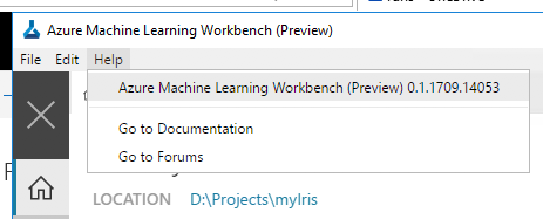

# Azure Machine Learning Workbench - Known Issues And Troubleshooting Guide 
This article helps you find and correct errors or failures encountered as a part of using the Azure Machine Learning Workbench application. 

> [!IMPORTANT]
> When communicating with the support team, it is important to have the build number. You can find out the build number of the app by clicking on the **Help** menu. Clicking on the build number copies it to your clipboard. You can paste it into emails or support forums to help report issues.



## How to get help
There are a few different ways to get help.

### Post to MSDN Forum
We have an MSDN Forum that you can post questions. The product team monitors the forum actively. 
The address is [https://aka.ms/azureml-forum](https://aka.ms/azureml-forum).

### Gather diagnostics information
Sometimes we might ask you to send us diagnostics information of a particular execution. You can package up the relevant files using the following command:

```azurecli
# Find out the run id first
$ az ml history list -o table

# Create a ZIP file that contains all the diagnostics information
$ az ml experiment diagnostics -r <run_id> -t <target_name>
```

The `az ml experiment diagnostics` command generates a `diagnostics.zip` file in the project root folder. This ZIP package contains the entire project folder in the state at the time it was executed, plus logging information. Be sure to remove any sensitive information you don't want to include before sending us the diagnostics file.

### Send us a frown (or a smile)

When you are working in Azure ML Workbench, you can also send us a frown (or a smile) by clicking on the smiley face icon at the lower left corner of the application shell. You can optionally choose to include your email address (so we can get back to you), and/or a screenshot of the current state. 

## Known service limits
- Max allowed project folder size: 25 MB.
    >[!NOTE]
    >This limit doesn't apply to `.git`, `docs` and `outputs` folders. These folder names are case-sensitive. If you are working with large files, refer to [Persisting Changes and Deal with Large Files](how-to-read-write-files.md).

- Max allowed experiment execution time: seven days
- Max size of tracked file in `outputs` folder after a run: 512 MB
  - This means if your script produces a file larger than 512 MB in the outputs folder, it is not collected there. If you are working with large files, refer to [Persisting Changes and Deal with Large Files](how-to-read-write-files.md).

- SSH keys are not supported when connecting to a remote machine or Spark cluster over SSH. Only username/password mode is currently supported.

- Text clustering transforms are not supported on Mac.

- RevoScalePy library is not supported only on Windows, or on Linux (in Docker containers). It is not supported on macOS.

## Docker error "read: connection refused"
When executing against a local Docker container, sometimes you might see the following error: 
```
Get https://registry-1.docker.io/v2/: 
dial tcp: 
lookup registry-1.docker.io on [::1]:53: read udp [::1]:49385->[::1]:53: 
read: connection refused
```

You can fix it by changing the Docker DNS Server from `automatic` to a fixed value of `8.8.8.8`.

## Remove VM execution error "no tty present"
When executing against a Docker container on a remote Linux machine, you might encounter the following error message:
```
sudo: no tty present and no askpass program specified.
``` 
This can happen if you use Azure portal to change the root password of an Ubuntu Linux VM. 

Azure Machine Learning Workbench requires password-less sudoers access to run on remote hosts. The simplest way to do that is to use _visudo_ to edit the following file (you may create the file if it does not exist):

```
$ sudo visudo -f /etc/sudoers
```

>[!IMPORTANT]
>It is important to edit the file with _visudo_ and not another command. _visudo_ automatically syntax checks all sudo config files, and failure to produce a syntactically correct sudoers file can lock you out of sudo.

Insert the following line at the end of the file:

```
username ALL=(ALL) NOPASSWD:ALL
```

Where _username_ is the name of Azure Machine Learning Workbench will use to log in to your remote host.

The line must be placed after #includedir "/etc/sudoers.d", otherwise it may be overridden by another rule.

If you have a more complicated sudo configuration, you may want to consult sudo documentation for Ubuntu available here: https://help.ubuntu.com/community/Sudoers

The above error can also happen if you are not using an Ubuntu-based Linux VM in Azure as an execution target. We only support Ubuntu-based Linux VM for remote execution. 

## VM disk is full
By default when you create a new Linux VM in Azure, you get a 30-GB disk for the operating system. Docker engine by default uses the same disk for pulling down images and running containers. This can fill up the OS disk and you see a "VM Disk is Full" error when it happens.

You can add a data disk and configure Docker engine to use the data disk for storing images. Here is [how to add a data disk](https://docs.microsoft.com/en-us/azure/virtual-machines/linux/add-disk).

Or, you can expand the OS disk, and you don't have to touch Docker engine configuration. Here is [how you can expand the OS disk](https://docs.microsoft.com/en-us/azure/virtual-machines/linux/add-disk).

## Sharing C drive on Windows
If you are executing in a local Docker container on Windows, setting `sharedVolumes` to `true` in the `docker.compute` file under `aml_config` can improve execution performance. However, this requires you share C drive in the _Docker for Windows Tool_. If you are not able to share C drive, try the following tips:

* Check the sharing on C drive using file explorer
* Open network adapter settings and uninstall/reinstall "File and Printer Sharing for Microsoft Networks" for vEthernet
* Open docker settings and share C drive from within docker settings
* Changes to the Windows password affect the sharing. Open File explorer, reshare the C drive, and enter the new password.
* You might also encounter firewall issue when attempting to share your C drive with Docker. This [Stack Overflow post](http://stackoverflow.com/questions/42203488/settings-to-windows-firewall-to-allow-docker-for-windows-to-share-drive/43904051) can be helpful.
* When sharing C drive using domain credentials, the sharing might stop working on networks where the domain controller is not reachable (for example, home network, public wifi etc.). For more information, see [this post](https://blogs.msdn.microsoft.com/stevelasker/2016/06/14/configuring-docker-for-windows-volumes/).

You can also avoid the sharing problem, at a small performance cost, by setting `sharedVolumne` to `false` in the `docker.compute` file.

## Some useful Docker commands

Here are some useful Docker commands:

```sh
# display all running containers
$ docker ps

# dislplay all containers (running or stopped)
$ docke ps -a

# display all images
$ docker images

# show Docker logs of a container
$ docker logs <container_id>

# create a new container and launch into a bash shell
$ docker run <image_id> /bin/bash

# launch into a bash shell on a running container
$ docker exec -it <container_id> /bin/bash

# stop an running container
$ docker stop <container_id>

# delete a container
$ docker rm <container_id>

# delete an image
$ docker rmi <image_id>

# delete all unussed Docker images (dangerous!)
$ docker system prune -a

```