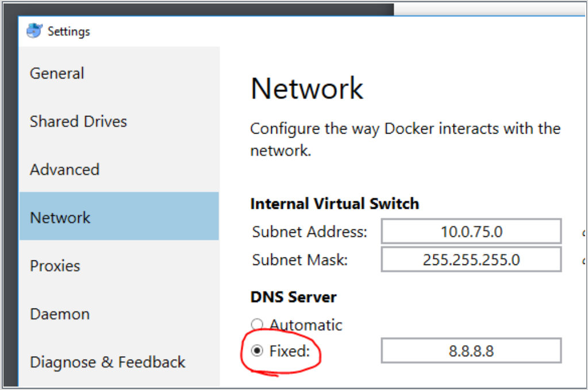

# Known Issues And Troubleshooting Guide 

## Security
* RSA keys are not supported when connecting to a remote machine or Spark cluster over SSH. Only username/password mode is supported.

## Sharing C drive in Docker for Windows stops working
* Check the sharing on C drive using file explorer
* Open network adapter settings and uninstall/reinstall "File and Printer Sharing for Microsoft Networks" for vEthernet
* Open docker settings and share C drive from within docker settings
* Changes to the Windows password affect the sharing. Open File explorer, reshare the C drive, and enter the new password.
* You might also encounter firewall issue when attempting to share your C drive with Docker. This [Stack Overflow post](http://stackoverflow.com/questions/42203488/settings-to-windows-firewall-to-allow-docker-for-windows-to-share-drive/43904051) can be helpful.
* When sharing C drive using domain credentials, the sharing might stop working on networks where the domain controller is not reachable (for example, home network, public wifi etc.). For more information, see [this post](https://blogs.msdn.microsoft.com/stevelasker/2016/06/14/configuring-docker-for-windows-volumes/).

## DataPrep
- Text clustering transform doesn't work on macOS.

## Python/PySpark Script Execution
* CentOS-based Azure Data Science Virtual Machine (DSVM) is not supported. You can target [Ubuntu-based DSVM](https://azuremarketplace.microsoft.com/marketplace/apps/microsoft-ads.linux-data-science-vm-ubuntu).
* If you change the password on the Linux VM from Azure portal, and then you try to execute against that VM you see an error about "sudo: no tty present and no askpass program specified". Workaround: add a file named _myDockerUsers_ (any file name works as long as it has no dot in the file name) in _/etc/sudoers.d_ with following content (replace \<username> with the actual username):
```
<username> ALL = NOPASSWD: /usr/bin/docker, /usr/bin/nvidia-docker
```

## Docker
* When executing against a local Docker container, if you see the following error, you can fix it by changing the Docker DNS Server from Automatic to Fixed 8.8.8.8. 
```
Get https://registry-1.docker.io/v2/: 
dial tcp: 
lookup registry-1.docker.io on [::1]:53: read udp [::1]:49385->[::1]:53: 
read: connection refused
```


## Check the Build Number for Azure Machine Learning Workbench
You can find out the build number of the installed app by clicking on the **Help** menu. Clicking on the build number copies it to your clipboard. You can paste it to emails or support forums to help report issues.


## Remove prior installations of Azure Machine Learning Workbench
When a new release becomes available, Azure Machine Learning Workbench will auto-update on its own replacing your existing local installation. It is usually unnecessary to remove prior installations. However, you can run the following scripts if you'd like to clean up your current install and start fresh: 

* Windows command line: [cleanup_win.cmd](scripts/quick-start-installation/cleanup_win.cmd). 
* Windows PowerShell: [cleanup_win.ps1](scripts/quick-start-installation/cleanup_win.ps1). 
  * Note, you may need to execute "_Set-ExecutionPolicy Unrestricted_" in a privilege-elevated PowerShell window before you can run the downloaded PowerShell script.
* macOS: [cleanup_mac.sh](scripts/quick-start-installation/cleanup_mac.sh)
  * You may need to execute `_chmod a+x ./cleanup_mac.sh_` before you can run the downloaded script.

>Note: to run these clean-up scripts, you might need elevated privileges. Also, these scripts will not delete your existing projects.


## Operationalization (O16N) CLI

## Feedback
If you discovered other undocumented issues, send feedback through _Send a Smile/Frown_. 

