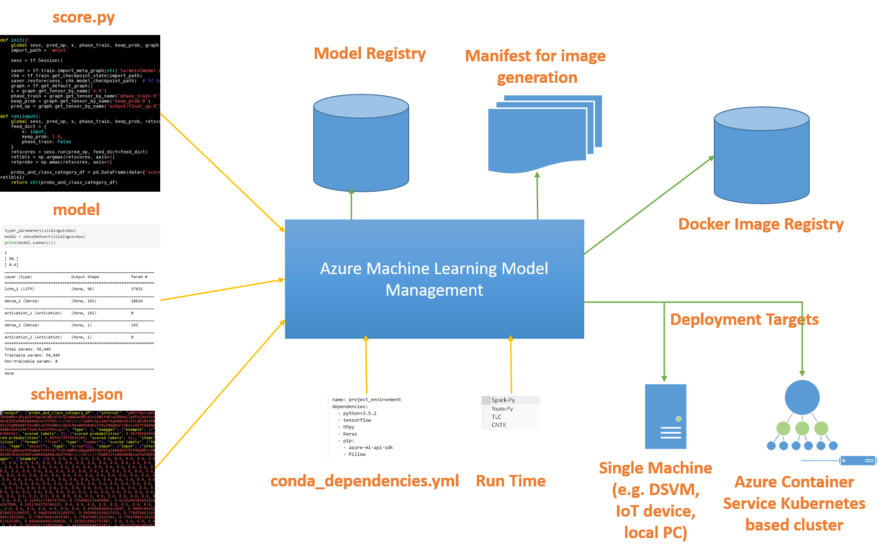

# Azure Machine Learning Model Management 

Azure Machine Learning Model Management enables enterprises and users to manage and deploy machine-learning workflows and models as Docker containerized web services. 

The Model Management Service provides capabilities for:
- Model versioning
- Tracking models in production
- Deploying models in production through [Azure Container Service](https://azure.microsoft.com/en-us/services/container-service/) using [Kubernetes](https://docs.microsoft.com/en-us/azure/container-service/kubernetes/container-service-kubernetes-walkthrough)
- Deploying models as local web services or to IoT edge devices as Docker container clusters
- Automated model retraining
- Capturing model telemetry for actionable insights. 
 

The Azure Machine Learning Model Management deploys models into production by creating a Linux-based Docker container that includes the model and all encompassing dependencies. It adds web service front-end required for REST endpoints with necessary authentication, load balancing, and encryption.  

The Azure Machine Learning Model Management provides these capabilities through the CLI, API, or the Azure portal. 

The Azure Machine Learning Model Management uses the following information for registering a given model, creating a manifest that is required for building a container, building a container image for the Docker, and deploying the container to Azure Container Service using Kubernetes.

 - user generated scoring file
 - model path, conda dependency file
 - runtime environment choice, and 
 - schema for managing models in production 
 
 The following figure shows an overview of how models are registered and deployed into the cluster. 

## Create and manage models 
Enterprises can register models with Azure Machine Learning Model Management for tracking models and versions in the production.  For ease of reproducibility and governance, the service captures all dependencies and associated information. For deeper insights into performance, users can capture model telemetry using the Python SDK. Model telemetry is archived in a user-provided storage, and can be  used later for tracking model performance, retraining, and gaining model insights for the business users.

## Create and manage manifests 
Models require additional artifacts to deploy into the production. The system provides the capability to create a manifest that encompasses model, dependencies, inference script (aka scoring script), sample data, schema etc. This manifest acts as a recipe to create a Docker container image. Enterprises can auto-generate manifest, create different versions, and manage their manifests. 

## Create and manage Docker container images 
The users can use the manifest from the previous step to generate and regenerate Docker-based container images in their respective environments. The containerized Docker-based images provide enterprises with the flexibility to run these images on scalable [Kubernetes based Azure Container Service](https://docs.microsoft.com/azure/container-service/kubernetes/container-service-kubernetes-walkthrough), or pull these images into their environment to run on-prem, on the local machine, or on IoT device. These Docker-based containerized images are self-contained with all necessary dependencies required for generating predictions. 

## Deploy Docker container images 
With the Model Management Service, users can deploy Docker-based container images with a single command to Azure Container Service. These deployments are created with a front-end server that provides load balancing, encryption, API key authorization, and swagger. Users can control the deployment scale and telemetry: 
- Users can enable/disable system logging and model telemetry for each web service level. If enabled, all stdout logs are streamed to [Azure Application Insights](https://azure.microsoft.com/services/application-insights/) and model telemetry is archived in users provided storage. 
- Users can control auto-scale and concurrency limits that automatically increases the number of deployed containers based on the load within the existing cluster size. 

## Consumption 
Azure Machine Learning Model Management creates a REST API for the deployed model along with the swagger document. Users can consume deployed models by calling the REST APIs with API key and model inputs to get the predictions as part of the line-of-business applications. The sample code is available in GitHub for languages Java, [Python](https://github.com/CortanaAnalyticsGallery-Int/digit-recognition-cnn-tf/blob/master/client.py), and C# for calling REST APIs. The Azure Machine Learning Model Management CLI provides an easy way to consume these REST APIs using a single CLI command, within a swagger-enabled applications, or a using curl. 

## Retraining 
Azure Machine Learning Model Management provides APIs for the users to retrain their models, and to update existing deployment with new versions of the model. As part of the data science workflow, the user recreates a new model in their experimentation environment, registers this new model with model management, and updates  existing deployment  with this new model using a single UPDATE CLI command. The UPDATE method updates existing deployment without changing API URL and the key. The business applications consuming the model continues to work without any code change and starts getting better predictions using new model.

The complete workflow describing these concepts is captured in the following figure:

## Frequently asked questions (FAQ) 
- What data types can I pass NumPy arrays directly as input to web service?

If you are providing schema file that was created using generate_schema SDK, then you can pass NumPy and/or Pandas DF. You can pass any JSON serializable inputs. You can pass image as binary encoded string as well.

- Does the web service support multiple inputs or parse different inputs? 

Yes, you can take multiple inputs packaged in the same JSON request.

- Is the call activated by a  request to the web service a blocking call or an asynchronous call?

If service was created using realtime option as part of the CLI or API, then it is blocking/sync. It is expected to be realtime fast. Although on the client you can call it using async HTTP library.

- How many requests can the web service simultaneously handle?

It depends on the cluster and web service scale. You can scale out your service to 100x of PODs and it handles as many requests concurrently. 

- How many requests can the web service queue up?

It is configurable. By default, it is set to ~50 per single POD, but you can increase/decrease it to your application requirements. Typically increasing it, increases the service throughput but makes the latencies worse at higher percentiles. To keep the latencies consistent, you may want to set the queuing to a low value (1-10), and increase the number of PODs to handle the throughput. You can also turn on autoscaling. 

- Can the same machine or cluster be used for multiple web service endpoints?

Absolutely. You can run 100x of services/endpoints on the same cluster. 

