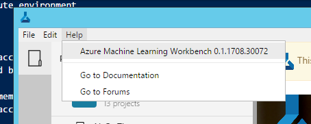

# Installing Azure Machine Learning preview features

In order to use Azure Machine Learning preview features, you need to do two things:
- Provision Azure resources.
- Install the Azure Machine Learning Workbench desktop application, which also includes CLI (command-line interface) tools.

## Prerequisites
### Mandatory Requirements:
* Access to an Azure subscription where you have sufficient permissions to create Azure resources. Minimally, you need to be a Contributor of the subscription, or Contributor of a Resource Group in the subscription.
* Supported operating systems for the Azure ML Workbench:
    * Windows 10
    * Windows server 2016
    * macOS Sierra (or newer)
>Note model management CLI tools are also supported on Linux.

### Optional Requirements:
* Local Docker engine for running dev/test scenarios locally.
* Access to Unbutu Linux VM for scale-up computation.
* Access to HDInsight for Spark cluster for scale-out computation.
* Access to Azure Container Service (ACS) Kubernetes cluster for scale-out model deployment.

### Special Note for macOS Users
Ensure that you run this [shell script](scripts/quick-start-installation/install_openssl.sh) to brew-install the latest OpenSSL libraries, and configure links before proceeding with the installation.

If you are using Python greater than 3.5, you need to execute this command to enable installing the right certificates.
```bash
$ /Applications/Python\ 3.6/Install\ Certificates.command
```

## Provisioning
Launch the Azure portal by browsing to [http://portal.azure.com](http://portal.azure.com). Log in to Azure. Click on _+ New_ and search for _Machine Learning_. Look for _ML Experimentation (preview)_ in the search results. Click on _ML Experimentation (preview)_ to get started with creating your _Machine Learning Experimentation account_. As part of the Experimentation account creation, you are also asked to create an Azure storage account, or supply an existing one, for storing Run outputs and other data.

As part of the Experimentation account creation experience, you have an option of also creating the _Machine Learning Model Management account_. You need this resource when you are ready to deploy and manage your models as real-time web services. It is recommended that you create the Model Management account along with the Experimentation account.

<!--
>NOTE: Some note about pricing associated for public preview should go in here.
-->

## Installation
You can install Azure Machine Learning Workbench on your Windows or macOS computer.
### Remove prior installations
When a new release becomes available, Azure Machine Learning Workbench auto-updates on its own over the existing installation. It is usually unnecessary to remove prior installations. But in case you want to clean up and start a fresh install, you can run the following scripts: 

* Windows command line: [cleanup_win.cmd](scripts/quick-start-installation/cleanup_win.cmd). 
* Windows PowerShell: [cleanup_win.ps1](scripts/quick-start-installation/cleanup_win.ps1). 
  * Note, you may need to execute "_Set-ExecutionPolicy Unrestricted_" in a privilege-elevated PowerShell window before you can run the downloaded PowerShell script.
* macOS: [cleanup_mac.sh](scripts/quick-start-installation/cleanup_mac.sh)
  * You may need to execute "_chmod a+x ./cleanup_mac.sh_" before you can run the downloaded script.

>Note: to run these clean-up scripts, you might need elevated privileges. Also, these scripts do not delete your existing projects.

### Download the Latest Azure ML Workbench Installer

| Installer | Operation System  
| ------- | ------- 
| [AmlWorkbenchSetup.exe](https://vienna.blob.core.windows.net/windows/AmlWorkbenchSetup.exe) | Windows 
| [AmlWorkbench.dmg](https://vienna.blob.core.windows.net/osx/AmlWorkbench.dmg) | macOS

### Install Azure ML Workbench
Double-click the downloaded installer _AmlWorkbenchSetup.exe_ (on Windows), or _AmlWorkbench.dmg_ (on macOS). Follow the on-screen instructions to finish the installation. Azure ML Workbench is now installed in the following directory:
```
# On Windows
C:\Users\<username>\AppData\Local\AmlWorkbench

# On macOS
/Applications/AmlWorkbench.app
 ```

Click on the **Launch Azure Machine Learning Workbench** button when installation finishes to launch Workbench. If you close the installer, you can find the shortcut on your desktop named **Azure Machine Learning Workbench**. Double-click and open it. 

Log in using the same account you used earlier to provision Azure resources. 

When logging in succeeds, Workbench attempts to find your ML Experimentation accounts you created earlier from all the Azure subscriptions you have access to. If at least one is found, Azure Machine Learning Workbench will load it and list Workspaces and Projects under that account. And your installation process is complete. You can now move on to installing optional components.

### Provisioning Azure Machine Learning resources through CLI
If no ML Experimentation account is found after you log in, you are presented with the following screen. 

You can go back to the Provisioning steps to create the Experimentation account. Or, you can launch a command-line window by clicking on that link, and provision the resources using CLI tools. Below are the instructions.

First, let's prepare the environment.
```bash
# make sure you have properly installed Azure ML CLI tools
$ az ml -h

# authenticate to Azure
$ az login

# list all your subscriptions
$ az account list -o table
 
# set the subscription you want to use for Azure Machine Learning as the current subscription.
$ az account set -s <subscription id>
```

From here, you have two options, you can create a new Azure resource group, or use an existing one. Note you must have access to create resources within the resource group.

```bash
# Create a new Azure resource group
# Note the currently supported Azure regions are: eastus2, and westcentralus
# -n: Azure resource group name
# -l: Azure region
$ az group create -n mygroup -location eastus2

# Create a new Experimentation account
# -g: Azure resource group
# -a: Experimentation Account name. It must be between 3 and 24 characters in length and use numbers and lower-case letters only.
$ az ml account experimentation create -n myexpacct -g mygroup
```
>Note the new Azure Storage Account auto-created will all carry the same name as the Experimentation account name.

After Experimentation account is created, close the current instance of Workbench, then relaunch it. You should be dropped into the newly created Experimentation account.

If you happen to be a member of more than one Experimentation accounts, you can switch among Experimentation accounts by clicking on your account picture at the lower left corner of the app.

It is a good idea to also create a new Workspace where your Projects can live. You can use commands below.

```bash
# Create a new workspace
# -n: name of the workspace
# -g: resource group name
# -a: Experimentation account name
$ az ml workspace create -n myWS -g mygroup -a myexpacct
```

Let's also create resources needed for deploying and managing your models. 
>Note: Docker engine ust be installed and running if you want to deploy the web service locally.

```bash
# Create a new Model Management Account
# -l: Azure region
# -n: environment name
# -g: Azure resource group name
# --sku-instance: number of skus included.
# --sku-name: the sku name
$ az ml account modelmanagement create -l eastus2 -n myenv -g mygroup --sku-instances 1 --sku-name S1

# Create a new Model Management environment for local web service deployment
# -l: Azure region
# -n: environment name
$ az ml env setup -l eastus2 -n myenv

# Set the environment to be used
# -n: environment name
# -g: Azure resource group name
$ az ml env set -n myenv -g mygroup
```

### Check Your Build number
You can find out the build number of the installed app by clicking on the Help menu. Clicking on the build number copies it to your clipboard. You can paste it to emails or support forums to help report issues.



### Success
You have now successfully installed the Workbench desktop app and command-line interface. Follow the [Iris Quickstart](quick-start-iris.md) to get a quick tour of the Azure ML preview features experience.

### Install Optional Components
Azure ML Workbench can run experiments in various compute targets. To leverage these execution targets, install additional components, and create or obtain access to additional computation resources in Azure:
* Execute on your local **Windows or macOS computer**
    * There is no additional requirements.
* Execute in a **local Docker container**
    * You must have Docker engine installed and running. Follow [Docker installation instructions](https://docs.docker.com/engine/installation/) to install Docker on your operation system.
* Execute in a **Docker container on a remote Linux machine**
    * You must have SSH access (username and password) to that Linux VM, and you must have Docker engine installed and running on that machine.
    * We recommend you [create a Ubuntu-based DSVM (Data Science Virtual Machine) on Azure](https://docs.microsoft.com/en-us/azure/machine-learning/machine-learning-data-science-dsvm-ubuntu-intro), which has Docker pre-installed so it is ready to go.
* Execute in an **HDInsight Spark cluster**
    * You must have SSH access (username and password) to the head node of that HDInsight Spark cluster. Here are the instructions on [provisioning a HDInsight Spark cluster](https://docs.microsoft.com/en-us/azure/hdinsight/hdinsight-apache-spark-jupyter-spark-sql).
* Deploy a web service to run locally on your machine
    * This requires a local Docker installation. Follow [Docker installation instructions](https://docs.docker.com/engine/installation/) to install Docker on your operation system.

#### Special Note on Docker for Windows 
Docker is needed if you want to execute scripts in a local Docker container, or deploy model via a containerized web service locally. Since it is a technology born in Linux, it can be a little challenging to work with on Windows. Make sure you follow these instructions:
- Only Windows 10 is supported for running Docker for Windows.
- Install [Docker for Windows](https://docs.docker.com/docker-for-windows/install/) and have it up and running.
- Make sure your Docker engine is running in [Linux Container mode](https://docs.docker.com/docker-for-windows/#switch-between-windows-and-linux-containers).
- Optionally, for better execution performance, share C drive (or whichever drive the system %temp% folder is) in the Docker for Windows configuration.
 


>Note on Windows, Docker container runs inside of a guest Linux VM on the Windows host via Hyper-V. You can see the Linux VM by opening up Hyper-V manager on your Windows OS.

## Next Steps
- Get a quick tour of Azure Machine Learning Workbench with [_Quickstart: Classifying Iris Flower Dataset_](quick-start-iris.md).
- Walk through an extensive tutorial [_Classifying Iris_](doc-template-tutorial.md).
- Learn about Azure Machine Learning Workbench data preparation capabilities through the [_Wrangling Bike Share Dataset_](doc-template-tutorial.md) tutorial.
