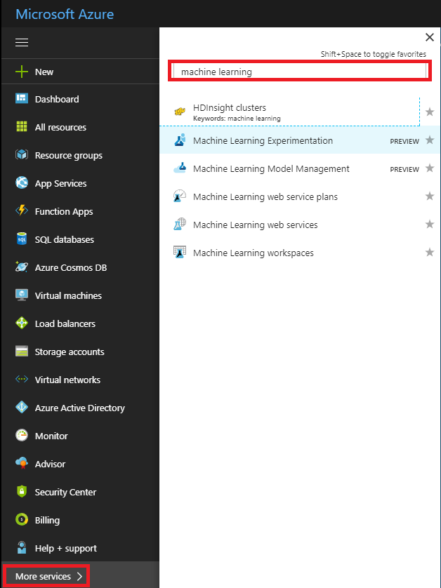

# Create Azure Machine Learning preview accounts and install Azure Machine Learning Workbench
Azure Machine Learning is an integrated, end-to-end data science and advanced analytics solution for professional data scientists to prepare data, develop experiments and deploy models at cloud scale.

This Quickstart shows you how to create experimentation and model management accounts in Azure Machine Learning preview. It also shows you how to install the Azure Machine Learning Workbench desktop application and CLI tools.

## Prerequisites
* An Azure account - you can [create a free account](https://azure.microsoft.com/free/?WT.mc_id=A261C142F).
* Use your own client machine to install Azure Machine Learning Workbench locally. Currently the Azure Machine Learning Workbench can be installed on the following operating systems only:
   * Windows 10
   * Windows Server 2016 
   * macOS Sierra (High Sierra is not supported)

### Optional components
* Docker engine for running dev/test scenarios locally.
* Access to an Ubuntu Linux VM for scale-up computation.
* Access to HDInsight for Spark cluster for scale-out computation.
* Access to Azure Container Service clusters for production web service deployment.

## Provision Azure Machine Learning accounts
Use the Azure portal to provision Azure Machine Learning accounts. 
1. Go to the Azure portal [http://portal.azure.com](http://portal.azure.com). 

2. Enter your credentials to sign in to the portal. 

3. Select the **New** button (+) in the upper-left corner of the portal.

4. Type in "Machine Learning" into the search bar. Select the search result named **Machine Learning Experimentation (preview)**. 

   

5. Click **Add** to open the form to configure a new Machine Learning Experimentation account. 

   

6. Fill out the Machine Learning Experimentation form with the following information:

   Setting|Suggested value|Description
   ---|---|---
   Experimentation account name | _Unique name_ |Choose a unique name that identifies your account. You could use your own name, or a departmental or project name that best identifies the experiment. The name should be between 2 and 32 characters, including only alphanumeric characters and the '-' dash character. 
   Subscription | _Your subscription_ |The Azure subscription that you want to use for your experiment. If you have multiple subscriptions, choose the appropriate subscription in which the resource is billed for.
   Resource Group | _Your resource group_ | You may make a new resource group name, or use an existing one from your subscription.
   Location | _The region closest to your users_ | Choose the location that's closest to your users and the data resources.
   Number of seats | 2 | Type the number of seats. This selection impacts the [pricing](https://azure.microsoft.com/pricing/details/machine-learning/). The first two seats are free. Use two seats for the purposes of this Quickstart. You can update the number of seats later as needed in the Azure portal.
   Storage Account | _Unique name_ | Choose **Create new** and provide a name  to create a new Azure storage account, or choose **Use existing** and select your existing storage account from the drop-down. The storage account is required and is used to hold project artifacts and run history data. 
   Workspace for Experimentation account | _Unique name_ | Provide a name for the new workspace. The name should be between 2 and 32 characters, including only alphanumeric characters and the '-' dash character.
   Assign owner for the workspace | _Your account_ | Select your own account as the workspace owner.
   Create Model Management Account | *check* | As part of the Experimentation account creation experience, you have the option of also creating the Machine Learning Model Management account. This resource is used once you are ready to deploy and manage your models as real-time web services. We recommend creating the Model Management account at the same time as the Experimentation account.
   Account Name | _Unique name_ | Choose a unique name that identifies your Model Management account. You could use your own name, or a departmental or project name that best identifies the experiment. The name should be between 2 and 32 characters, including only alphanumeric characters and the '-' dash character. 
   Model Management pricing tier | **DEVTEST** | Click **No pricing tier selected** to specify the pricing tier for your new Model Management account. For cost savings, select **DEVTEST** pricing tier if available on your subscription (limited availability), otherwise select S1 pricing tier for cost savings. Click **Select** to save the pricing tier selection. 
   Pin to dashboard | _check_ | Check the **Pin to dashboard** option to allow easy tracking of your Machine Learning Experimentation account on the front dashboard page of your Azure portal.

7. If you already have a Machine Learning Experimentation account, and only need to create a Machine Learning Model Management account then you can select **Machine Learning Model Management (preview)** from the step 4 above.  Click on **+Create** button on the **Machine Learning Model Management account** screen. 
   You see the following screen:

   

   Once you have provided all the information for Model Management account in the preceding screenshot, click on **Create**.

8. Once you have provided all the information for Model Management account in the preceding screenshot, click **Create** to begin the creation process.
 
9. On the upper right of the Azure portal toolbar, click **Notifications** (bell icon) to monitor the deployment process. 

   The notification shows "Deployment in progress...". The status changes to "Deployment succeeded" once it is done. Your Machine Learning Experimentation account page opens upon success.


Now, depending on which operating system you use on your local computer, follow one of the next two sections to install Azure Machine Learning Workbench on your computer. 

## Install Azure Machine Learning Workbench on Windows
Install the Azure Machine Learning Workbench on your computer running Windows 10, Windows Server 2016, or newer.

1. Download the latest Azure Machine Learning Workbench installer
**[AmlWorkbenchSetup.msi](https://aka.ms/azureml-wb-msi)**.

2. Double-click the downloaded installer _AmlWorkbenchSetup.msi_ from your File Explorer.

   >[!IMPORTANT]
   >**Download the installer fully on disk, then launch it from there. Do not launch it directly off your browser's download widget.**

3. Finish the installation by following the on-screen instructions.

   The installer downloads all the necessary dependent components such as Python, Miniconda, and other related libraries. The installation may take around half an hour to finish all the components. 

4. Azure Machine Learning Workbench is now installed in the following directory:
   
   `C:\Users\<user>\AppData\Local\AmlWorkbench`

## Install Azure Machine Learning Workbench on macOS
Install the Azure Machine Learning Workbench on your computer running macOS Sierra or newer.

1. Install openssl library using [Homebrew](http://brew.sh). See [Prerequisite for .NET Core on Mac](https://docs.microsoft.com/dotnet/core/macos-prerequisites) for more details.
   ```
   # install Homebrew first if you don't have it already
   /usr/bin/ruby -e "$(curl -fsSL https://raw.githubusercontent.com/Homebrew/install/master/install)"

   # install latest openssl needed for .NET Core 1.x
   brew update
   brew install openssl
   mkdir -p /usr/local/lib
   ln -s /usr/local/opt/openssl/lib/libcrypto.1.0.0.dylib /usr/local/lib/
   ln -s /usr/local/opt/openssl/lib/libssl.1.0.0.dylib /usr/local/lib/
   ```

2. Download the latest Azure Machine Learning Workbench installer
**[AmlWorkbench.dmg](https://aka.ms/azureml-wb-dmg)**.

   >[!IMPORTANT]
   >**Download the installer fully on disk, then launch it from there. Do not launch it directly off your browser's download widget.**

3. Double-click the downloaded installer _AmlWorkbench.dmg_ from Finder.

4. Finish the installation by following the on-screen instructions.

   The installer downloads all the necessary dependent component such as Python, Miniconda, and other related libraries. The installation may take around half an hour to finish all the components. 

5. Azure Machine Learning Workbench is now installed in the following directory: 

   _/Applications/AmlWorkbench.app_

## Run Azure Machine Learning Workbench to log in the first time
1. Click on the **Launch Workbench** button on the last screen of the installer once the installation process is complete. If you have closed the installer, find the shortcut to the Machine Learning Workbench on your desktop and start menu named **Azure Machine Learning Workbench** to launch the app.

2. Log in to the Workbench using the same account you used earlier to provision your Azure resources. 

3. When the login process has succeeded, Azure Machine Learning Workbench attempts to find the Machine Learning Experimentation accounts you created earlier. It searches for all Azure subscriptions to which your credential has access. When at least one Experimentation Account is found, Azure Machine Learning Workbench opens with that account. It then lists the Workspaces and Projects found in that account. 

   >[!TIP]
   > If you have access to more than one Experimentation Account, you can switch to a different one by clicking on the avatar icon in the lower left corner of the Workbench app.

Once the installation process is complete and you log in successfully, move on to installing optional components.

## Install optional components
Azure Machine Learning Workbench can run experiments, or deploy web services in various compute environments. To use these environments, install additional components, or create/obtain access to additional computation resources in Azure:
* Execute experiments on your local **Windows or macOS computer**
   * There are no additional requirements.
* Execute experiments in a **local Docker container**
   * This requires a local Docker installation. Follow [Docker installation instructions](https://docs.docker.com/engine/installation/) to install Docker on your operation system.
* Execute experiments in a **Docker container on a remote Linux machine**
   * You must have SSH access (username and password) to the Linux VM, and you must have Docker engine installed and running on that machine.
   * We recommend you [create a Ubuntu-based DSVM (Data Science Virtual Machine) on Azure](../data-science-virtual-machine/dsvm-ubuntu-intro.md), which has Docker pre-installed so it is ready to go. Also make sure you use username/password for credentials, not SSH public key.
* Execute experiments in an **HDInsight Spark cluster**
   * You must have SSH access (username and password) to the head node of that HDInsight Spark cluster. Here are the instructions on [provisioning a HDInsight Spark cluster](../../hdinsight/hdinsight-apache-spark-jupyter-spark-sql.md).
* Deploy a web service to run **locally on your machine**
   * This requires setting up a local deployment environment. Follow [Local deployment setup instructions](deployment-setup-configuration.md) to set up a local deployment environment.
* Deploy a web service to run in an **Azure Container Service Kubernetes cluster**
   * This requires setting up a cluster deployment environment. Follow [Cluster deployment setup instructions](deployment-setup-configuration.md) to set up a cluster deployment environment.

## Special note on Docker for Windows 
You need Docker engine to execute scripts in a local Docker container, or to deploy model via a containerized web service locally. We have some tips for installing and configuring Docker for Azure Machine Learning on Windows.  Make sure you follow these instructions:
- Only local instances of Windows 10 and Windows Server 2016 are supported for running Docker for Windows.
- Windows in a Virtual Machine is not supported.
- Install [Docker for Windows](https://docs.docker.com/docker-for-windows/install/) and have it up and running.
- Make sure your Docker engine is running in [Linux Container mode](https://docs.docker.com/docker-for-windows/#switch-between-windows-and-linux-containers).
- Optionally, for better execution performance, share C drive (or whichever drive the system _%temp%_ folder is) in the Docker for Windows configuration.

> [!NOTE]
> When using Docker on Windows, the Docker container runs inside of a guest Linux VM on the Windows host via Hyper-V. You can see the Linux VM by opening up Hyper-V manager on your Windows OS.

See [Deployment Environment Setup](deployment-setup-configuration.md) for creating an environment for deploying your web services.

## Next steps
You have now successfully created an Azure Machine Learning Experimentation account and an Azure Machine Learning Model Management account. You have installed the Azure Machine Learning Workbench desktop app and command-line interface.

Follow the classifying iris Quickstart to get a tour of the Azure Machine Learning preview feature experience.

> [!div class="nextstepaction"]
> [Quickstart: classifying iris flower dataset](quick-start-iris.md)
