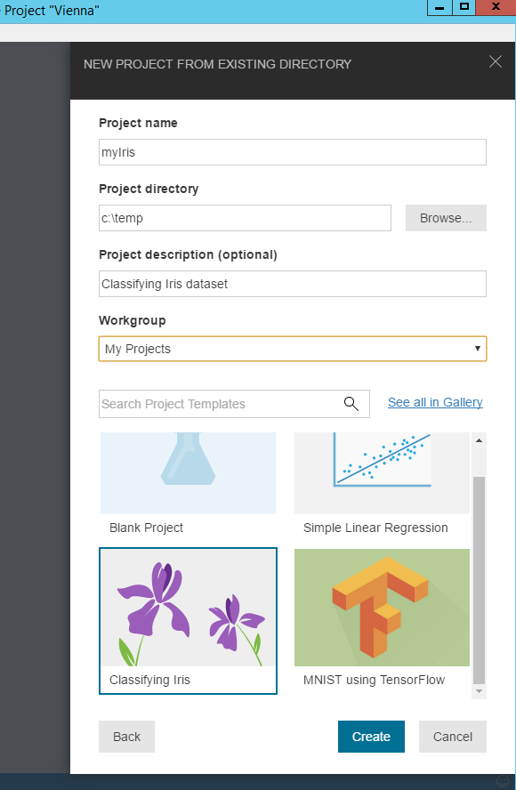

# Quickstart: Classifying Iris Flower Dataset
In this Quickstart, we take a quick tour of Azure Machine Learning preview features using the timeless [Iris flower dataset](https://en.wikipedia.org/wiki/iris_flower_data_set). 

## Provision and Install Azure Machine Learning Workbench
Follow the installation guide to provision Azure resources and install Azure ML Workbench app.

## Create a New Project with `Classifying Iris` Sample Template 
1. Launch the Azure ML Workbench desktop app. 

2. Click on **File** --> **New Project** (or click on the **+** sign in the project list pane). 

3. Fill in the **project name**, and the **directory** the project is going to be created in. The **project description** is optional but helpful. Choose the default `My Projects` workgroup, and then select the `Classifying Iris` sample project as the project template.

<!---->
4. Optionally, you can fill in the Git repo text field with the URL of a Git repo that lives in a [VSTS (Visual Studio Team Service)](https://www.visualstudio.com) project. This Git repo must exist, and is empty with no master branch. Adding a Git repo now lets you enable roaming and sharing scenarios later.

5. Click on the **Create** button to create the project. After a few seconds, the new project is created and opened.

## Run `iris_sklearn.py` Python Script

1. Now you should see the project dashboard. Select **local** as the execution target, and **iris_sklearn.py** as the script to run.

2. In the **Argument** text field, type `0.01`.

3. Click the **Run** button.

4. Click the **Jobs Panel** and notice that a job is now listed. The job status goes from **Submitting** to **Running** as the job begins to run, and to **Completed** in a few seconds. 

   Now you have successfully executed a Python script in Azure ML Workbench.

5. Repeat the previous steps 2-4 a few times. Each time, use different argument values ranging from `10` to `0.001`. This value is used as regularization rate of the logistic regression algorithm in the `iris_sklearn.py` script.

## View Run History of `iris_sklearn.py`
1. Navigate to the Run History view, and click on **iris_sklearn.py**.The run history list view opens and displays of all runs executed on **iris_sklearn.py**. 

2. Notice the top metrics, some default graphs, and a list of metrics for each run.

   Customize this view by sorting, filtering, and adjusting the configurations.

3. Now click on a completed run. You can see the detailed view of that particular execution, including additional metrics, the files it produced (pickled scikit-learn model, plots in png format), the two plotted png files (confusion matrix and multi-class ROC curve), and other useful run logs.

4. In the **output files** section. Expand the `outputs` folder, and select the `model.pkl` file. Click **download** button and select the `myIris` project root folder to download the `model.pkl` file.

## Create Web Service Schema File
1. Choose `iris_schema_gen.py` and the `local` environment in the **Run Control**, then click _Run_ button. This creates the `service_schema.json` in the `outputs` folder.

2. Go to the run history of the `iris_shcema_gen.py` file, and download the `service_schema.json` file to the project root folder.

## Create the Scoring File
1. In the **File View**, click `+` and select _New Item_. 
2. Name the file `score.py`.
3. Go back to `iris_shcema_gen.py` file and copy the `init()` and `run()` functions. 
4. Open `score.py` and paste the functions. Then click _Save_ button.

## Deploy the Web Service
>Note you must have Docker installed and running in order to deploy the web service locally.
1. In the top menu of the Workbench, click **File** --> **Open Command-line Interface**.
2. In the command window, type the following command:

```batch
C:\Temp\myIris> az ml service create realtime --model-file model.pkl -f score.py -n irisservice -s service_schema.json -r python
```
 
## Test the web service
```batch
C:\Temp\myIris> az ml service run realtime -n irisservice -d "{\"input_df\": [{3.4,4.2,5.1,3.1]}"
```

## Next Steps
- Full-length [Classifying Iris tutorial](tutorial-classifying-iris.md).
- Advanced data preparation tutorial: [Bike Share Forecasting Data Preparation](./doc-template-tutorial.md)