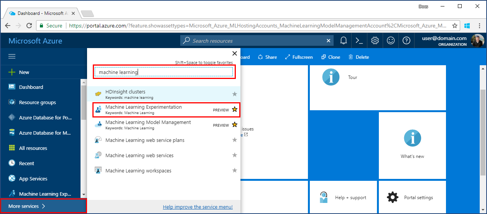
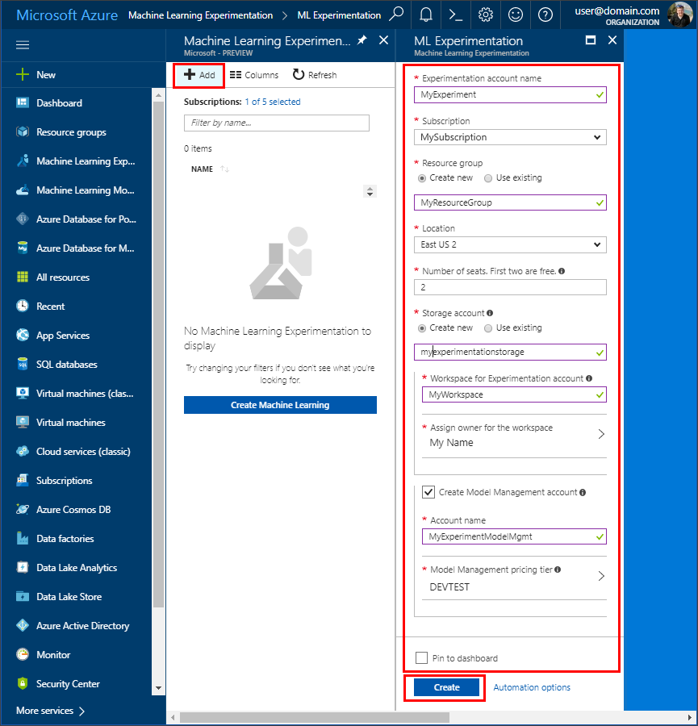
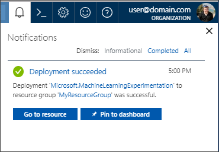
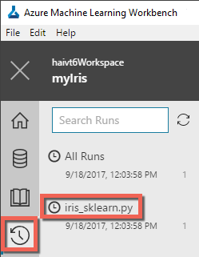
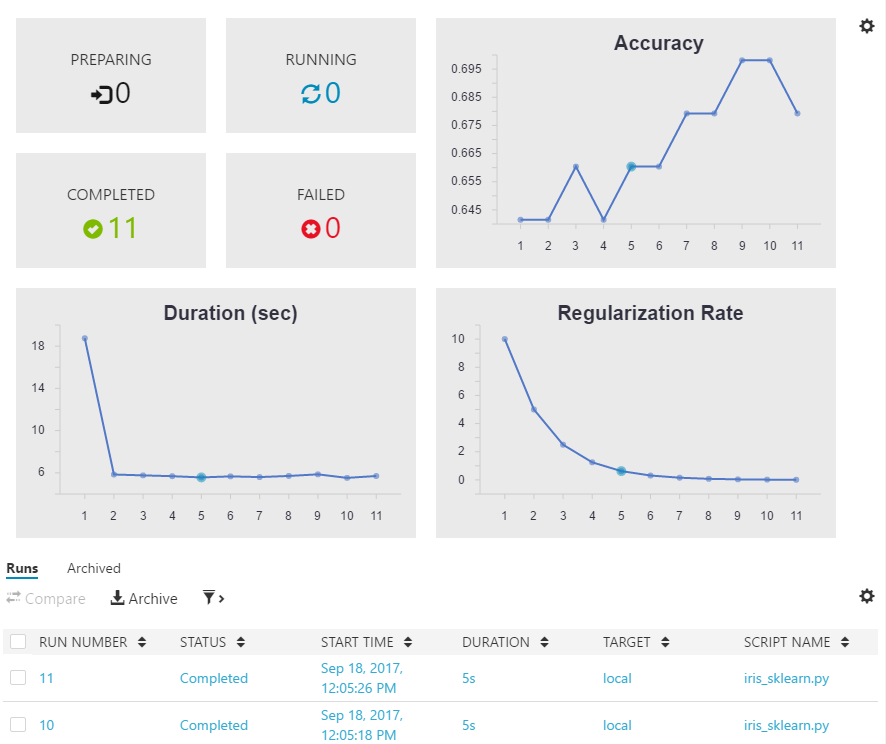

# Create Azure Machine Learning preview accounts and install Azure Machine Learning Workbench
Azure Machine Learning is an integrated, end-to-end data science and advanced analytics solution for professional data scientists to prepare data, develop experiments and deploy models at cloud scale.

This Quickstart shows you how to create experimentation and model management accounts in Azure Machine Learning services preview. It also shows you how to install the Azure Machine Learning Workbench desktop application and CLI tools. Next, you take a quick tour of Azure Machine Learning preview features using the timeless [Iris flower dataset](https://en.wikipedia.org/wiki/iris_flower_data_set) to build a model to predict the type of iris based on some of its physical characteristics.  

If you don't have an Azure subscription, create a [free account](https://azure.microsoft.com/free/?WT.mc_id=A261C142F) before you begin.

## Prerequisites
Currently the Azure Machine Learning Workbench desktop app can be installed on the following operating systems only: 
- Windows 10
- Windows Server 2016
- macOS Sierra
- macOS High Sierra

## Log in to the Azure portal
Log in to the [Azure portal](https://portal.azure.com/).

## Create Azure Machine Learning accounts
Use the Azure portal to provision Azure Machine Learning accounts. 
1. Select the **New** button (+) in the upper-left corner of the portal.

2. Type in "Machine Learning" into the search bar. Select the search result named **Machine Learning Experimentation (preview)**.  Click the star icon to make this selection a favorite in your Azure portal.

   

3. Click **+ Add** to configure a new Machine Learning Experimentation account. The detailed form opens.

   

4. Fill out the Machine Learning Experimentation form with the following information:

   Setting|Suggested value|Description
   ---|---|---
   Experimentation account name | _Unique name_ |Choose a unique name that identifies your account. You could use your own name, or a departmental or project name that best identifies the experiment. The name should be between 2 and 32 characters, including only alphanumeric characters and the '-' dash character. 
   Subscription | _Your subscription_ |The Azure subscription that you want to use for your experiment. If you have multiple subscriptions, choose the appropriate subscription in which the resource is billed for.
   Resource Group | _Your resource group_ | You may make a new resource group name, or use an existing one from your subscription.
   Location | _The region closest to your users_ | Choose the location that's closest to your users and the data resources.
   Number of seats | 2 | Type the number of seats. This selection impacts the [pricing](https://azure.microsoft.com/pricing/details/machine-learning/). The first two seats are free. Use two seats for the purposes of this Quickstart. You can update the number of seats later as needed in the Azure portal.
   Storage Account | _Unique name_ | Choose **Create new** and provide a name  to create a new Azure storage account, or choose **Use existing** and select your existing storage account from the drop-down. The storage account is required and is used to hold project artifacts and run history data. 
   Workspace for Experimentation account | _Unique name_ | Provide a name for the new workspace. The name should be between 2 and 32 characters, including only alphanumeric characters and the '-' dash character.
   Assign owner for the workspace | _Your account_ | Select your own account as the workspace owner.
   Create Model Management Account | *check* | As part of the Experimentation account creation experience, you have the option of also creating the Machine Learning Model Management account. This resource is used once you are ready to deploy and manage your models as real-time web services. We recommend creating the Model Management account at the same time as the Experimentation account.
   Account Name | _Unique name_ | Choose a unique name that identifies your Model Management account. You could use your own name, or a departmental or project name that best identifies the experiment. The name should be between 2 and 32 characters, including only alphanumeric characters and the '-' dash character. 
   Model Management pricing tier | **DEVTEST** | Click **No pricing tier selected** to specify the pricing tier for your new Model Management account. For cost savings, select **DEVTEST** pricing tier if available on your subscription (limited availability), otherwise select S1 pricing tier for cost savings. Click **Select** to save the pricing tier selection. 
   Pin to dashboard | _check_ | Check the **Pin to dashboard** option to allow easy tracking of your Machine Learning Experimentation account on the front dashboard page of your Azure portal.

5. Click **Create** to begin the creation process.

6. On the upper right of the Azure portal toolbar, click **Notifications** (bell icon) to monitor the deployment process. 

   The notification shows "Deployment in progress...". The status changes to "Deployment succeeded" once it is done. Your Machine Learning Experimentation account page opens upon success.
   
   

Now, depending on which operating system you use on your local computer, follow one of the next two sections to install Azure Machine Learning Workbench on your computer. 

## Install Azure Machine Learning Workbench on Windows
Install the Azure Machine Learning Workbench on your computer running Windows 10, Windows Server 2016, or newer.

1. Download the latest Azure Machine Learning Workbench installer
**[AmlWorkbenchSetup.msi](https://aka.ms/azureml-wb-msi)**.

2. Double-click the downloaded installer _AmlWorkbenchSetup.msi_ from your File Explorer.

   >[!IMPORTANT]
   >Download the installer fully on disk, then launch it from there. Do not launch it directly off your browser's download widget.

3. Finish the installation by following the on-screen instructions.

   The installer downloads all the necessary dependent components such as Python, Miniconda, and other related libraries. The installation may take around half an hour to finish all the components. 

4. Azure Machine Learning Workbench is now installed in the following directory:
   
   `C:\Users\<user>\AppData\Local\AmlWorkbench`

## Install Azure Machine Learning Workbench on macOS
Install the Azure Machine Learning Workbench on your computer running macOS Sierra.

1. Install openssl library using [Homebrew](http://brew.sh). See [Prerequisite for .NET Core on Mac](https://docs.microsoft.com/dotnet/core/macos-prerequisites) for more details.
   ```
   # install Homebrew first if you don't have it already
   /usr/bin/ruby -e "$(curl -fsSL https://raw.githubusercontent.com/Homebrew/install/master/install)"

   # install latest openssl needed for .NET Core 1.x
   brew update
   brew install openssl
   mkdir -p /usr/local/lib
   ln -s /usr/local/opt/openssl/lib/libcrypto.1.0.0.dylib /usr/local/lib/
   ln -s /usr/local/opt/openssl/lib/libssl.1.0.0.dylib /usr/local/lib/
   ```

2. Download the latest Azure Machine Learning Workbench installer
**[AmlWorkbench.dmg](https://aka.ms/azureml-wb-dmg)**.

   >[!IMPORTANT]
   >Download the installer fully on disk, then launch it from there. Do not launch it directly off your browser's download widget.

3. Double-click the downloaded installer _AmlWorkbench.dmg_ from Finder.

4. Finish the installation by following the on-screen instructions.

   The installer downloads all the necessary dependent component such as Python, Miniconda, and other related libraries. The installation may take around half an hour to finish all the components. 

5. Azure Machine Learning Workbench is now installed in the following directory: 

   `/Applications/AmlWorkbench.app`

## Run Azure Machine Learning Workbench to log in the first time
1. Click on the **Launch Workbench** button on the last screen of the installer once the installation process is complete. If you have closed the installer, find the shortcut to the Machine Learning Workbench on your desktop and start menu named **Azure Machine Learning Workbench** to launch the app.

2. Log in to the Workbench using the same account you used earlier to provision your Azure resources. 

3. When the login process has succeeded, the Workbench attempts to find the Machine Learning Experimentation accounts you created earlier. It searches for all Azure subscriptions to which your credential has access. When at least one Experimentation Account is found, the Workbench opens with that account. It then lists the Workspaces and Projects found in that account. 

   >[!TIP]
   > If you have access to more than one Experimentation Account, you can switch to a different one by clicking on the avatar icon in the lower left corner of the Workbench app.

See [Deployment Environment Setup](deployment-setup-configuration.md) for creating an environment for deploying your web services.

## Create a new project
1. Launch the Azure ML Workbench app and log in. 

2. Click on **File** --> **New Project** (or click on the **+** sign in the **PROJECTS** pane). 

3. Fill in the **Project name** and the **Project directory** fields. The **Project description** is optional but helpful. Leave the **Visualstudio.com GIT Repository URL** field blank for now. Choose a workspace, and select **Classifying Iris** as the project template.

   >[!TIP]
   >Optionally, you can fill in the Git repo text field with the URL of a Git repo that is hosted in a [VSTS (Visual Studio Team Service)](https://www.visualstudio.com) project. This Git repo must already exist, and it must be empty with no master branch. And you must have write access to it. Adding a Git repo now lets you enable roaming and sharing scenarios later. [Read more](using-git-ml-project.md).

4. Click on the **Create** button to create the project. A new project is created and opened for you. At this point, you can explore the project home page, data sources, notebooks, source code files. 

    >[!TIP]
    >You can also open the project in VS Code or other editors simply by configuring an IDE (Integrated Development Environment) link, and then open the project directory in it. [Read more](how-to-configure-your-IDE.md). 

## Run a Python script
Let's execute a script on your local computer. 

1. Each project opens to its own **Project Dashboard** page. Select `local` as the execution target from the command bar near the top of the application to the left of the run button, and `iris_sklearn.py` as the script to run.  There are a number of other files included in the sample you can check out later. 

   

2. In the **Arguments** text field, enter `0.01`. This number is used in the code to set the regularization rate, a value used to configure how the linear regression model is trained. 

3. Click the **Run** button to begin executing `iris_sklearn.py` on your computer. 

   This code uses the [logistic regression](https://en.wikipedia.org/wiki/logistic_regression) algorithm from the popular Python [scikit-learn](http://scikit-learn.org/stable/index.html) library to build the model.

4. The **Jobs** panel slides out from the right if it is not already visible, and an `iris_sklearn` job is added in the panel. Its status transitions from **Submitting** to **Running** as the job begins to run, and then to **Completed** in a few seconds. 

5. Congratulations. You have successfully executed a Python script in Azure ML Workbench.

6. Repeat steps 2-4 several times. Each time, use different argument values ranging from `10` to `0.001`.

## View run history
1. Navigate to the **Runs** view, and click on **iris_sklearn.py** in the run list. The run history dashboard for `iris_sklearn.py` opens. It shows every run that was executed on `iris_sklearn.py`. 

   

2. The run history dashboard also displays the top metrics, a set of default graphs, and a list of metrics for each run. You can customize this view by sorting, filtering, and adjusting the configurations by clicking on the configuration icon or the filter icon.

   

3. Click on a completed run and you can see a detailed view for that specific execution, including additional metrics, the files it produced, and other potentially useful logs.

## Next steps
You have now successfully created an Azure Machine Learning Experimentation account and an Azure Machine Learning Model Management account. You have installed the Azure Machine Learning Workbench desktop app and command-line interface. You have created a new project, create a model by executing a script, and explored the run history of the script.

For a more in-depth experience of this workflow, including how to deploy your Iris model as a web service, follow the full-length Classifying Iris Tutorial which contains detailed steps for [data preparation](tutorial-classifying-iris-part-1.md), [experimentation](tutorial-classifying-iris-part-2.md), and [model management](tutorial-classifying-iris-part-3.md). 

> [!div class="nextstepaction"]
> [Classifying Iris tutorial](tutorial-classifying-iris-part-1.md)
