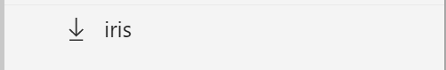

# Roaming and collaboration in Azure Machine Learning Workbench
This document walks you through how Azure Machine Learning Workbench can help roam your projects across machines as well as enable collaboration with your teammates. 

When you create an Azure Machine Learning project with a remote Git Repository (repo) link, the project metadata and snapshots are stored in the cloud. The cloud link enables you to access the project from a different computer (Roaming). You can also give access to your co-workers, thus enabling collaboration. 

## Prerequisites
First, install the Azure Machine Learning Workbench with access to an Experimentation Account. Follow the [installation guide](quickstart-installation.md) for more details.

Second, access [Visual Studio Team System](https://www.visualstudio.com) and create a repo to link your project to. For detailed information about Git, reference the [Using Git Repo with an Azure Machine Learning Workbench Project](using-git-ml-project.md) article.

## Create a new Azure Machine Learning project
Launch Azure Machine Learning Workbench, and create a new project (for example, _iris_). Fill the **Visualstudio.com GIT Repository URL** textbox with a valid VSTS Git repo URL. 
>[!IMPORTANT]
>Project creation fails if You do not have read/write access on the Git repo, and the Git repo is not empty, i.e. it already has a master branch.

Once the project is created, submit a few runs on any scripts within the project. This action commits project state into the remote Git repo's run history branch. 

If you have setup Git authentication, you can also explicitly operate in the master branch, or create a new branch. 

As an example: 
```
# check current repo status
$ git status

# stage all changes in the current repo
$ git add -A

# commit changes
$ git commit -m "my commit fixes this weird bug!"

# push to remote repo.
$ git push origin master
```

## Roaming
<a name="roaming"></a>

### Open Azure Machine Learning Workbench on second machine
Once the VSTS Git repository is linked with your project, you can access the _iris_ project from any computer where you have installed Azure Machine Learning Workbench. 

To access the iris project on another computer, you need to login to the app with the same credentials used while creating the project. Additionally, you need to navigate to the same Experimentation Account and Workspace. The _iris_ project is alphabetically listed with other projects within the workspace. 

### Download project on second machine
When the workspace is opened on the second machine, the icon adjacent to the _iris_ project is different from the typical folder icon. The download icon indicates that the content of the project is in the cloud and needs to be downloaded to the current machine. 



Clicking on the _iris_ project starts a download action. After a short while, when the download completes, the project is ready to be accessed on the second computer. 

On Windows, it is `C:\Users\<username>\Documents\AzureML`

On macOS, it is here: `/home/<username>/Documents/AzureML`

In a future release, we plan to enhance the functionality to allow you to select a destination folder. 

>Note if you happen to have a folder in the Azure ML directory that has the exact same name as the project, the download fails. For the time being, you need to rename the existing folder in order to work around this issue.


### Work on the downloaded project 
The newly downloaded project reflects the project state as of the last run in the project. A snapshot of the project state is automatically committed to the run history branch in the VSTS Git repo every time you submit a run. We use the snapshot associated with the latest run when instantiating the project on the second computer. 
 

## Collaboration
You can collaborate with your teammates on projects linked to a VSTS Git repo. You can assign permissions to users on the Experimentation Account, Workspace, and Project. At this time, you can perform the Azure Resource Manager commands using the Azure CLI. You can also use [Azure portal](https://portal.azure.com). See [following section](#portal).    

### Using command line to add Users
Lets use an example. Say, Alice is the Owner of th e_Iris_ project and she wants to share access with Bob. 

Alice clicks on the **File** menu, and selects the **Command Prompt** menu item to launch the command-prompt configured to the _iris_ project. Alice is then able to decide what level fo access she wants to grant to Bob by executing the following commands.  

```azurecli
# Find ARM ID of the experimnetation account
az ml account experimentation show --query "id"

# Add Bob to the Experimentation Account as a Contributor.
# Bob now has read/write access to all workspaces and projects under the Account by inheritance.
az role assignment create --assignee bob@contoso.com --role Contributor --scope <experimentation account ARM ID>

# Find ARM ID of the workspace
az ml workspace show --query "id"

# Add Bob to the workspace as an Owner.
# Bob now has read/write access to all projects under the Workspace by inheritance. And he can invite or remove others.
az role assignment create --assignee bob@contoso.com --role Owner --scope <workspace ARM ID>
```

After the role assignment, directly or by inheritance, Bob can see the project in the Workbench project list. The application might need a restart in order to see the project. Bob can then download the project as described in the [Roaming section](#roaming) and collaborate with Alice. 

The run history for all users collaborating on a project is committed to the same remote Git repo. So when Alice executes a run, Bob can see the run in the run history section of the project in the Workbench app. Bob can also restore the project to the state of any run including runs started by Alice. 

Sharing a remote Git repo for the project enables Alice and Bob to also collaborate on the master branch. If needed, they can also create personal branches and use Git pull-requests and merges to collaborate. 

### Using Azure portal to add users
<a name="portal"></a>

Azure Machine Learning Experimentation Accounts, Workspaces, and Projects are Azure Resource Manager resources. You can use the Access Control link in the [Azure portal](https://portal.azure.com) to assign roles. 

Find the resource you are looking to add users to from the All Resources view. Click on the Access control (IAM) link within page. Add users 


