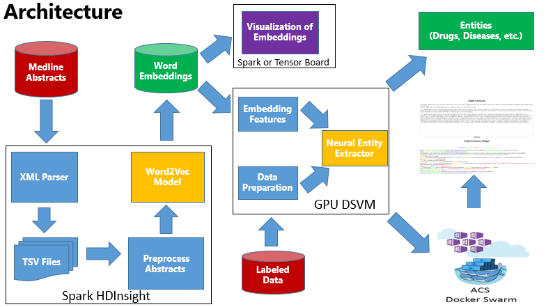
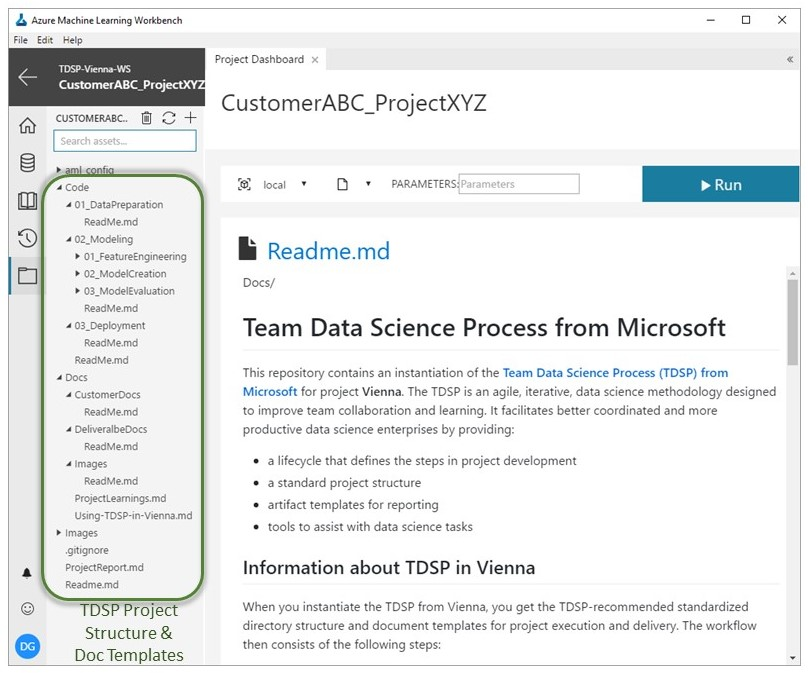

# Bio-Medical Entity Recognition With TDSP Project

## Link of the Gallery GitHub repository
Following is the link to the public GitHub repository: 

[https://github.com/Azure/MachineLearningSamples-BiomedicalEntityExtraction](https://github.com/Azure/MachineLearningSamples-BiomedicalEntityExtraction)

## Detailed documentation in GitHub repository
We provide summary documentation here about the sample. More extensive documentation can be found on the GitHub site in the file: [https://github.com/Azure/MachineLearningSamples-BiomedicalEntityExtraction/blob/master/ProjectReport.md](https://github.com/Azure/MachineLearningSamples-BiomedicalEntityExtraction/blob/master/ProjectReport.md).

## Prerequisites

### Azure subscription and Hardware
1. An Azure [subscription](https://azure.microsoft.com/en-us/free/)
2. [HDInsight Spark Cluster](https://docs.microsoft.com/en-us/azure/hdinsight/hdinsight-apache-spark-jupyter-spark-sql) version Spark 2.1 on Linux (HDI 3.6). To process the full amount of MEDLINE abstracts discussed below, you need the minimum configuration of: 
* Head node: [D13_V2](https://azure.microsoft.com/en-us/pricing/details/hdinsight/) size
* Worker nodes: At least 4 of [D12_V2](https://azure.microsoft.com/en-us/pricing/details/hdinsight/). In our work, we used 11 worker nodes of D12_V2 size.
3. [NC6 Data Science Virtual Machine (DSVM)](https://docs.microsoft.com/en-us/azure/machine-learning/machine-learning-data-science-linux-dsvm-intro) on Azure.

### Software
1. Azure Machine Learning Workbench. See [installation guide](quick-start-installation.md).
2. [TensorFlow](https://www.tensorflow.org/install/)
3. [CNTK 2.0](https://docs.microsoft.com/en-us/cognitive-toolkit/using-cntk-with-keras)
4. [Keras](https://keras.io/#installation)

### Basic instructions for Azure Machine Learning (AML) Workbench
* [Overview](overview-what-is-azure-ml.md)
* [Installation](quick-start-installation.md)
* [Using TDSP](how-to-use-tdsp-in-azure-ml.md)
* [How to read and write files](how-to-read-write-files.md)
* [How to use Jupyter Notebooks](how-to-use-jupyter-notebooks.md)
* [How to use GPU](how-to-use-gpu.md)
* [How to read and write files](how-to-read-write-files.md)

## INTRODUCTION: Business Case Understanding & Project Summary

### Use Case Overview
Medical Named Entity Recognition (NER) is a critical step for complex biomedical NLP tasks such as: 
* Extraction of diseases, symptoms from electronic medical or health records.
* Understanding the interactions between different entity types like Drugs, Diseases for purpose of pharmacovigilence.

Our study focuses on how a large amount of unstructured biomedical data available form MEDLINE abstracts can be utilized for training a Neural Entity Extractor for biomedical NER. 

 The project highlights several features of Azure Machine Learning Workbench, such as:
 1. Instantiation of [Team Data Science Process (TDSP) structure and templates](how-to-use-tdsp-in-azure-ml.md)
 2. Execution of code in Jupyter notebooks as well as Python files
 3. Run history tracking for Python files 
 4. Execution of jobs on remote Spark computes context using HDInsight Spark 2.1 clusters
 5. Execution of jobs in remote GPU VMs on Azure
 6. Easy operationalization of Deep Learning models as web-services on Azure Container Services

### Purpose of the Project
Objectives of the sample are: 
1. Show how to systematically train a Word Embeddings Model using nearly 15 million MEDLINE abstracts using [Word2Vec on Spark](https://spark.apache.org/docs/latest/mllib-feature-extraction.html#word2vec) and then use them to build an LSTM-based deep neural network for Entity Extraction on a GPU enabled VM on Azure.
2. Demonstrate that domain-specific data can enhance accuracy of NER compared to generic data, such as Google News, which are often used for such tasks.
3. Demonstrate an end-to-end work-flow of how to train and operationalize deep learning models on large amounts of text data using Azure Machine Learning Workbench and multiple compute contexts (Spark, GPU VMs).
4. Demonstrate the following capabilities within Azure Machine Learning Workbench:

    * Instantiation of [Team Data Science Process (TDSP) structure and templates](how-to-use-tdsp-in-azure-ml.md)
    * Execution of code in Jupyter notebooks as well as Python files
    * Run history tracking for Python files 
    * Execution of jobs on remote Spark compute context using HDInsight Spark 2.1 clusters
    * Execution of jobs in remote GPU VMs on Azure
    * Easy operationalization of Deep Learning models as web-services on Azure Container Services

### Summary: Results and Deployment
Our results show that training a domain-specific word embedding model boosts the accuracy of biomedical NER when compared to embeddings trained on generic data such as Google News. The in-domain word embedding model can detect 7012 entities correctly (out of 9475) with a F1 score of 0.73 compared to 5274 entities with F1 score of 0.61 for generic word embedding model.

We also demonstrate how we can publish the trained Neural Network as a service for real time scoring using Docker and Azure Container Service. Finally, we develop a basic website using Flask to consume the created web service and host it on Azure using Web App for Linux. Currently the model operational on the website (http://medicalentitydetector.azurewebsites.net/) supports seven entity types namely, Diseases, Drug, or Chemicals, Proteins, DNA, RNA, Cell Line, Cell Type.

## Architecture
The figure shows the architecture that was used to process data and train models.

## Data 
We first obtained the raw MEDLINE abstract data from [MEDLINE](https://www.nlm.nih.gov/pubs/factsheets/medline.html). The data is available publically and is in form of XML files available on their [FTP server](ftp://ftp.nlm.nih.gov/nlmdata/.medleasebaseline/gz/). There are 812 XML files available on the server and each of the XML files contain around 30,000,000 abstracts. More detail about data acquisition and understanding is provided in the Project Structure. The fields present in each file are 
        
        abstract
        affiliation
        authors
        country	
        delete: boolean if False means paper got updated so you might have two XMLs for the same paper.
        file_name	
        issn_linking	
        journal	
        keywords	
        medline_ta: this is abbreviation of the journal nam	
        mesh_terms: list of MeSH terms	
        nlm_unique_id	
        other_id: Other IDs	
        pmc: Pubmed Central ID	
        pmid: Pubmed ID
        pubdate: Publication date
        title

This amount to a total of 24 million abstracts but nearly 10 million documents do not have a field for abstracts. Since the amount of data processed is large and cannot be loaded into memory at a single machine, we rely on HDInsight Spark for processing. Once the data is available in Spark as a data frame, we can apply other pre-processing techniques on it like training the Word Embedding Model. Refer to [GitHub code link](https://github.com/Azure/MachineLearningSamples-BiomedicalEntityExtraction/blob/master/Code/01_DataPreparation/ReadMe.md) to get started.

Data after parsing XMLs

Other datasets, which are being used for training and evaluation of the Neural Entity Extractor have been include in the corresponding folder. To obtain more information about them, you could refer to the following corpora:
 * [Bio-Entity Recognition Task at Bio NLP/NLPBA 2004](http://www.nactem.ac.uk/tsujii/GENIA/ERtask/report.html)
 * [BioCreative V CDR task corpus](http://www.biocreative.org/tasks/biocreative-v/track-3-cdr/)
 * [Semeval 2013 - Task 9.1 (Drug Recognition)](https://www.cs.york.ac.uk/semeval-2013/task9/)

## Project Structure and Reporting According TDSP LifeCycle Stages
For the project, we use the TDSP folder structure and documentation templates (Figure 1), which follows the [TDSP lifecycle](https://github.com/Azure/Microsoft-TDSP/blob/master/Docs/lifecycle-detail.md). Project is created based on instructions provided [here](https://github.com/amlsamples/tdsp/blob/master/Docs/how-to-use-tdsp-in-azure-ml.md).

 

The step-by-step data science workflow was as follows:

### 1. [Data Acquisition and Understanding](https://github.com/Azure/MachineLearningSamples-BiomedicalEntityExtraction/blob/master/Code/01_Data_Acquisition_and_Understanding/ReadMe.md)
The MEDLINE abstract fields present in each file are 
        
        abstract
        affiliation
        authors
        country	
        delete: boolean if False means paper got updated so you might have two XMLs for the same paper.
        file_name	
        issn_linking	
        journal	
        keywords	
        medline_ta: this is abbreviation of the journal nam	
        mesh_terms: list of MeSH terms	
        nlm_unique_id	
        other_id: Other IDs	
        pmc: Pubmed Central ID	
        pmid: Pubmed ID
        pubdate: Publication date
        title

This amount to a total of 24 million abstracts but nearly 10 million documents do not have a field for abstracts. Since the amount of data to be processed is huge and cannot be loaded into memory at a single instance, we rely on Sparks Distributed Computing capabilities for processing. Once the data is available in Spark as a data frame, we can apply other pre-processing techniques on it like training the Word Embedding Model. Refer to [GItHub code link](https://github.com/Azure/MachineLearningSamples-BiomedicalEntityExtraction/tree/master/Code/01_Data_Acquisition_and_Understanding) to get started.

Data after parsing XMLs

Other datasets, which are being used for training and evaluation of the Neural Entity Extractor have been include in the corresponding folder. To obtain more information about them, you could refer to the following corpora:
 * [Bio-Entity Recognition Task at Bio NLP/NLPBA 2004](http://www.nactem.ac.uk/tsujii/GENIA/ERtask/report.html)
 * [BioCreative V CDR task corpus](http://www.biocreative.org/tasks/biocreative-v/track-3-cdr/)
 * [Semeval 2013 - Task 9.1 (Drug Recognition)](https://www.cs.york.ac.uk/semeval-2013/task9/)

### 2. [Modeling (Including Word2Vec word featurization/embedding)](https://github.com/Azure/MachineLearningSamples-BiomedicalEntityExtraction/tree/master/Code/02_Modeling)
Modeling is the stage where we show how you can use the data downloaded in the previous section for training your own word embedding model and use it for other downstream tasks. Although we are using the Medline data, however the pipeline to generate the embeddings is generic and can be reused to train word embeddings for any other domain. For embeddings to be an accurate representation of the data, it is essential that the word2vec is trained on a large amount of data.
Once we have the word embeddings ready, we can make a deep neural network that uses the learned embeddings to initialize the Embedding layer. We mark the embedding layer as non-trainable but that is not mandatory. The training of the word embedding model is unsupervised and hence we are able to take advantage of unstructured texts. However, to train an entity recognition model we need labeled data. The more the better.

#### [Featurizing/Embedding Words with Word2Vec](https://github.com/Azure/MachineLearningSamples-BiomedicalEntityExtraction/tree/master/Code/02_Modeling/01_FeatureEngineering)
Word2Vec is the name given to a class of neural network models that, given an unlabeled training corpus, produce a vector for each word in the corpus that encodes its semantic information. These models are simple neural networks with one hidden layer. The word vectors/embeddings are learned by backpropagation and stochastic gradient descent. There are two types of word2vec models, namely, the Skip-Gram and the continuous-bag-of-words. Since we are using the MLlib's implementation of the word2vec, which supports the Skip-gram model, we briefly describe the model here. [For details](https://arxiv.org/pdf/1301.3781.pdf).

The model uses Hierarchical Softmax and Negative sampling to optimize the performance. Hierarchical SoftMax (H-SoftMax) is an approximation inspired by binary trees. H-SoftMax essentially replaces the flat SoftMax layer with a hierarchical layer that has the words as leaves. This allows us to decompose calculating the probability of one word into a sequence of probability calculations, which saves us from 
having to calculate the expensive normalization over all words. Since a balanced binary tree has a depth of log2(|V|)log2(|V|) (V is the Vocabulary), we only need to evaluate at most log2(|V|)log2(|V|) nodes to obtain the final probability of a word. The probability of a word w given its context c is then simply the product of the probabilities of taking right and left turns respectively that lead to its leaf node. We can build a Huffman Tree based on the frequency of the words in the dataset to ensure that more frequent words get shorter representations. Refer [link](http://sebastianruder.com/word-embeddings-softmax/) for further information.
Image taken from [here](https://ahmedhanibrahim.wordpress.com/2017/04/25/thesis-tutorials-i-understanding-word2vec-for-word-embedding-i/)

Once we have the embeddings, we would like to visualize them and see the relationship between semantically similar words. 

We have shown two different ways of visualizing the embeddings. The first, uses a PCA to project the high dimensional vector to a 2-D vector space. This leads to a significant loss of information and the visualization is not as accurate. The second is to use PCA with t-SNE. t-SNE is a nonlinear dimensionality reduction technique that is well-suited for embedding high-dimensional data into a space of two or three dimensions, which can then be visualized in a scatter plot.  It models each high-dimensional object by a two- or three-dimensional point in such a way that similar objects are modeled by nearby points and dissimilar objects are modeled by distant points. It works in two parts. First, it creates a probability distribution over the pairs in the higher dimensional space in a way that similar objects have a high probability of being picked and dissimilar points have  low probability of getting picked. Second, it defines a similar probability distribution over the points in a low dimensional map and minimizes the KL Divergence between the two distributions with respect to location of points on the map. The location of the points in the low dimension is obtained by minimizing the KL Divergence using Gradient Descent. But t-SNE might not be always reliable. Reference to t-SNE [link](https://distill.pub/2016/misread-tsne/). Reference to [GitHub code link](https://github.com/Azure/MachineLearningSamples-BiomedicalEntityExtraction/tree/master/Code/02_Modeling/01_FeatureEngineering) for details about the implementation.

As you see below, t-SNE visualization provides more separation and potential clustering patterns. 

* Visualization with PCA

* Visualization with t-SNE

* Points closest to "Cancer" (they are all subtypes of Cancer)

#### [Training the Neural Entity Extractor](https://github.com/Azure/MachineLearningSamples-BiomedicalEntityExtraction/tree/master/Code/02_Modeling/02_ModelCreation/ReadMe.md)
Traditional Neural Network Models suffer from a problem that they treat each input and output as independent of the other inputs and outputs. This may not be a good idea for tasks such as Machine translation, Entity Extraction, or any other sequence to sequence labeling tasks. Recurrent Neural Network models overcome this problem as they can pass information computed until now to the next node. This property is called having memory in the network since it is able to use the previously computed information. The below picture represents this.

Vanilla RNNs actually suffer from the [Vanishing Gradient Problem](https://en.wikipedia.org/wiki/Vanishing_gradient_problem) due to which they are not able to utilize all the information they have seen before. The problem becomes evident only when a large amount of context is required to make a prediction. But models like LSTM do not suffer from such a problem, in fact they are designed to remember long-term dependencies. Unlike vanilla RNNs that have a single neural network, the LSTMs have the interactions between four neural networks for each cell. Refer to the [excellent post](http://colah.github.io/posts/2015-08-Understanding-LSTMs/) for a detailed explanation of how LSTM work.

Let’s try to put together our own LSTM-based Recurrent Neural Network and try to extract Entities like Drugs, Diseases etc. from Medical Data. The first step is to obtain a large amount of labeled data and as you would have guessed, that's not easy! Most of the medical data contains lot of sensitive information about the person and hence are not publicly available. We rely on a combination of two different datasets that are publicly available. The first dataset is from Semeval 2013 - Task 9.1 (Drug Recognition) and the other is from BioCreative V CDR task. We are combining and auto labeling these two datasets so that we can detect both drugs and diseases from medical texts and evaluate our word embeddings. 

Refer [GitHub code link](https://github.com/Azure/MachineLearningSamples-BiomedicalEntityExtraction/tree/master/Code/02_Modeling/02_ModelCreation) for implementation details

The model architecture that we have used across all the codes and for comparison is presented below. The parameter that changes for different datasets is the maximum sequence length (613 here).

#### Model evaluation
We use the evaluation script from the shared task [Bio-Entity Recognition Task at Bio NLP/NLPBA 2004](http://www.nactem.ac.uk/tsujii/GENIA/ERtask/report.html) to evaluate the precision, recall, and F1 score of the model. Below is the comparison of the results we get with the embeddings trained on Medline Abstracts and that on Google News embeddings. We clearly see that the in-domain model is out performing the generic model. Hence having a specific word embedding model rather than using a generic one is much more helpful. 

We perform the evaluation of the word embeddings on other datasets in the similar fashion and see that in-domain model is always better.

All the training and evaluations reported here are done using Keras and TensorFlow. Keras also supports CNTK backend but since it does not have all the functionalities for the bidirectional model yet we have used unidirectional model with CNTK backend to benchmark the results of CNTK model with that of TensorFlow. These are the results we get

We also compare the performance of Tensorflow vs CNTK and see that CNTK performs as good as Tensorflow both in terms of time taken per epoch (60 secs for CNTK and 75 secs for Tensorflow) and the number of entities detected. We are using the Unidirectional layers for evaluation.

### 3. [Deployment](https://github.com/Azure/MachineLearningSamples-BiomedicalEntityExtraction/tree/master/Code/03_Deployment)
We  deployed a web-service on a cluster in the [Azure Container Service (ACS)](https://azure.microsoft.com/en-us/services/container-service/). The operationalization environment provisions Docker and Kubernetes in the cluster to manage the web-service deployment. You can find further information on the operationalization process [here](model-management-service-deploy.md ).

## Conclusion & Next Steps

In this report, we went over the details of how you could train a Word Embedding Model using Word2Vec on Spark and then use the Embeddings obtained for training a Neural Network for Entity Extraction. We have shown the pipeline for Bio-Medical domain but the pipeline is generic. You just need enough data and you can easily adapt the workflow presented here for a different domain.