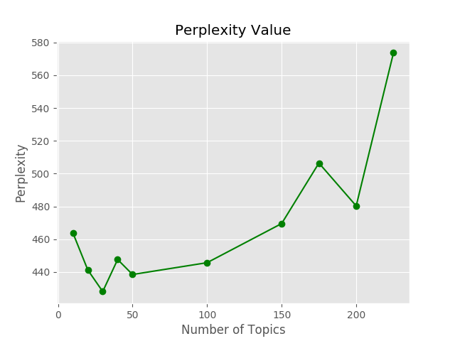

# Document Collection Analysis

[//]: # ""

**[Find the code on GitHub repository](https://github.com/Azure/MachineLearningSamples-DocumentCollectionAnalysis)**

[//]: # (**The above info will be included in the Readme on GitHub**)

## Prerequisites

The prerequisites to run this example are as follows:

1. Make sure that you have properly installed Azure ML Workbench by following the [installation guide (TODO)](https://github.com/Azure/ViennaDocs/blob/master/Documentation/Installation.md).

1. This example could be run on any compute context. However, it is recommended to run it on a multi-core machine with at least of 16-GB memory and 5-GB disk space.

## Introduction

This example showcases how to analyze a large collection of documents, which includes phrase learning, topic modeling, and topic model analysis using Azure ML Workbench. With Azure ML Workbench, one can easily scale up and out if the collection of documents is huge. And it can help tune hyper-parameters on different compute contexts. The capability of using iPython notebook on Azure ML Workbench also enables the development to be much easier.

## Overview

With large amount of data (especially unstructured text data) collected every day, a significant challenge is to organize, search, and understand vast quantities of those texts. The Document Collection Analysis example is aimed to demonstrate an efficient and automated end to end workflow on how to analyze large document collection and serve the downstream NLP tasks.

The key learnings delivered by this example are as follows:

1. Learn phrases from documents, which could provide more meaningful information versus individual words.

1. Discover hidden topic patterns that presented across different documents.

1. Annotate documents (document embedding) according to those topics and serve as a featurizer at document level.

1. Use the learned topics to better organize, search, and summarize documents.

This example could fit into a vast majority of NLP tasks, including (but not limited to): sentiment analysis, document classification, document semantic similarity, and document search. It is a critical workload for many industries and companies. For instance, government document ingestion and analysis, law firms legal documents analysis, and insurance claim process.

The machine learning techniques/algorithms used in this example include:

1. Text processing pipeline to scrub documents and then find n-grams that best categorize them. Those n-grams can then be used to learn phrases, which could provide more meaningful information than purely using individual words.

1. A Latent Dirichlet Allocation (LDA) topic model is built to learn latent structure in documents collection. The model can be updated with more documents collected.

1. The learned topic model works as a featurizer at document level where new documents can be mapped to a topic vector. By using the mapped topic vector, we can then use it as features for various NLP tasks mentioned earlier.

[//]: # "Please note this section will be included in the Readme file on GitHub repo."

## Data Description

The dataset that used in this example is collected from [GovTrack.us](https://www.govtrack.us/), which is one of the active maintainers that tracks the United States Congress and helps Americans participate in their national legislature. The bulk data can be downloaded via [this link](https://www.govtrack.us/data/congress/) using a manual script, which is not included in this example. The details of how to download the data could be found in the [GovTrack API documentation](https://www.govtrack.us/developers/api).

### Data Source

In this example, the raw data collected is a series of legislative actions introduced by the US Congress (proposed bills and resolutions) from 1973 to June 2017 (the 93rd to the 115th Congress). The data collected is in JSON format that contains a rich set of information about the legislative actions. A detailed description of the Bill data format could refer to [this GitHub link](https://github.com/unitedstates/congress/wiki/bills). For demonstration purpose, only a few data fields were extracted from those JSON files. The Python script used to extract those data fields is not included in this example. And a compiled TSV file `CongressionalDataAll_Jun_2017.tsv` was generated by the Python script and is used in this example. This TSV file was saved in a Blob Storage. It could be downloaded automatically in `1_Preprocess_Text.ipynb` under the notebook folder or `preprocessText.py` in the Python package.

### Data Structure

There are nine data fields in the data file. The data field names and the descriptions are listed as follows.

| Field Name | Type | Description | Contain Missing Value |
|------------|------|-------------|---------------|
| `ID` | String | The ID of the bill/resolution. The format of this field is [bill_type][number]-[congress]. For example, "hconres1-93" means the bill type is "hconres" (stands for House Concurrent Resolution, refer to [this document](https://github.com/unitedstates/congress/wiki/bills#basic-information)), the bill number is '1' and the congress number is '93'. | No |
| `Text` | String | The content of the bill/resolution. | No |
| `Date` | String | The date of the bill/resolution that proposed. In a format of 'yyyy-mm-dd'. | No |
| `SponsorName` | String | The name of the primary sponsor that proposed the bill/resolution. | Yes |
| `Type` | String | The title type of the primary sponsor, either 'rep' (representative) or 'sen' (senator). | Yes |
| `State` | String | The state of the primary sponsor. | Yes |
| `District` | Integer | The district number of the primary sponsor if the title of the sponsor is a representative. | Yes |
| `Party` | String | The party of the primary sponsor. | Yes |
| `Subjects` | String | The subject terms added cumulatively by the Library of Congress to the bill. The terms are concatenated by commas. These terms are written by a human in the Library of Congress, and are not usually present when information on the bill is first published. They can be added at any time. Thus by the end of life of a bill, some subject may appear to not be relevant (anymore). | Yes |

## Scenario Structure

The document collection analysis example is organized into two types of deliverables. The first type is a series of iPython Notebooks that show the step-by-step descriptions of the entire workflow. The second type is a Python package as well as some sample codes of how to use that package. The Python package is generic enough that not only serve this example but also other use cases.

The files in this example are organized as follows.

| File Name | Type | Description |
|-----------|------|-------------|
| `Data` | Folder | The data folder used to save intermediate files for Notebooks |
| `documentAnalysis` | Folder | The Python package folder |
| `notebooks` | Folder | The iPython Notebooks folder |
| `documentAnalysis/__init__.py` | Python file | The Python package init file |
| `documentAnalysis/configs.py` | Python file | The configuration file used by the document analysis Python package, constants were defined in this file |
| `documentAnalysis/preprocessText.py` | Python file | The Python file used to preprocess the data for downstream tasks |
| `documentAnalysis/phraseLearning.py` | Python file | The Python file used to learn phrases from the data and transform the raw data |
| `documentAnalysis/topicModeling.py` | Python file | The Python file used to train a Latent Dirichlet Allocation (LDA) topic model and evaluate the topic model |
| `notebooks/1_Preprocess_Text.ipynb` | iPython Notebook | Preprocess text and transform the raw data |
| `notebooks/2_Phrase_Learning.ipynb` | iPython Notebook | Learn phrases from text data (after data transform) |
| `notebooks/3_Topic_Model_Training.ipynb` | iPython Notebook | Train LDA topic model |
| `notebooks/4_Topic_Model_Summarization.ipynb` | iPython Notebook | Summarize the contents of the document based on a trained LDA topic model |
| `notebooks/5_Topic_Model_Analysis.ipynb` | iPython Notebook | Analyze the topical content of a collection of text documents and correlate topical information against other meta-data associated with the document collection |
| `notebooks/6_Topic_Model_Visualizations.ipynb` | iPython Notebook | Visualize the learned topical content of a collection of text documents |
| `step1.py` | Python file | Step 1 of document collection analysis: preprocess text |
| `step2.py` | Python file | Step 2 of document collection analysis: phrase learning |
| `step3.py` | Python file | Step 3 of document collection analysis: train and evaluate LDA topic model |
| `runme.py` | Python file | Example of run all steps in one file |
| `winprocess.py` | Python file | The python script for multiprocessing used by Notebooks |
| `readme.md` | Markdown file | The README markdown file |

### Data Ingestion & Transformation

The compiled dataset `CongressionalDataAll_Jun_2017.tsv` is saved in a Blob Storage and could be accessible both in the iPython Notebook and the Python script. Hence, the data ingestion and transformation in this example is fairly straightforward. There are two steps for data ingestion and transformation: preprocessing the text data, and phrase learning.

#### Preprocess Text Data

The preprocessing step applies the natural language processing techniques to process the raw text data. It serves as precursor for the unsupervised phrase learning and latent topic modeling. The detailed step-by-step description can be found in the iPython Notebook `1_Preprocess_Text.ipynb`. There is also a Python script `step1.py` corresponds to this iPython Notebook.

In this step, the TSV data file is downloaded from the Blob Storage and imported as a Pandas DataFrame. Each row element in the DataFrame is a single cohesive long string of text or a 'document'. Then, each document is split into chunks of text that are likely to be sentences, phrases, or subphrases. The splitting is designed to prohibit the phrase learning process from using cross-sentence or cross-phrase word strings when learning phrases.

There are multiple functions defined for the preprocessing step both in the iPython Notebook and the Python package. The majority of the job can be achieved by calling those two lines of codes.

```python
# Read raw data into a Pandas DataFrame
textDF = getData()

# Write data frame with preprocessed text out to TSV file
cleanedDataFrame = CleanAndSplitText(textDF, saveDF=True)
```

#### Phrase Learning

The phrase learning step implements a basic framework to learn key phrases among a large collection of documents. It is described in the paper entitled "[Modeling Multiword Phrases with Constrained Phrases Tree for Improved Topic Modeling of Conversational Speech](http://people.csail.mit.edu/hazen/publications/Hazen-SLT-2012.pdf)", which was originally presented in the 2012 IEEE Workshop on Spoken Language Technology. The detailed implementation of phrase learning step is shown in the iPython Notebook `2_Phrase_Learning.ipynb` and the Python script `step2.py`.

This step takes a cleaned text (a chunk of text from step 1) as input, and learn the most salient phrases present in a large collection of documents. The phrase learning is an iterative process that can be divided into three tasks: count n-grams, rank potential phrases by the Weighted Pointwise Mutual Information of their constituent words, and rewrite phrase to text. Those three tasks are executed sequentially in multiple iterations until the specified phrases have been learned.

In the document analysis Python package, a Python Class `PhraseLearner` is defined in the `phraseLearning.py` file. And the phrase learner can be easily instantiated. Following is the code snippet used to learn phrases.

```python
# Instantiate a PhraseLearner and run a configuration
phraseLearner = PhraseLearner(cleanedDataFrame, "CleanedText", numPhrase,
                        maxPhrasePerIter, maxPhraseLength, minInstanceCount)

# The chunks of text in a list
textData = list(phraseLearner.textFrame['LowercaseText'])

# Learn most salient phrases present in a large collection of documents
phraseLearner.RunConfiguration(textData,
            phraseLearner.learnedPhrases,
            addSpace=True,
            writeFile=True,
            num_workers=cpu_count()-1)
```

> **NOTE:** The phrase learning step is implemented with multiprocessing. However, more CPU cores do **NOT** mean a faster execution. In our tests, the performance is not improved with more than eight cores due to the overhead of multiprocessing. It took about two hours to learn 25,000 phrases on a machine with eight cores (3.6 GHz) by using 7 of the cores.

### Topic Modeling

Learn a latent topic model is the third step in this scenario. The [gensim](https://radimrehurek.com/gensim/) Python package is required in this step to learn an LDA topic model. The corresponding iPython Notebook for this step is `3_Topic_Model_Training.ipynb`. You can also refer to `step3.py` for how to use the document analysis package.

In this step, the main task is to learn an LDA topic model. Since it is an unsupervised task, identifying the best number of topics is the key challenge in this step. In the document analysis Python package, a few functions were defined to help the users figure it out. The first approach is by evaluating the coherence of the topic model. There are four evaluation matrices supported: `u_mass`, `c_v`, `c_uci`, and `c_npmi`. The details of those four metrics are discussed in [this paper](http://svn.aksw.org/papers/2015/WSDM_Topic_Evaluation/public.pdf). The second approach is to evaluate the perplexity on a held-out corpus.

For the perplexity evaluation, a 'U' shape curve is expected to find out the best number of topics. And the elbow position is the best choice. It is recommended to evaluate multiple times with different random seed and get the average. The coherence evaluate is expected to be a 'n' shape, which means the coherence increases with increasing the number of topics and then decrease. An example plot of perplexity and `c_v` coherence is showing as follows.




In this example, the perplexity increases significantly after 200 topics, while the coherence value decreases significantly after 200 topics as well. It shows that in this case, choose 200 topics could be a good option.

You can train one LDA topic model in one experiment run, or train and evaluate multiple LDA models with different topic number configurations in a single experiment run. The details of how to use the document analysis package can be found in `step3.py` file. An example code snippet is as follows.

```python
topicmodeler = TopicModeler(docs,
        stopWordFile=FUNCTION_WORDS_FILE,
        minWordCount=MIN_WORD_COUNT,
        minDocCount=MIN_DOC_COUNT,
        maxDocFreq=MAX_DOC_FREQ,
        workers=cpu_count()-1,
        numTopics=NUM_TOPICS,
        numIterations=NUM_ITERATIONS,
        passes=NUM_PASSES,
        chunksize=CHUNK_SIZE,
        random_state=RANDOM_STATE,
        test_ratio=test_ratio)

# Train an LDA topic model
lda = topicmodeler.TrainLDA(saveModel=saveModel)

# Evaluate coherence metrics
coherence = topicmodeler.EvaluateCoherence(lda, coherence_types)

# Evaluate perplexity on a held-out corpus
perplex = topicmodeler.EvaluatePerplexity(lda)
```

> **NOTE**: The execution time to train an LDA topic model depends on multiple factors such as the size of corpus, hyper parameter configuration, as well as the number of cores on the machine. Using multiple CPU cores trains a model faster. However, with the same hyper parameter setting more cores means fewer updates during training. It is recommended to have **at least 100 updates to train a converged LDA model**. The relationship between number of updates and hyper parameters is discussed in [this post](https://groups.google.com/forum/#!topic/gensim/ojySenxQHi4) and [this post](http://miningthedetails.com/blog/python/lda/GensimLDA/). In our tests, it took about 3 hours to train an LDA model with 200 topics using the configuration of `workers=15`, `passes=10`, `chunksize=1000` on a machine with 16 cores (2.0 GHz).

### Topic Summarization and Analysis

The topic summarization and analysis consists of three Notebooks, while there are no corresponding functions in the document analysis package.

In `4_Topic_Model_Summarization.ipynb`, it shows how to summarize the contents of the document based on a trained LDA topic model. The summarization is applied to an LDA topic model learned in step 3. It shows how to measure the importance or quality of a topic using topic to document purity measure. This purity measure assumes latent topics that dominate the documents in which they appear are more semantically important than latent topics that are weakly spread across many documents. This concept was introduced in the paper "[Latent Topic Modeling for Audio Corpus Summarization](http://people.csail.mit.edu/hazen/publications/Hazen-Interspeech11.pdf)."

Notebook `5_Topic_Model_Analysis.ipynb` shows how to analysis the topical content of a collection of text documents and correlate topical information against other meta-data associated with the document collection. A few plots are introduced in this Notebook to help the users better understand the learned topic and the document collection.

The last Notebook `6_Topic_Model_Visualizations.ipynb` visualizes a Dendrogram of hierarchically clustered topics, as well as 2-D projection of topics from topic similarity matrix. The visualization can help to better understand the relationship between different topics.

## Conclusion & Next Steps

This real world scenario highlights how to use well-known text analytics techniques (in this case, phrase learning and LDA topic modeling) to produce a robust model, and how Azure Machine Learning Workbench can help track model performance and seamlessly run learners at higher scale. In more detail:

* Use phrase learning and topic modeling to process a collection of documents and build a robust model. If the collection of documents is huge, Azure Machine Learning Workbench can easily scale it up and out. And users have the freedom to do it on different compute context.

* The capability of using iPython notebook to show the detailed steps of phrase learning and topic modeling. It is also powerful to show some intermediate results and graphs.

* Hyper-parameter tuning using Azure Machine Learning Workbench to find the best number of topics needed to learn. Azure Machine Learning Workbench can help track the model performance and seamlessly run different learners at higher scale.

* Azure Machine Learning Workbench can manage the run history and learned models. It enables data scientists to quickly identify the best performing models, and to find the scripts and data used to generate them.

## References

* **Timothy J. Hazen, Fred Richardson**, [_Modeling Multiword Phrases with Constrained Phrases Tree for Improved Topic Modeling of Conversational Speech_](http://people.csail.mit.edu/hazen/publications/Hazen-SLT-2012.pdf). Spoken Language Technology Workshop (SLT), 2012 IEEE. IEEE, 2012.

* **Timothy J. Hazen**, [_Latent Topic Modeling for Audio Corpus Summarization_](http://people.csail.mit.edu/hazen/publications/Hazen-Interspeech11.pdf). Twelfth Annual Conference of the International Speech Communication Association. 2011.

* **Michael Roder, Andreas Both
, Alexander Hinneburg**, [_Exploring the Space of Topic Coherence Measures_](http://svn.aksw.org/papers/2015/WSDM_Topic_Evaluation/public.pdf). Proceedings of the eighth ACM international conference on Web search and data mining. ACM, 2015.

## Acknowledgement

Thanks T.J Hazen for the great technical discussions on the NLP topics. Thanks Peter Morgan and John Pelak for deep involvement of implementing this work on the Azure Machine Learning Workbench.

## Contact

Feel free to contact Ke Huang (kehuan@microsoft.com) and Timothy J. Hazen (TJ.Hazen@microsoft.com) with any question or comment.

## Disclaimer

_TODO_