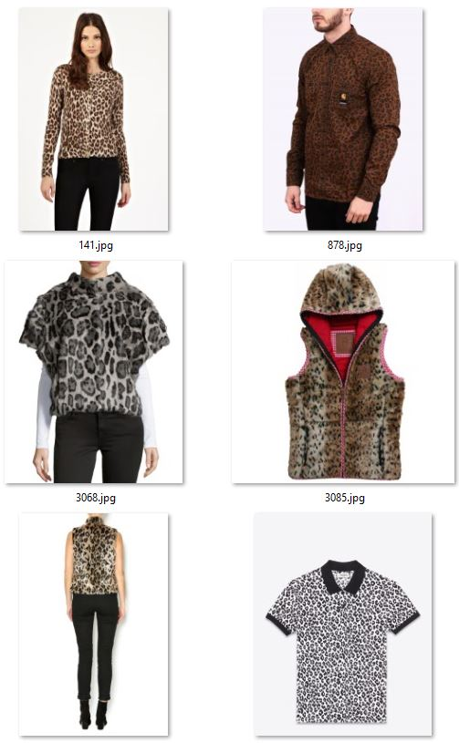
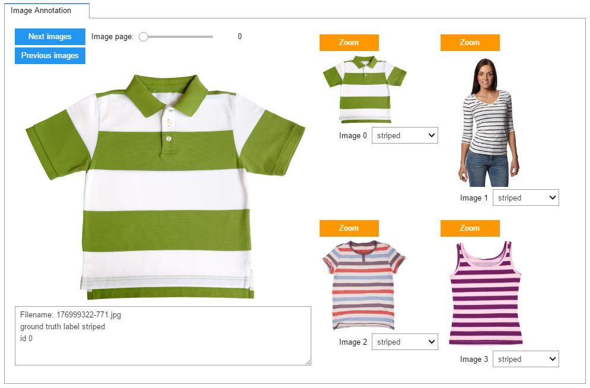
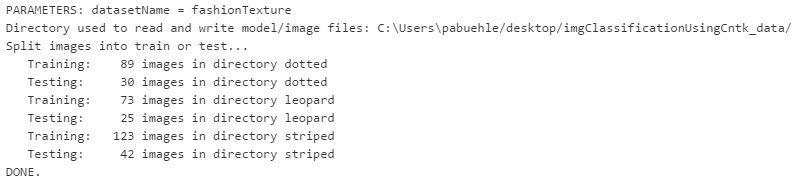
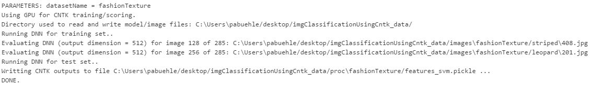
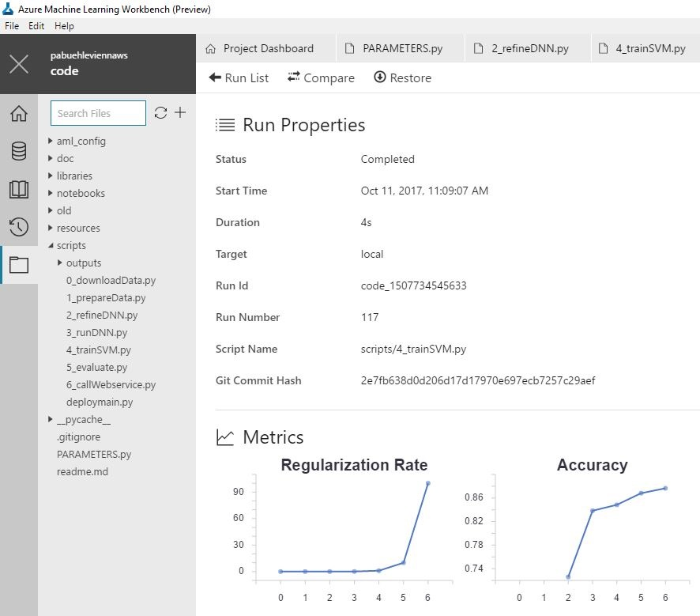
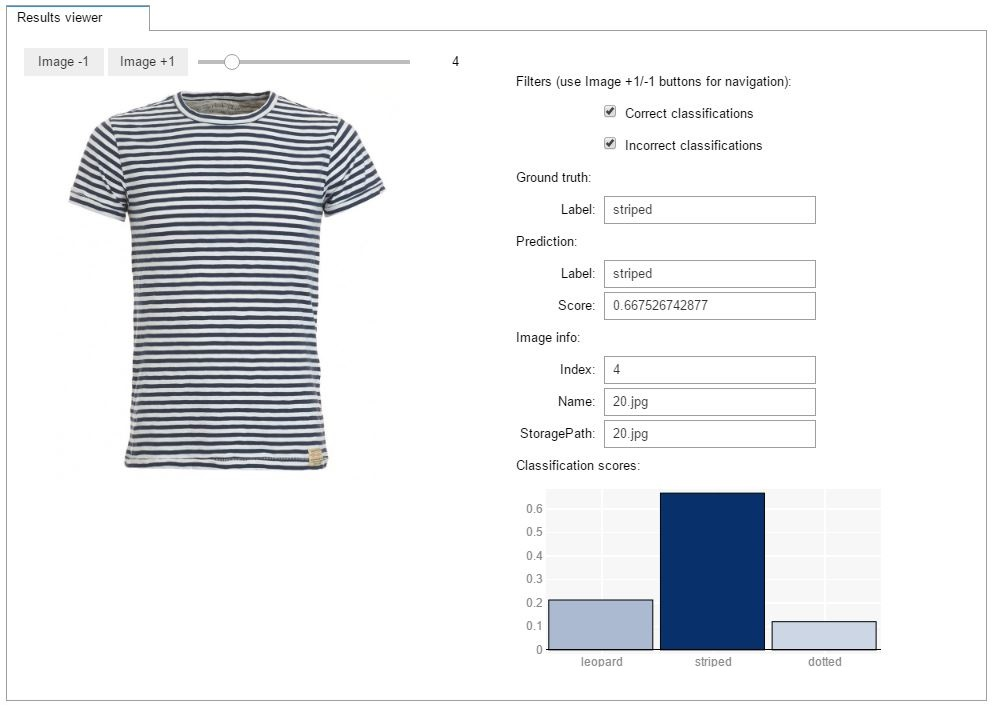
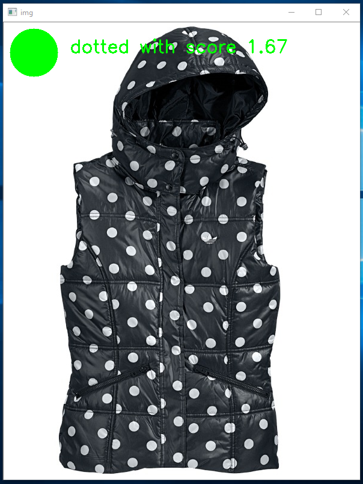

---
title: Image Classification using CNTK inside Azure Machine Learning Workbench | Microsoft Docs
description: Train, evaluate, and deploy a custom image classification model using CNTK.
services: machine-learning
documentationcenter: ''
author: pabuehle
manager: tihazen
editor: pabuehle
ms.assetid:
ms.service: machine-learning
ms.workload: data-services
ms.tgt_pltfrm: na
ms.devlang: na
ms.topic: article
ms.custom: mvc
ms.date: 10/17/2017
ms.author: pabuehle
ms.manager: tihazen
ms.reviewer: mawah, marhamil
---
# Image Classification using Azure Machine Learning workbench

A large number of problems in the computer vision domain can be solved using image classification approaches.
These include building models which answer questions such as, "Is an OBJECT present in the image?" (where OBJECT could for example be "dog", "car", "ship", etc.) as well as more complex questions, like "What class of eye disease severity is evinced by this patient's retinal scan?"

This tutorial will address solving such problems. We will show how to train, evaluate and deploy your own image classification model using the  [Microsoft Cognitive Toolkit (CNTK) ](https://www.microsoft.com/en-us/cognitive-toolkit/) for deep learning.
Example images are provided, but the reader can also bring their own dataset and train their own custom models.

Traditionally, computer vision solutions required expert knowledge to manually identify and implement so-called "features" which highlight desired information in images.
This changed in 2012 with the famous [AlexNet](https://papers.nips.cc/paper/4824-imagenet-classification-with-deep-convolutional-neural-networks.pdf)[1] Deep Learning paper, and at present, Deep Neural Networks (DNN) are used to automatically find these features.
DNNs led to a huge improvement in the field not just for image classification, but also for other computer vision problems such as object detection and image similarity.


## Link to the gallery GitHub repository
[https://github.com/Azure/MachineLearningSamples-ImageClassificationUsingCNTK](https://github.com/Azure/MachineLearningSamples-ImageClassificationUsingCNTK)

## Overview

This tutorial is split into three parts:

- Part 1 shows how to train, evaluate and deploy an image classification system using a pre-trained DNN as featurizer and training a SVM on its output.
- Part 2 then shows how to improve accuracy by, for example, refining the DNN rather then using it as a fixed featurizer.
- Part 3 covers how to use your own dataset instead of the provided example images, and if needed, how to produce your own dataset by scraping images from the net.

While previous experience with machine learning and CNTK is not required, it is very helpful for understanding the underlying principles. Note that accuracy numbers, training time, etc. reported in this tutorial are only for reference, and the actual values you might see when running the code will almost certainly differ.


## Prerequisites

The prerequisites to run this example are as follows:

1. An [Azure account](https://azure.microsoft.com/free/) (free trials are available).
2. The [Azure Machine Learning Workbench](./overview-what-is-azure-ml.md) following the [quick start installation guide](./quickstart-installation.md) to install the program and create a workspace.  
3. A Windows machine. This is necessary since the Workbench supports only Windows and MacOS, while Microsoft's Cognitive Toolkit (which we use as deep learning library) only supports Windows and Linux.
4. A dedicated GPU. While not being required to execute the SVM training in part 1, it is however needed for refining of the DNN described in part 2. If you lack a strong GPU, want to train on multiple GPUs, or do not have a Windows machine, then consider using Azure's Deep Learning Virtual Machine with Windows operating system. See [here](https://azuremarketplace.microsoft.com/en-us/marketplace/apps/microsoft-ads.dsvm-deep-learning) for a 1-click deployment guide. Once deployed, connect to the VM via a remote desktop connection, install Workbench there, and execute the code locally from the VM.
5. Various python libraries need to be installed. Click *Open Command Prompt* from the *File* menu in the Workbench and run the following commands to install these dependencies:  
   ```
       - pip install https://cntk.ai/PythonWheel/GPU/cntk-2.0-cp35-cp35m-win_amd64.whl  
       - pip install opencv_python-3.3.0-cp35-cp35m-win_amd64.whl (after downloading the opencv wheel from http://www.lfd.uci.edu/~gohlke/pythonlibs/; note that the exact filename and version can change)
       - conda install matplotlib numpy pillow
       - conda install -c conda-forge bqplot
   ```
<!--
  Linux:
   ```
       - pip install https://cntk.ai/PythonWheel/GPU/cntk-2.0-cp35-cp35m-linux_x86_64.whl
       - conda install opencv matplotlib numpy pillow
       - conda install -c conda-forge bqplot
   ```
-->

Troubleshooting / Known bugs:
- The error "Batch normalization training on CPU is not yet implemented" is thrown in part 2 when trying to train the DNN using a system which does not have a GPU. This is a restriction from CNTK.
- Out-of-memory errors during DNN training can be avoided by reducing the minibatch size (variable `cntk_mb_size` in `PARAMETERS.py`).
- This code was tested using CNTK 2.0 and 2.1, and should run without any (or only minor) changes also on newer CNTK versions.
- At the time of writing, the AML Workbench had problems showing notebooks larger than 5 Mbytes, which can happen if the notebook is saved after all cell output is displayed. If you encounter this problem, then open the command prompt from the File menu inside the Workbench, execute `jupyter notebook`, open the notebook, clear all output, and save the notebook. After this, the notebook will open properly inside the AML Workbench again.


## Create a new workbench project

To create a new project using this example as a template:
1.	Open Azure Machine Learning Workbench.
2.	On the **Projects** page, click the **+** sign and select **New Project**.
3.	In the **Create New Project** pane, fill in the information for your new project.
4.	In the **Search Project Templates** search box, type "Image classification" and select the template.
5.	Click **Create**.

This will create the project structure shown below. Note that the project directory is restricted to be less than 25 Mbytes in size since the AML Workbench creates a copy of this folder after each run (to enable run history). Hence, all image and temporary files will be saved when running the provided scripts to and from the directory *~/Desktop/imgClassificationUsingCntk_data* (referred to as *DATA_DIR* in this document).

  Folder| Description
  ---|---
  aml_config/|		                     Directory containing the AML Workbench configuration files
  libraries/|		                       Directory containing all Python and Jupyter helper functions
  notebooks/|		                       Directory containing all notebooks
  resources/|		                       Directory containing all resources (e.g. url of fashion images)
  scripts/|		                         Directory containing all scripts
  PARAMETERS.py|                       Python script specifying all parameters
  readme.md|                           This readme document


## Data description

This tutorial uses as running example an upper body clothing texture dataset consisting of up to 428 images, where each image is annotated as one of 3 different textures (dotted, striped, leopard). We kept the number of images small so that this tutorial can be executed quickly, however the code is well-tested and works with tens of thousands of images. All images were scraped using Bing Image Search and hand-annotated as is explained in [Part 3](#using-a-custom-dataset). The image URLs with their respective attributes are listed in the */resources/fashionTextureUrls.tsv* file.

The script `0_downloadData.py` needs to be executed once and downloads all images to the *DATA_DIR/images/fashionTexture/* directory. Note that some of the 428 URLs are likely broken - this is not an issue, and just means that we have slightly fewer images for training and testing.

The figure below shows examples for the attributes dotted (left two columns), striped (middle two columns), and leopard (right two columns). Note that annotations were done according to the upper body clothing item, and the classifier needs to learn to focus on the relevant part of the image and to ignore all other areas (e.g. pants, shoes).

<p align="center">



</p>


## Scenario structure

## PART 1 - Model training and evaluation

In the first part of this tutorial we are training a system which uses, but does not modify, a pre-trained deep neural network. This pre-trained DNN will be used as a featurizer, and a linear SVM will be trained to predict the attribute (i.e. dotted, striped or leopard) of a given featurized image.

We will now described this approach in detail, step-by-step, and show which scripts need to be executed. We recommend after each step to inspect which files are written and where they are written to.

Note that all important parameters are specified, and a short explanation provided, in a single place: the  `PARAMETERS.py` file.


### Step 1: Data preparation
`Script: 1_prepareData.py. Notebook: showImages.ipynb`

The notebook `showImages.ipynb` can be used to visualize the images, and to correct their annotation as needed. To run the notebook, simply open it in Azure Machine Learning Workbench, click on "Start Notebook Server" if this option is shown, and then execute all cells in the notebook. See the troubleshooting section in this document if you get an error complaining that the notebook is too large to be displayed.
<p align="center">

</p>

Now execute the script named `1_prepareData.py`, which assigns all images to either the training set or the test set. This assignment is mutually exclusive - no training image is also used for testing or vice versa. By default, a randomly-chosen 75% of the images from each attribute class are assigned to training, and the remaining 25% are assigned to testing. All data generated by the script are saved in the *DATA_DIR/proc/fashionTexture/* folder.

<p align="center">

</p>


### Step 2: Refining the Deep Neural Network
`Script: 2_refineDNN.py`

As we explained earlier, in part 1 of this tutorial, the pre-trained DNN is kept fixed (i.e. it is not refined). However, the script named `2_refineDNN.py` should still be run in part 1 of the tutorial, as it will load a pre-trained [ResNet](https://www.cv-foundation.org/openaccess/content_cvpr_2016/papers/He_Deep_Residual_Learning_CVPR_2016_paper.pdf)[2] model and modify it e.g. to allow for higher input image resolution. This step is fast (seconds) and does not require a GPU.

In part 2 of the tutorial, a modification to the PARAMETERS.py file will cause the `2_refineDNN.py` script to also refine the pre-trained DNN. By default, we run 45 training epochs during refinement.

In both cases, the final model is then written to the file *DATA_DIR/proc/fashionTexture/cntk_fixed.model*.

### Step 3: Evaluate DNN for all images
`Script: 3_runDNN.py`

We can now use the (possibly refined) DNN from the last step to featurize our images. Given an image as input to the DNN, the output is the 512-floats vector from the penultimate layer of the model. This vector, while having a much smaller dimension than the image itself, should nevertheless contain (and even highlight) all information in the image relevant to recognize the image's attribute, i.e. if the clothing item has a dotted, striped, or leopard texture.

All of the DNN image representations are saved to the file *DATA_DIR/proc/fashionTexture/cntkFiles/features.pickle*.

<p align="center">

</p>


### Step 4: Support Vector Machine training
`Script: 4_trainSVM.py`

The 512-floats representations computed in the last step are now used to train a SVM classifier: given an image as input, the SVM outputs a score for each attribute to be present. In our example dataset, this means a score for 'striped', for 'dotted', and for 'leopard'.

Script `4_trainSVM.py` loads the training images, trains an SVM for different values of the regularization (slack) parameter C, and keeps the SVM with highest accuracy. The classification accuracy is printed on the console and plotted in the Workbench, as can be seen in the screenshot below. For the provided texture data these values should be around 100% and 88% respectively. Finally, the trained SVM is written to the file *DATA_DIR/proc/fashionTexture/cntkFiles/svm.np*.

<p align="center">

</p>


### Step 5: Evaluation and visualization
`Script: 5_evaluate.py. Notebook: showResults.ipynb`

The accuracy of the trained image classifier can be measured using the script `5_evaluate.py`. This scores all test images using the trained SVM classifier, assigns each image the attribute with the highest score, and compares the predicted attributes with the ground truth annotations.

The output of script `5_evaluate.py` is shown below. The classification accuracy of each individual class is computed, as well as the accuracy for the full test set ('overall accuracy'), and the average over the individual accuracies ('overall class-averaged accuracy'). 100% corresponds to the best possible accuracy, 0% to the worst, and random guessing would on average produce a class-averaged accuracy of 1 over the number of attributes, i.e. in our case this would be 33.33%. These results improve significantly when using a higher input resolution such as `rf_inputResoluton = 1000`, however at the expense of longer DNN computation times.

<p align="center">

</p>

In addition to accuracy, the ROC curve is plotted with respective area-under-curve (left); and the confusion matrix is shown (right):

<p align="center">

</p>

Finally, the notebook `showResults.py` is provided to scroll through the test images and visualize their respective classification scores as can be seen in this screenshot:
<p align="center">

</p>


### Step 6: Deployment
`Scripts: 6_callWebservice.py, deploymain.py. Notebook: deploy.ipynb`

The trained system can now be operationalized by publishing it as a REST API. This is explained in the notebook `deploy.ipynb`, and based on functionality within the AML Workbench. See also the excellent deployment section of the [IRIS tutorial](https://docs.microsoft.com/en-us/azure/machine-learning/preview/tutorial-classifying-iris-part-3).

Once deployed, the web service can be called using the script `6_callWebservice.py`. Note that the IP address (either local or on the cloud) of the web service needs to be set first in the script. The notebook `deploy.ipynb` explains how to find this IP address.


## PART 2 - Accuracy improvements

In part 1, we showed how to classify an image by training a linear Support Vector Machine on the 512-floats output of the penultimate layer of a pre-trained Deep Neural Network. This approach is very fast since the DNN is used as-is, but nevertheless often gives very good results.

We will now present several ways to improve the accuracy of the model from part 1. Most notably we will refine the DNN rather than keeping it fixed.

### DNN refinement

Instead of a SVM, one can do the classification directly in the neural network by adding a new last layer to the pre-trained DNN which takes the 512-floats from the penultimate layer as input. The advantage of doing the classification in the last layer of the DNN is that now the full network can be retrained using backpropagation. This often leads to significantly better classification accuracies compared to using the pre-trained DNN as-is, however at the expense of much longer training time (even with GPU).

Training the Neural Network instead of an SVM is done by simply changing the variable `classifier` in `PARAMETERS.py` from "svm" to "dnn". Then, as described in part 1, all the scripts except for data preparation (step 1) and SVM training (step 3) need to be executed again. Note that a GPU is required for model refinement, and the script `2_refineDNN.py` will throw an error if no GPU was found or if the GPU is locked (e.g. by a previous CNTK run). DNN training can throw out-of-memory error on some GPUs which can be avoided by reducing the minibatch size (variable `cntk_mb_size` in `PARAMETERS.py`).

Once training completes, the refined model is saved to *DATA_DIR/proc/fashionTexture/cntk_refined.model*, and a plot drawn which shows how the training and test classification errors change during training. Note that the error on the training set is much smaller than on the test set. This so-called over-fitting behavior can be reduced e.g. by using a higher value for the dropout rate `rf_dropoutRate`.
<p align="center">

</p>

As can be seen in the plot below, the accuracy using DNN refinement on the provided dataset is 92.35% versus the 88.92% before (part 1). In particular, the 'dotted' images improve significantly, with an ROC area-under-curve of 0.98 with refinement vs. 0.94 before. Note that we are using a very small dataset, and hence the actual accuracies you might see will almost certainly be different due to stochastic effects suchs as the random split of the images into training and testing sets.
<p align="center">

</p>

### Run history tracking

The AML Workbench stores the history of each run on Azure and allows to compare two or more runs that are even weeks apart. This is explained in detail in the [Iris tutorial](https://docs.microsoft.com/en-us/azure/machine-learning/preview/tutorial-classifying-iris-part-2) and also illustrated in the screenshots below where we compare two runs of the script `5_evaluate.py`, using either DNN refinement i.e. `classifier = "dnn"`(run number 148) or SVM training i.e. `classifier = "svm"` (run number 150).

In the first screenshot, it can be seen that the DNN refinement leads to better accuracies than SVM training for all classes. The second screenshot shows all metrics that are being tracked, including what the classifier was. This is done in the script `5_evaluate.py` by simply calling the AML logger. In addition, note that the script also saves the ROC curve and confusion matrix to the *outputs* folder. This *outputs* folder is special in that its content is also tracked by the Workbench history feature: the output files can be accessed at any time, regardless of whether local copies have been overwritten.

<p align="center">
  
</p>

<p align="center">

</p>


### Parameter tuning
As is true for most machine learning projects, getting good results for a new dataset requires careful parameter tuning as well as evaluating different design decisions. To help with this, all important parameters are specified, and a short explanation provided, in a single place: the `PARAMETERS.py` file.

Some of the most promising avenues for improvements are:

- Data quality: ensure the training and test sets have high quality. That is, the images are annotated correctly, ambiguous images removed (e.g. clothing items with both stripes and dots), and the attributes are mutually exclusive (i.e. chosen such that each image belongs to exactly one attribute).
- Image classification approaches do not work well if the object-of-interest is small in the image. In such cases consider using an object detection approach as described in this [tutorial](https://github.com/Azure/ObjectDetectionUsingCntk).
- DNN refinement: the arguably most important parameter to get right is the learning rate `rf_lrPerMb`. If the accuracy on the training set after training (first figure in part 2) is not close to 0-5% then most likely (but not always) this is due to the learning rate being wrong. The other parameters starting with `rf_` are less important. Typically, the training error should decrement exponentially and be close to 0% after training (or higher when using a large dropout rate).
- Input resolution: the default image resolution is 224x224 pixels. Using higher image resolution (parameter: `rf_inputResoluton`) of e.g. 448x448 or 896x896 pixels often significant improves accuracy but slows down DNN refinement. **This is nearly free lunch and almost always boosts accuracy**.
- DNN over-fitting: avoid a large gap between the training and test accuracy during DNN refinement (first figure in part 2). This gap can be reduced using dropout rates `rf_dropoutRate` of 0.5 or more, and by increasing the regularizer weight `rf_l2RegWeight`. Using a high dropout rate can be especially helpful if the DNN input image resolution is high.
- Try using deeper DNNs by changing `rf_pretrainedModelFilename` from "ResNet_18.model" to either "ResNet_34.model" or "ResNet_50.model". The Resnet-50 model is not only deeper, but its output of the penultimate layer is of size 2048 floats (vs. 512 floats of the ResNet-18 and ResNet-34 models) which especially when using the 'svm' classifier can lead to increased accuracy.

## PART 3 - Custom dataset

In part 1 and 2, we trained and evaluated an image classification model using the provided example images of upper body clothing textures. We will now show how to use a custom user-provided dataset instead, and if not available, how to generate and annotate such a dataset using Bing Image Search.

### Using a custom dataset

First, let's have a look at the folder structure for the clothing texture data. Note how all images for the different attributes are in the respective subfolders *dotted*, *leopard* and *striped* at *DATA_DIR/images/fashionTexture/*. Note also how the image folder name also occurs in the `PARAMETERS.py` file:
```python
datasetName = "fashionTexture"
```

Using a custom dataset is as simple as reproducing this folder structure where all images are in subfolders according to their attribute, and to copy these subfolders to a new user-specified directory *DATA_DIR/images/newDataSetName/*. The only code change required is to set the `datasetName` variable to *newDataSetName*. Scripts 1-5 can then be executed in order, and all intermediate files will be written to *DATA_DIR/proc/newDataSetName/*. No other code changes are required.

It is important that the new dataset is generated such that each image can be assigned to exactly one attribute. For example, it would be wrong to have attributes for 'animal' and for 'leopard', since a 'leopard' image would also belong to 'animal'. Also, it is best to remove images which are ambiguous and hence difficult to annotate.


### Image Scraping and Annotation

Collecting a sufficiently large number of annotated images for training and testing can be difficult. One way to overcome this problem is to scrape images from the Internet. For example, see below the Bing Image Search results for the query "tshirt striped". As expected, most images indeed are striped t-shirts, and the few incorrect or ambiguous images (such as column 1, row 1; or column 3, row 2) can be identified and removed easily:
<p align="center">

</p>

To generate a large and diverse dataset, multiple queries should be used. For example 7\*3 = 21 queries can by synthesized automatically using all combinations of clothing items {blouse, hoodie, pullover, sweater, shirt, tshirt, vest} and attributes {striped, dotted, leopard}. Downloading the top 50 images per query would then lead to a maximum of 21*50=1050 images.

Rather than manually downloading images from Bing Image Search, it is much easier to instead use the [Cognitive Services Bing Image Search API](https://www.microsoft.com/cognitive-services/en-us/bing-image-search-api) which returns a set of image URLs given a query string.

Some of the downloaded images will be exact or near duplicates (e.g. differ just by image resolution or jpg artifacts) and should be removed so that the training and test split do not contain the same images. This can be achieved using a hashing-based approach which works in two steps: (i) first, the hash string is computed for all images; (ii) in a second pass over the images, only those are kept with a hash string which has not yet been seen. All other images are discarded. We found the *dhash* approach in the Python library *imagehash* and described in this [blog](http://www.hackerfactor.com/blog/index.php?/archives/529-Kind-of-Like-That.html) to perform well, with the parameter `hash_size` set to 16. It is OK to incorrectly remove some non-duplicate images, as long as the majority of the real duplicates get removed.


## Conclusion

Some key highlights of this example are:
- Code to train, evaluate and deploy image classification models.
- Demo images provided, but easily adaptable (one line change) to use own image dataset.
- State-of-the-art expert features implemented to train high accuracy models based on Transfer Learning.
- Interactive model development with Azure Machine Learning Workbench and Jupyter Notebook.


## References

[1] Alex Krizhevsky, Ilya Sutskever, and Geoffrey E. Hinton, [_ImageNet Classification with Deep Convolutional
Neural Networks_](https://papers.nips.cc/paper/4824-imagenet-classification-with-deep-convolutional-neural-networks.pdf). NIPS 2012.  
[2] Kaiming He, Xiangyu Zhang, Shaoqing Ren, and Jian Sun, [_Deep Residual Learning for Image Recognition_](https://www.cv-foundation.org/openaccess/content_cvpr_2016/papers/He_Deep_Residual_Learning_CVPR_2016_paper.pdf). CVPR 2016.


# ======== OLD TEXT ========


#AML Workbench Image Classification demo code


###Description:
- This code runs inside AML Workbench, by e.g. clicking on the "run" button.
- Functionality: local training and evaluation, visualization of results inside a Jupyter notebook, deployment to local and cloud including load testing using Jupyter notebooks.
- NOTE: This is not the final user experience, but a repo for Michael, Nimisha and me to work towards the ignite demo. Hence some things are not as polished as they could be.

###Note how the project consists of two directories.
- Called "..code": is where all scripts are. This directory has to be less than 25 Mbytes, since a copy is created every time a script is run. Hence, files written during code execution (using relative path) will not be copied back into the original directory.
- Called "..data": this is where the images are downloaded to, and where all other temporary files are written and read from.

###Installation:
- Create AML Workbench project:
    - Create new project inside the AML Workbench App with project name e.g. "imgClassification" and point at "<dir>\viennaImgClassTutorial\" as project directory. This has to be an empty directory otherwise Workbench will complain.
    - Then press "create" button. See screenshot "createNewProject.jpg" in the same directory as this readme file, and also shown in the markdown rendering below.
    - Next delete all files and folder in the "imgClassification" directory (EXCEPT for hidden directories), and then move all files and folders from "vienna_img_class_code" to "imgClassification".
    - WARNING: the "imgClassification" directory is not allowed to exceed 25Mbytes (a restricion by AML Workbench since it creates a temporary copy of this folder for each script run). Hence, all big files (such
           as large wheel installation files) should not exist in the "imgClassification" directory.


- Install missing packages to the local Python environment. To do this, open the command prompt from within the AML Workbench (menu tab "File") and execute these commands:
	- Windows:
		 - pip install https://cntk.ai/PythonWheel/GPU/cntk-2.0-cp35-cp35m-win_amd64.whl  
		 - Download opencv from http://www.lfd.uci.edu/~gohlke/pythonlibs/ and then run e.g. "pip install opencv_python-3.3.0-cp35-cp35m-win_amd64.whl"
		 - conda install matplotlib
		 - conda install numpy   #numpy update might be needed if "import matplotlib" throws an error
		 - conda install pillow
		 - conda install -c conda-forge bqplot

	- Linux (NOT TESTED):
		 - pip install https://cntk.ai/PythonWheel/GPU/cntk-2.0-cp35-cp35m-linux_x86_64.whl
		 - conda install opencv
		 - conda install matplotlib
		 - conda install numpy   #numpy update might be needed if "import matplotlib" throws an error
		 - conda install pillow
		 - conda install -c conda-forge bqplot

- Update "rootDir" in Parameters.py to point to the "vienna_img_class_data" directory, e.g. rootDir = "C:/Users/pabuehle/Desktop/viennaImgClassTutorial/vienna_img_class_data/". Setting an absolute path is unfortunately necessary since AML Workbench executes code in a temporary directory, and this is the only way to read/save data from the "vienna_img_class_data" directory.


Finally, qualitative visualizations are produced for each image in the test set (see figure below).  The highest score and respective class is shown (here: 'dotted' with score 1.67), in green if the class of the image was correctly predicted, and red otherwise.

<p align="center">

</p>

Up to now our focus was on training a model and evaluating its performance. Hence all steps were performed one-by-one, and intermediate results were written to and loaded from disk. During scoring, given one or more images, it would be preferable to perform all steps in-memory. Exactly this is done in script `deploymain.py`: it loads a given image, runs the DNN using the image as input, optionally evaluates the trained SVM, and finally outputs a score for each of the labels.
