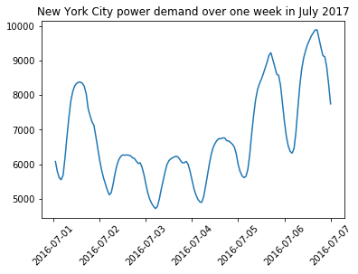

# Time Series Forecasting

[https://github.com/Azure/MachineLearningSamples-EnergyDemandTimeSeriesForecasting](https://github.com/Azure/MachineLearningSamples-EnergyDemandTimeSeriesForecasting)

## Prerequisites

1. Please ensure that you have properly installed Azure ML Workbench by following the [installation guide](https://github.com/Azure/ViennaDocs/blob/master/Documentation/Installation.md).
2. This sample assumes that you are running Azure ML Workbench on Windows 10 with [Docker engine](https://www.docker.com/) locally installed. If you are using macOS, the instruction is largely the same.
3. This sample requires that you update the Pandas installation to version 0.20.3. Run the following command in the CLI to upgrade the package.
    ```
    conda install pandas==0.20.3
    ```
Notes:

- The sample was built and tested on a Windows 10 machine with the following specification: Intel Core i7-6600U CPU @ 2.60 GHz, 16-GB RAM, 64-bit OS, x64-based processor with Docker Version 17.06.2-ce-win27 (13194).
- Model operationalization was built using this version of Azure ML CLI: azure-cli-ml==0.1.0a24.post2

## Introduction

Time series forecasting is the task of predicting future values in a time-ordered sequence of observations. It is a common problem and has applications in many industries. For example, retail companies need to forecast future products sales so they can effectively organize their supply chains to meet demand. Similarly, package delivery companies need to estimate the demand for their services so they can plan workforce requirements and delivery routes ahead of time. In many cases, the financial risks of inaccurate forecasts can be significant and forecasting is therefore often a business critical activity.

This sample shows how time series forecasting can be performed through applying machine learning techniques. You are guided through every step of the modeling process including:
- data preparation to clean and format the data;
- creating features for the machine learning models from raw time series data;
- training various machine learning models;
- evaluating the models by comparing their performance on a held-out test dataset; and,
- operationalizing the best model, making it available through a web service to generate forecasts on demand.

Azure Machine Learning Workbench aids the modeling process at every step: 
- The sample shows how the Jupyter notebook environment - available directly from through Workbench - can make developing Python code easier. The model development process can be explained to others more clearly using markdown annotations and charts. These notebooks can be viewed, edited, and executed directly from the Workbench.
- Trained models can be persisted and uploaded to blob storage. This helps the data scientist to keep track of trained model objects and ensure they are retained and retrievable when needed.
- Metrics can be logged while executing a Python script, enabling the data scientist to keep a record of model performance scores.
- The workbench produces customizable tables of logged metrics allowing the data scientist to easily compare model performance metrics. Charts are automatically displayed so the best performing model can be readily identified.
- Finally, the sample shows how a trained model can be operationalized by deploying it in a realtime web service.

## Use Case Overview

This scenario focuses on energy demand forecasting. This is the task of predicting the future load on an energy grid. It is a critical business operation for companies in the energy sector. For example, energy grid operators need to maintain the fine balance between the energy consumed on a grid and the energy supplied to it. If too much power is supplied to the grid, it can result in energy wastage or even technical faults. However, if there is not enough supply to meet demand it can lead to blackouts, leaving many people without power. Typically, grid operators can take short-term decisions to manage energy supply to the grid and keep the load in balance. An accurate short-term forecast of energy demand is therefore essential for the operator to make these decisions with confidence.

This scenario shows how the task of energy demand forecasting can be approached as a machine learning problem. Models are trained on a public dataset from the [New York Independent System Operator (NYISO)](http://www3.dps.ny.gov/W/PSCWeb.nsf/All/298372E2CE4764E885257687006F39DF?OpenDocument), which operates the power grid for New York State. The dataset includes hourly power demand data for New York City over a period of five years. An additional dataset containing hourly weather conditions in New York City over the same time period was taken from [darksky.net](https://darksky.net).

## Data Description

The data for this sample is stored in a blob storage container on Azure. Instructions for downloading this data are provided in the next section. There are two datasets: *nyc_demand.csv* and *nyc_weather.csv*:

**nyc_demand.csv** contains hourly power demand values for New York City for the years 2012-2017. The data has the following simple structure:

| timeStamp | demand |
| --- | --- |
| 2012-01-01 00:00:00 |	4937.5 |
| 2012-01-01 01:00:00 |	4752.1 |
| 2012-01-01 02:00:00 | 4542.6 |
| 2012-01-01 03:00:00 | 4357.7 |

Demand values are in megawatt-hours (MWh). Below is a chart of energy demand over a 7-day period in July 2017:



**nyc_weather.csv** contains hourly weather values for New York City over the years 2012-2017:

| timeStamp	| precip | temp
| --- | --- | --- |
| 2012-01-01 00:00:00 | 0.0 | 46.13 |
| 2012-01-01 01:00:00 | 0.01 | 45.89 |
| 2012-01-01 02:00:00 | 0.05 | 45.04 |
| 2012-01-01 03:00:00 | 0.02 | 45.03 |

*precip* is a percentage measure of the level of precipitation. *temp* (temperature) values have been rescaled such that all values fall in the interval [0, 100].

## Scenario Structure

When you open this sample for the first time, navigate to the Files pane on the left-hand side of the Workbench. Here you will see the following files:
- **1-data-preparation.ipynb** - this Jupyter notebook downloads and processes the data to prepare it for modeling. This is the first notebook you will run.
- **2-linear-regression.ipynb** - this notebook trains a linear regression model on the training data.
- **3-ridge.ipynb** - trains a ridge regression model.
- **4-ridge-poly2.ipynb** - trains a ridge regression model on polynomial feature of degree 2.
- **5-ridge-poly3.ipynb** - trains a ridge regression model on polynomial feature of degree 3.
- **6-dtree.ipynb** - trains a decision tree model.
- **7-gbm.ipynb** - trains a gradient boosted machine model.
- **8-evaluate-model .py** - this script loads a trained model and uses it to make predictions on a held-out test dataset. It produces model evaluation metrics so the performance of different models can be compared.
- **9-forecast-output-exploration.ipynb** - this notebook produces visualizations of the forecasts generated by the machine learning models.
- **10-deploy-model.ipynb** - this notebook demonstrates how a trained forecasting model can be operationalized in a realtime web service.

### 1. **Data Preparation & Cleaning**

To start running the sample, first click on **1-data-preparation.ipynb**. This will open the notebook in preview mode. Click on **Start Notebook Server**. This will start a Jupyter notebook server and Python kernel on your machine and allow you to run the code. You can either run the notebooks from within the Workbench, or you can use your browser by navigating to [http://localhost:8888](http://localhost:8888). Press ***shift+Enter*** to run the code in the notebook cells.

The notebook first downloads the data from a blob storage container hosted on Azure. The data is then stored in the AZURE_NATIVE_SHARE_DIRECTORY. This location is accessible from any notebooks or scripts you run from the Workbench so is a good place to store data and trained models.

Once the data has been downloaded, the notebook shows how the data can be cleaned by filling gaps in the time series. Missing values are also filledby interpolation. Cleaning the time series data in this way maximizes the amount of data available for training the models.

After the data has been cleaned, several model features are created from the raw data. These can be classed into two groups:

- **time driven features** - these features are derived from the *timestamp* variable e.g. *month*, *dayofweek* and *hour*
- **lagged features** - these are time shifted values of the actual demand or temperature values. These features aim to capture the conditional dependencies between consecutive time periods in the model.

### 2. **Model Development**

Open the first model notebook, **2-linear-regression.ipynb** to begin the model development process. This notebook shows how to train a linear regression model to create a forecast of future energy demand. In particular, the model will be trained to predict energy demand in period ***t+1***, one hour ahead of the current time period ***t***.

To train a model, a predictive pipeline is created which involves three distinct steps:

- **a data transformation**: the required formats for input data can vary depending on the machine learning algorithm. For example, linear regression requires categorical variables to be one-hot encoded while other algorithms do not.
- **a cross validation routine**: Often a machine learning model will have one or more hyperparameters that need to be tuned through experimentation. Cross validation can be used to find the optimal set of parameter values. The model is repeatedly trained and evaluated on different folds of the dataset. The best parameters are those that achieve the best model performance when averaged across the cross validation folds. This process is explained in more detail in 2-linear-regression.ipynb.
- **training the final model**: The model is trained on the whole dataset, using the best set of hyperparameters.

Run all the notebooks numbered 2-7 to train all the models developed for this scenario.

### 3. **Model Evaluation & Comparison**

We can use a trained model to make forecasts for the time period covered in held-out test dataset. By evaluating the different models on the same dataset, we can fairly compare their performance and identify the best model. To evaluate a model, open the **8-evaluate-model .py** script from the File explorer pane in the Workbench. This script performs several operations:

- loads a trained model pipeline from disk
- makes predictions on the test dataset
- computes model performance metrics and logs them
- saves the test dataset predictions to disk
- saves the trained model pipeline to the *Outputs* folder. The model will then be copied into the Azure Blob Storage account associated with your Experimentation account.

Check that *Run Configuration* is set to **local** and then type the model name into the *Arguments* field. The model name needs to match exactly the *model_name* variable set at the start of the notebook in which the model is trained (e.g. "linear_regression"). Click *Run* to execute the script and evaluate the model.

To compare the performance of multiple trained models, run the script repeatly using different model names as the script argument. Now navigate to the *Run History* pane and click on *8-evaluate-model .py*. You will see some charts displaying three model performance metrics:

- **MSE**: [mean squared error](https://en.wikipedia.org/wiki/Mean_squared_error)
- **RMSE**: root mean squared error (the square root of MSE)
- **MAPE**: [mean absolute percentage error](https://en.wikipedia.org/wiki/Mean_absolute_percentage_error)

If metrics are not displaying in the chart area, click on the gear symbol in the top right-hand corner. Ensure that the model performance metrics you are interested in are checked. The metrics will also appear in a table below the charts. Again, this table is customizable be clicking on the gear symbol. Sort the table by a performance metric to identify the best model.

When evaluating forecasting models, it can be very useful to visualize the output predictions. This helps the data scientist to determine whether the forecast produced appears realistic. It can also help to identify problems in the forecast if, for example, the forecast performs poorly in certain time periods. Use the notebook **9-forecast-output-exploration.ipynb** to produce visualizations of the forecast generated for the test dataset.

### 4. **Deployment**

The best model can be operationalized by deploying it as a realtime web service. This web service can be invoked to generate forecasts on demand as new data becomes available. In this scenario, a new forecast needs to be generated every hour to predict the energy demand in the subsequent hour. To perform this task, a web service can be deployed which takes an array of features for a given hour time period as input and returns the predicted demand as output.

In this sample, a web service is deployed to be hosted on a Windows 10 machine. Ensure you have completed the prerequisite steps set out in the [installation](https://github.com/Azure/Machine-Learning-Operationalization/blob/master/documentation/install-on-windows.md) guide for the Operationalization CLI. Follow the instructions under **Set up the Azure Machine Learning environment for local mode deployment**. Once you have set up your environment for local deployment, run the **10-deploy-model.ipynb** notebook to deploy the web service.

## Conclusion & Next Steps

This sample demonstrates how to build an end-to-end time series forecasting solution for the purposes of forecasting energy demand. Many of the principles explored in this sample can be extended to other scenarios and industries. The sample shows how the Azure Machine Learning Workbench can assist a data scientist in developing such solutions with useful features such as the Jupyter notebook environment and metric logging capabilities. The sample also guides the reader on how the best model can be operationalized and deployed using Azure Machine Learning Operationalization CLI. Once deployed, the web service API allows developers or data engineers to integrate the forecasting model into a wider data pipeline.

## Contact

Please feel free to contact Angus Taylor (angus.taylor@microsoft.com) with any question or comment.