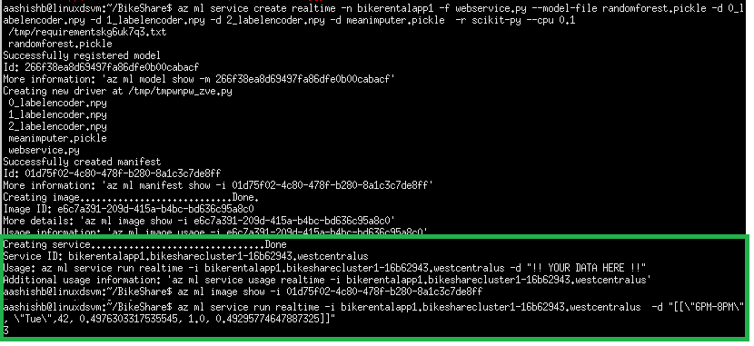

### Hubway Bike Rental Tutorial
# Task 3: Operationalization

>NOTE: Project "Vienna" is evolving quickly with a weekly release cadence. This tutorial is initially developed with version 0.1.1706.05012. As we bring new updates (and some times breaking changes) into Vienna, inevitably you find bits in the tutorial look or behave differently in the Vienna version you have installed. We do our best to keep the tutorial up-to-date with the latest releases and changes.

#### O1. Download the model and transform files generated by regression.py

>NOTE: the following step is a temporary measure. The experience will become a lot better in the near future.

Once you have a successful execution of the _regression.py_ script, you can go to the run history detail of that run, and find the following files:
- 0_labelencoder.npy
- 1_labelencoder.npy
- 2_labelencoder.npy
- meanimputer.pickle
- randomforest.pickle


Download them (sorry you have to do this one by one for now) by clicking on the download button, and save them into the root of the _BikeShare_ project.

#### O2. Copy the webservice file.

Copy the webservice file to your project folder if you haven't already done so.

* [webservice.py](https://github.com/hning86/ViennaSample-BikeShare/blob/master/webservice.py)

Open the _webservice.py_ file and observe. Notice that it has an _init()_ function that loads the pickled models, and the _run()_ function evaluates the models using JSON-formatted inputs.

#### O3. Run the web service deployment code locally

Now, from Vienna run the _webservice.py_ locally by selecting it from the left ribbon, by clicking on it once, and selecting the *local* from drop-down (that appears next to project items under the tab bar) and clicking the right pointing arrow once.


Next, navigate to the run history for _webservice.py_ by clicking on clock icon in left ribbon and then clicking on the run history corresponding to _webservice.py_ as shown in the following screenshot: 


Next, click the on run details corresponding to the timestamp you submitted the run and verify the output under _Driver Log_, as shown in the following screenshot: 


#### O4. Use the CLI to deploy and manage your web service
Vienna allows you to deploy your models either locally on your Windows or macOS machine that will require that you have a local Docker engine installed, or remotely into a Kubernetes Cluster running in Azure Cluster Service (ACS).

Use the following commands to set up an environment and account to run the web service. For more info, see the Getting Started Guide and the CLI Command Reference. You can use -h flag at the end of the commands for command help.

- Create the environment (you need to do this once per environment, e.g.,  dev or prod) in cluster mode  
```
az ml env setup -c -n <yourclustername> --location <e.g. eastus2>
```

    This will provision a storage account for storing Docker images, an ACR (Azure Container Registry) for listing Docker images, an AppInsight account for gathering telemetry, and an ACS cluster.

- Create a Model Management account (one time setup)  
```
az ml account modelmanagement create --location <e.g. eastus2> -n <your-new-acctname> -g <yourresourcegroupname> --sku-name S1
```

- Set the Model Management account  
```
az ml account modelmanagement set -n <youracctname> -g <yourresourcegroupname>
```

- Set the environment. The cluster name is the name used in step 1 above. The resource group name was the output of the same process and would be in the command window when the setup process is completed.
```
az ml env set -n <yourclustername> -g <yourresourcegroupname>
```

- Create the realtime REST API
  
    Note the app name "bikerentalapp" must be all lower-case
    
```
az ml service create realtime -n bikerentalapp -f webservice.py --model-file randomforest.pickle -d 0_labelencoder.npy -d 1_labelencoder.npy -d 2_labelencoder.npy -d meanimputer.pickle  -r scikit-py --cpu 0.1   
```

- Invoke the realtime REST API
```
az ml service run realtime -i bikerentalapp.bikesharecluster1-16b62943.westcentralus -d "[[\"6PM-8PM\", \"Tue\",42, 0.4976303317535545, 1.0, 0.49295774647887325]]"
```

    You should see console output similar to following indicating successful deployment and execution of your web service.
    
        