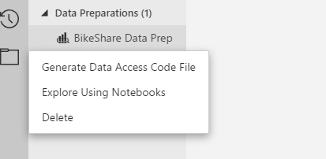
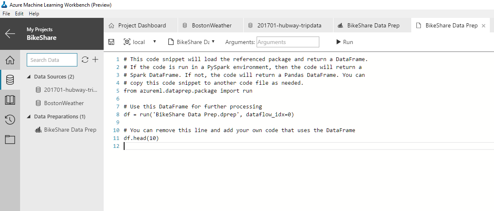

# Bike-share tutorial: Advanced data preparation with Azure Machine Learning Workbench
Azure Machine Learning services (preview) is an integrated, end-to-end data science and advanced analytics solution for professional data scientists to prepare data, develop experiments and deploy models at cloud scale.

In this tutorial, you use Azure Machine Learning services (preview) to learn how to:
> [!div class="checklist"]
> * Prepare data interactively with the Azure Machine Learning Data Preparation tool
> * Import, transform, and create a test dataset
> * Generate a Data Preparation package
> * Run the Data Preparation Package using Python
> * Generate a training dataset by reusing the Data Preparation package for additional input files

> [!IMPORTANT]
> This tutorial only prepares the data, it does not build the prediction model.
>
> You can use the prepared data to train your own prediction models. For example, you might create a model to predict bike demand during a 2-hour window.

## Prerequisites
1. Azure Machine Learning Workbench needs to be installed locally. For more information, follow the [installation Quickstart](quick-start-installation.md).
2. Familiarity with creating a new project in the Workbench.


## Data acquisition
This tutorial uses the [Boston Hubway dataset](https://s3.amazonaws.com/hubway-data/index.html) and Boston weather data from [NOAA](http://www.noaa.gov/).

1. Download the data files from the following links to your local development environment. 
   * [Boston weather data](https://azuremluxcdnprod001.blob.core.windows.net/docs/vienna/bikeshare/BostonWeather.csv). 
   * Hubway trip data from Hubway website.

      - [201501-hubway-tripdata.zip](https://s3.amazonaws.com/hubway-data/201501-hubway-tripdata.zip)
      - [201504-hubway-tripdata.zip](https://s3.amazonaws.com/hubway-data/201504-hubway-tripdata.zip)
      - [201510-hubway-tripdata.zip](https://s3.amazonaws.com/hubway-data/201510-hubway-tripdata.zip)
      - [201601-hubway-tripdata.zip](https://s3.amazonaws.com/hubway-data/201601-hubway-tripdata.zip)
      - [201604-hubway-tripdata.zip](https://s3.amazonaws.com/hubway-data/201604-hubway-tripdata.zip)
      - [201610-hubway-tripdata.zip](https://s3.amazonaws.com/hubway-data/201610-hubway-tripdata.zip)
      - [201701-hubway-tripdata.zip](https://s3.amazonaws.com/hubway-data/201701-hubway-tripdata.zip)

2. Unzip each .zip file after download.

## Learn about the datasets
1. The __Boston weather__ file contains the following weather-related fields, reported on hourly basis:
   * DATE
   * REPORTTPYE
   * HOURLYDRYBULBTEMPF
   * HOURLYRelativeHumidity
   * HOURLYWindSpeed

2. The __Hubway__ data is organized into files by year and month. For example, the file named `201501-hubway-tripdata.zip` contains a .csv file containing data for January 2015. The data contains the following fields, each row representing a bike trip:

   * Trip Duration (in seconds)
   * Start Time and Date
   * Stop Time and Date
   * Start Station Name & ID
   * End Station Name & ID
   * Bike ID
   * User Type (Casual = 24-Hour or 72-Hour Pass user; Member = Annual or Monthly Member)
   * ZIP Code (if user is a member)
   * Gender (self-reported by member)

## Create a new project
1. Launch the **Azure Machine Learning Workbench** from your start menu or launcher.

2. Create a new Azure Machine Learning project.  Click the **+** button on the **Projects** page, or **File** > **New**.
   - Use the **Blank Project** template.
   - Name your project **BikeShare**. 

## Create a new Data Source

1. Create a new data source. Click the **Data** button (cylinder icon) on the left toolbar. This displays the **Data View**.

   

2. Add a data source. Select the **+** icon and then select **Add Data Source**.

   

## Complete the Add Data Source Steps
1. **Data Store**: Select the data store that contains the data. Since we are using files, select **File(s)/Directory**. Select **Next** to continue.

   

2. **File Selection**: Add the weather data. Browse and select the `BostonWeather.csv` file that you downloaded earlier. Click **Next**.

   

3. **File Details**: Verify the file schema that is detected

   The __File Details__ section displays the file ingestion parameters. Azure Machine Learning Workbench analyzes the data in the file and infers the schema to use. 

   

   Verify that the parameters are set to the following values:

   * __File Type__: Delimited File (csv, tsv, txt, etc.)
   * __Separator__: Comma [,]
   * __Comment Line Character__: No value is set.
   * __Skip Lines Mode__: Don't skip
   * __File Encoding__: utf-8
   * __Promote Headers Mode__: Use Headers From First File

   The preview of the data should display the following columns:
   * **Path**
   * **DATE**
   * **REPORTTYPE**
   * **HOURLYDRYBULBTEMPF**
   * **HOURLYRelativeHumidity**
   * **HOURLYWindSpeed**

   To continue, select **Next**.

4. **Data Types**: Review the data types that are detected automatically.

   The __Data Types__ section displays the data types for the columns. Azure Machine Learning Workbench analyzes the data in the file and infers the data types to use.

   For this data, change the `DATA TYPE` of all columns to `String`.

   > [!NOTE]
   > `String` is used to highlight the capabilities of the Workbench later in this tutorial. 

   

   To continue, select __Next__. 

5. **Sampling**: Create the data sampling amount.

   The __Data sampling__ section allows you to set the sampling scheme. The default scheme is __Top 10000__.

   

   To create a new sampling scheme, select the **+ New** button. Select the new __Top 10000__ row that is added, and then select __Edit__. Set __Sample Strategy__ to **Full File**, and then select **Apply**.

   

   To use the __Full File__ strategy, select the __Full File__ entry and then select __Set as Active__. A star appears next to __Full File__ to indicate that it is the active strategy.

   

   To continue, select **Next**.

6. **Path Column**: The __Path Column__ section allows you to include the full file path as a column in the imported data. Select __Do Not Include Path Column__.

   > [!TIP]
   > Including the path as a column is useful if you are importing a folder of many files with different file names. It is also useful if the file names contain information that you want to extract later.

   

7. **Finish**: To finish creating the data source, select the **Finish** button.

    A new data source tab named __BostonWeather__ opens. A sample of the data is displayed in a grid view. The sample is based on the active sampling scheme specified earlier.

    Notice the **Steps** pane on the right side of the screen displays the individual actions taken while creating this data source.

   

## View Data Source metrics

1.  Select the __Metrics__ button at the top left of the tab's grid view. This view displays the distribution and other aggregated statistics of the sampled data.

2. To configure the visibility of the statistics, use the **Choose Metric** dropdown. Check and uncheck metrics there to change the grid view.

   

3. Return to the __Data View__. Select __Data__ button on the upper left.

## Add Data Source to Data Preparation package

1. Select the  __Prepare__ button to begin preparing the data. 

2. When prompted, enter a name for the Data Preparation package, such as `BikeShare Data Prep`. 

3. Select __OK__ to continue.

   

4. A new package named **BikeShare Data Prep** appears  under __Data Preparation__ section of the __Data__ tab. 

   To display the package, select this entry. 

5. Select the **>>** button to expand to display the __Dataflows__ contained in the package. In this example, __BostonWeather__ is the only dataflow.

   > [!IMPORTANT]
   > A package can contain multiple Dataflows.

   

## Filter data by value
1. To filter data, right-click on a cell with a certain value and select __Filter__, and then the type of filter.

2. For this tutorial, select a cell that contains the value `FM-15` and then set the filter to a filter of **Equals**.  Now the data is filtered to only returns rows where the __REPORTTYPE__ is `FM-15`.

   

   > [!TIP]
   > You can also perform the same filter operation by right-clicking on the __REPORTTYPE__ column header, and then select __Filter Column__. Select **Keep Rows If this Column Equals** `FM-15`. Any rows that do not match are removed.

## Remove a column

We no longer need the __REPORTTYPE__ column. Right-click on the column header and select **Remove Column**.

   

## Change datatypes and remove errors
1. Select multiple columns in the data grid. Press __Ctrl__ and **click** on the column headers. Select the following columns:
   * **HOURLYDRYBULBTEMPF**
   * **HOURLYRelativeHumidity**
   * **HOURLYWindSpeed**

2. **Right-click** one of the selected column headers and select **Convert Field Type to Numeric**. This converts the data type for the columns to numeric.

   

3. Filter out the error values. Some columns have data type conversion problems. This problem is indicated by the red color in the __Data Quality Bar__ for the column.

   To remove the rows that have errors, right-click on the **HOURLYDRYBULBTEMPF** column heading. Select **Filter Column**. Use the default **I Want To** as **Keep Rows**. Change the **Conditions** drop down to select **is not error**. Select **OK** to apply the filter.

4. To eliminate the remaining error rows in the other columns, repeat this filter process for **HOURLYRelativeHumidity** and **HOURLYWindSpeed** columns.

## Use _By example_ transformations

To use the data in a prediction for two-hour time blocks, you must compute the average weather conditions for two-hour periods. To do this, you must perform the following actions:

* Split the **DATE** column into separate **Date** and **Time** columns. See the next section for the detailed steps.

* Derive an **Hour_Range** column from the **Time** column. See the following section for the detailed steps.

* Derive a **Date\_Hour\_Range** column from the **DATE** and **Hour_Range** columns. See the following section for the detailed steps.

### Split Column by Example

1. Split the **DATE** column into separate date and time columns. Right-click on the **DATE** column header and select **Split Column by Example**.

   

2. Azure Machine Learning Workbench automatically identifies a meaningful delimiter and creates two columns by splitting the data into date and time values. 

3. Select __OK__ to accept the split operation results.

   

### Derive Column by Example

1. To derive a two-hour range, right-click the __DATE\_2__ column header and select **Derive Column by Example**.

   

   A new empty column is added with null values.

2. Click in the first empty cell in the new column. Provide an example of the time range desired by typing `12AM-2AM` in the new column and then press enter.

   

   > [!NOTE]
   > Azure ML Workbench synthesizes a program based on the examples provided by you and applies the same program on remaining rows. All other rows are automatically populated based on the example you provided. Workbench also analyzes your data and tries to identify edge cases. 

3. The text **Analyzing Data** above the grid indicates that Workbench is working on the analysis. When done, the status changes to **Review next suggested row** or **No suggestions**. In this example, **Review next suggested row** is returned.

4. To review the suggested changes, select **Review next suggested row**. The cell that you should review and correct (if needed) is highlighted on the display.

   

5. Select __OK__ to accept the transformation.

   
 
6. You are returned to the grid view of data for __BostonWeather__. The grid now contains the three columns added previously.

   

   > [!TIP]
   >  All the changes you have made are preserved on the **Steps** pane. Go to the step that we created now in the **Steps** pane, click on the down arrow and select **Edit**. The advanced window for **Derive Column by Example** is displayed. All your examples are preserved here. You can also add examples manually by double-clicking on a row in the grid below. Select **Cancel** to return to the main grid without applying changes. You can also access this view by selecting **Advanced Mode** while performing a **Derive Column by Example** transform.

7. Rename the newly created column to *Hour Range* by double-clicking the column name, renaming it, and pressing **Enter** after renaming.

   

8. Now let's use the *DATE_1* column and the *Hour Range* columns as inputs to create *Date Hour Range* column by example.

Follow similar steps for deriving the column. This time, multi-select *DATE_1* and  *Hour Range* columns by holding **Ctrl** key while selecting the two columns. Right-click, and select **Derive column by example**.


Type "Jan 01, 2015 12AM-2AM" as the example against the first row and click **Enter**.

Notice that Workbench does two transformations in single go just using examples. First, it converts the data format, and second, it concatenates the data with values from the other column.


Wait for the status to change from **Analyzing Data** to **Review next suggested row**. This may take several seconds. Click on the status link to navigate to the suggested row. 


Notice that row has null value. This is because it is trying to interpret the date in *dd/mm/yyyy* format. Type in the correct expected value "Jan 13, 2015 2AM-4AM" here and press **Enter**. Workbench then uses the two examples given so far and learns a revised program.


Press **OK** to accept the transform. 

Scroll to the top of the grid.

You should see the following screen:


> **Try This:** Go to the advanced mode of **Derive column by example** for the step we created now by clicking the down arrow in the **Steps** pane. In the data grid, notice the checkboxes next to the column names *DATE_1* and *Hour Range* columns. Uncheck the checkbox next to the *Hour Range* column. Notice how the output changes. In the absence of the *Hour Range* column as input, *12AM-2AM* is treated as a constant and appends it to all the derived values. Press Cancel in this dialog to return to the main grid without applying your changes.

Rename the newly created column named *Column* to "Date Hour Range" by double-clicking the column name, renaming it, and pressing enter after renaming.

Multi-select *DATE, DATE_1, DATE_2, and Hour Range* columns, Right-click, and select **Remove column**.

## Summarize data (Mean)

We want to summarize the weather conditions by taking the mean of the values, grouped by the Hour Ranges. Select the *Date Hour Range* column and click on the **Summarize** option from the **Transform menu**.


You should see the following screen: Drag and Drop *Hour Range* column from the bottom grid to the left pane that says **Drag columns here to group data**. Similarly, drag and drop *HOURLYDRYBULBTEMPF*, *HOURLYRelativeHumidity*, and *HOURLYWindSpeed* from the grid to the right pane that says **Drag columns here to summarize data**. Select **Mean** as the *Aggregate* measure from the dropdowns. Click **OK** to complete the summarization.


> **Try This:** Notice what other aggregate functions are available. Try selecting those. Send us feedback on what other aggregates you would like to see there.

## Transform Dataflow using script

We want to scale the values in the three numeric columns to a 0 to 1 range so that our model converges quickly. This is also often known as *normalization*. At present, there is no out-of-the-box transform for this. So, we use custom python code to achieve this.

From the transform menu, select **Transform Dataflow**.


Copy and paste the following code snippet into the textbox that appears. If you have not modified any column names, the code should work without modification. We are writing a simple min-max normalization logic in Python.

```python
maxVal = max(df["HOURLYDRYBULBTEMPF_Mean"])
maxVal = max(df["HOURLYDRYBULBTEMPF_Mean"])
minVal = min(df["HOURLYDRYBULBTEMPF_Mean"])
df["HOURLYDRYBULBTEMPF_Mean"] = (df["HOURLYDRYBULBTEMPF_Mean"]-minVal)/(maxVal-minVal)
df.rename(columns={"HOURLYDRYBULBTEMPF_Mean":"N_DryBulbTemp"},inplace=True)

maxVal = max(df["HOURLYRelativeHumidity_Mean"])
minVal = min(df["HOURLYRelativeHumidity_Mean"])
df["HOURLYRelativeHumidity_Mean"] = (df["HOURLYRelativeHumidity_Mean"]-minVal)/(maxVal-minVal)
df.rename(columns={"HOURLYRelativeHumidity_Mean":"N_RelativeHumidity"},inplace=True)

maxVal = max(df["HOURLYWindSpeed_Mean"])
minVal = min(df["HOURLYWindSpeed_Mean"])
df["HOURLYWindSpeed_Mean"] = (df["HOURLYWindSpeed_Mean"]-minVal)/(maxVal-minVal)
df.rename(columns={"HOURLYWindSpeed_Mean":"N_WindSpeed"},inplace=True)

df
```

> **Try This:** You can write whatever Python code you like here. At the end, return **df** and it loads the grid. Make sure to remove any additional code you wrote before proceeding. We are planning to provide few code templates as starters for users. What kind of operations you would like to see in the Templates? Send us feedback.

With this, we are done with preparing the weather data.

Now, let's work on the trip data files that you downloaded from the Hubway website and unzipped into a folder. We first use `201701-hubway-tripdata.csv` trip data file as source to prepare our test data. Subsequently, we use `201501-hubway-tripdata.csv`, `201504-hubway-tripdata.csv`, `201510-hubway-tripdata.csv`, `201601-hubway-tripdata.csv`, `201604-hubway-tripdata.csv`, and `201610-hubway-tripdata.csv` files appended together as the source for our training data.

First we work with the `201701-hubway-tripdata.csv` data file to generate the data prep steps, and then we can run the same steps on the remaining files.

## Load new data file

Follow the steps similar to D1 to create a **Data Source** for the `201701-hubway-tripdata.csv` file. Use **Full File** sampling scheme, make the sample active, and accept the default *Data Type* detection. This time, however, select *BikeShare Data Prep.dprep* from the dropdown in the Prepare step. By doing so, we are adding a new **Dataflow** to an existing **Data Preparation** file rather than creating a new one.


Wait until data is loaded in the grid.

Now you should see two **Dataflows** in the **DATAFLOWS** pane: *BostonWeather* and *201701-hubway-tripdata*. Click on the *201701-hubway-tripdata* if that is not already selected.


For data preparation, there are a number of useful visualizations called **Inspectors** for String, Numeric, and Geographical data that help in understanding the data better and in identifying outliers. Let's use a few of those Inspectors.

## Use Map Inspector

Let's visualize the lat, long columns using Map inspector. Multi-select the *start station latitude* and *start station longitude* columns using **CTRL key**, Right-click, and select **Map**.


Notice a Map Inspector showing the plot of latitude and longitude of the start stations. Also notice the buttons highlighted by a red rectangle in the following image: 

**Hover over those buttons to find out their purpose.**


Click on the **Maximize** button of the inspector. It maximizes the map. Then, click on **E** icon on the left-top side of the maximized map inspector to fit the map to the window.


> **Try This:**  We can filter the data using the map inspector. Let's try to exclude the two bike stations that are to the immediate north of the *Logan International Airport*. Draw a rectangle around the two stations on the map by holding the **CTRL** key while moving the mouse. Notice the color of the selected data points change to blue. Click on the **Filter Out** button of the map inspector. You notice that the points disappear from the map and a new, **Advanced filter**, step is added to the **Dataflow**. Go to the Edit view of the newly created **Advanced filter** step to see the code that got generated for this filter operation. Delete this step  before proceeding.

Click on the **Minimize** button, which is at the same location as the **Maximize** button, of the inspector and you should see your data back in the grid.

## Use Column Statistics Inspector

Next, let's inspect the summary statistics of the *trip duration* column.

Right-click on the _tripduration_ column and select **Column Statistics**.


Notice a statistics inspector in the Inspectors pane.


Interestingly, the maximum value of the trip duration is *961,814 minutes*, which is about two years. It seems there are some outliers in the dataset.

## Use Histogram Inspector

Let's try to draw a Histogram of the tripduration column to see if we can identify the outliers. Right-click on the *tripduration* column and select **Histogram**. You should see the following histogram in the Inspectors pane.


It is not helpful as the outliers are skewing the graph. How about we take a log of the trip duration? 


## Add column using script

Right-click on the *tripduration* column and select **Add Column (Script)**.


It opens a dialog where we can write Python script to compute a new column. Fill the dialog as shown and click **OK**.


A new column, *logtripduration*, gets added. Right-click on the column and select **Histogram**. You should see the following Histogram:


Visually, it seems like a Normal Distribution with an abnormal tail. Let's use visual inspection and decide that we want to drop all the rows where the log of *tripduration* is greater than *9*.

## Use Advanced Filter

Right-click on the *logtripduration* column and select **Filter Column**. You should see the following dialog:

Change the filter condition as shown in the dialog and click **OK**.


You notice that the data is filtered and at the same time, inspectors are updated with the new distribution. Your inspector pane should look like this:


## Review the Halo Effect

Maximize the Histogram corresponding to the *logtripduration* column. You notice that we have a blue histogram overlaid over a gray histogram. We call this **Halo effect**. The gray histogram represents the distribution before the operation (in this case, operation is *filtering*) and the blue one represents the histogram after the operation. This helps us see the effect of operation on the data.


You can get rid of the *Halo* by clicking on the **Edit** button of the inspector and unchecking **Show halo**. You can also change other aspects of the histogram from this dialog.


Click **OK**, and you should see the histogram without the **Halo effect**.

Minimize the inspector to proceed with the next steps.

In this data file, each row represents a bike pickup event. We are only interested in *starttime* and *start station* columns. Remove the other columns by selecting these two columns (by holding **Ctrl** key while clicking on the column headers) and then choosing **Keep Column**. Other columns are removed.


## Summarize data (Count)

We want to summarize bike demand at a particular station for a given hour range.

Let’s begin by creating a derived column that has the 2-hour periods. We use a different approach to create the derived column than what we used while working with the *weather* data. Previously we split the *starttime* field into *date* and *time* fields, and derived an *hour-range* from the *time* field. Then derived a *Date Hour Range* column from the *date* and *hour-range* fields. This time, we directly derive the *Date Hour Range* column from the *starttime* column.

Right-click on the *starttime* column and select **Derive Column by Example**


Provide an example of the output against the first row as shown below and press *Enter*.

> You can give example against any of the rows. However, for the purpose of consistency in this tutorial, let's give an example against the first row.


Wait until the application computes the values against all the rows, and finishes **Analyzing Data**. It may take several seconds. After analyzing is complete, you should see the following screen:


Click on the **Review next suggested row**. Ensure that the computed value is correct. If not so, update the value with the expected value and press enter. Again, wait for the application to complete its analysis. It may take several seconds. Complete the **Review next suggested row** loop until you see **No suggestions**. Once you see **No suggestions**, the application has looked at the edge cases and is satisfied with the synthesized program. In general, even after the Workbench says **No suggestions**, it is a good idea to do a visual inspection of data before accepting the transformation. 

Click **OK** to accept the transform. Rename the newly created column to *Date Hour Range*.

Once you are done with the transform, your screen should look like this:


Next, remove the *starttime* column. Right-click on the column header and select **Remove column**. Rename the newly created column to "Hour Range."

We want to count rows grouped by *Hour Range* and *start station id*. Trigger the **Summarize** transform from the **Transform** menu and make selections as shown below to achieve the count result. This count result is our target variable –- something we want to predict.


Click **OK** to accept the summary result.

## Join Dataflows

Now we want to join the *Weather Data* and *Trip data* to get the final prepared data. Select **Join** from the **Transforms** menu.


Select *BostonWeather* as the left dataflow and *201701-hubway-tripdata* as the right dataflow. Then, click **Next**.


Click on the *Hour Range* column in both the tables in the next screen to select those as the join key.


Here one can visualize the joins. Play with the options to see how results change. Finally, select **Matching rows** checkbox on the top-right side and click **Finish**.


Notice a new **Dataflow** named *Join Results* get created. You may rename the *Dataflow* by right-clicking on its name. 

## Create additional features

Now we quickly create a few new features using the **By example** approach. Right-click on the *Date Hour Range* column, select **Derive column by Example**, and provide "Sun" as the example against a row containing *Jan 01, 2017 12AM-2AM*, which was a *Sunday*. Press **Enter** and click **OK**. Rename the column to "Weekday." This is one of our new features. Notice how we are able to extract weekday information even from a column of a String type.


Right click on the *Hour Range* column, select **Derive column by example**, and provide "12AM-2AM" as an example against a row containing *Jan 01, 2017 12AM-2AM*. We want to use the time-period as one of the features. Rename this column to "Period." Notice how we are able to perform substring operation by example.


Remove the columns *Date Hour Range* and *rDate Hour Range* by selecting the column headers, right-clicking, and then selecting **Remove Column**. We do not use these columns as features.

Now, you have prepared the Test Data and also the *Data Preparation Steps*. Our eventual goal is to save this data that we want to use as the Test Data, and also run the same data preparation steps on another set of input files in order to generate the Training Data.

## Read data from Python

Azure Machine Learning enables users to **run** the *Data Preparation Package* from Python/PySpark and obtain the resultant data in a *Data Frame*. 

Here is the *Python* code for running a *Data Preparation Package* and obtaining the first **Dataflow** into a *Data Frame*. **dataflow_idx** takes the ordinal index of the **Dataflow** in the *Data Preparation Package*, starting with zero.

```python
from azureml.dataprep.package import run

df = run('BikeShare Data Prep.dprep', dataflow_idx=0)
```

You can generate a python file containing above code by right-clicking on the **Data Preparation Package** name. Then select **Generate Data Access Code File**. This new file is created in your *Project Folder*, and is also loaded in a tab within the workbench. 



Note the name of the generated file as we need this later. It should be `BikeShare Data Prep.py`. 

Notice the UI elements in the header of this tab that allows us to run different Python script in different **Execution environments**. We run the Python script on the **Local Environment** for this tutorial. 



## Save test data as a CSV file

Update the Python code as shown below to save the *Join Result* **Dataflow** to a csv file. Save the file.

```python
from azureml.dataprep.package import run

df = run('BikeShare Data Prep.dprep', dataflow_idx=2)

# Example file path: C:\\Users\\Jayaram\\BikeDataOut\\BikeShareTest.csv
df.to_csv('Your Test Data File Path here')
```

Then, click on **Run** button in the header of the **Code Viewer**. A new **Job** is submitted on local machine to execute the python script. After some time, the status of the job should change to **Completed**, and you should see your data file at the location you specified.

## Substitute Data Sources

We used the `201701-hubway-tripdata.csv` and `BostonWeather.csv` as the source to prepare our Test data. We reuse the same weather file source as it contains complete data for the time period of our interest. However, we want to replace the **Data Source** corresponding to  `201701-hubway-tripdata.csv` with another **Data Source** that corresponds to the remaining six tripdata files concatenated together.

Create a new **Data Source** using the steps given earlier. However, this time, the following two steps need to be performed differently:

* While browsing for files, multi-select the remaining six *tripdata files* from your data folder. After selecting, you should notice the following screen with **+5** with a file name indicating additional five files in the Data Source.

 

* In the **Choose file parameters** screen, select **All Files Have The Same Headers** because each of our tripdata files contains the same header.

 

Note the name of the newly created **Data Source** as we need this for substituting the Data Sources later on. Despite the name, the new **Data Source** points to the six files we selected. 

Open the `local.runconfig` file located under the *aml_config* subfolder of your project folder. You can access it from the **Project Explorer** as shown in the following screenshot:

 

Add the following lines at the end of the `local.runconfig` file and save it. Here, we are substituting the earlier **Data Source** named *201701-hubway-tripdata.dsource* with the newly created **Data Source** *201501-hubway-tripdata.dsource*.

```yaml
UseSampling: true
DataSourceSubstitutions:
  201701-hubway-tripdata.dsource: 201501-hubway-tripdata.dsource
```

## Save training data as a CSV file

Navigate to the Python file `BikeShare Data Prep.py` that we edited earlier and provide a different File Path to save the Training Data.

```python
from azureml.dataprep.package import run

df = run('BikeShare Data Prep.dprep', dataflow_idx=2)

# Example file path: C:\\Users\\Jayaram\\BikeDataOut\\BikeShareTrain.csv
df.to_csv('Your Training Data File Path here')
```

Click on the **Run** button in the header of the **Code Viewer**. A new **Job** is submitted with the new run configuration to create your Training Data using the same Data Preparation steps that we created earlier. It may take few minutes to complete the job.

## Summary
You have completed the Bike-share Data Preparation tutorial. In this tutorial, you used Azure Machine Learning services (preview) to learn how to:
> [!div class="checklist"]
> * Prepare data interactively with the Azure Machine Learning Data Preparation tool
> * Import, transform, and create a test dataset
> * Generate a Data Preparation package
> * Run the Data Preparation Package using Python
> * Generate a training dataset by reusing the Data Preparation package for additional input files

## Next Steps:
Follow the three part tutorial based on the Iris dataset to better understand Azure Machine Learning services (preview):
- [Part 1: Prepare data](tutorial-classifying-iris-part-1.md)
- [Part 2: Model building](tutorial-classifying-iris-part-2.md)
- [Part 3: Model deployment](tutorial-classifying-iris-part-3.md)
