# Bike-share tutorial: Advanced data preparation with Azure Machine Learning Workbench
Azure Machine Learning services (preview) is an integrated, end-to-end data science, and advanced analytics solution for professional data scientists to prepare data, develop experiments and deploy models at cloud scale.

In this tutorial, you use Azure Machine Learning services (preview) to learn how to:
> [!div class="checklist"]
> * Prepare data interactively with the Azure Machine Learning Data Preparation tool
> * Import, transform, and create a test dataset
> * Generate a Data Preparation package
> * Run the Data Preparation Package using Python
> * Generate a training dataset by reusing the Data Preparation package for additional input files

> [!IMPORTANT]
> This tutorial only prepares the data, it does not build the prediction model.
>
> You can use the prepared data to train your own prediction models. For example, you might create a model to predict bike demand during a 2-hour window.

## Prerequisites
1. Azure Machine Learning Workbench needs to be installed locally. For more information, follow the [installation Quickstart](quick-start-installation.md).
2. Familiarity with creating a new project in the Workbench.


## Data acquisition
This tutorial uses the [Boston Hubway dataset](https://s3.amazonaws.com/hubway-data/index.html) and Boston weather data from [NOAA](http://www.noaa.gov/).

1. Download the data files from the following links to your local development environment. 
   * [Boston weather data](https://azuremluxcdnprod001.blob.core.windows.net/docs/vienna/bikeshare/BostonWeather.csv). 
   * Hubway trip data from Hubway website.

      - [201501-hubway-tripdata.zip](https://s3.amazonaws.com/hubway-data/201501-hubway-tripdata.zip)
      - [201504-hubway-tripdata.zip](https://s3.amazonaws.com/hubway-data/201504-hubway-tripdata.zip)
      - [201510-hubway-tripdata.zip](https://s3.amazonaws.com/hubway-data/201510-hubway-tripdata.zip)
      - [201601-hubway-tripdata.zip](https://s3.amazonaws.com/hubway-data/201601-hubway-tripdata.zip)
      - [201604-hubway-tripdata.zip](https://s3.amazonaws.com/hubway-data/201604-hubway-tripdata.zip)
      - [201610-hubway-tripdata.zip](https://s3.amazonaws.com/hubway-data/201610-hubway-tripdata.zip)
      - [201701-hubway-tripdata.zip](https://s3.amazonaws.com/hubway-data/201701-hubway-tripdata.zip)

2. Unzip each .zip file after download.

## Learn about the datasets
1. The __Boston weather__ file contains the following weather-related fields, reported on hourly basis:
   * DATE
   * REPORTTPYE
   * HOURLYDRYBULBTEMPF
   * HOURLYRelativeHumidity
   * HOURLYWindSpeed

2. The __Hubway__ data is organized into files by year and month. For example, the file named `201501-hubway-tripdata.zip` contains a .csv file containing data for January 2015. The data contains the following fields, each row representing a bike trip:

   * Trip Duration (in seconds)
   * Start Time and Date
   * Stop Time and Date
   * Start Station Name & ID
   * End Station Name & ID
   * Bike ID
   * User Type (Casual = 24-Hour or 72-Hour Pass user; Member = Annual or Monthly Member)
   * ZIP Code (if user is a member)
   * Gender (self-reported by member)

## Create a new project
1. Launch the **Azure Machine Learning Workbench** from your start menu or launcher.

2. Create a new Azure Machine Learning project.  Click the **+** button on the **Projects** page, or **File** > **New**.
   - Use the **Blank Project** template.
   - Name your project **BikeShare**. 

## <a id="newdatasource"></a>Create a new Data Source

1. Create a new data source. Click the **Data** button (cylinder icon) on the left toolbar. This displays the **Data View**.

   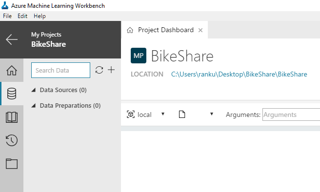

2. Add a data source. Select the **+** icon and then select **Add Data Source**.

   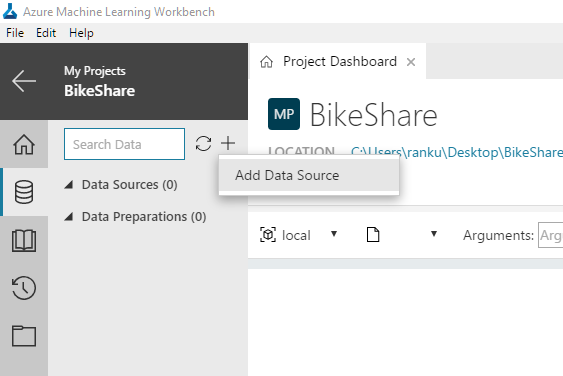

## Add weather data

1. **Data Store**: Select the data store that contains the data. Since you are using files, select **File(s)/Directory**. Select **Next** to continue.

   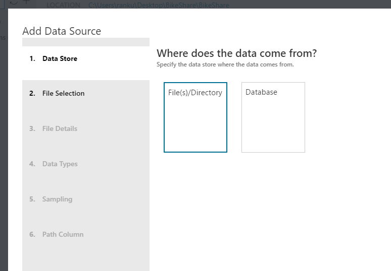

2. **File Selection**: Add the weather data. Browse and select the `BostonWeather.csv` file that you downloaded earlier. Click **Next**.

   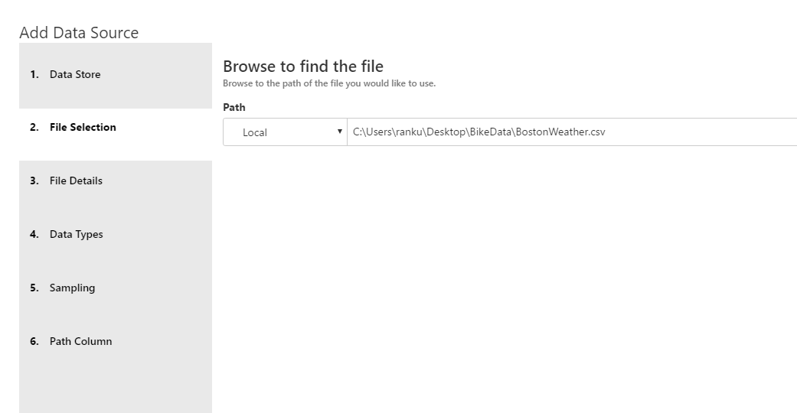

3. **File Details**: Verify the file schema that is detected. Azure Machine Learning Workbench analyzes the data in the file and infers the schema to use.

   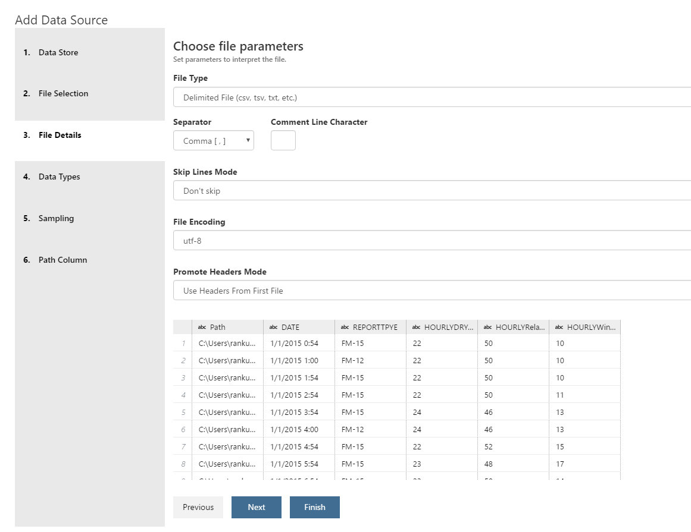

   > [!IMPORTANT]
   > The Workbench may not detect the correct schema in some cases. You should always verify that the parameters are correct for your data set. For the weather data, verify that they are set to the following values:
   >
   > * __File Type__: Delimited File (csv, tsv, txt, etc.)
   > * __Separator__: Comma [,]
   > * __Comment Line Character__: No value is set.
   > * __Skip Lines Mode__: Don't skip
   > * __File Encoding__: utf-8
   > * __Promote Headers Mode__: Use Headers From First File

   The preview of the data should display the following columns:
   * **Path**
   * **DATE**
   * **REPORTTYPE**
   * **HOURLYDRYBULBTEMPF**
   * **HOURLYRelativeHumidity**
   * **HOURLYWindSpeed**

   To continue, select **Next**.

4. **Data Types**: Review the data types that are detected automatically. Azure Machine Learning Workbench analyzes the data in the file and infers the data types to use.

   For this data, change the `DATA TYPE` of all columns to `String`.

   > [!NOTE]
   > `String` is used to highlight the capabilities of the Workbench later in this tutorial. 

   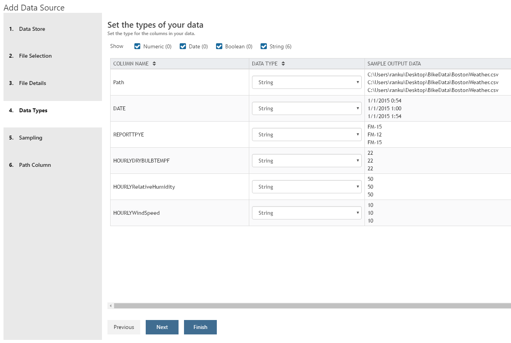

   To continue, select __Next__. 

5. **Sampling**: To create a sampling scheme, select the **+ New** button. Select the new __Top 10000__ row that is added, and then select __Edit__. Set __Sample Strategy__ to **Full File**, and then select **Apply**.

   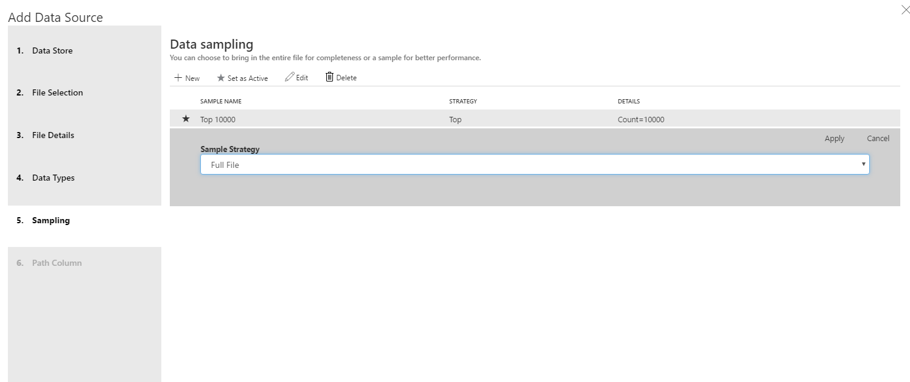

   To use the __Full File__ strategy, select the __Full File__ entry and then select __Set as Active__. A star appears next to __Full File__ to indicate that it is the active strategy.

   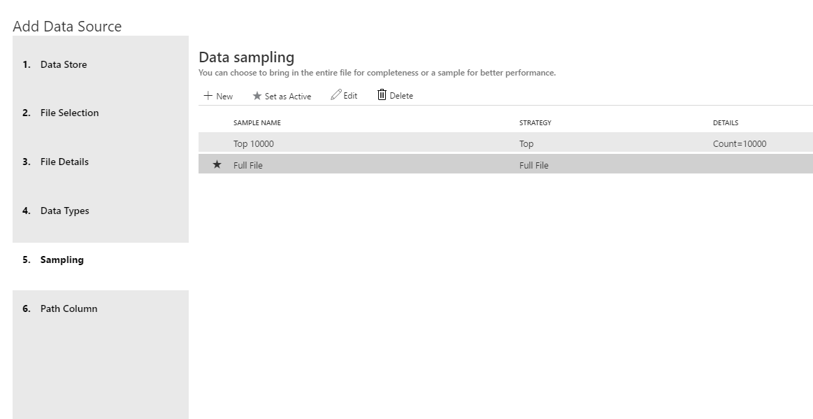

   To continue, select **Next**.

6. **Path Column**: The __Path Column__ section allows you to include the full file path as a column in the imported data. Select __Do Not Include Path Column__.

   > [!TIP]
   > Including the path as a column is useful if you are importing a folder of many files with different file names. It is also useful if the file names contain information that you want to extract later.

   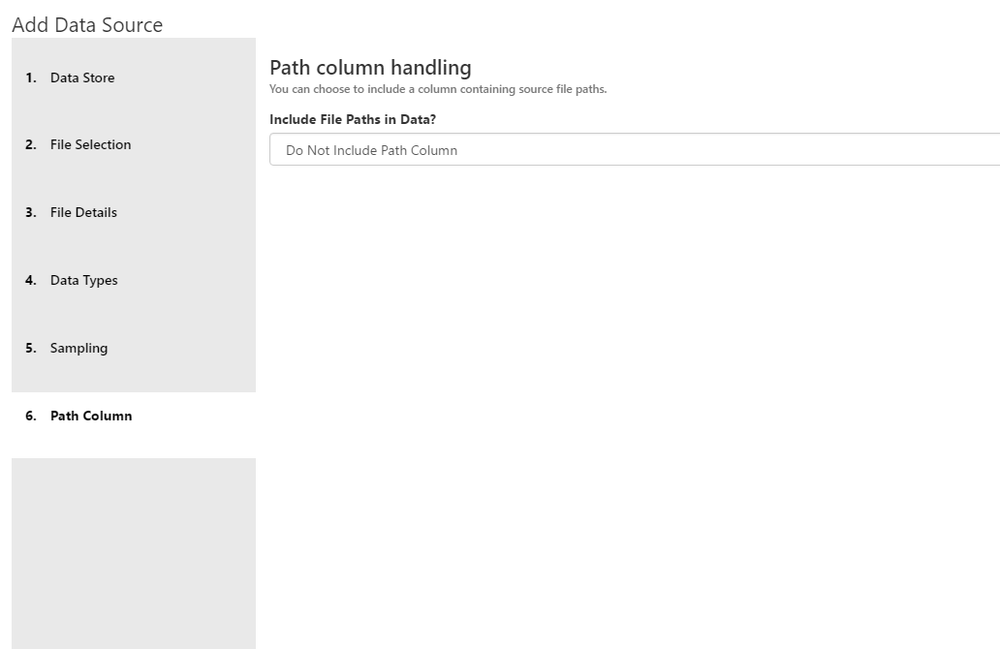

7. **Finish**: To finish creating the data source, select the **Finish** button.

    A new data source tab named __BostonWeather__ opens. A sample of the data is displayed in a grid view. The sample is based on the active sampling scheme specified earlier.

    Notice the **Steps** pane on the right side of the screen displays the individual actions taken while creating this data source.

   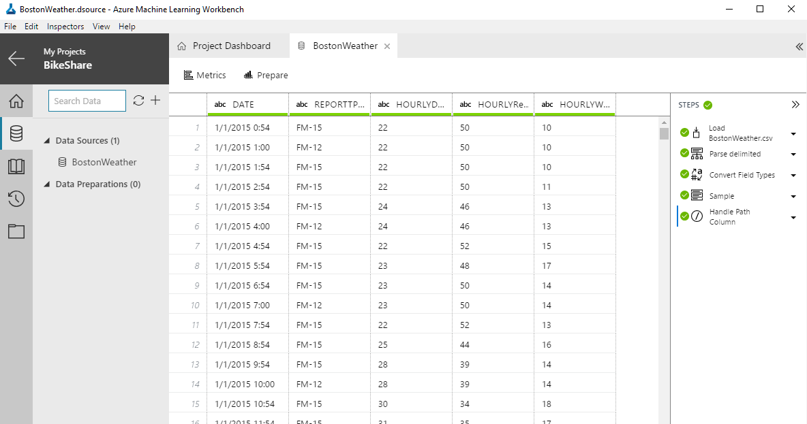

### View data source metrics

Select the __Metrics__ button at the top left of the tab's grid view. This view displays the distribution and other aggregated statistics of the sampled data.

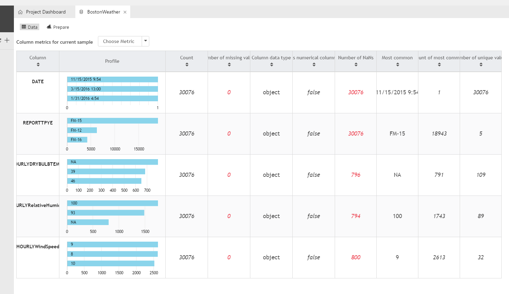

> [!NOTE]
> To configure the visibility of the statistics, use the **Choose Metric** dropdown. Check and uncheck metrics there to change the grid view.

To return the __Data View__, select __Data__ from the upper left of the page.

## Add Data Source to Data Preparation package

1. Select __Prepare__ to begin preparing the data. 

2. When prompted, enter a name for the Data Preparation package, such as `BikeShare Data Prep`. 

3. Select __OK__ to continue.

   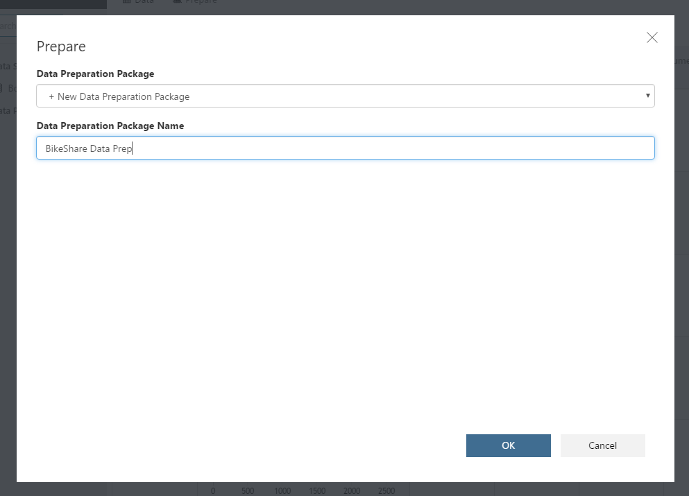

4. A new package named **BikeShare Data Prep** appears  under __Data Preparation__ section of the __Data__ tab. 

   To display the package, select this entry. 

5. Select the **>>** button to expand to display the __Dataflows__ contained in the package. In this example, __BostonWeather__ is the only dataflow.

   > [!IMPORTANT]
   > A package can contain multiple Dataflows.

   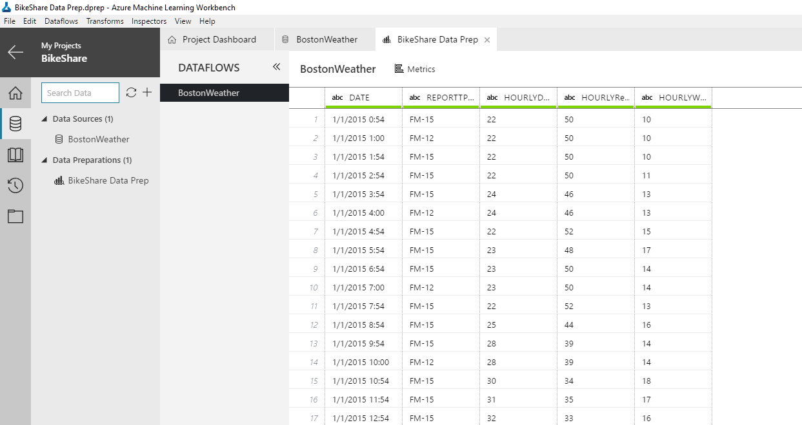

## Filter data by value
1. To filter data, right-click on a cell with a certain value and select __Filter__, and then the type of filter.

2. For this tutorial, select a cell that contains the value `FM-15` and then set the filter to a filter of **Equals**.  Now the data is filtered to only returns rows where the __REPORTTYPE__ is `FM-15`.

   

   > [!NOTE]
   > FM-15 is a type of Meteorological Terminal Aviation Routine Weather Report (METAR). The FM-15 reports are empirically observed to be the most complete, with listtle missing data.

## Remove a column

You no longer need the __REPORTTYPE__ column. Right-click on the column header and select **Remove Column**.

   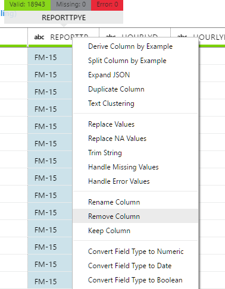

## Change datatypes and remove errors
1. Pressing __Ctrl__ while selecting column headers allows you to select multiple columns at once. Use this to select the following column headers:
   * **HOURLYDRYBULBTEMPF**
   * **HOURLYRelativeHumidity**
   * **HOURLYWindSpeed**

2. **Right-click** one of the selected column headers and select **Convert Field Type to Numeric**. This converts the data type for the columns to numeric.

   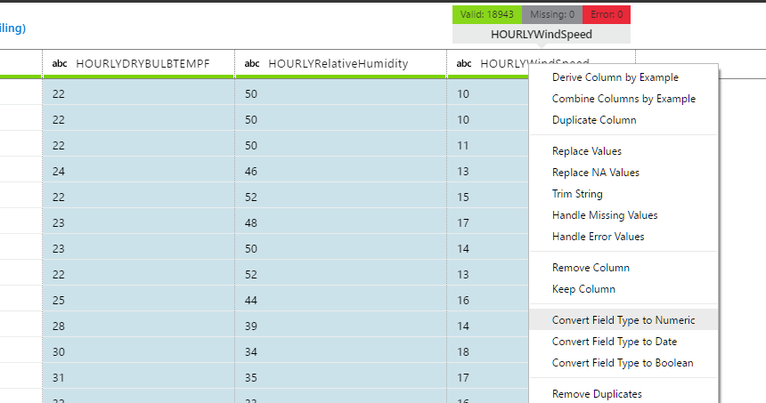

3. Filter out the error values. Some columns have data type conversion problems. This problem is indicated by the red color in the __Data Quality Bar__ for the column.

   To remove the rows that have errors, right-click on the **HOURLYDRYBULBTEMPF** column heading. Select **Filter Column**. Use the default **I Want To** as **Keep Rows**. Change the **Conditions** drop down to select **is not error**. Select **OK** to apply the filter.

4. To eliminate the remaining error rows in the other columns, repeat this filter process for **HOURLYRelativeHumidity** and **HOURLYWindSpeed** columns.

## Use _By example_ transformations

To use the data in a prediction for two-hour time blocks, you must compute the average weather conditions for two-hour periods. To do this, you can use following actions:

* Split the **DATE** column into separate **Date** and **Time** columns. See the next section for the detailed steps.

* Derive an **Hour_Range** column from the **Time** column. See the following section for the detailed steps.

* Derive a **Date\_Hour\_Range** column from the **DATE** and **Hour_Range** columns. See the following section for the detailed steps.

### Split Column by Example

1. Split the **DATE** column into separate date and time columns. Right-click on the **DATE** column header and select **Split Column by Example**.

   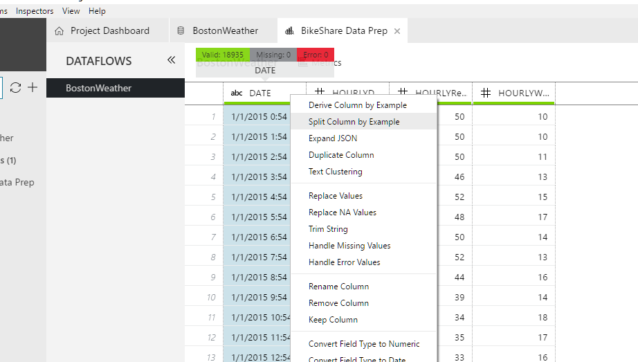

2. Azure Machine Learning Workbench automatically identifies a meaningful delimiter and creates two columns by splitting the data into date and time values. 

3. Select __OK__ to accept the split operation results.

   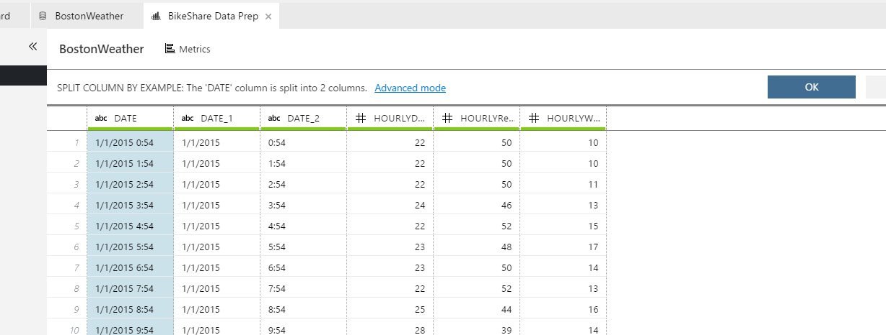

### Derive Column by Example

1. To derive a two-hour range, right-click the __DATE\_2__ column header and select **Derive Column by Example**.

   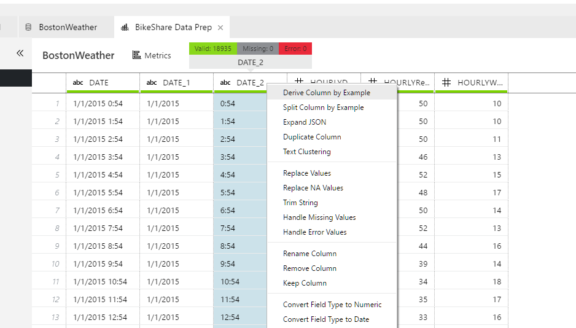

   A new empty column is added with null values.

2. Click in the first empty cell in the new column. Provide an example of the time range desired by typing `12AM-2AM` in the new column and then press enter.

   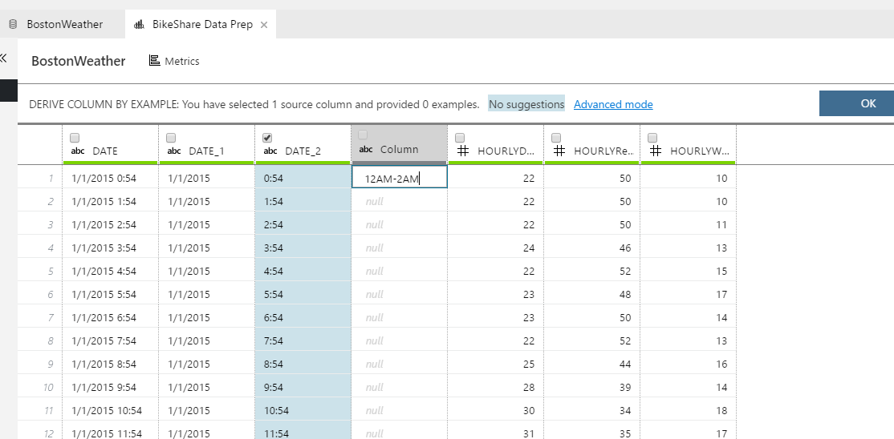

   > [!NOTE]
   > Azure ML Workbench synthesizes a program based on the examples provided by you and applies the same program on remaining rows. All other rows are automatically populated based on the example you provided. Workbench also analyzes your data and tries to identify edge cases. 

3. The text **Analyzing Data** above the grid indicates that Workbench is trying to detect edge cases. When done, the status changes to **Review next suggested row** or **No suggestions**. In this example, **Review next suggested row** is returned.

4. To review the suggested changes, select **Review next suggested row**. The cell that you should review and correct (if needed) is highlighted on the display.

   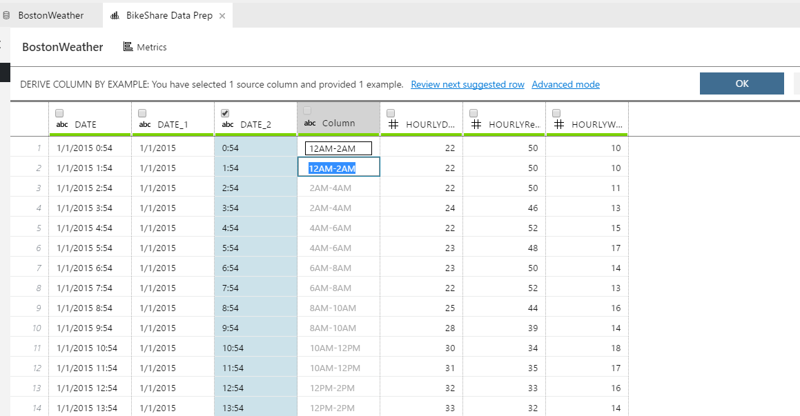

    Select __OK__ to accept the transformation.
 
5. You are returned to the grid view of data for __BostonWeather__. The grid now contains the three columns added previously.

   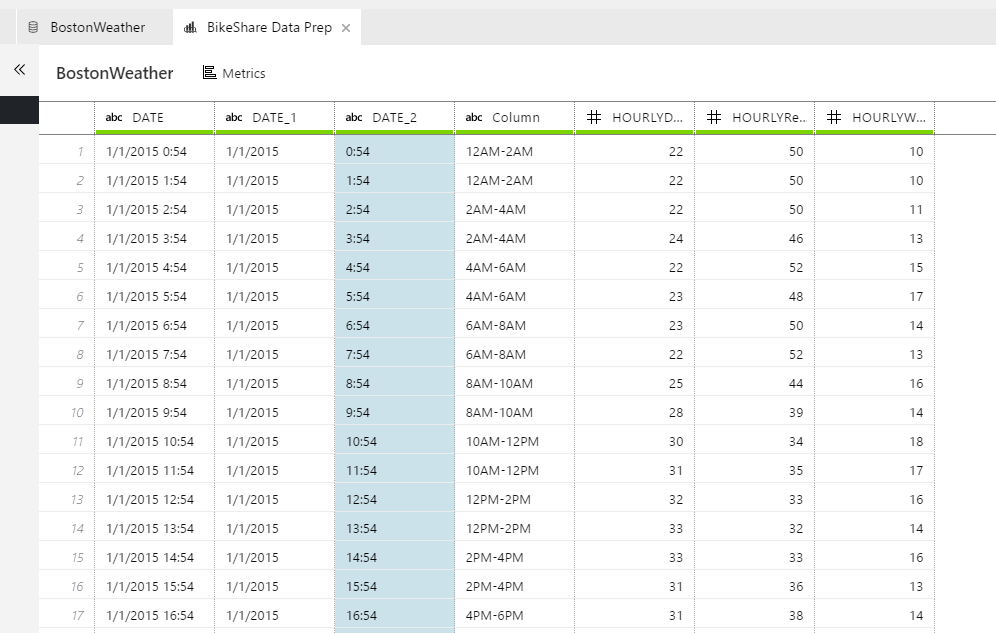

   > [!TIP]
   >  All the changes you have made are preserved on the **Steps** pane. Go to the step that you created in the **Steps** pane, click on the down arrow and select **Edit**. The advanced window for **Derive Column by Example** is displayed. All your examples are preserved here. You can also add examples manually by double-clicking on a row in the grid below. Select **Cancel** to return to the main grid without applying changes. You can also access this view by selecting **Advanced Mode** while performing a **Derive Column by Example** transform.

6. To rename the column, double-click the column header and type **Hour Range**. Press **Enter** to save the change.

   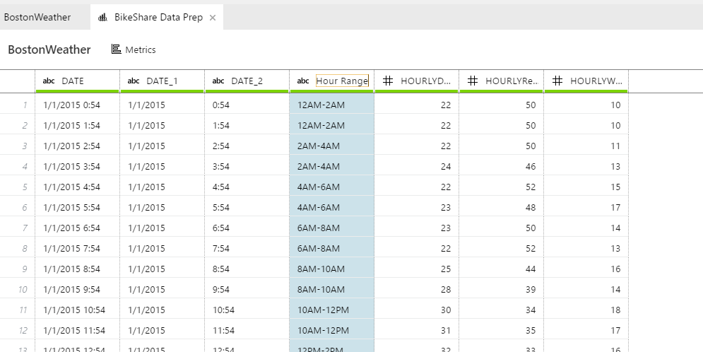

7. To derive the date and hour range, multi-select the **Date\_1** and **Hour Range** columns, right-click, and then select **Derive column by example**.

   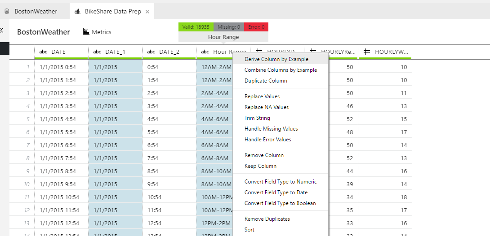

   Type `Jan 01, 2015 12AM-2AM` as the example against the first row and press **Enter**.

   The Workbench determines the transformation based on the example you provide. In this example, the result is that the date is format is changed and concatenated with the two-hour window.

   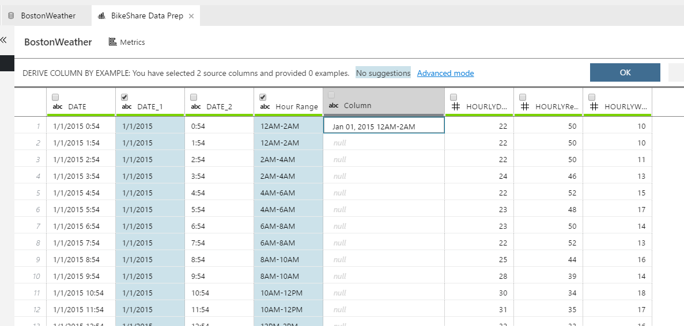

8. Wait for the status to change from **Analyzing Data** to **Review next suggested row**. This may take several seconds. Select the status link to navigate to the suggested row. 

   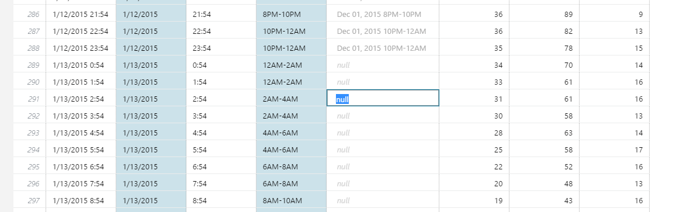

   The row has a null value because the source date value could be for either dd/mm/yyyy or mm/dd/yyyy. Type the correct value of `Jan 13, 2015 2AM-4AM` and press **Enter**. The workbench uses the two examples to improve the derivation for the remaining rows.

   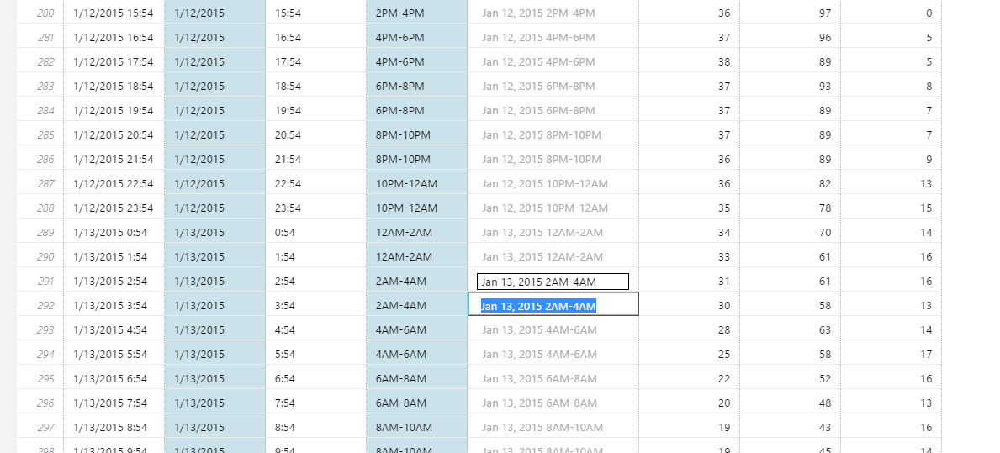

9. Select **OK** to accept the transform.

   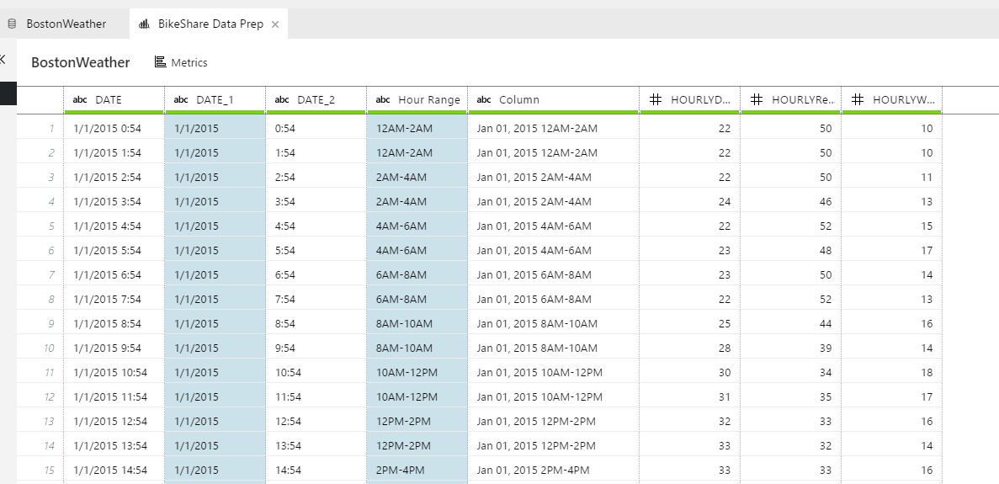

   > [!TIP]
   > You can use the advanced mode of **Derive column by example** for this step by clicking the down arrow in the **Steps** pane. In the data grid, there are checkboxes next to the column names **DATE\_1** and **Hour Range** columns. Uncheck the checkbox next to the **Hour Range** column to see how this changes the output. In the absence of the **Hour Range** column as input, **12AM-2AM** is treated as a constant and is appended to the derived values. Select **Cancel** to return to the main grid without applying your changes.

10. To rename the column, double-click the header. Change the name to **Date Hour Range** and then press **Enter**.

11. Multi-select the **DATE**, **DATE\_1**, **DATE\_2**, and **Hour Range** columns. Right-click, and then select **Remove column**.

## Summarize data (Mean)

The next step is to summarize the weather conditions by taking the mean of the values, grouped by hour range.

1. Select the **Date Hour Range** column, and then select **Summarize** from the **Transforms** menu.

    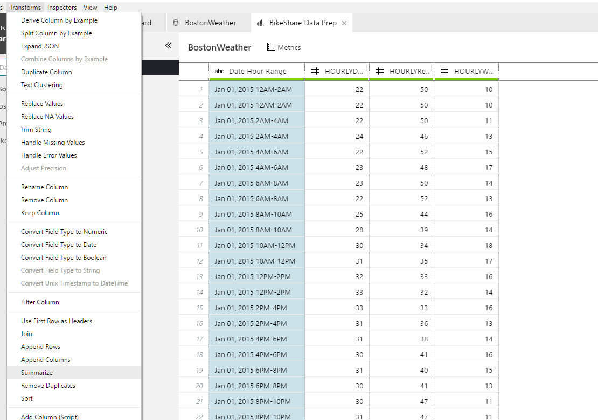

2. To summarize the data, you drag columns from the grid at the bottom of the page to the left and right panes at the top. The left pane contains the text **Drag columns here to group data**. The right pane contains the text **Drag columns here to summarize data**. 

    Drag the **Date Hour Range** column from the grid at the bottom to the left pane. Drag **HOURLYDRYBULBTEMPF**, **HOURLYRelativeHumidity**, and **HOURLYWindSpeed** to the right pane. 

    In the right pane, select **Mean** as the **Aggregate** measure for each column. Click **OK** to complete the summarization.

   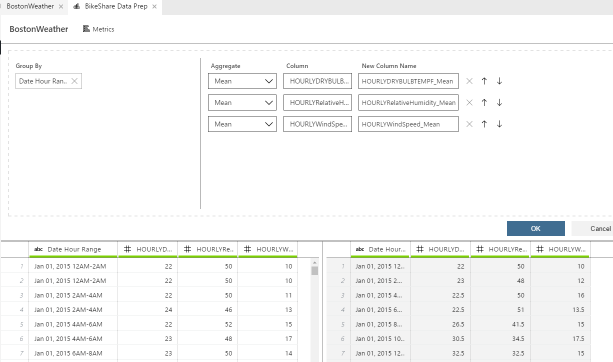

## Transform Dataflow using script

Changing the data in the numeric columns to a range of 0-1 allows some models to converge quickly. Currently there is no built-in transformation to generically do this transformation, but a Python script can be used to perform this operation.

1. From the **Transform** menu, select **Transform Dataflow**.

2. Enter the following code in the textbox that appears. If you have used the column names, the code should work without modification. You are writing a simple min-max normalization logic in Python.

    > [!WARNING]
    > The script expects the column names used previously in this tutorial. If you have different column names, you must change the names in the script.

   ```python
   maxVal = max(df["HOURLYDRYBULBTEMPF_Mean"])
   maxVal = max(df["HOURLYDRYBULBTEMPF_Mean"])
   minVal = min(df["HOURLYDRYBULBTEMPF_Mean"])
   df["HOURLYDRYBULBTEMPF_Mean"] = (df["HOURLYDRYBULBTEMPF_Mean"]-minVal)/(maxVal-minVal)
   df.rename(columns={"HOURLYDRYBULBTEMPF_Mean":"N_DryBulbTemp"},inplace=True)

   maxVal = max(df["HOURLYRelativeHumidity_Mean"])
   minVal = min(df["HOURLYRelativeHumidity_Mean"])
   df["HOURLYRelativeHumidity_Mean"] = (df["HOURLYRelativeHumidity_Mean"]-minVal)/(maxVal-minVal)
   df.rename(columns={"HOURLYRelativeHumidity_Mean":"N_RelativeHumidity"},inplace=True)

   maxVal = max(df["HOURLYWindSpeed_Mean"])
   minVal = min(df["HOURLYWindSpeed_Mean"])
   df["HOURLYWindSpeed_Mean"] = (df["HOURLYWindSpeed_Mean"]-minVal)/(maxVal-minVal)
   df.rename(columns={"HOURLYWindSpeed_Mean":"N_WindSpeed"},inplace=True)

   df
   ```

    > [!TIP]
    > The Python script must return `df` at the end. This value is used to populate the grid.
    
    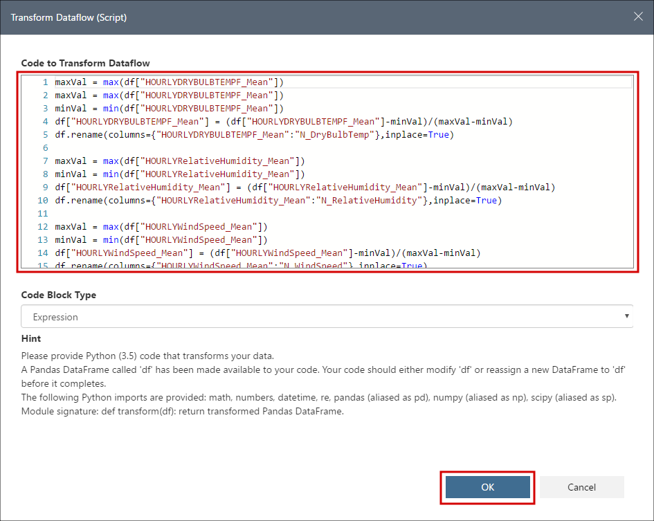

3. Select __OK__ to use the script. The numeric columns in the grid now contain values in the range of 0-1.

    

You have finished preparing the weather data. Next, prepare the trip data.

## Load trip data

1. To import the  `201701-hubway-tripdata.csv` file, use the steps in the [Create a new Data Source](#newdatasource) section. Use the following options during the import process:

    * __Sampling scheme__: **Full File** sampling scheme, make the sample active, and 
    * __Data Type__: Accept the defaults.

2. After importing the data, select the  __Prepare__ button to begin preparing the data. Select the existing **BikeShare Data Prep.dprep** package, and then select __OK__.

    This process adds a **Dataflow** to the existing **Data Preparation** file rather than creating a new one.

    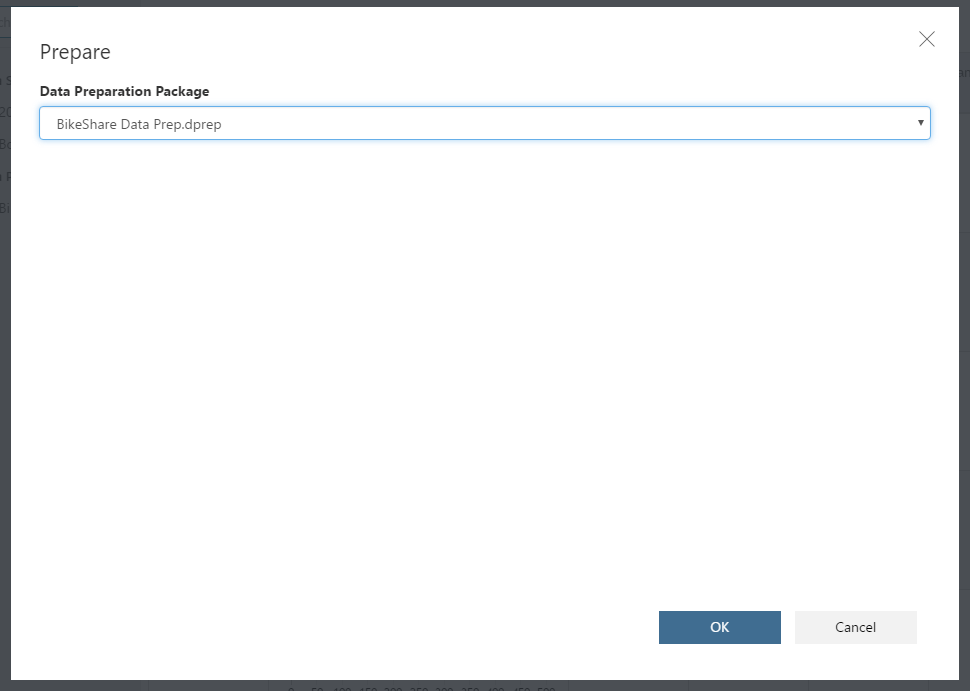

3. Once the grid has loaded, expand __DATAFLOWS__. There are now two dataflows: **BostonWeather** and **201701-hubway-tripdata**. Select the **201701-hubway-tripdata** entry.

    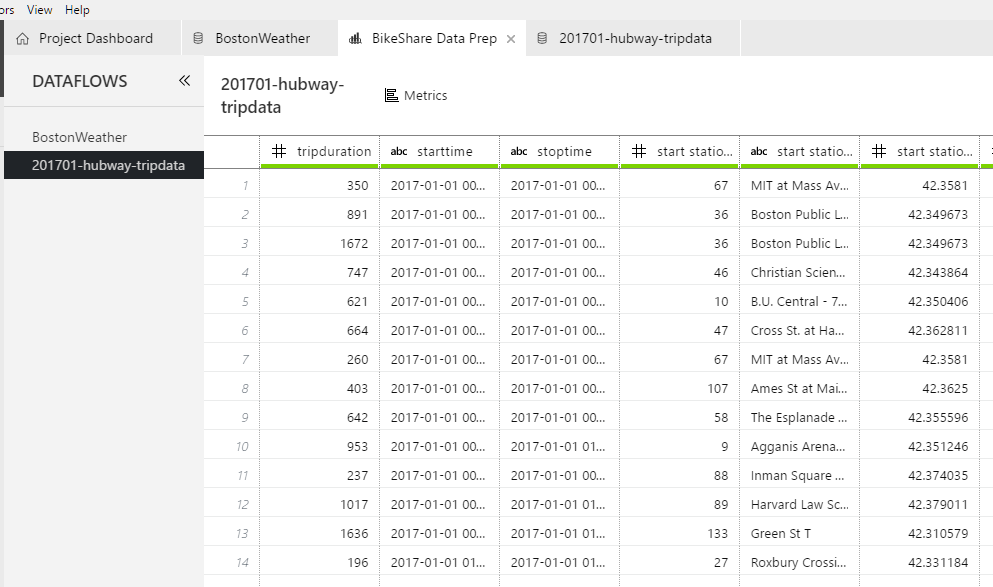

## Use Map Inspector

For data preparation, there are a number of useful visualizations called **Inspectors** for String, Numeric, and Geographical data that help in understanding the data better and in identifying outliers. Use the following steps to use the Map inspector:

1. Multi-select the **start station latitude** and **start station longitude** columns. Right-click one of the columns and then select **Map**.

    > [!TIP]
    > To enable multi-select, hold down __Ctrl__ and select the header for each column.

    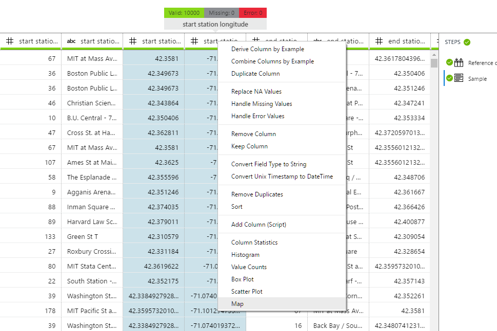

2. To maximize the map visualization, select the **Maximize** icon. To fit the map to the window, select the **E** icon on the left-top side of the visualization.

    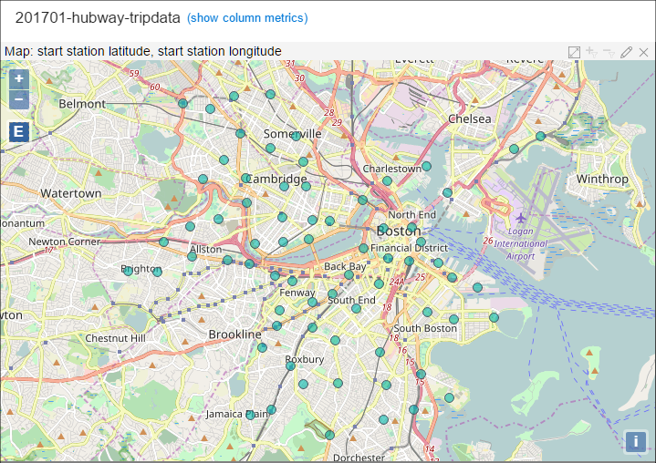

3. Click on the **Minimize** button to return to the grid view.

## Use Column Statistics Inspector

To use the column statistics inspector, right-click on the __tripduration__ column and select __Column Statistics__.

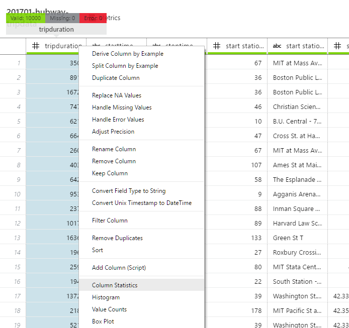

This process adds a new visualization titled __tripduration Statistics__ in the __INSPECTORS__ pane.

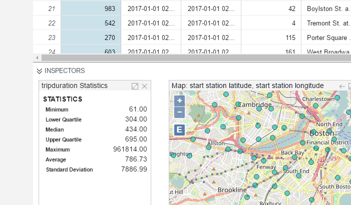

> [!IMPORTANT]
> The maximum value of the trip duration is **961,814 minutes**, which is about two years. It seems there are some outliers in the dataset.

## Use Histogram Inspector

To attempt to identify the outliers, right-click the __tripduration__ column and select __Histogram__.

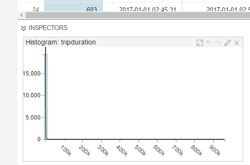

The histogram is not helpful, as the outliers are skewing the graph.

## Add column using script

1. Right-click on the **tripduration** column and select **Add Column (Script)**.

    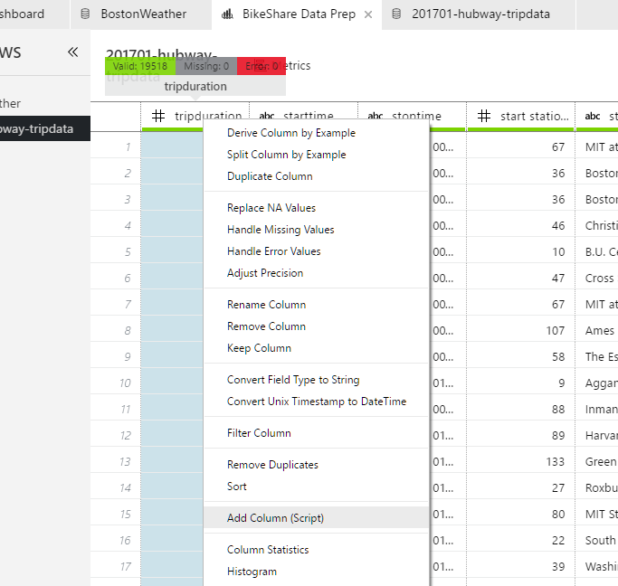

2. In the __Add Column (Script)__ dialog, use the following values:

    * __New Column Name__: logtripduration
    * __Insert this New Column After__: tripduration
    * __New Column Code__: `math.log(row.tripduration)`
    * __Code Block Type__: Expression

   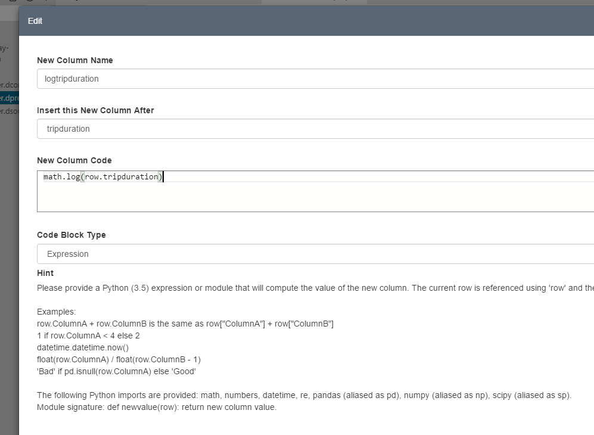

3. Select __OK__ to add the **logtripduration** column.

4. Right-click on the column and select **Histogram**.

    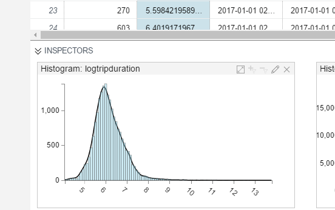

  Visually, this histogram seems like a Normal Distribution with an abnormal tail.

## Use Advanced Filter

Using a filter on the data updates the inspectors with the new distribution. Right-click on the **logtripduration** column and select **Filter Column**. In the __Edit__ dialog, use the following values:

* __Filter this Number Column__: logtripduration
* __I Want To__: Keep Rows
* __When__: Any of the Conditions below are True (logical OR)
* __If this Column__: less than
* __The Value__: 9

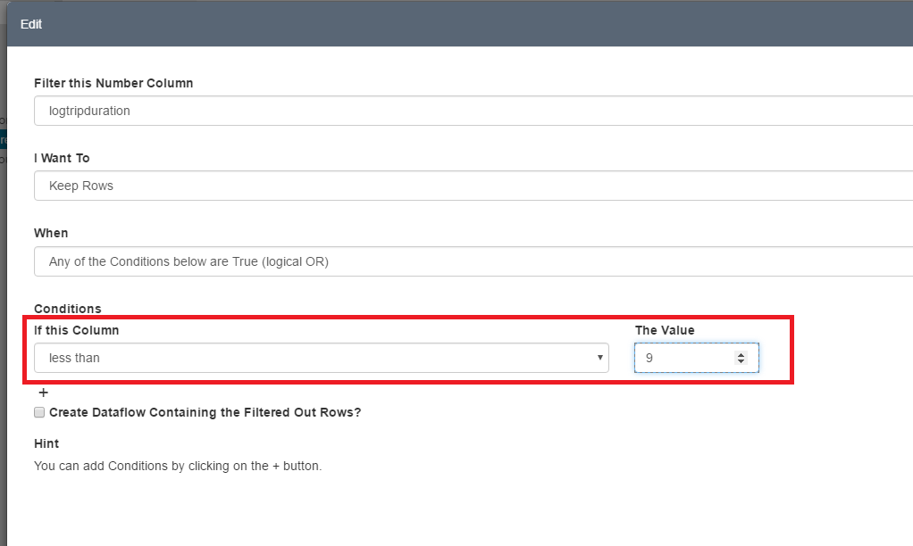

Select __OK__ to apply the filter.

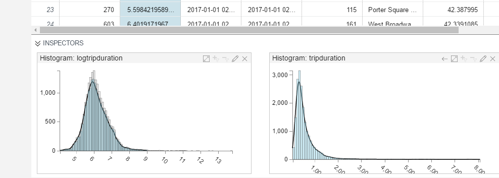

### The Halo Effect

1. Maximize the **logtripduration** histogram. There is a blue histogram overlaid on a gray histogram. This display is called the **Halo Effect**:

    * The **gray histogram** represents the distribution before the operation (in this case, the filtering operation).
    * The **blue histogram** represents the histogram after the operation. 

   The halo effect helps with visualizing the effect of an operation on the data.

   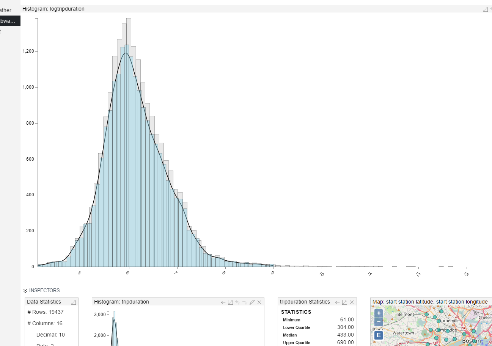

2. To remove the halo, select __Edit__ and uncheck __Show halo__.

    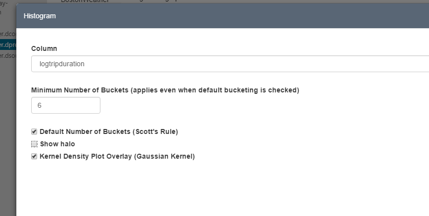

3. Select **OK** to disable the halo effect, and then minimize the histogram.

### Remove columns

In the trip data, each row represents a bike pickup event. For this tutorial, you only need the **starttime** and **start station** columns. Remove the other columns by multi-selecting these two columns, right-click the column header, and then select **Keep Column**. Other columns are removed.

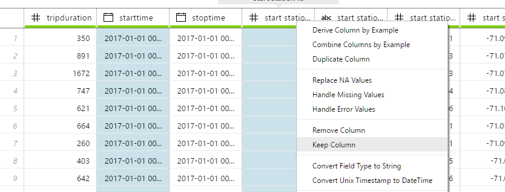

### Summarize data (Count)

To summarize bike demand for a 2-hour period, use derived columns.

1. Right-click on the **starttime** column and select **Derive Column by Example**

    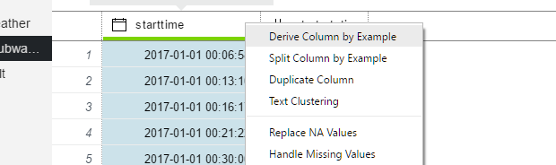

2. For the example, enter a value of `Jan 01, 2017 12AM-2AM` for the first row.

    > [!IMPORTANT]
    > In the previous example of deriving columns, you used multiple steps to derive a column that contained the date and time period. In this example, you can see that this operation can be performed as a single step by providing an example of the final output.

    > [!NOTE]
    > You can give an example against any of the rows. For this example, the value of `Jan 01, 2017 12AM-2AM` is valid for the first row of data.

    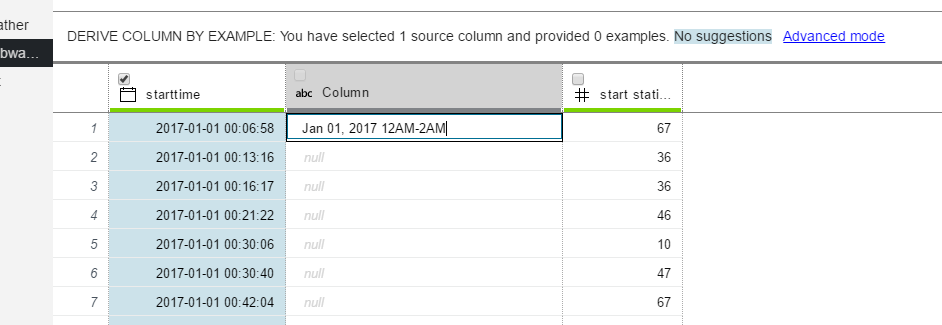

3. Wait until the application computes the values against all the rows. It may take several seconds. After analyzing is complete, use the __Review next suggested row__ link to review data.

   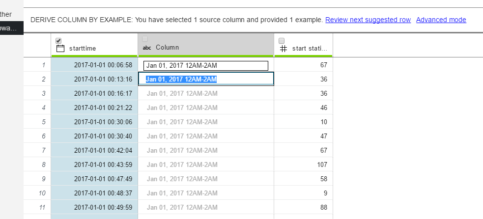

    Ensure that the computed values are correct. If not, update the value with the expected value and press enter. Then wait for the analysis to complete. Complete the **Review next suggested row** process until you see **No suggestions**. Once you see **No suggestions**, the application has looked at the edge cases and is satisfied with the synthesized program. It is a best practice to perform a visual inspection of the transformed data before accepting the transformation. 

4. Select **OK** to accept the transform. Rename the newly created column to **Date Hour Range**.

    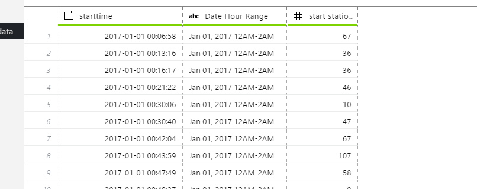

5. Right-click on the **starttime** column header and select **Remove column**.

6. To summarize the data, select __Summarize__ from the __Transform__ menu. To create the transformation, perform the following actions:

    * Drag __Date Hour Range__ and __start station id__ to the left (group by) pane.
    * Drag __start station id__ to the right (summarize data) pane.

   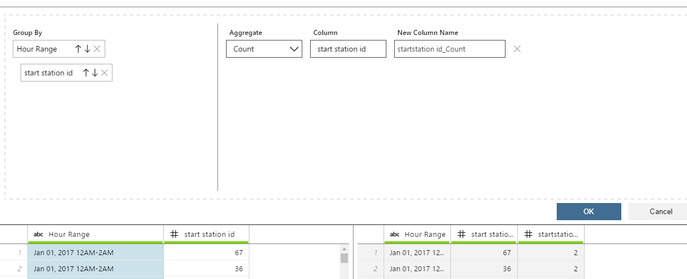

7. Select **OK** to accept the summary result.

## Join Dataflows

To join the weather data with the trip data, use the following steps:

1. Select __Join__ from the __Transforms__ menu.

2. __Tables__: Select **BostonWeather** as the left dataflow and **201701-hubway-tripdata** as the right dataflow. To continue, select **Next**.

    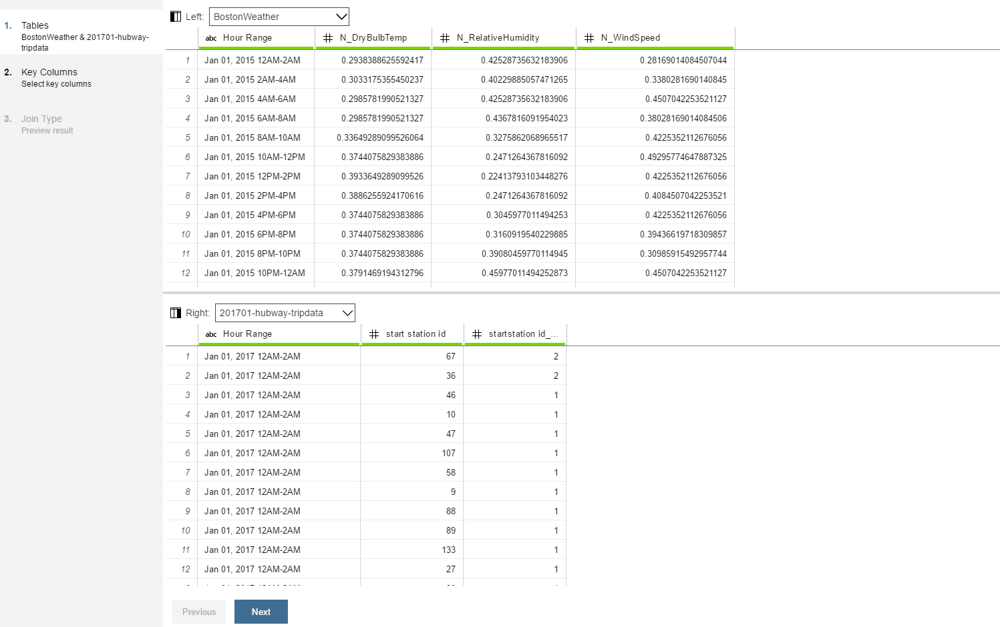

3. __Key Columns__: Select the **Date Hour Range** column in both the tables, and then select __Next__.

    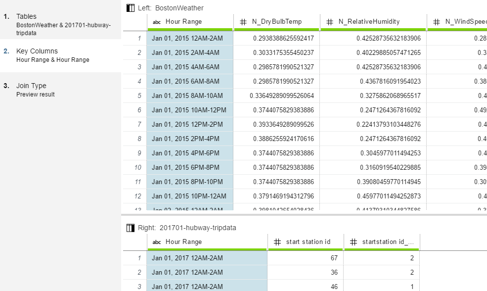

4. __Join Type__: Select  __Matching rows__ as the join type, and then select __Finish__.

    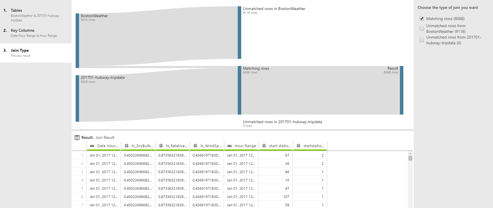

    This process creates a new dataflow named __Join Result__.

## Create additional features

1. To create a column that contains the day of the week, right-click on the **Date Hour Range** column and select **Derive column by Example**. Use a value of __Sun__ for a date that occurred on a Sunday. For example, **Jan 01, 2017 12AM-2AM**. Press **Enter** and then select **OK**. Rename this column to __Weekday__.

    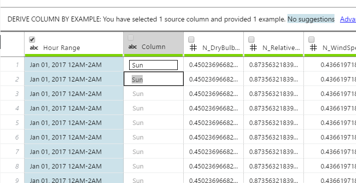

2. To create a column containing the time period for a row, right-click on the **Date Hour Range** column and select **Derive column by example**. Use a value of **12AM-2AM** for the row containing **Jan 01, 2017 12AM-2AM**. Press **Enter** and then select **OK**. Rename this column to **Period**.

    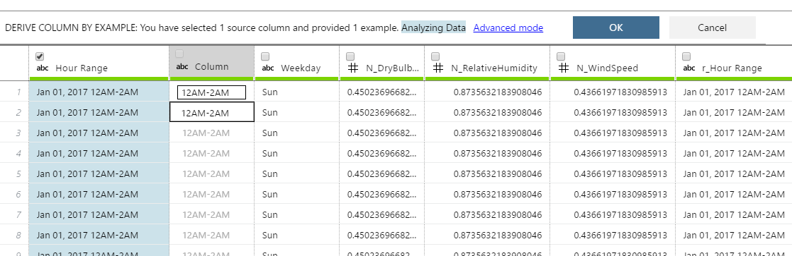

3. To remove the **Date Hour Range** and **rDate Hour Range** columns, press **Ctrl** and select each column header. Right-click and then select **Remove Column**.

## Read data from Python

You can run a data preparation package from Python or PySpark and retrieve the result as a **Data Frame**.

To generate an example Python script, right-click on __BikeShare Data Prep__ and select __Generate Data Access Code File__. The example Python file is created in your **Project Folder**, and is also loaded in a tab within the workbench. The following Python script is an example of the code that is generated:

```python
# Use the Azure Machine Learning data preparation package
from azureml.dataprep import package

# Use the Azure Machine Learning data collector to log various metrics
from azureml.logging import get_azureml_logger
logger = get_azureml_logger()

# This call will load the referenced package and return a DataFrame.
# If run in a PySpark environment, this call returns a
# Spark DataFrame. If not, it will return a Pandas DataFrame.
df = package.run('BikeShare Data Prep.dprep', dataflow_idx=0)

# Remove this line and add code that uses the DataFrame
df.head(10)
```

For this tutorial, the name of the file is `BikeShare Data Prep.py`. This file is used later in the tutorial.

## Save test data as a CSV file

To save the **Join Result** Dataflow to a .CSV file, you must change the `BikeShare Data Prep.py` script. Update the Python script using the following code:

```python
from azureml.dataprep.package import run

# dataflow_idx=2 sets the dataflow to the 3rd dataflow (the index starts at 0), the Join Result.
df = run('BikeShare Data Prep.dprep', dataflow_idx=2)

# Example file path: C:\\Users\\Jayaram\\BikeDataOut\\BikeShareTest.csv
df.to_csv('Your Test Data File Path here')
```

Select **Run** from the top of the screen. The script is submitted as a **Job** on the local machine. Once the job status changes to __Completed__, the file has been written to the specified location.

## Substitute Data Sources

In the previous steps, you used the `201701-hubway-tripdata.csv` and `BostonWeather.csv` data sources to prepare the Test data. To use the package with the other trip data files, use the following steps:

1. Create a new **Data Source** using the steps given earlier, with the following changes to the process:

    * __File Selection__: When selecting a file, multi-select the six remaining trip tripdata .CSV files.

        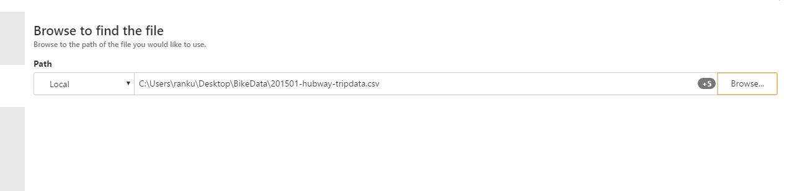

        > [!NOTE]
        > The __+5__ entry indicates that there are five additional files beyond the one that is listed.

    * __File Details__: Set __Promote Headers Mode__ to **All Files Have The Same Headers**. This value indicates that each of the files contains the same header.

        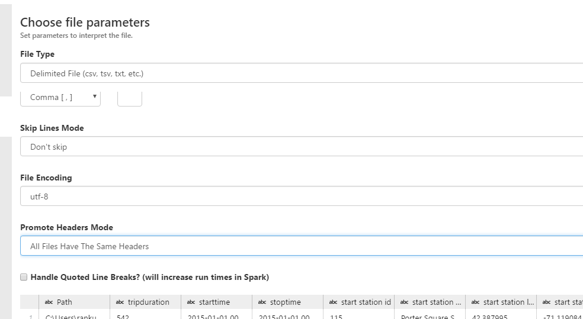 

   Save the name of this data source, as it is used in later steps.

2. Select the folder icon to view the files in your project. Expand the __aml\_config__ directory, and then select the `local.runconfig` file.

    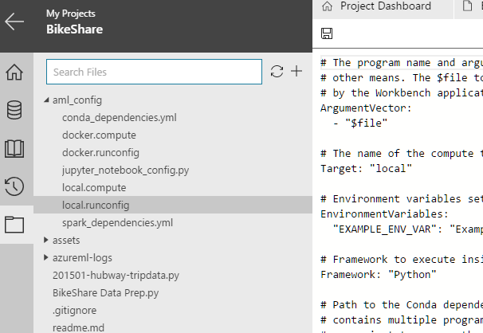 

3. Add the following lines at the end of the `local.runconfig` file and then select the disk icon to save the file.

    ```yaml
    DataSourceSubstitutions:
      201701-hubway-tripdata.dsource: 201501-hubway-tripdata.dsource
    ```

    This change replaces the original data source with the one that contains the six trip data files.

## Save training data as a CSV file

Navigate to the Python file `BikeShare Data Prep.py` that you edited earlier and provide a different File Path to save the Training Data.

```python
from azureml.dataprep.package import run
# dataflow_idx=2 sets the dataflow to the 3rd dataflow (the index starts at 0), the Join Result.
df = run('BikeShare Data Prep.dprep', dataflow_idx=2)

# Example file path: C:\\Users\\Jayaram\\BikeDataOut\\BikeShareTrain.csv
df.to_csv('Your Training Data File Path here')
```

To submit a new job, use the **Run** icon at the top of the page. A **Job** is submitted with the new configuration. The output of this job is the Training Data. This data is created using the same Data Preparation steps that you created earlier. It may take few minutes to complete the job.

## Summary
You have completed the Bike-share Data Preparation tutorial. In this tutorial, you used Azure Machine Learning services (preview) to learn how to:
> [!div class="checklist"]
> * Prepare data interactively with the Azure Machine Learning Data Preparation tool
> * Import, transform, and create a test dataset
> * Generate a Data Preparation package
> * Run the Data Preparation Package using Python
> * Generate a training dataset by reusing the Data Preparation package for additional input files

## Next Steps:
Follow the three part tutorial based on the Iris dataset to better understand Azure Machine Learning services (preview):
- [Part 1: Prepare data](tutorial-classifying-iris-part-1.md)
- [Part 2: Model building](tutorial-classifying-iris-part-2.md)
- [Part 3: Model deployment](tutorial-classifying-iris-part-3.md)
