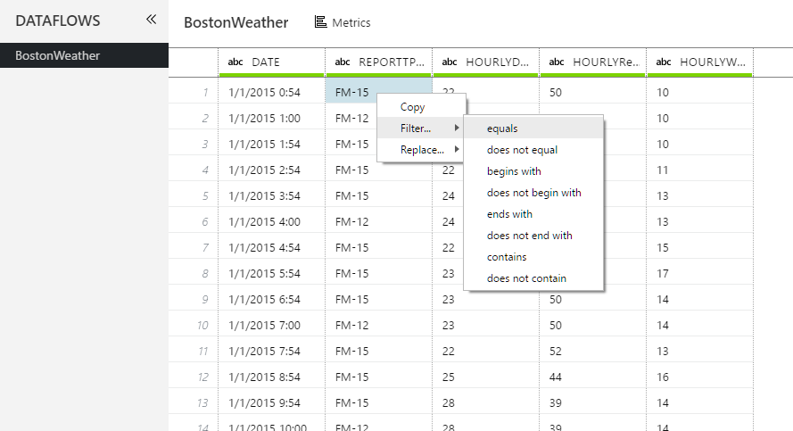
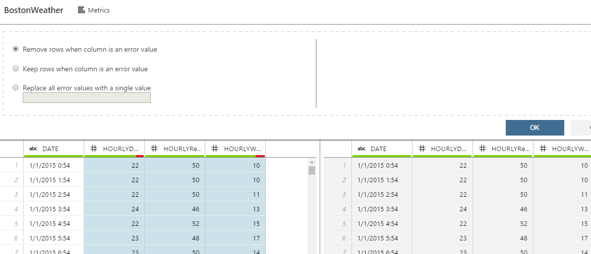
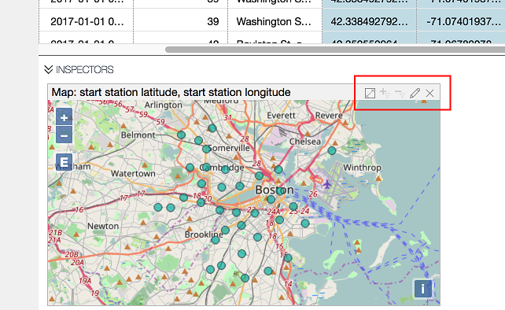
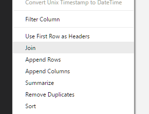

# Bike-Share Data Preparation Tutorial

### Introduction
In this tutorial, we are going to use the [Boston Hubway dataset](https://s3.amazonaws.com/hubway-data/index.html) together with Boston weather data obtained from [NOAA](http://www.noaa.gov/) to prepare data for building a prediction model. The purpose of the prediction model would be to predict the number of bikes picked up by users from a bike station during a 2-hour window.

The Hubway data is organized in separate file for each month. The data files include the following fields, each row representing a bike trip:

* Trip Duration (in seconds)
* Start Time and Date
* Stop Time and Date
* Start Station Name & ID
* End Station Name & ID
* Bike ID
* User Type (Casual = 24-Hour or 72-Hour Pass user; Member = Annual or Monthly Member)
* ZIP Code (if user is a member)
* Gender (self-reported by member)

The Boston weather file contains the following weather-related fields reported on hourly basis:

* DATE
* REPORTTPYE
* HOURLYDRYBULBTEMPF
* HOURLYRelativeHumidity
* HOURLYWindSpeed

We will use Azure ML Workbench Data Preparation tool to prepare the Training and the Test data. We will not be building a prediction model. However, you are encouraged to take the prepared data and build a prediction model using the plethora of algorithms that the Workbench supports.

### Prerequisites
1. A properly installed Azure ML Workbench. Follow the [installation guide](../Installation.md).
2. Familiarity with creating a new project in the Workbench.

### Let's Begin
Now, launch Azure ML Workbench, sign-in, and create a new blank project, name it **BikeShare**. We are well on our way. 

## Obtaining Data

We will use two sets of data files for this tutorial.

* [Boston weather data](https://azuremluxcdnprod001.blob.core.windows.net/docs/vienna/bikeshare/BostonWeather.csv). Download this file and store it locally.
* Hubway trip data from Hubway website. Download them from Hubway and unzip them in a local folder.
  - [201501-hubway-tripdata.zip](https://s3.amazonaws.com/hubway-data/201501-hubway-tripdata.zip)
  - [201504-hubway-tripdata.zip](https://s3.amazonaws.com/hubway-data/201504-hubway-tripdata.zip)
  - [201510-hubway-tripdata.zip](https://s3.amazonaws.com/hubway-data/201510-hubway-tripdata.zip)
  - [201601-hubway-tripdata.zip](https://s3.amazonaws.com/hubway-data/201601-hubway-tripdata.zip)
  - [201604-hubway-tripdata.zip](https://s3.amazonaws.com/hubway-data/201604-hubway-tripdata.zip)
  - [201610-hubway-tripdata.zip](https://s3.amazonaws.com/hubway-data/201610-hubway-tripdata.zip)
  - [201701-hubway-tripdata.zip](https://s3.amazonaws.com/hubway-data/201701-hubway-tripdata.zip)

## Data Cleaning and Featurization
First, we import the `201701-hubway-tripdata.csv` file and the `BostonWeather.csv` data files and create our test dataset. In the process, we generate a Data Preparation package consisting of a series of Data prep steps. Subsequently, we execute the same Data prep steps on a different set of input files to generate our training dataset.

#### D0. Create a new Azure ML project if you have not already done so.
Make sure you use the blank project template, and name your project *BikeShare*.

#### D1. Add the weather data from your local folder.

>CONCEPTS: Loading data into the Workbench for Data Preparation is a two-step process. First, we create a **Data Source** by specifying connection details to the source of the data. Subsequently, we initiate a **Data Flow** that references the Data Source. A Data Flow is a collection of data preparation steps. A **Data Preparation** file is a container for multiple Data Flows.

First, Navigate to the **Data View** by clicking on the **Data** tab as shown below.

<table><tr><td></td></tr></table>

Click on the **+** icon and select **Add Data Source**

<table><tr><td></td></tr></table>

Select *File(s)/Directory* as the data store, click **Next**.

<table><tr><td></td></tr></table>

Browse to the weather data file, `BostonWeather.csv`. Click **Next**.

<table><tr><td></td></tr></table>

You should see the following screen with file ingestion parameters automatically filled in. Azure ML Workbench analyzes the data in the file to automatically infer the schema. Verify that you get the parameters as shown in the screen. Click **Next**.

<table><tr><td></td></tr></table>

The next screen shows automatically inferred data types of columns and sample values from the columns. Here, user may change the data type of the columns. 

For this data file, we change everything to *Strings*. Doing so enables us to try out a few interesting capabilities of the Workbench.  

<table><tr><td></td></tr></table>

Click **Next**. You should see the **Data Sampling** page. 

<table><tr><td></td></tr></table>

Depending on the volume of your data, you may want to work with a sample of your data rather than the full data set. We provide various sampling schemes to choose from. You can maintain different samples of your data in the workbench. When you want to work with a particular sample, mark it active. 

The default sampling scheme is **Top 10000**.  Let's create a new sample based on **Full File** scheme.  

Click on the **+ New** button to create a new sample. It adds a new row with the default **Top 10000** sampling scheme. Select the newly created row and click on **Edit** icon. In the dialog that opens, select **Full File** as the Sample Strategy, and Click **Apply**.

<table><tr><td></td></tr></table>

Now we have two sample schemes for our data. We want to use the sample named *Full File* in this tutorial. So, we need to mark the *Full File* sample as active. 

Select the *Full File* row and click on the **Set as Active** button to make it the active sample. 

At the end of the sampling exercise, your screen should look like following:

<table><tr><td></td></tr></table>

Click **Next**.

The next screen gives you an option to include the full file path as a column in your imported data. This is useful if you are importing a folder of many files with different file names, or if the file names contain important information that you want to extract later. For the purpose of this tutorial, let's not include it.

<table><tr><td></td></tr></table>

Click **Finish**.

Notice that a new data source named *BostonWeather* has been added under the **Data Sources** node on the left-hand tree. A sample of the data source (based on the active sampling scheme we specified earlier, it is actually the full set) is loaded in a grid view. Also, notice the **Steps** pane on the right-hand side. It has steps corresponding to different actions we have taken so far while creating this data source. 

<table><tr><td></td></tr></table>

Click on **Metrics** button over the top of the grid view. 

It shows distribution and various aggregated statistics of the sampled data in a tabular view. You can configure the visibility of these statistics by clicking on the **Choose Metric** dropdown. 

<table><tr><td></td></tr></table>

From here, we can either go back to the *Data View* by clicking on the **Data** icon, or start preparing our data by clicking on the **Prepare** icon.

Click on the **Prepare** icon. It opens a dialog where we can specify the name of the **Data Preparation** file. Remember, a **Data Preparation** file is a container that can hold multiple **Data Flows**. In this case, we are creating a new **Data Preparation** file, and also adding the first **Data Flow** to the file at the same time.

<table><tr><td></td></tr></table>

Click **OK**.

Notice that a new **Data Preparation** file named *BikeShare Data Prep* is created under the **Data Preparations** node in the navigation tree. Also, the data is loaded in a new tab. Click on the **>>** icon next to **DATAFLOWS** to see the **Data Flows** contained within this **Data Preparation** file. At the moment, we have only one **Data Flow** by the name *BostonWeather* as part of the **Data Preparation** file. We add another **Data Flow** to the preparation file later.

<table><tr><td></td></tr></table>

Now let's start manipulating and preparing the data in this **Data Flow**.

#### D2. Remove rows where REPORTTYPE is not *FM-15*:

We are only interested in weather records where the *ReportType* is "FM-15". So, let's do a filter by the row values by right-clicking on one of the cells containing "FM-15" under the *REPORTTYPE* column and selecting **Filter --> Equals**.

<table><tr><td></td></tr></table>

>**Try this:**: you can also perform the same filter operation using an advanced window. First delete the filter block that we created now from the **Steps** pane. Then, Right-click on the **REPORTTYPE** column header and select **Filter Column**. You can the select **Keep Rows If this Column Equals** "FM-15". Remaining rows are removed. Notice how auto-suggestion works as you type value in the **The Value** text box.

#### D3. Remove the _REPORTTYPE_ Column.
We no longer need the *REPORTTYPE* column, so right-click on the column header and select **Remove Column**.

<table><tr><td></td></tr></table>

#### D4. Convert a few columns to Numeric.
Multi-select the three columns show below by pressing the **Ctrl** key while clicking on the column headers, then right-click and select **Convert Field Type to Numeric**.

<table><tr><td></td></tr></table>

#### D5. Handle data type conversion errors
Notice that a few of the columns have data type conversion issues. It is indicated by the red color in the **Data Quality bar**. For now, we remove the rows that have errors. Multi-select the three numeric columns, then right-click on any one of them, and then select **Handle Error Values** from the dropdown menu. You should see the following screen: 

<table><tr><td></td></tr></table>

Choose **Remove rows when column is an error value** and hit **OK** to remove rows with errors.

#### D6. Derive Hour Range
We want to make our prediction for 2-hour time blocks at a given bike station. Hence, we want to compute the average weather conditions for 2-hour periods. In order to achieve that, the first task is to compute a *Date_Hour_Range* column. Below are the general steps:
* Split *DATE* column that contains date time into separate *Date* and *Time* columns
* Derive an *Hour_Range* column from the *Time* column using the **Derive column by example** feature
* Derive a new, *Date_Hour_Range* column from the *DATE* and *Hour_Range* columns using **Derive column by example** feature

Let's start by right-clicking on the *DATE* column and selecting **Split Column by Example**.

<table><tr><td></td></tr></table>

Notice that Workbench automatically identifies a logical delimiter and creates two new columns by splitting the DateTime value to Date and Time values. Click **OK** to accept the splitting.

<table><tr><td></td></tr></table>

>**Try this:** Play with **Split Column by Example**. Right click on the *DATE_1* column and select **Split Column by Example**. You should see the Year, Month, and Date values separated. Try the same thing on the *DATE_2* column. Try the same thing on a numeric column. Are you expecting the result you are seeing? Send us a note if it is not. Delete your trial steps from the **Steps** pane before proceeding.

Right-click on the *DATE_2* column and select **Derive Column by Example**.

<table><tr><td></td></tr></table>

A new column appears where you can provide an example of the output you want. Type "12AM-2AM" against the first row, and press **Enter**.

<table><tr><td></td></tr></table>

Azure ML Workbench synthesizes a program based on the examples provided by you and applies the same program on remaining rows. Notice that all other rows are automatically populated. Moreover, Workbench analyzes your data, and tries to identify edge cases. Notice the text **Analyzing Data** above the grid. Wait for the status to change. It may take few seconds. 

In general, the status either changes to **Review next suggested row** or **No suggestions**. In this case, it comes back with **Review next suggested row**. Click **Review next suggested row** and it takes you to the cell that you should review and correct if needed.

<table><tr><td></td></tr></table>

In this case, it takes you to row 18, which seems to be calculated correctly. Also notice **No suggestions** in the status above. At this point, click **OK** to accept the transform.

<table><tr><td></td></tr></table>

You should see the following view:

<table><tr><td></td></tr></table>

> **Try This:** Go to the step that we created now in the **Steps** pane, click on the down arrow and select **Edit**. You will see the advanced window for **Derive Column by Example**. All your examples are preserved here. You may add additional examples manually by double-clicking on a row in the grid below. Press **Cancel** in this dialog to return to the main grid without applying your changes. You would see the same view if you were to click on the **Advanced Mode** while performing a  **Derive Column by Example** transform.

> **Try This:** You can perform several date transformations or extractions by example. Try extracting Month, Month Abbreviations, Weekday Abbreviations, Quarter, Different Date and Time ranges etc. Let us know if you were not able to perform certain Date transformation using examples. Delete the transformation steps you created before proceeding.

Rename the newly created column to *Hour Range* by double-clicking the column name, renaming it, and pressing **Enter** after renaming.

<table><tr><td></td></tr></table>

Now let's use the *DATE_1* column and the *Hour Range* columns as inputs to create *Date Hour Range* column by example.

Follow similar steps for deriving the column. This time, multi-select *DATE_1* and  *Hour Range* columns by holding **Ctrl** key while selecting the two columns. Right-click, and select **Derive column by example**.

<table><tr><td></td></tr></table>

Type "Jan 01, 2015 12AM-2AM" as the example against the first row and click **Enter**.

Notice that Workbench does two transformations in single go just using examples. First, it converts the data format, and second, it concatenates the data with values from the other column.

<table><tr><td></td></tr></table>

Wait for the status to change from **Analyzing Data** to **Review next suggested row**. This may take several seconds. Click on the status link to navigate to the suggested row. 

<table><tr><td></td></tr></table>

Notice that row has null value. This is because it is trying to interpret the date in *dd/mm/yyyy* format. Type in the correct expected value "Jan 13, 2015 2AM-4AM" here and press **Enter**. Workbench then uses the two examples given so far and learns a revised program.

<table><tr><td></td></tr></table>

Press **OK** to accept the transform. 

Scroll to the top of the grid.

You should see the following screen:

<table><tr><td></td></tr></table>

> **Try This:** Go to the advanced mode of **Derive column by example** for the step we created now by clicking the down arrow in the **Steps** pane. In the data grid, notice the checkboxes next to the column names *DATE_1* and *Hour Range* columns. Uncheck the checkbox next to the *Hour Range* column. Notice how the output changes. In the absence of the *Hour Range* column as input, *12AM-2AM* is treated as a constant and appends it to all the derived values. Press Cancel in this dialog to return to the main grid without applying your changes.

Rename the newly created column named *Column* to "Date Hour Range" by double-clicking the column name, renaming it, and pressing enter after renaming.

#### D7. Remove the *DATE, DATE_1, DATE_2, and Hour Range* columns
Multi-select *DATE, DATE_1, DATE_2, and Hour Range* columns, Right-click, and select **Remove column**.

#### D8. Compute average weather conditions for the periods

We want to summarize the weather conditions by taking the mean of the values, grouped by the Hour Ranges. Select the *Hour Range* column and click on the **Summarize** option from the **Transform menu**.

<table><tr><td></td></tr></table>

You should see the following screen: Drag and Drop *Hour Range* column from the bottom grid to the left pane that says **Drag columns here to group data**. Similarly, drag and drop *HOURLYDRYBULBTEMPF*, *HOURLYRelativeHumidity*, and *HOURLYWindSpeed* from the grid to the right pane that says **Drag columns here to summarize data**. Select **Mean** as the *Aggregate* measure from the dropdowns. Click **OK** to complete the summarization.

<table><tr><td></td></tr></table>

> **Try This:** Notice what other aggregate functions are available. Try selecting those. Send us feedback on what other aggregates you would like to see there.

#### D9. Normalize the numeric values into a range between 0 and 1.

We want to scale the values in the three numeric columns so that our model converges quickly. This is also often known as *normalization*. At present, there is no out-of-the-box transform for this. So, we will use custom python code to achieve this.

From the transform menu, select **Transform Dataflow**.

<table><tr><td></td></tr></table>

Copy and paste the following code snippet into the textbox that appears. If you have not modified any column names, the code should work without modification. We are writing a simple min-max normalization logic in Python.

```python
maxVal = max(df["HOURLYDRYBULBTEMPF_Mean"])
maxVal = max(df["HOURLYDRYBULBTEMPF_Mean"])
minVal = min(df["HOURLYDRYBULBTEMPF_Mean"])
df["HOURLYDRYBULBTEMPF_Mean"] = (df["HOURLYDRYBULBTEMPF_Mean"]-minVal)/(maxVal-minVal)
df.rename(columns={"HOURLYDRYBULBTEMPF_Mean":"N_DryBulbTemp"},inplace=True)

maxVal = max(df["HOURLYRelativeHumidity_Mean"])
minVal = min(df["HOURLYRelativeHumidity_Mean"])
df["HOURLYRelativeHumidity_Mean"] = (df["HOURLYRelativeHumidity_Mean"]-minVal)/(maxVal-minVal)
df.rename(columns={"HOURLYRelativeHumidity_Mean":"N_RelativeHumidity"},inplace=True)

maxVal = max(df["HOURLYWindSpeed_Mean"])
minVal = min(df["HOURLYWindSpeed_Mean"])
df["HOURLYWindSpeed_Mean"] = (df["HOURLYWindSpeed_Mean"]-minVal)/(maxVal-minVal)
df.rename(columns={"HOURLYWindSpeed_Mean":"N_WindSpeed"},inplace=True)

df
```

> **Try This:** You can write whatever Python code you like here. At the end, return **df** and it will load to the grid. Make sure to remove any additional code you wrote before proceeding. We are planning to provide few code templates as starters for users. What kind of operations you would like to see in the Templates? Send us feedback.

With this, we are done with preparing the weather data.

Now, we will work on the trip data files that you downloaded from the Hubway website and unzipped into a folder. We will use `201701-hubway-tripdata.csv` trip data file as the source for our test data and `201501-hubway-tripdata.csv`, `201504-hubway-tripdata.csv`, `201510-hubway-tripdata.csv`, `201601-hubway-tripdata.csv`, `201604-hubway-tripdata.csv`, and `201610-hubway-tripdata.csv` files appended together as our training data.

First we will work with `201701-hubway-tripdata.csv` data file to generate the data prep steps, and then we can run the same steps on the remaining files.

#### D10. Load the `201701-hubway-tripdata.csv` file

Follow the steps similar to D1 to create a **Data Source** for the `201701-hubway-tripdata.cs` file. Use **Full File** sampling scheme, make it active, and accept the default *Data Type* detection. This time, however, select *BikeShare Data Prep.dprep* from the dropdown in the Prepare step. By doing so, we are adding a new **Data Flow** to an existing **Data Preparation** file.

<table><tr><td></td></tr></table>

Wait until data is loaded in the grid.

Now you should see two **Data Flows** in the **DATAFLOWS** pane: *BostonWeather* and *201701-hubway-tripdata*. Click on the *201701-hubway-tripdata* if that is not already selected.

<table><tr><td></td></tr></table>

For data preparation, there are a number of useful visualizations called **Inspectors** for String, Numeric, and Geographical data that help in understanding the data better and in identifying outliers. Let's use a few of those Inspectors.

#### D10.A. Visualize the lat, long columns using Map inspector.

Multi-select the *start station latitude* and *start station longitude* columns using **CTRL key**, Right-click, and select **Map**.

<table><tr><td></td></tr></table>

Notice a Map Inspector showing the plot of latitude and longitude of the start stations. Also notice the buttons highlighted by a red rectangle in the image below. 

**Hover over those buttons to find out their purpose.**

<table><tr><td></td></tr></table>

Click on the **Maximize** button of the inspector. It will maximize the map. Then, click on **E** icon on the left-top side of the maximized map inspector to fit the map to the window.

<table><tr><td></td></tr></table>

> **Try This:**  We can filter the data using the map inspector. Let's try to exclude the two bike stations that are to the immediate north of the *Logan International Airport*. Draw a rectangle around the two stations on the map by holding the **CTRL** key while moving the mouse. You should notice the color of the selected data points change to blue. Click on the **Filter Out** button of the map inspector. You will notice that the points disappear from the map and a new, **Advanced filter**, step is added to the **Dataflow**. Go to the Edit view of the newly created **Advanced filter** step to see the code that got generated for this filter operation. Delete this step  before proceeding.

Click on the **Minimize** button, which is at the same location as the **Maximize** button, of the inspector and you should see your data back in the grid.

#### D10.B. Visualize the trip duration column and handle outliers

Next, let's inspect the *trip duration* column.

Right-click on the _tripduration_ column and select **Column Statistics**.

<table><tr><td></td></tr></table>

You will notice a statistics inspector in the Inspectors pane.

<table><tr><td></td></tr></table>

Interestingly, the maximum value of the trip duration is *961,814 minutes*, which is about two years. It seems there are some outliers in the dataset.

Let's try to draw a Histogram of the column to see if we can identify the outliers. Right-click on the *tripduration* column and select **Histogram**. You should see the following histogram in the Inspectors pane.

<table><tr><td></td></tr></table>

It is not helpful as the outliers are skewing the graph. How about we take a log of the trip duration? 

Right-click on the *tripduration* column and select **Add Column (Script)**.

<table><tr><td></td></tr></table>

It opens a dialog where we can write Python script to compute a new column. Fill the dialog as shown and click **OK**.

<table><tr><td></td></tr></table>

A new column, *logtripduration*, gets added. Right-click on the column and select **Histogram**. You should see the following Histogram:

<table><tr><td></td></tr></table>

Visually, it seems like a Normal Distribution with an abnormal tail. Let's use visual inspection and decide that we want to drop all the rows where the log of *tripduration* is greater than *9*.

Right-click on the *logtripduration* column and select **Filter Column**. You should see the following dialog:

Change the filter condition as shown in the dialog and click **OK**.

<table><tr><td></td></tr></table>

You will notice that the data is filtered and at the same time, inspectors are updated with the new distribution. Your inspector pane should look like this:

<table><tr><td></td></tr></table>

Maximize the Histogram corresponding to the *logtripduration* column. You will notice that we have a blue histogram overlaid over a gray histogram. We call this **Halo effect**. The gray histogram represents the distribution before the operation (in this case, operation is *filtering*) and the blue one represents the histogram after the operation. This helps us see the effect of operation on the data.

<table><tr><td></td></tr></table>


You can get rid of the *Halo* by clicking on the **Edit** button of the inspector and unchecking **Show halo**. You can also change other aspects of the histogram from this dialog.

<table><tr><td></td></tr></table>

Click **OK**, and you should see the histogram without the **Halo effect**.

Minimize the inspector to proceed with the next steps.

#### D11. Keep only columns of interest.

In this data file, each row represents a bike pickup event. We are only interested in *starttime* and *start station* columns. Remove the other columns by selecting these two columns (by holding **Ctrl** key while clicking on the column headers) and then choosing **Keep Column**. Other columns will be removed.

<table><tr><td></td></tr></table>

#### D12. Summarize bike demand by hour range, and remove _starttime_ column.
We want to summarize bike demand at a particular station for a given hour range.

Let’s begin by creating a derived column that has the 2-hour periods. We will use a different approach to create the derived column than what we used while working with the *weather* data. Instead of splitting the *starttime* field into *date* and *time* fields, deriving an *hour-range* from the *time* field and then deriving a *Date Hour Range* column from the *date* and *hour-range* fields, we will directly derive the *Date Hour Range* column from the *starttime* column.

Right-click on the *starttime* column and select **Derive Column by Example**

<table><tr><td></td></tr></table>

Provide an example of the output against the first row as shown below and press *Enter*.

> You can give example against any of the rows. However, for the purpose of consistency in this tutorial, let's give an example against the first row.

<table><tr><td></td></tr></table>

Wait until the application computes the values against all the rows, and finishes **Analyzing Data**. It may take several seconds. After analyzing is complete, you should see the following screen:

<table><tr><td></td></tr></table>

Click on the **Review next suggested row**. Ensure that the computed value is correct. If not so, update the value with the expected value and press enter. Again, wait for the application to complete its analysis. It may take several seconds. Complete the **Review next suggested row** loop until you see **No suggestions**. Once you see **No suggestions**, the application has looked at the edge cases and is satisfied with the synthesized program. In general, even after the Workbench says **No suggestions**, it is a good idea to do a visual inspection of data before accepting the transformation. 

Click **OK** to accept the transform.

Once you are done with the transform, your screen should look like this:

<table><tr><td></td></tr></table>

Next, remove the *starttime* column. Right-click on the column header and select **Remove column**. Rename the newly created column to "Hour Range".

We want to count rows grouped by *Hour Range* and *start station id*. Trigger the **Summarize** transform from the **Transform** menu and make selections as shown below to achieve the count result. This count result is our target variable –- something we want to predict.

<table><tr><td></td></tr></table>

Click **OK** to accept the summary result.

#### D13. Join the weather data with trip data.

Now we want to join the *Weather Data* and *Trip data* to get the final prepared data. Select **Join** from the **Transforms** menu.

<table><tr><td></td></tr></table>

Select *BostonWeather* as the left dataflow and *201701-hubway-tripdata* as the right dataflow. Then, click **Next**.

<table><tr><td></td></tr></table>

Click on the *Hour Range* column in both the tables in the next screen to select those as the join key.

<table><tr><td></td></tr></table>

Here one can visualize the joins. Play with the options to see how results change. Finally, select **Matching rows** checkbox on the top-right side and click **Finish**.

<table><tr><td></td></tr></table>

#### D14. Create new features

Now we will quickly create a few new features using the **By example** approach. Right-click on the *Date Hour Range* column, select **Derive column by Example**, and provide "Sun" as the example against a row containing *Jan 01, 2017 12AM-2AM*, which was a *Sunday*. Press **Enter** and click **OK**. Rename the column to "Weekday". This is one of our new features. Notice how we are able to extract weekday information even from a column of a String type.

<table><tr><td></td></tr></table>

Right click on the *Hour Range* column, select **Derive column by example**, and provide "12AM-2AM" as an example against a row containing *Jan 01, 2017 12AM-2AM*. We want to use the time-period as one of the features. Rename this column to "Period". Notice how we are able to perform substring operation by example.

<table><tr><td></td></tr></table>

#### D15. Remove extra columns
Remove the columns *Date Hour Range* and *rDate Hour Range* by selecting the column headers, right-clicking, and then selecting **Remove Column**. We will not use these columns as features.

#### D16. Save the output

Save the output to a csv file named `TestData.csv`. Use the **Write to csv** transform from the **Transform** menu.

<table><tr><td></td></tr></table>

Now, we have created our test data file and also the data prep steps. We want to run the same steps on the training data files and save the output to `TrainingData.csv`. There are several ways to do it.

... content coming soon with the next iteration of the document.