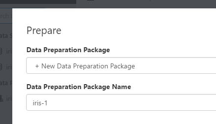

# Classifying Iris part 1: Prepare data
Azure Machine Learning services (preview) is an integrated, end-to-end data science and advanced analytics solution for professional data scientists to prepare data, develop experiments and deploy models at cloud scale.

This tutorial is part one of a three part series. In this tutorial, let's walk through the basics of Azure Machine Learning services (preview). In this tutorial, you learn how to:
> [!div class="checklist"]
> * Create a project in the Azure Machine Learning Workbench
> * Create a data preparation package
> * Generate Python/PySpark code to invoke data prep package

This tutorial uses the timeless [Iris flower dataset](https://en.wikipedia.org/wiki/Iris_flower_data_set) to keep things simple. The screenshots are Windows-specific, but the macOS experience is almost identical.

## Launch Azure Machine Learning Workbench
Follow the [Install and create Quickstart](quickstart-installation.md) to install the Azure Machine Learning Workbench application, which also includes the command-line interface (CLI). Launch the Azure Machine Learning Workbench app, and log in if needed.

## Create a new project
1. In the **PROJECTS** pane, click on the **+** icon to create a **New Project**.

   

2. Fill in the **Create New Project** details. 

   

   - Fill in the **Project name** field with a name for the project. For example, use the value **myIris**.
   - Choose the **Project directory** in which the project is created. For example, use the value **C:\Temp**. 
   - Enter the **Project description**. 
   - The **Git repository** field is optional and can be left blank. You can provide an existing empty Git repo (a repo with no master branch) on VSTS. Doing so allows you to enable roaming and sharing scenarios later. For more information, please reference the [Using Git repo](using-git-ml-project.md) article. 
   - Choose a **Workspace**, for example this tutorial uses **IrisGarden**. 
   - Select the **Classifying Iris** template from the project template list. 

3. Click on the **Create** button to create the project. The project is now created and opened for you.

## Create a data preparation package
1. Open the `iris.csv` file from the **File View**. The file is a simple table with 5 columns and 150 rows. It has four numerical feature columns and a string target column. It does not have column headers.

   

   >[!NOTE]
   >Note: it is not recommended to include data files in your project folder, particularly when the file size is large. We include `iris.csv` in this template for demonstration purposes because it is tiny. For more information, please reference the [How to read and write large data files](how-to-read-write-files.md) article.

2. In the **Data View**, click on the **+** icon to add a new data source. The **Add Data Source** wizard launches. 

   

3. Select the **File(s)/Directory** option, and choose the `iris.csv` local file. Accept the default settings for each screen and finally click on **Finish**. 

   

   >[!IMPORTANT]
   >Make sure you select the `iris.csv` file from within the current project directory for this exercise, otherwise latter steps may fail. 

4. A new file `iris-1.dsource` is created. The file is named uniquely with a dash-one since the sample project already comes with an unnumbered `iris.dsource` file.  The file opens and the data is shown. A series of column headers, from `Column1` to `Column5`, are automatically added to this dataset. Scroll to the bottom and notice the last row of the dataset is empty. It is because of an extra line break in the csv file.

   

5. Now click on the **Metrics** button. Observe the histograms and a complete set of statistics that are calculated for you for each column. You can also click the **Data** button to see the data again. 

   

6. Click on the **Prepare** button next to the **Metrics** button (or the **Data** button if you are on the metrics view). The **Prepare** dialog pops up. The sample project already comes with a `iris.dprep` file, so by default it asks you to create a new data flow in that existing **iris.dprep** data prep package. Change the dropdown value to **+New Data Preparation Package**, and enter a new value "iris-1", then click on **OK**.

   

A new data prep package named `iris-1.dprep` is created and opened in data preparation editor.

Now let's do some simple data preparation. Rename the column names by clicking on each column header and make the header text editable. Enter `Sepal Length`, `Sepal Width`, `Petal Length`, `Petal Width`, and `Species` for the five columns respectively.


Select the `Species` column, and right-click on it. Choose **Value Counts**. 


This action creates a histogram with four bars. Notice our target column has three distinct values, `Iris_virginica`, `Iris_versicolor`, `Iris-setosa`. There is also one row with a `(null)` value. Let's get rid of this row by selecting the bar representing the null value, and to remove it click on the **-** filter button. 


As you are working on column renaming and filtering out the null value row, each action you take is being recorded as a data prep step in the **STEPS** pane. You can edit them (to adjust their settings), reorder them, or even remove them.


## Generate Python/PySpark code to invoke data prep package

Now close the DataPrep editor. (Don't worry, it is auto-saved.) Right-click on the **iris-1.dprep** file to bring up context menu, and choose **Generate Data Access Code File**. 


An **iris-1.py** file is created with following two lines of code prepopulated (along with some comments):

```python
# This code snippet will load the referenced package and return a DataFrame.
# If the code is run in a PySpark environment, the code will return a
# Spark DataFrame. If not, the code will return a Pandas DataFrame.

from azureml.dataprep.package import run
df = run('iris.dprep', dataflow_idx=0)
```
This code snippet invokes the logic you created as a data preparation package. Depending on the context in which this code is run, `df` can be a [pandas DataFrame](https://pandas.pydata.org/pandas-docs/stable/generated/pandas.DataFrame.html) if executed in Python runtime, or a [Spark DataFrame](https://spark.apache.org/docs/latest/sql-programming-guide.html) if executed in a Spark context. For more information on how to prepare data in Azure Machine Learning Workbench, reference the [Getting Started with Data Preparation](data-prep-getting-started.md) guide.

## Next steps
In this first part of the three part tutorial series, you have used the Azure Machine Learning Workbench to:
> [!div class="checklist"]
> * Create a new project 
> * Create a data preparation package
> * Generate Python/PySpark code to invoke data prep package

You are ready to move on to the next part in the series, to build a machine learning model.
> [!div class="nextstepaction"]
> [Build a model](tutorial-classifying-iris-part-2.md)
