# Classifying Iris Part 1: Prepare Data

In this tutorial, let's walk through the basics of Azure Machine Learning by creating a data preparation package, building a model and deploying it as a real-time web service. We use the timeless [Iris flower dataset](https://en.wikipedia.org/wiki/Iris_flower_data_set) to keep things simple. The screenshots are Windows-specific, but the macOS experience is almost identical.

This is part 1 of a 3 part tutorial, covering project setup, and data preparation.

## Step 1. Launch Azure ML Workbench
Follow the [installation guide](quick-start-installation.md) to install the Azure ML Workbench application, which also includes the command-line interface (CLI). Launch the Azure ML Workbench app, and log in if needed.

## Step 2. Create a new project
Click on **File** --> **New Project** (or click on the **+** icon in the **PROJECTS** pane). You can also create a new Workspace first from this drop down menu.

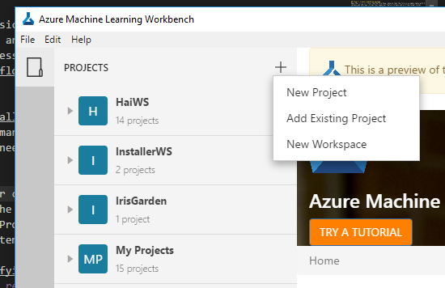

Fill in the project name (this tutorial assumes you use `myIris`). Choose the directory in which the project will be created (this tutorial assumes you've chosen `C:\Temp`). Enter the optional description. Choose a Workspace (this tutorial uses `IrisGarden`). And then select the **Classifying Iris** template from the project template list. 

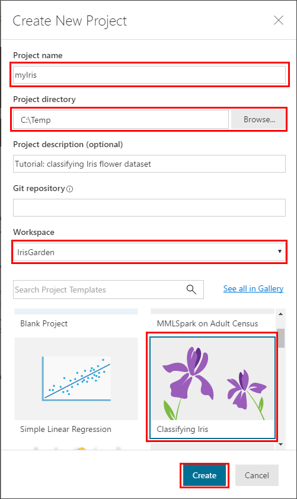
>[!TIP]
>Optionally, you can also fill in the Git repo field with an existing empty Git repo (a repo with no master branch) on VSTS. Doing so allows you to enable roaming and sharing scenarios later. For more information, please reference the [Using Git repo](using-git-ml-project.md) article and the [Roaming and Sharing](collab.md) article.

Click on the **Create** button to create the project. The project is now created and opened for you.

## Step 3. Create a Data Preparation package
Open the `iris.csv` file from the File View. The file is a simple table with 5 columns and 150 rows. It has four numerical feature columns and a string target column. It does not have column headers.

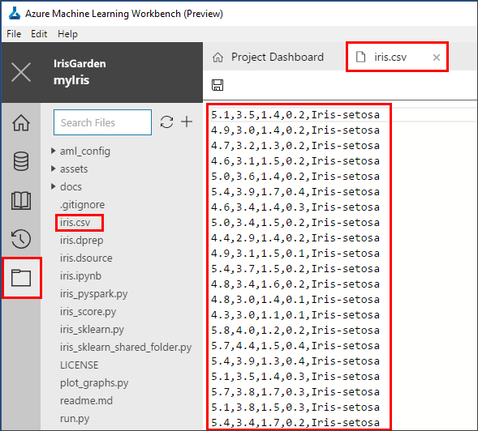

>[!NOTE]
>Note: it is not recommended to include data files in your project folder, particularly when the file size is large. We include `iris.csv` in this template for demonstration purposes because it is tiny. For more information, please reference the [How to Deal with Large Data Files](PersistChanges.md) article.

In the Data Pane, click on the **+** icon to add a new data source. This launches the **Add Data Source** wizard. 

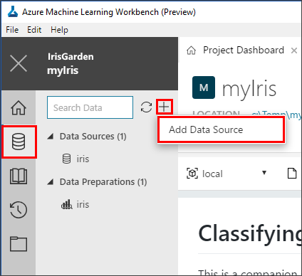

Select the **File(s)/Directory** option, and choose the `iris.csv` local file. Accept the default settings for each screen and finally click on **Finish**. 

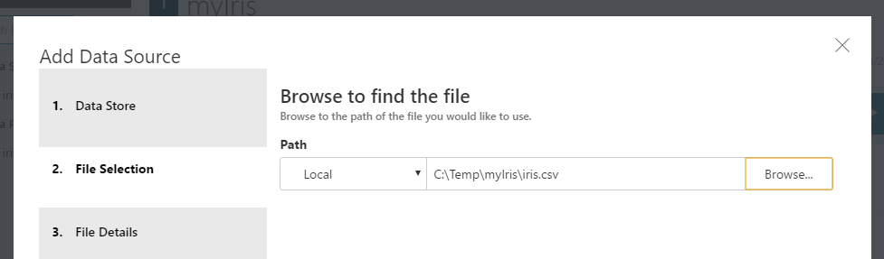

>[!IMPORTANT]
>Make sure you select the `iris.csv` file from within the current project directory for this exercise, otherwise latter steps may fail. 

This creates an `iris-1.dsource` file (because the sample project already comes with an `iris.dsource` file) and opens it in the **Data View**. A series of column headers, from `Column1` to `Column5`, are automatically added to this dataset. Scroll to the bottom and notice the last row of the dataset is empty. It is because of an extra line break in the csv file.

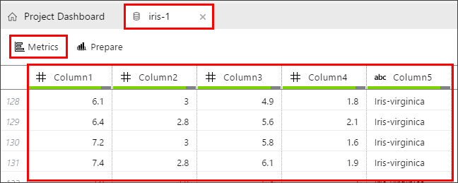

Now click on the **Metrics** button. Observe the histograms and a complete set of statistics that are calculated for you for each column. You can also switch over to the **Data View** to see the data itself. 

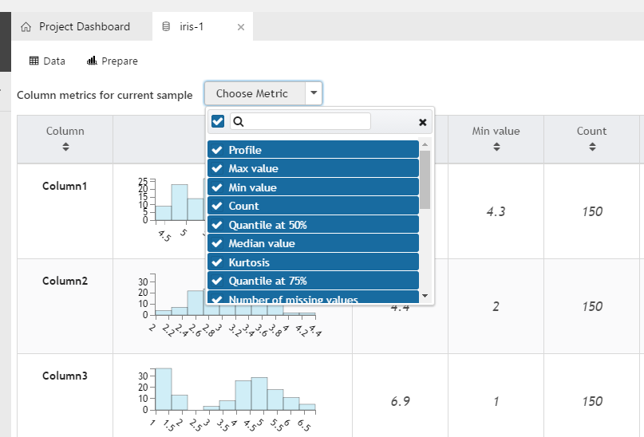

Click on the **Prepare** button next to the **Metrics** button, and a new file named `iris-1.dprep` is created. This is because the sample project already comes with an `iris.dprep` file. The file opens in data preparation editor. Now let's do some simple data prepartion.

Rename the column names by clicking on each column header and make the header text editable. Enter `Sepal Length`, `Sepal Width`, `Petal Length`, `Petal Width`, and `Species` for the five columns respectively.

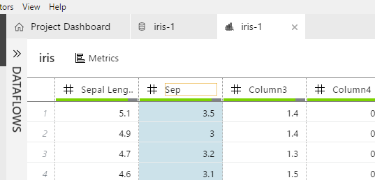

Select the `Species` column, and right-click on it. Choose **Value Counts**. 

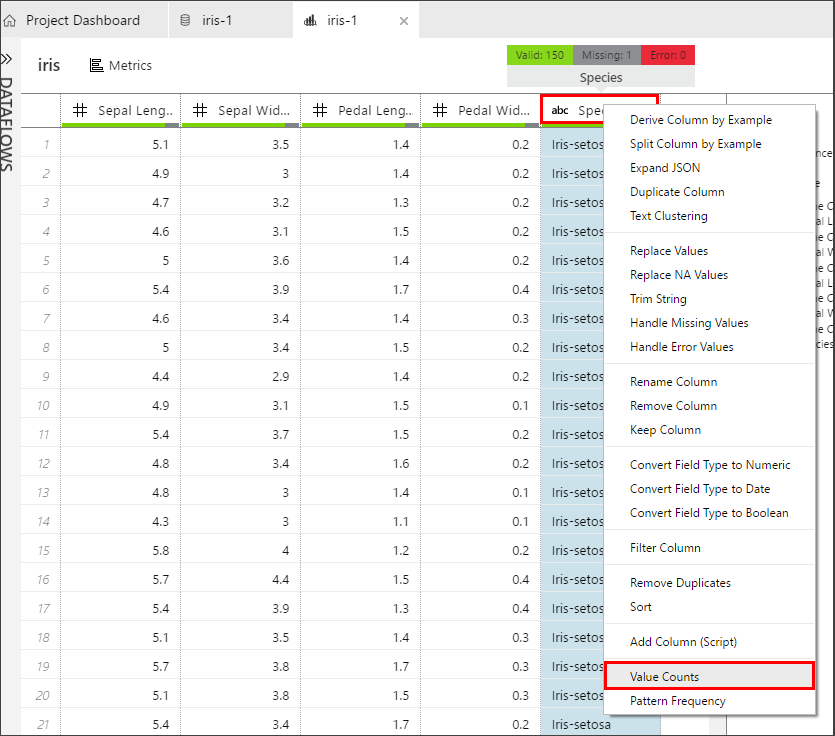

This creates a histogram with four bars. Notice our target column has three distinct values, `Iris_virginica`, `Iris_versicolor`, `Iris-setosa`. And there is also one row with a `(null)` value. Let's get rid of this row by selecting the bar representing the null value, and clicking on the **-** filter button to remove it. 

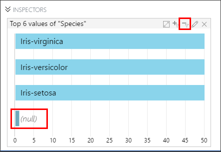

As you are working on column renaming and filtering out the null value row, each action you take is being recorded as a data prep step in the **STEPS** pane. You can edit them (to adjust their settings), reorder them, or even remove them.
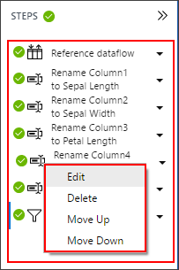

## Step 4. Generate Python/PySpark Code to Invoke Data Prep Package

Now close the DataPrep editor. (Don't worry, it is auto-saved.) Right-click on the `iris-1.dprep` file to bring up context menu, and choose **Generate Data Access Code File**. 

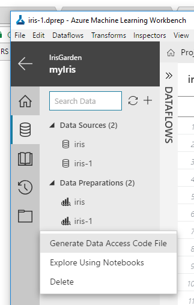

An `iris-1.py` file is created with following two lines of code prepopulated (along with some comments):

```python
# This code snippet will load the referenced package and return a DataFrame.
# If the code is run in a PySpark environment, the code will return a
# Spark DataFrame. If not, the code will return a Pandas DataFrame.

from azureml.dataprep.package import run
df = run('iris.dprep', dataflow_idx=0)
```
This code snippet invokes the logic you created as a data preparation package. Depending on the context in which this code is run, `df` can be a _[pandas DataFrame](https://pandas.pydata.org/pandas-docs/stable/generated/pandas.DataFrame.html)_ if executed in Python runtime, or a [_Spark DataFrame_](https://spark.apache.org/docs/latest/sql-programming-guide.html) if executed in a Spark context. For more information on how to prepare data in Azure ML Workbench, reference the [Getting Started with Data Preparation](data-prep-getting-started.md) guide.

Now we have a data prep package that can be invoked from Python code, we are ready to move on to the next step: building a machine learning model.

## Next Steps
- Part 1: Project setup and data preparation
- [Part 2: Model building](tutorial-classifying-iris-part-2.md)
- [Part 3: Model deployment](tutorial-classifying-iris-part-3.md)