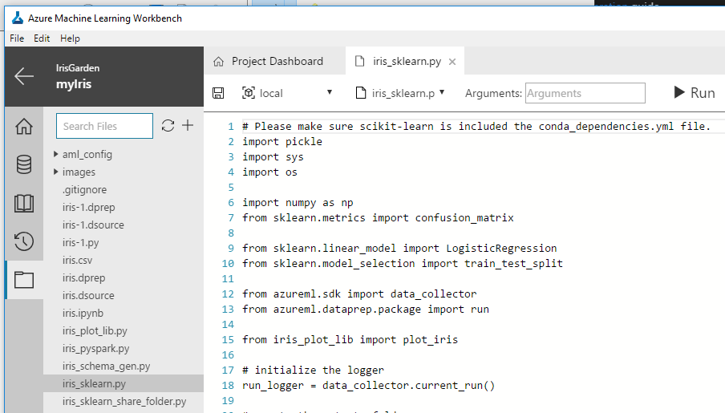
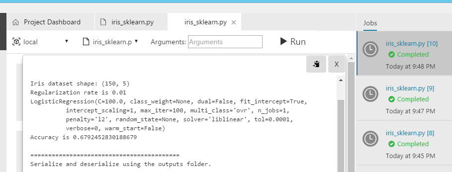
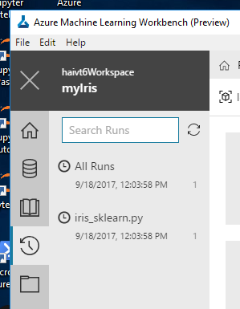
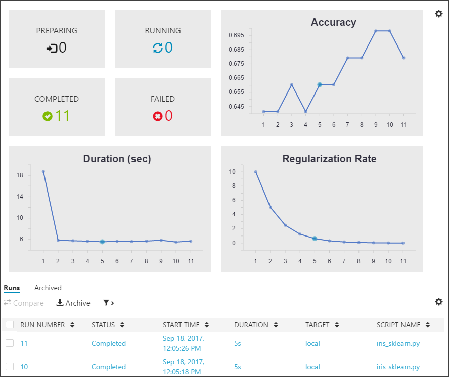
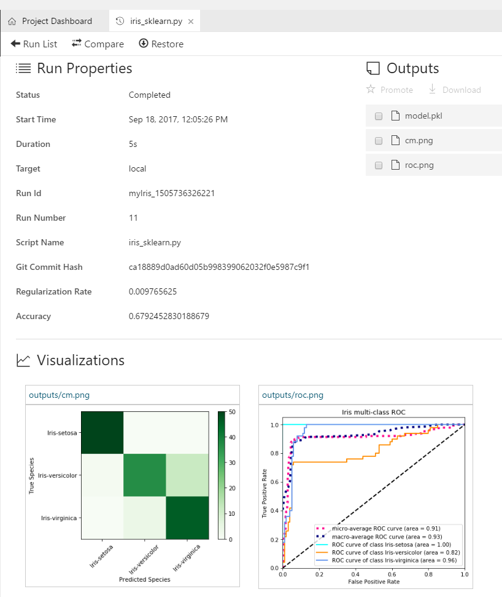

# Tutorial: Classify Iris part 2 - Build a model
Azure Machine Learning services (preview) is an integrated, end-to-end data science and advanced analytics solution for professional data scientists to prepare data, develop experiments, and deploy models at cloud scale.

This tutorial is part two of a three-part series. In this part of the tutorial, you use Azure Machine Learning services (preview) to:

> [!div class="checklist"]
> * Use Azure Machine Learning Workbench.
> * Open scripts and review code.
> * Execute scripts in a local environment.
> * Review the run history.
> * Execute scripts in a local Docker environment.
> * Execute scripts in a local Azure CLI window.
> * Execute scripts in a remote Docker environment.
> * Execute scripts in a cloud Azure HDInsight environment.

This tutorial uses the timeless [Iris flower data set](https://en.wikipedia.org/wiki/Iris_flower_data_set). The screenshots are Windows-specific, but the Mac OS experience is almost identical.

If you don't have an Azure subscription, create a [free account](https://azure.microsoft.com/free/?WT.mc_id=A261C142F) before you begin.

## Prerequisites
Finish the first part of this tutorial series. Follow the [Prepare data tutorial](tutorial-classifying-iris-part-1.md) to create Azure Machine Learning resources and install the Azure Machine Learning Workbench application prior to beginning the steps in this tutorial.

Optionally, you can experiment with running scripts against a local Docker container. To do so, you need a Docker engine (Community Edition is sufficient) installed and started locally on your Windows or Mac OS machine. For more information about installing Docker, see [Docker installation instructions](https://docs.docker.com/engine/installation/).

To experiment with dispatching scripts to run in a Docker container in a remote Azure VM or an Azure HDInsight Spark cluster, you can follow the [instructions to create an Ubuntu-based Azure Data Science Virtual Machine or HDInsight cluster](how-to-create-dsvm-hdi.md).

## Review iris_sklearn.py and the configuration files
1. Open the Azure Machine Learning Workbench application, and open the **myIris** project you created in the previous part of the tutorial series.

2. After the project is open, select the **Files** button (the folder icon) on the far-left pane to open the file list in your project folder.

3. Select the **iris_sklearn.py** file. The Python code opens in a new text editor tab inside the workbench.

   

   >[!NOTE]
   >The code you see might not be exactly the same as the preceding code, because this sample project is updated frequently.

4. Review the Python script code to become familiar with the coding style. The script performs the following tasks:

   - Loads the data preparation package **iris.dprep** to create a [pandas DataFrame](https://pandas.pydata.org/pandas-docs/stable/generated/pandas.DataFrame.html). 

        >[!NOTE]
        >Use the `iris.dprep` data preparation package that comes with the sample project, which should be the same as the `iris-1.dprep` file you built in part 1 of this tutorial.

   - Adds random features to make the problem more difficult to solve. Randomness is necessary because Iris is a small data set that's easily classified with nearly 100% accuracy.

   - Uses the [scikit-learn](http://scikit-learn.org/stable/index.html) machine learning library to build a logistic regression model. 

   - Serializes the model by inserting the [pickle](https://docs.python.org/2/library/pickle.html) library into a file in the `outputs` folder. The script then loads it and deserializes it back into memory.

   - Uses the deserialized model to make a prediction on a new record. 

   - Plots two graphs, a confusion matrix and a multi-class receiver operating characteristic (ROC) curve, by using the [matplotlib](https://matplotlib.org/) library, and then saves them in the `outputs` folder.

   - The `run_logger` object is used throughout to record the regularization rate and to model accuracy into the logs. The logs are automatically plotted in the run history.


## Execute iris_sklearn.py script in a local environment

Let's prepare to run the **iris_sklearn.py** script for the first time. This script requires the **scikit-learn** and **matplotlib** packages. The **scikit-learn** package is already installed by Azure Machine Learning Workbench. You still need to install **matplotlib**. 

1. In Azure Machine Learning Workbench, select the **File** menu,  and then select **Open Command Prompt** to open the command prompt. The command-line interface window is referred to as the *Azure Machine Learning Workbench CLI window*, or *CLI window* for short.

2. In the CLI window, enter the following command to install the **matplotlib** Python package. It should finish in less than a minute.

   ```azurecli
   pip install matplotlib
   ```

   >[!NOTE]
   >If you skip the previous `pip install` command, the code in `iris_sklearn.py` runs successfully. If you only run `iris_sklearn.py`, the code doesn't produce the confusion matrix output and the multi-class ROC curve plots as shown in the history visualizations.

3. Return to the workbench app window. 

4. In the toolbar at the top of the **iris_sklearn.py** tab, select to open the drop-down menu that is next to the **Save** icon, and then select **Run Configuration**. Select **local** as the execution environment, and then enter `iris_sklearn.py` as the script to run.

5. Next, move to the right side of the toolbar and enter `0.01` in the **Arguments** field. 

   

6. Select the **Run** button. A job is immediately scheduled. The job is listed in the **Jobs** pane on the right side of the workbench window. 

7. After a few moments, the status of the job transitions from **Submitting**, to **Running**, and then to **Completed**.

   

8. Select **Completed** in the job status text in the **Jobs** pane. A pop-up window opens and displays the standard output (stdout) text of the running script. To close the stdout text, select the **Close** (**x**) button on the upper right of the pop-up window.

9. In the same job status in the **Jobs** pane, select the blue text **iris_sklearn.py [n]** (_n_ is the run number) just above the **Completed** status and the start time. The **Run Properties** window opens and shows the following information for that particular run:
   - **Run Properties** information
   - **Outputs** files
   - **Visualizations**, if any
   - **Logs** 

   When the run is finished, the pop-up window shows the following results:

   >[!NOTE]
   >Because we introduced some randomization into the training set earlier, your exact results might vary from the results shown here.

   ```text
   Python version: 3.5.2 |Continuum Analytics, Inc.| (default, Jul  5 2016, 11:41:13) [MSC v.1900 64 bit (AMD64)]
   
   Iris dataset shape: (150, 5)
   Regularization rate is 0.01
   LogisticRegression(C=100.0, class_weight=None, dual=False, fit_intercept=True,
          intercept_scaling=1, max_iter=100, multi_class='ovr', n_jobs=1,
          penalty='l2', random_state=None, solver='liblinear', tol=0.0001,
          verbose=0, warm_start=False)
   Accuracy is 0.6792452830188679
   
   ==========================================
   Serialize and deserialize using the outputs folder.
   
   Export the model to model.pkl
   Import the model from model.pkl
   New sample: [[3.0, 3.6, 1.3, 0.25]]
   Predicted class is ['Iris-setosa']
   Plotting confusion matrix...
   Confusion matrix in text:
   [[50  0  0]
    [ 1 37 12]
    [ 0  4 46]]
   Confusion matrix plotted.
   Plotting ROC curve....
   ROC curve plotted.
   Confusion matrix and ROC curve plotted. See them in Run History details pane.
   ```

10. Close the **Run Properties** tab, and then return to the **iris_sklearn.py** tab. 

11. Repeat additional runs. 

    Enter a series of different numerical values in the **Arguments** field ranging from `0.001` to `10`. Select **Run** to execute the code a few more times. The argument value you change each time is fed to the logistic regression algorithm in the code, and that results in different findings each time.

## Review the run history in detail
In Azure Machine Learning Workbench, every script execution is captured as a run history record. If you open the **Runs** view, you can view the run history of a particular script.

1. To open the list of **Runs**, select the **Runs** button (clock icon) on the left toolbar. Then select **iris_sklearn.py** to show the **Run Dashboard** of `iris_sklearn.py`.

   

2. The **Run Dashboard** tab opens. 
Review the statistics captured across the multiple runs. Graphs render in the top of the tab. Each run has a consecutive number, and the run details are listed in the table at the bottom of the screen.

   

3. Filter the table, and then select any of the graphs to view the status, duration, accuracy, and regularization rate of each run. 

4. Select two or three runs in the **Runs** table, and select the **Compare** button to open a detailed comparison pane. Review the side-by-side comparison. Select the **Run List** back button on the upper left of the **Comparison** pane to return to the **Run Dashboard**.

5. Select an individual run to see the run detail view. Notice that the statistics for the selected run are listed in the **Run Properties** section. The files written into the output folder are listed in the **Outputs** section, and you can download the files from there.

   

   The two plots, the confusion matrix and the multi-class ROC curve, are rendered in the **Visualizations** section. All the log files can also be found in the **Logs** section.

## Execute scripts in the local Docker environment

With Machine Learning, you can easily configure additional execution environments, such as Docker, and run your script in those environments. 

>[!IMPORTANT]
>To accomplish this step, you must have a Docker engine locally installed and started. For more information, see the Docker installation instructions.

1. On the left pane, select the **Folder** icon to open the **Files** list for your project. Expand the `aml_config` folder. 

2. There are several environments that are preconfigured, such as **docker-python**, **docker-spark**, and **local**. 

   Each environment has two files, such as `docker-python.compute` and `docker-python.runconfig`. Open each file to see that certain options are configurable in the text editor.  

   To clean up, select **Close** (**x**) on the tabs for any open text editors.

3. Run the **iris_sklearn.py** script by using the **docker-python** environment: 

   - On the left toolbar, select the **Clock** icon to open the **Runs** pane. Select **All Runs**. 
   - On the top of the **All Runs** tab, select **docker-python** as the targeted environment instead of the default **local**. 
   - Next, move to the right side and select **iris_sklearn.py** as the script to run. 
   - Leave the **Arguments** field blank because the script specifies a default value. 
   - Select the **Run** button.

4. Observe that a new job starts. It appears in the **Jobs** pane on the right side of the workbench window.

   When you run against Docker for the first time, it takes a few extra minutes to finish. 

   Behind the scenes, Azure Machine Learning Workbench builds a new docker file. 
   The new file references the base Docker image specified in the `docker.compute` file and the dependency Python packages specified in the `conda_dependencies.yml` file. 
   
   The Docker engine does the following tasks:

    - Downloads the base image from Azure.
    - Installs the Python packages specified in the `conda_dependencies.yml` file.
    - Starts a Docker container.
    - Copies or references, depending on the run configuration, the local copy of the project folder.      
    - Executes the `iris_sklearn.py` script.

   In the end, you should see the exact same result as you do when you target **local**.

5. Now, let's try Spark. The Docker base image contains a preinstalled and configured Spark instance. Because of this instance, you can execute a PySpark script in it. This is an easy way to develop and test your Spark program, without having to spend the time to install and configure Spark yourself. 

   Open the `iris_spark.py` file. This script loads the `iris.csv` data file, and uses the logistic regression algorithm from the Spark Machine Learning library to classify the Iris data set. Now change the run environment to **docker-spark** and the script to **iris_spark.py**, and then run it again. This process takes a little longer because a Spark session has to be created and started inside the Docker container. You can also see the stdout is different than the stdout of `iris_spark.py`.

6. Do a few more runs and play with different arguments. 

7. Open the `iris_spark.py` file to see the logistic regression model built by using the Spark Machine Learning library. 

8. Interact with the **Jobs** pane, run a history list view, and run a details view of your runs across different execution environments.

## Execute scripts in the Azure Machine Learning CLI window

1. In Azure Machine Learning Workbench, open the command-line window, select the **File** menu, and then select **Open Command Prompt**. Your command prompt starts in the project folder with the prompt `C:\Temp\myIris\>`.

   >[!IMPORTANT]
   >You must use the command-line window (opened from the workbench) to accomplish the steps that follow.

2. Use the command prompt to log in to Azure. 

   The workbench app and CLI use independent credential caches when authenticating against Azure resources. You only need to do this once until the cached token expires. The **az account list** command returns the list of subscriptions available to your login. If there is more than one, use the ID value from the desired subscription. Set that subscription as the default account to use with the **az account set -s** command, and then provide the subscription ID value. Then confirm the setting by using the account **show** command.

   ```azurecli
   REM login by using the aka.ms/devicelogin site
   az login
   
   REM lists all Azure subscriptions you have access to 
   az account list -o table
   
   REM sets the current Azure subscription to the one you want to use
   az account set -s <subscriptionId>
   
   REM verifies that your current subscription is set correctly
   az account show
   ```

3. After authentication finishes and the current Azure subscription context is set, enter the following commands in the CLI window to install **matplotlib**, and then submit the Python script as an experiment to run.

   ```azurecli
   REM you don't need to run this command if you have installed matplotlib locally from the previous steps
   pip install matplotlib
   
   REM kicks off an execution of the iris_sklearn.py file against the local compute context
   az ml experiment submit -c local .\iris_sklearn.py
   ```

4. Review the output. You have the same output and results that you had when you used the workbench to run the script. 

5. Run the same script again by using the Docker execution environment if you have Docker installed on your machine.

   ```azurecli
   REM executes iris_sklearn.py in the local Docker container Python environment
   az ml experiment submit -c docker-python .\iris_sklearn.py 0.01
   
   REM executes iris_spark.py in the local Docker container Spark environment
   az ml experiment submit -c docker-spark .\iris_spark.py 0.1
   ```
6. In the workbench, select the **Folder** icon on the left pane to list the project files, and open the Python script named **run.py**. 

   This script is useful to loop over various regularization rates. Run the experiment multiple times with those rates. This script starts an `iris_sklearn.py` job with a regularization rate of `10.0` (a ridiculously large number). The script then cuts the rate to half in the following run, and so on, until the rate is no smaller than `0.005`. 

   ```python
   # run.py
   import os
   
   reg = 10
   while reg > 0.005:
       os.system('az ml experiment submit -c local ./iris_sklearn.py {}'.format(reg))
       reg = reg / 2
   ```

   To open the **run.py** script from the command line, run the following commands:

   ```cmd
   REM submits iris_sklearn.py multiple times with different regularization rates
   python run.py
   ```

   When `run.py` finishes, you see a graph in your run history list view in the workbench.

## Execute in a Docker container on a remote machine
To execute your script in a Docker container on a remote Linux machine, you need to have SSH access (username and password) to that remote machine. In addition, that remote machine must have a Docker engine installed and running. The easiest way to obtain such a Linux machine is to create an Ubuntu-based Data Science Virtual Machine (DSVM) on Azure. Learn [how to create an Ubuntu DSVM to use in Azure ML Workbench](how-to-create-dsvm-hdi.md#create-an-ubuntu-dsvm-in-azure-portal).

>[!NOTE] 
>The CentOS-based DSVM is *not* supported.

1. After the VM is created, you can attach the VM as an execution environment if you generate a pair of `.runconfig` and `.compute` files. Use the following command to generate the files. Let's name the new environment `myvm`.
 
   ```azurecli
   REM creates an myvm compute target
   az ml computetarget attach remotedocker --name myvm --address <IP address> --username <username> --password <password>
   ```
   
   >[!NOTE]
   >The IP address can also be a publicly addressable fully qualified domain name (FQDN), such as `vm-name.southcentralus.cloudapp.azure.com`. It is a good practice to add FQDN to your DSVM and use it here instead of an IP address. This practice is a good idea because you might turn off the VM at some point to save on cost. Additionally, the next time you start the VM, the IP address might have changed.

   Next, run the following command the construct the Docker image in the VM to get it ready to run the scripts:
   
   ```azurecli
   REM prepares the myvm compute target
   az ml experiment prepare -c myvm
   ```
   >[!NOTE]
   >You can also change the value of `PrepareEnvironment` in `myvm.runconfig` from default of `false` to `true`. This change automatically prepares the Docker container at the first run.

2. Edit the generated `myvm.runconfig` file under `aml_config` and change the framework from the default of `PySpark` to `Python`:

   ```yaml
   "Framework": "Python"
   ```
   >[!NOTE]
   >If you leave the framework setting as PySpark, that should also work. But it's less inefficient if you don't actually need a Spark session to run your Python script.

3. Issue the same command as you did before in the CLI window, except this time target _myvm_:
   ```azurecli
   REM executes iris_sklearn.py in a remote Docker container
   az ml experiment submit -c myvm iris_sklearn.py
   ```
   The command executes as if you're in a `docker-python` environment, except that the execution happens on the remote Linux VM. The CLI window displays the same output information.

4. Let's try using Spark in the container. Open File Explorer. You can also do this from the CLI window if you're comfortable with basic file-manipulation commands. Make a copy of the `myvm.runconfig` file and name it `myvm-spark.runconfig`. Edit the new file to change the `Framework` setting from `Python` to `PySpark`:
   ```yaml
   "Framework": "PySpark"
   ```
   Don't make any changes to the `myvm.compute` file. The same Docker image on the same VM gets used for the Spark execution. In the new `myvm-spark.runconfig`, the `target` field points to the same `myvm.compute` file via its name `myvm`.

5. Type the following command to run it in the Spark instance in the remote Docker container:
   ```azureli
   REM executes iris_spark.py in a Spark instance on a remote Docker container
   az ml experiment submit -c myvm-spark .\iris_spark.py
   ```

## Execute script in an HDInsight cluster
You can also run this script in an HDInsight Spark cluster. Learn [how to create HDInsight Spark Cluster to use in Azure ML Workbench](how-to-create-dsvm-hdi.md#create-an-apache-spark-for-azure-hdinsight-cluster-in-azure-portal).

>[!NOTE] 
>The HDInsight cluster must use Azure Blob as the primary storage. Using Azure Data Lake storage is not supported yet.

1. If you have access to Spark for Azure HDInsight cluster, generate an HDInsight run configuration command as shown here. Provide the HDInsight cluster name and your HDInsight username and password as the parameters. Use the following command:

   ```azurecli
   REM creates a compute target that points to a HDInsight cluster
   az ml computetarget attach cluster --name myhdi --address <cluster head node FQDN> --username <username> --password <password>

   REM prepares the HDInsight cluster
   az ml experiment prepare -c myhdi
   ```

   The cluster head node FQDN is typically `<cluster_name>-ssh.azurehdinsight.net`.

   >[!NOTE]
   >The `username` is the cluster SSH username. The default value is `sshuser` if you don't change it during HDInsight setup. The value is not `admin`, which is the other user created during setup to enable access to the cluster's admin website. 

2. Run the following command, and the script runs in the HDInsight cluster:

   ```azurecli
   REM executes iris_spark on the HDInsight cluster
   az ml experiment submit -c myhdi .\iris_spark.py
   ```

   >[!NOTE]
   >When you execute against a remote HDInsight cluster, you can also view the Yet Another Resource Negotiator (YARN) job execution details at `https://<cluster_name>.azurehdinsight.net/yarnui` by using the `admin` user account.


## Clean up resources

[!INCLUDE [aml-delete-resource-group](../../../includes/aml-delete-resource-group.md)]

## Next steps
In this second part of the three-part tutorial series, you have learned how to use Azure Machine Learning services to:
> [!div class="checklist"]
> * Use Azure Machine Learning Workbench.
> * Open scripts and review code.
> * Execute scripts in a local environment.
> * Review the run history.
> * Execute scripts in a local Docker environment.
> * Execute scripts in a local Azure CLI window.
> * Execute scripts in a remote Docker environment.
> * Execute scripts in a cloud HDInsight environment.

You are ready to move on to the third part in the series. Now that you have created the logistic regression model, let's deploy it as a real-time web service.

> [!div class="nextstepaction"]
> [Tutorial 3 - Classifying Iris: Deploy models](tutorial-classifying-iris-part-3.md)
