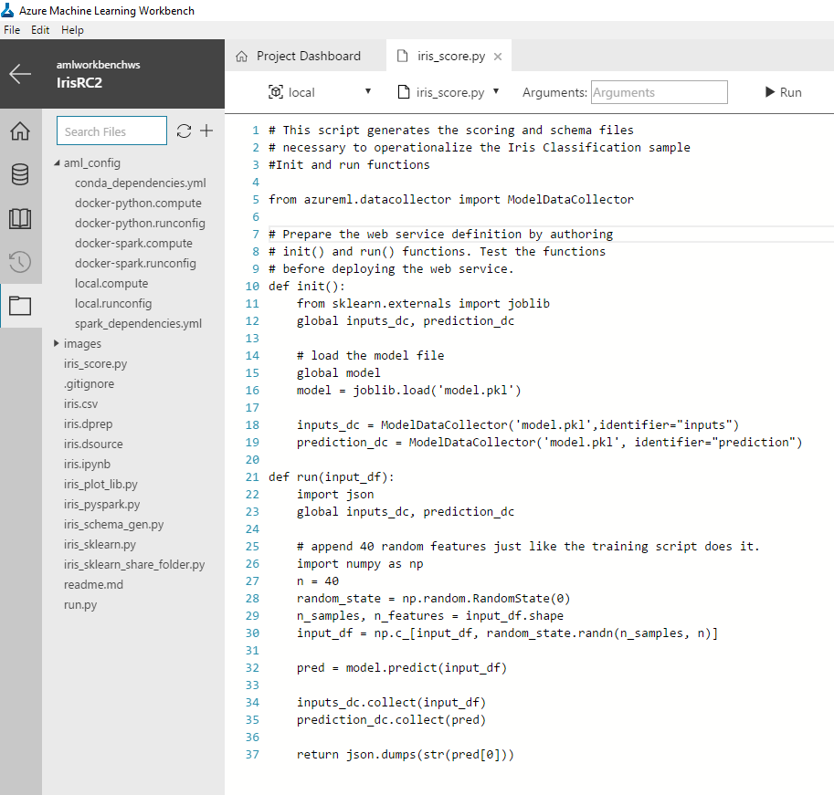

# Classifying Iris part 3: Deploy a model
Azure Machine Learning services (preview) is an integrated, end-to-end data science and advanced analytics solution for professional data scientists to prepare data, develop experiments and deploy models at cloud scale.

This tutorial is part three of a three part series. In this part of the tutorial, you use Azure Machine Learning services (preview) to learn how to:

> [!div class="checklist"]
> * Locate the model file
> * Generate a scoring script and schema file
> * Prepare the environment
> * Create a real-time web service
> * Run the real-time web service
> * Examine the output blob data 

 This tutorial uses the timeless [Iris flower dataset](https://en.wikipedia.org/wiki/iris_flower_data_set) to keep things simple. The screenshots are Windows-specific, but the macOS experience is almost identical.

## Prerequisites
Complete the first two parts of this tutorial series:
- Firstly, follow [Prepare data tutorial](tutorial-classifying-iris-part-1.md) to create Azure Machine Learning resources and install the Azure Machine Learning Workbench application.
- Secondly, follow [Build a model tutorial](tutorial-classifying-iris-part-2.md) to create a logistic regression model in Azure Machine Learning.

## Download the model pickle file
In the previous part of the tutorial, the  `iris_sklearn.py` script was run in Azure Machine Learning Workbench locally. That action serialized the logistic regression model using the popular Python object serialization package **[pickle](https://docs.python.org/2/library/pickle.html)**. 

1. Launch the **Azure Machine Learning Workbench** application, and open the **myIris** project you created in the previous part of the tutorial series.

2. Once the project is open, click the **Files** button (folder icon) on the left toolbar in Azure Machine Learning Workbench to open the file list in your project folder.

3. Select the **iris_sklearn.py** file, and the Python code opens in a new text editor tab inside the Workbench.

4. Review the **iris_sklearn.py** file to see where the pickle file was generated. Use Control+F to open the find dialogue, and then find word **pickle** in the python code.

   This code snippet shows how the pickled output file was generated. Notice the output pickle file is named `model.pkl` on disk. 

   ```python
   print("Export the model to model.pkl")
   f = open('./outputs/model.pkl', 'wb')
   pickle.dump(clf1, f)
   f.close()
   ```

5. Locate the model pickle file in the output files of a previous run.
   
   When you ran the **iris_sklearn.py** script, the model file was written to the `outputs` folder with the name `model.pkl`. This folder lives in the execution environment you choose to run the script, and not in your local project folder. 
   
   - To locate the file, use the Azure Machine Learning Workbench application, and click the **Runs** button (clock icon) on the left toolbar to open the listing of **All Runs**.  
   - The **All Runs** tab opens. In the table of Runs, select one of the recent runs where the target was **local** and the script name was **iris_sklearn.py**. 
   - The **Run Properties** page opens. On the upper right of the page, notice the **Outputs** section. 
   - Download the pickle file by selecting the checkbox next to the **model.pkl** file, and clicking on the **Download** button. Save it to the root of your project folder. It is needed in upcoming steps.

   

   Read more about the `outputs` folder in the [How to read and write large data files](how-to-read-write-files.md) article.

## Get scoring and schema files
To deploy the web service, along with the model file, you also need a scoring script and optionally a schema for the web service input data. The scoring script loads the `model.pkl` file from the current folder and uses it to produce a newly predicted Iris class.  

1. Launch the **Azure Machine Learning Workbench** application, and open the **myIris** project you created in the previous part of the tutorial series.

2. Once the project is open, click the **Files** button (folder icon) on the left toolbar in Azure Machine Learning Workbench to open the file list in your project folder.

3. Select the **iris_score.py** file. The python script opens. This file is used as the scoring file.

4. In order to get the schema file, run the script. Choose the **local** environment and the **iris_score.py** script in the command bar, then click the **Run** button. 

5. This script creates a JSON file in the **outputs** folder, which captures the input data schema required by the model.

   

6. In the Jobs pane on the right of the Machine Learning Workbench window, wait until the latest **iris_score.py** job shows the green **Completed** status. Then click the hyperlink **iris_score.py [1]** for the latest job run to see the run details from the **iris_score.py** run. 

7. On the Run Properties page, in the **Outputs** section, select the newly created   **service_schema.json** file. Save the file into your project root folder.

8. Return to the tab where you have opened script **iris_score.py**. 

   Note the usage of data collection that allows you to capture model inputs and predictions from the web service. Following points are of particular interest for data collection.

9. Review the code at the top of the file imports class ModelDataCollector that contains the model data collection functionality:

   ```python
   from azureml.datacollector import ModelDataCollector
   ```

10. Review the following lines of code in the `init()` function instantiates ModelDataCollector:

   ```python
   global inputs_dc, prediction_dc
   inputs_dc = ModelDataCollector('model.pkl',identifier="inputs")
   prediction_dc = ModelDataCollector('model.pkl', identifier="prediction")`
   ```

11. Review the following lines of code in the `run(input_df)` function collects input and prediction data:

   ```python
   global clf2, inputs_dc, prediction_dc
   inputs_dc.collect(input_df)
   prediction_dc.collect(pred)
   ```

Now you are ready to prepare your environment to operationalize the model.

## Prepare to operationalize locally
Use _local mode_ deployment to run in Docker containers on your local computer.

You can use _local mode_ for development and testing. The Docker engine must be running locally to complete the following steps to operationalize the model. You can use `-h` flag at the end of the commands for command help.

>[!NOTE]
>If you don't have Docker engine locally, you can still procreed by creating a cluster in Azure for deployment. Just be sure to delete the cluster after the tutorial so you don't incur ongoing charges.

1. Open the Command-line Interface 
   In the Azure Machine Learning Workbench, in the File menu, click **Open Command Prompt**.

   The command-line prompt opens in your current project folder location `c:\temp\myIris>`.

2. Create the environment. This step is required to be run once per environment, for example, dev or prod. Use _local mode_ for this first environment. (You can try the `-c` or `--cluster` switch in the below command to set up an environment in _cluster mode_ later.)

   ```azurecli
   az ml env setup -n <new deployment environment name> --location <e.g. eastus2>
   ```
   
   Follow the on-screen instructions to provision a storage account for storing Docker images, an ACR (Azure Container Registry) for listing Docker images, an AppInsight account for gathering telemetry. If you used the `-c` switch, it creates an ACS (Azure Container Service) cluster too.

3. Create a Model Management account (this is a one time setup)  
   ```azurecli
   az ml account modelmanagement create --location <e.g. eastus2> -n <new model management account name> -g <existing resource group name> --sku-name S1
   ```
   
4. Set the Model Management account  
   ```azurecli
   az ml account modelmanagement set -n <youracctname> -g <yourresourcegroupname>
   ```

5. Set the environment.
After the setup is complete, set the environment variables required to operationalize using the following command. The environment name is the name used in step 1 above. The resource group name was the output of the same process and would be in the command window when the setup process is completed.
   ```azurecli
   az ml env set -n <deployment environment name> -g <existing resource group name>
   ```

   To verify that you have properly configured your operationalization environment for local web service deployment, enter the following command:

   ```azurecli
   az ml env show
   ```

Now you are ready to create the real-time web service.

## Create a real-time web service
Use the following command to create a real-time web service:

   ```azurecli
   az ml service create realtime -f iris_score.py --model-file model.pkl -s service_schema.json -n irisapp -r python --collect-model-data true 
   ```
   This generates a web service ID you can use later.

   The following are switches for the `az ml service create realtime` command:
   * -n: app name, must be all lower case.
   * -f: scoring script file name
   * --model-file: model file, in this case it is the pickled model.pkl file
   * -r: type of model, in this case it is a python model
   * --collect-model-data true: enables data collection

   >[!IMPORTANT]
   >The service name (which is also the new Docker image name) must be all lower case, otherwise you get an error. 

   When you run the command, the model and the scoring file are uploaded into to the storage account you created as part of environment setup above. The deployment process builds a Docker image with your model, schema, scoring file in it, and pushes it to the ACR registry: `<ACR_name>.azureacr.io/<imagename>:<version>`. It then pulls down that image locally to your computer, and starts a Docker container based on that image. (If your environment is configured in cluster mode, the Docker container is deployed into the ACS Kubernetes cluster instead.)

   As part of the deployment, an HTTP REST endpoint for the web service is created on your local machine. After a few minutes the command should finish with a success message and your web service is ready for action!

   You can see the running Docker container using the `docker ps` command:
   ```azurecli
   docker ps
   ```
### Alternative route
As an alternate to `az ml service create realtime` command shown above, you can also perform the model registration, manifest generation, Docker image build, and web service creation steps individually. This gives your more flexibility at each step, and you can reuse entities generated from the previous step, and rebuild entities only when needed. Follow the below instructions to see how this can be achieved:

1. Register the model by providing the pickle file name.

   ```azurecli
   az ml model register --model model.pkl --name model.pkl
   ```
   This generates a model ID.

2. Create manifest

   In order to create a manifest, use this command and provide the model ID output from the previous step:

   ```azurecli
   az ml manifest create --manifest-name <new manifest name> -f iris_score.py -r python -i <model ID> -s service_schema.json
   ```
   This generates a manifest ID.

3. Create a Docker image

   In order to create a Docker image, use this command and provide the manifest ID value output from the previous step:

   ```azurecli
   az ml image create -n irisimage --manifest-id <manifest ID>
   ```
   This generates a Docker image ID.
   
4. Create the service

   In order to create a service, use the command listed and provide the image ID output from the previous step:

   ```azurecli
   az ml service create realtime --image-id <image ID> -n irisapp --collect-model-data true
   ```
   This genereates a web service ID.

You are now ready to run the web service.

## Run the real-time web service

Test the running `irisapp` web service by feeding it with a JSON encoded record containing an array of four random numbers.

1. The web service creation included sample data. When running in local mode, you can call the `az ml service show realtime` command to retrieve a sample run command that you can use to test the service. This will also give you the scoring url that you can use to incorporate the service in your own custom app:

   ```azurecli
   az ml service show realtime -i <web service ID>
   ```

2. To test the service, execute the returned service run command.

   ```azurecli
   az ml service run realtime -i irisapp -d "{\"input_df\": [{\"petal width\": 0.25, \"sepal length\": 3.0, \"sepal width\": 3.6, \"petal length\": 1.3}]}
   ```
   The output is `"2"`, which is the predicted class. (Your result might be different.) 

3. If you want to run the service from outside the CLI, you need to get the keys for authentication:

   ```azurecli
   az ml service keys realtime -i <web service ID>
   ```

## View the collected data in Azure blob storage:

1. Sign into the [Azure portal](https://portal.azure.com).

2. Locate your Storage Accounts. To do so, click **More Services**

3. In the search box, type **Storage accounts** and press **Enter**

4. From the **Storage accounts** search page, select the **Storage account** resource matching your environment. 

   > [!TIP]
   > To determine which storage account is used:
   > Open to Azure Machine Learning Workbench, select the project you're working on, and open command-line prompt from **File** menu
   > At the command-line prompt, type `az ml env show -v` and check the *storage_account* value. This is the name of your storage account

5. Once the **Storage account** page opens, click on **Containers** item in the left listing. Locate the container named **modeldata**. 
 
   If you do not see any data, you may need to wait up to 10 minutes after the first web service request in order to see data start propagating to the storage account.

   Data flows into blobs with the following container path:

   `/modeldata/<subscription_id>/<resource_group_name>/<model_management_account_name>/<webservice_name>/<model_id>-<model_name>-<model_version>/<identifier>/<year>/<month>/<day>/data.csv`

6. You can consume this data from Azure blobs in a variety of ways using both Microsoft software and open source tools. 

   Example approaches to consumer the output blobs:
   - Azure ML Workbench: open the csv file in Azure ML Workbench by adding csv file as a data source. 
   - Excel: open the daily csv files as a spreadsheet.
   - [Power BI](https://powerbi.microsoft.com/documentation/powerbi-azure-and-power-bi/): create charts with data pulled from csv data in blobs.
   - [Spark](https://docs.microsoft.com/azure/hdinsight/hdinsight-apache-spark-overview): create a dataframe with a large portion of csv data.

      ```python
      var df = spark.read.format("com.databricks.spark.csv").option("inferSchema","true").option("header","true").load("wasb://modeldata@<storageaccount>.blob.core.windows.net/<subscription_id>/<resource_group_name>/<model_management_account_name>/<webservice_name>/<model_id>-<model_name>-<model_version>/<identifier>/<year>/<month>/<date>/*")
      ```
   - [Hive](https://docs.microsoft.com/azure/hdinsight/hdinsight-hadoop-linux-tutorial-get-started): load csv data into a hive table and perform SQL queries directly against blob.

## Summary
In this tutorial, you have learned how to:
> [!div class="checklist"]
> * Locate the model file
> * Generate a scoring script and schema file
> * Prepare the environment
> * Create a real-time web service
> * Run the real-time web service
> * Examine the output blob data 

You have successfully run a training script in various compute environments, created a model, serialized the model, and operationalized the model through a Docker-based web service. 

## Next Steps
Learn to perform advanced data preparation with Azure Machine Learning Workbench:
> [!div class="nextstepaction"]
> [Advanced data preparation](tutorial-bikeshare-dataprep.md)

