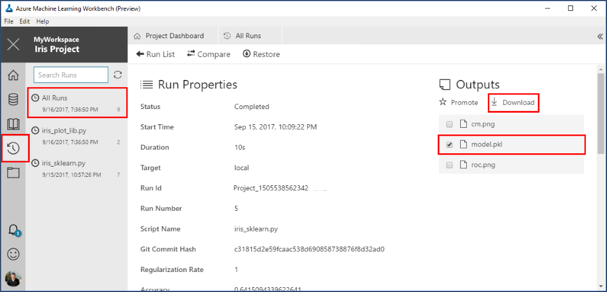

# Classifying Iris Part 3: Deploy Model
In this tutorial, let's walk through the basics of Azure Machine Learning services (preview) by creating a data preparation package, building a model and deploying it as a real-time web service. We use the timeless [Iris flower dataset](https://en.wikipedia.org/wiki/Iris_flower_data_set) to keep things simple. The screenshots are Windows-specific, but the macOS experience is almost identical.

This is part 3 of a 3 part tutorial, covering model deployment.

## Step 1. Obtain the Pickled Model
In the `iris_sklearn.py` script, we serialize the logistic regression model using the popular object serialization package -- pickle, into a file named `model.pkl` on disk. Here is the code snippet:

```python
print("Export the model to model.pkl")
f = open('./outputs/model.pkl', 'wb')
pickle.dump(clf1, f)
f.close()
```

When you executed the `iris_sklearn.py` script, the model was written to the `outputs` folder with the name `model.pkl`. This folder lives in the execution environment you choose to run the script, and not in your local project folder. You can find it in the run history detail page. There you can retrieve the binary file by clicking on the download button next to the file name. Read more about the `outputs` folder in the [How to read and write large data files](how-to-read-write-files.md) article.



Download the model file `model.pkl` and save it to the root of your project folder. It is needed in upcoming steps.

## Step 2. Prepare for Operationalization Locally
_Local mode_ deployments run in Docker containers on your local computer, whether that is your desktop or a Linux VM running on Azure. You can use _local mode_ for development and testing. The Docker engine must be running locally to complete the operationalization steps below. You can use `-h` flag at the end of the commands for command help.

- Create the environment (you need to do this once per environment, for example,  dev or prod) in _local mode_ (you can use -c switch in the command to set up environment in _cluster mode_):  
    ```batch
    C:\Temp\myIris> az ml env setup -n <yourclustername> --location <e.g. eastus2>
    ```
    
    Follow the on-screen instructions to provision a storage account for storing Docker images, an ACR (Azure Container Registry) for listing Docker images, an AppInsight account for gathering telemetry, and an ACS cluster.
    

- Create a Model Management account (one time setup)  
    ```batch
    C:\Temp\myIris> az ml account modelmanagement create --location <e.g. eastus2> -n <your-new-acctname> -g <yourresourcegroupname> --sku-name S1
    ```
    
- Set the Model Management account  
    ```batch
    C:\Temp\myIris> az ml account modelmanagement set -n <youracctname> -g <yourresourcegroupname>
    ```
    
- Set the environment
After the setup is complete, set the environment variables required for operationalization using the following command. The cluster name is the name used in step 1 above. The resource group name was the output of the same process and would be in the command window when the setup process is completed.
    ```batch
    C:\Temp\myIris> az ml env set -n <yourclustername> -g <yourresourcegroupname>
    ```
    
    To verify that you have properly configured your operationalization environment for local web service deployment, enter the following command:
    
    ```batch
    C:\Temp\myIris> az ml env show
    ```
    
## Step 3. Get scoring and schema files
To deploy the web service, along with the model you also need a scoring script and optionally a schema for the web service input data. The scoring script loads the `model.pkl` file from the current folder and uses it to produce a new predicted Iris class.  

We already downloaded the model.pkl file in Step 1. In order to get the schema file, follow the steps below:

* Choose `iris_score.py`, pick the `local` environment in the **Run Control** dropdown, and then click **Run** button. This creates the `service_schema.json` in the `outputs` folder.

* Go to the run history of the `iris_score.py` file, and download the `service_schema.json` file to the project root folder. 

We use `iris_score.py` as our scoring file. 

Now we enable data collection in `iris_score.py` file. Data collection allows you to capture model inputs and predictions from the web service. Follow the steps below to enable data collection,

* Use these links to download prerequisites for data collection on your machine.

* Open `iris_score.py` and add the following code at the top of the file
   
    ```python
    from azureml.datacollector import ModelDataCollector
    ```

* Add the following lines of code to the `init()` function,
    
    ```python
    global inputs_dc, prediction_dc
    inputs_dc = ModelDataCollector('model.pkl',identifier="inputs")
    prediction_dc = ModelDataCollector('model.pkl', identifier="prediction")`
    ```

* Add the following lines of code to the `run(input_df)` function,
    
    ```python
    global clf2, inputs_dc, prediction_dc
    inputs_dc.collect(input_df)
    prediction_dc.collect(pred)
    ```

    Make sure that variables `input_df` and `pred` are populated before you call `collect()` function on them.

Now you are ready to create the real-time web service.

## Step 4. Create a real-time Web Service

Use `az ml service create realtime` command as shown below to create a realtime web service

```batch
c:\temp\myIris> az ml service create realtime -f iris_score.py --model-file model.pkl -s service_schema.json -n irisapp -r python --collect-model-data true 
```
The following are switches for the `az ml service create realtime` command:
* -n: app name, must be lower case.
* -f: scoring script file name
* --model-file: model file, in this case it is the pickled model.pkl file
* -r: type of model, in this case it is a python model
* --collect-model-data true: enables data collection

>Important: The service name (which is also the new Docker image name) must be all lower-case, otherwise you get an error.

When you run the command, the model and the scoring file are uploaded into an Azure service that we manage. As part of deployment process, the operationalization component uses the pickled model `model.pkl` and the scoring script `iris_score.py` to build a Docker image named `<ACR_name>.azureacr.io/irisapp`. It then registers the image with your Azure Container Registry (ACR) service, pulls down that image locally to your computer, and starts a Docker container based on that image. (If your environment is configured in cluster mode, the Docker container will instead be deployed into the Kubernetes cluster.)

As part of the deployment, an HTTP REST endpoint for the web service is created on your local machine. After a few minutes the command should finish with a success message and your web service is ready for action!

You can see the running Docker container using the `docker ps` command:
```batch
c:\Temp\myIris> docker ps
```
You are now ready to run the web service.

## Step 5. Run the real-time Web Service

You can test the running `irisapp` web service by feeding it with a JSON encoded record containing an array of four random numbers.

The web service creation included sample data. When running in local mode, you can call the `az ml service show realtime` command to retrieve a sample run command that you can use to test the service.

```batch
C:\Temp\myIris> az ml service show realtime -i <web service id>
```

To test the service, execute the returned service run command.

```batch
C:\Temp\myIris> az ml service run realtime -i irisapp -d "{\"input_df\": [{\"petal width\": 0.25, \"sepal length\": 3.0, \"sepal width\": 3.6, \"petal length\": 1.3}]}
```
The output is `"2"`, which is the predicted class. (Your result might be different.) 

To view the collected data in blob storage:

1. Sign into the [Azure portal](https://portal.azure.com).
2. Click **More Services**.
3. In the search box, type `Storage accounts` and press **Enter**
4. From the **Storage accounts** search blade, select the **Storage account** resource. In order to determine your storage account follow the steps below,

    a. Go to Azure ML Workbench, select the project you're working on, and open command-line prompt from **File** menu
    
    b. Type `az ml env show -v` and check the *storage_account* value. This is the name of your storage account

5. Click on **Containers** in the resource blade menu, then the container called **modeldata**. You may need to wait up to 10 minutes after the first web service request in order to see data start propagating to the storage account. Data flows into blobs with the following container path:

    `/modeldata/<subscription_id>/<resource_group_name>/<model_management_account_name>/<webservice_name>/<model_id>-<model_name>-<model_version>/<identifier>/<year>/<month>/<day>/data.csv`

Data can be consumed from Azure blobs in a variety of ways using both Microsoft software and open source tools. Here are some examples:
 - Excel - open the daily csv files as a spreadsheet
 - [Power BI](https://powerbi.microsoft.com/en-us/documentation/powerbi-azure-and-power-bi/) - create charts with data pulled from csv data in blobs
 - [Spark](https://docs.microsoft.com/en-us/azure/hdinsight/hdinsight-apache-spark-overview) - create a dataframe with a large portion of csv data
```python
var df = spark.read.format("com.databricks.spark.csv").option("inferSchema","true").option("header","true").load("wasb://modeldata@<storageaccount>.blob.core.windows.net/<subscription_id>/<resource_group_name>/<model_management_account_name>/<webservice_name>/<model_id>-<model_name>-<model_version>/<identifier>/<year>/<month>/<date>/*")
```
 - [Hive](https://docs.microsoft.com/en-us/azure/hdinsight/hdinsight-hadoop-linux-tutorial-get-started) - load csv data into a hive table and perform SQL queries directly against blob

## Congratulations!
Great job! You have successfully run a training script in various compute environments, created a model, serialized the model, and operationalized the model through a Docker-based web service. 

## Next Steps
- [Part 1: Project setup and data preparation](tutorial-classifying-iris-part-1.md)
- [Part 2: Model building](tutorial-classifying-iris-part-2.md)
- Part 3: Model deployment
