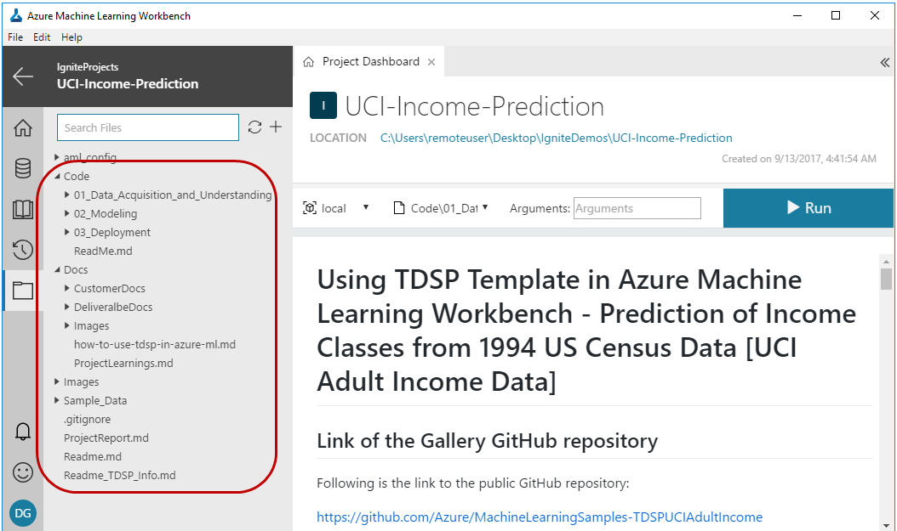

# Income Classification With Team Data Science Process (TDSP) Project

## [Link To GitHub Repository](https://github.com/Azure/MachineLearningSamples-TDSPUCIAdultIncome)
We provide summary documentation here about the sample. More extensive documentation can be found on the GitHub site.

## Introduction

Standardization of the structure and documentation of data science projects, that is anchored to an established [data science lifecycle](https://github.com/Azure/Microsoft-TDSP/blob/master/Docs/lifecycle-detail.md), is key to facilitating effective collaboration on data science teams. Creating Azure Machine Learning Workbench projects with the [Team Data Science Process (TDSP)](https://github.com/Azure/Microsoft-TDSP) template provides a framework for such standardization.

We had previously released a [GitHub repository for the TDSP project structure and templates](https://github.com/Azure/Azure-TDSP-ProjectTemplate). But it was not possible, until now to instantiate the TDSP structure and templates within a data science tool. We have now enabled creation of Azure Machine Learning Workbench projects that are instantiated with [TDSP structure and documentation templates for Azure ML Workbench](https://github.com/amlsamples/tdsp). Instructions on how to use TDSP structure and templates in Azure Machine Learning Workbench is provided [here](how-to-use-tdsp-in-azure-ml.md). Here we provide an example of how an actual machine learning project can be created using TDSP structure, populated with project-specific code and documents, and executed within the Azure Machine Learning Workbench.

### Purpose & Scope
The primary purpose of this sample is to show how to instantiate and execute a data science project using the [Team Data Science Process (TDSP)](https://github.com/Azure/Microsoft-TDSP) structure and templates in Azure Machine Learning Workbench.

 * This sample shows data exploration, training, and deployment of a machine learning model which address the above prediction problem described in the Use Case Overview below. 
 * We execute the project in Azure Machine Learning Workbench. We use the Team Data Science Process template from Azure ML Workbench for this project. 
 * Finally, we operationalize the solution directly from Azure Machine Learning Workbench in Azure Container Services for batch and single-mode scoring.

 The project highlights several features of Azure Machine Learning Workbench, such TDSP structure instantiation, execution of code in Jupyter notebooks as well as Python files, and easy operationalization

## [Team Data Science Process (TDSP) Lifecycle](https://github.com/Azure/Microsoft-TDSP/blob/master/Docs/lifecycle-detail.md)

## Pre-Requisites
### Required: Subscription, hardware, software
1. An Azure [subscription](https://azure.microsoft.com)
2. This tutorial was tested on an Azure Data Science Virtual Machine (DSVM) Windows Server 2016, (VM Size: [DS3_V2](https://docs.microsoft.com/azure/virtual-machines/windows/sizes), with 4 virtual CPUs and 14-Gb RAM). 
3. Please review [how to get started and FAQs](faq.md) on Azure ML Workbench and its related services.
4. Make sure that you have properly installed Azure ML Workbench by following the [installation guide](https://github.com/Azure/ViennaDocs/blob/master/Documentation/Installation.md).

### Informational: Instructions for Azure Machine Learning (AML) Workbench
* [FAQ - How to get started](faq.md)
* [Overview](overview-what-is-azure-ml.md)
* [Installation](quick-start-installation.md)
* [Using TDSP](how-to-use-tdsp-in-azure-ml.md)
* [Using Jupyter Notebooks](how-to-use-jupyter-notebooks.md)
* [Using GPU](how-to-use-gpu.md)
* [Read and write files](how-to-read-write-files.md)
* [Deploying an ML model as a web service](model-management-service-deploy.md)

### Informational: Data
The dataset for this sample is from the UCI ML Repository [[link]](https://archive.ics.uci.edu/ml/datasets/adult). It is taken from the 1994 US Census database and contains census and income information for about 50,000 individuals. This is structured dataset having numerical and categorical features, and a categorical target for binary classification. 

## Use Case Overview
The problem is to understand how socio-economic data captured in US Census can help predict annual income of individuals in US. Based on such Census features, the machine learning task is to predict if the income of an individual is above $50,000 or not (binary classification task).

## Data Description
For detailed information about the data, see the [description](https://archive.ics.uci.edu/ml/machine-learning-databases/adult/adult.names) in the UCI repository. 

This data was extracted from the Census Bureau database found at: https://www.census.gov/en.html. 

There are a total of 48,842 instances (prior to any filtering), mix of continuous and discrete (train=32,561, test=16,281)
Probability for the label '>50 K'  : 23.93% / 24.78% (without unknowns)
Probability for the label '<=50 K' : 76.07% / 75.22% (without unknowns)

* TARGET: Income class >50K, <=50 K.
* FEATURES: Age, work class, education level, education level, race, sex, hours of work per week, etc.

## Project Structure & Reporting

### Structure
For this project, we use the TDSP folder structure and documentation templates (Figure 1), which follows the [TDSP lifecycle](https://github.com/Azure/Microsoft-TDSP/blob/master/Docs/lifecycle-detail.md). 

Project is created based on instructions provided [here](https://github.com/amlsamples/tdsp/blob/master/Docs/how-to-use-tdsp-in-azure-ml.md).

The step-by-step data science workflow was as follows:

* [**Data Acquisition and Understanding**](https://github.com/Azure/MachineLearningSamples-TDSPUCIAdultIncome/tree/master/Code/01_Data_Acquisition_and_Understanding)

Data was downloaded in .csv form from URLs at UCI ML Repository [[link]](https://archive.ics.uci.edu/ml/datasets/adult). Features, target, and their transformations are described in detail in the ProjectReport.md file.

Data exploration is performed using the Python 3 [IDEAR (Interactive Data Exploration and Reporting) utility](https://github.com/Azure/Azure-TDSP-Utilities/tree/master/DataScienceUtilities/DataReport-Utils/Python) published as a part of [TDSP suite of data science tools](https://github.com/Azure/Azure-TDSP-Utilities). This utility helps to generate standardized data exploration reports for data containing numerical and categorical features and target. Details of how the Python 3 IDEAR utility was used is provided below. 

The location of the final data exploration report is [here](https://github.com/Azure/MachineLearningSamples-TDSPUCIAdultIncome/tree/master/Docs/DeliveralbeDocs).

* [**Modeling**](https://github.com/Azure/MachineLearningSamples-TDSPUCIAdultIncome/tree/master/Code/02_Modeling)
We created two models with 3-fold cross-validation: Elastic Net and Random forest. We used [59-point sampling](http://www.jmlr.org/papers/volume13/bergstra12a/bergstra12a.pdf)  for random grid search as a strategy for cross-validation. Accuracy of the models were measured using AUC (Area under curve) on the test data set. AUC of both Elastic Net and Random Forest models were > 0.85. We save both models in pickled.pkl files, and output the ROC plots for both models. In addition, for model interpretation, feature importance for the Random Forest model are output in a .csv file and plotted in a pdf (top predictive features only).

* [**Deployment**](https://github.com/Azure/MachineLearningSamples-TDSPUCIAdultIncome/tree/master/Code/03_Deployment)
We  deployed a web-service on a cluster in the [Azure Container Service (ACS)](https://azure.microsoft.com/services/container-service/). The operationalization environment provisions Docker and Kubernetes in the cluster to manage the web-service deployment. You can find further information on the operationalization process [here](model-management-service-deploy.md).

### Reporting
Details about each of the above sections are provided in the project report [ProjectReport](https://github.com/Azure/MachineLearningSamples-TDSPUCIAdultIncome/ProjectReport.md). The project report also contains further details about the use case, model performance metrics, deployment, and infrastructure.

## Conclusion & Next Steps

In this sample, we showed now to use TDSP structure and templates in Azure Machine Learning Workbench. We hope you use this feature of Azure Machine Learning Workbench to facilitate with project structure standardization and collaboration within your data science teams.

## References

Team Data Science Process (TDSP):  [https://github.com/Azure/Microsoft-TDSP](https://github.com/Azure/Microsoft-TDSP)

TDSP project template for Azure Machine Learning Workbench: [https://github.com/amlsamples/tdsp](https://github.com/amlsamples/tdsp)