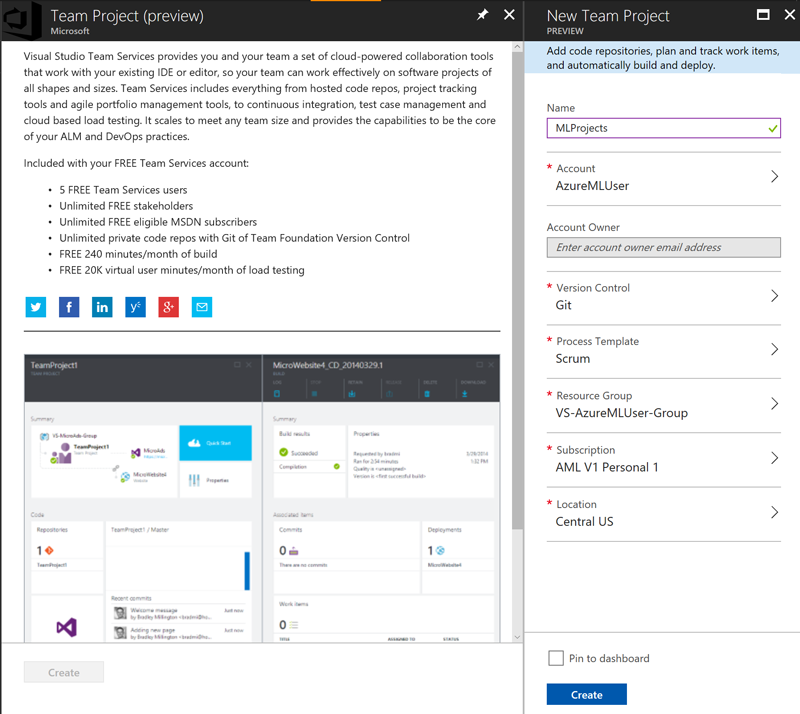
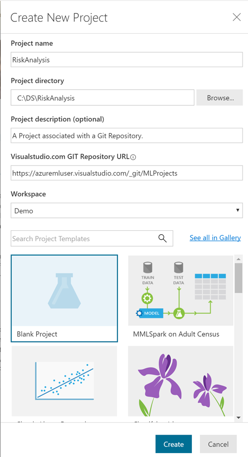
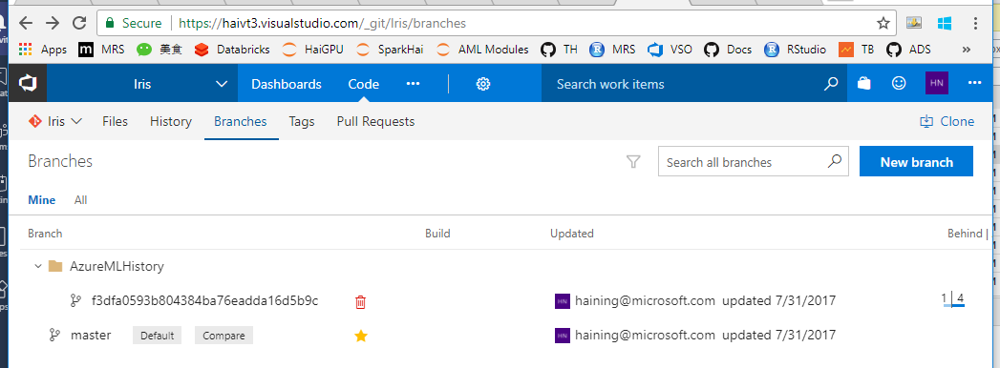

# Using Git repository with an Azure Machine Learning Workbench project
This document provides information on how Azure Machine Learning Workbench uses Git to provide version control and ensure reproducibility in your data science experiment. Instructions on how to associate your project with a cloud Git repository are also provided.

## Introduction
Azure Machine Learning Workbench is designed with Git integration from the ground up. When creating a new project, the project folder is automatically "Git-initialized" as a local Git repository (repo). Meanwhile, a second hidden local Git repo is also created with a branch named _AzureMLHistory/<project_GUID>_ to keep track of project folder changes for each execution. 

Associating the Azure ML project with a Git repo, hosted within a Visual Studio Team Service (VSTS) project, enables automatic version-control both locally and remotely. This association lets anybody with access to the remote repo download the latest source code to another computer (roaming).  

> [!NOTE]
> VSTS has its own access control list that is independent of Azure Machine Learning Experimentation Service. User access may vary between a Git repo and an Azure ML workspace or project, and may need to be managed. So if you want to share your Azure ML Project with a team member including code level access, in addition to just share the workspace, you need to explicitly grant him/her proper access to the VSTS Git repo. 

With Git, it is also possible to manage version control explicitly by using the _master_ branch or by creating other branches on the repo. You can just use the local Git repo, and you can also push to the remote Git repo if provisioned.

This diagram depicts the relationship between a VSTS Git repo and an Azure ML project:


To get started using a remote Git repo, follow these basic instructions.

> [!NOTE]
> Currently, Azure Machine Learning only supports Git repositories on VSTS Accounts. Support for General Git repos (such as GitHub and etc.) is planned in the future.

## Step 1. Create an Azure ML Experimentation Account
If not already done, create an Azure ML Experimentation Account and install the Azure ML Workbench app. See more details in the [Install and create Quickstart](quickstart-installation.md).

## Step 2. Create a Team project or use an existing Team project
From [Azure portal](https://portal.azure.com/), create a new **Team Project**.
1. Click on **+**
2. Search for **"Team Project"**
3. Enter the required information.
    - Name: A team name.
    - Version Control: **Git**
    - Subscription: The one with an Azure Machine Learning Experimentation Account.
    - Location: Ideally stay in a region that is close to your Azure Machine Learning Experiment resources.
4. Click **Create**. 



Make sure you sign in with the same Azure Active Directory (AAD) account you are using to access the Azure Machine Learning Workbench. Otherwise, the system cannot access it using your AAD credential, unless you use command line to create the Azure ML project and supply a personal access token to access the Git repo. More on this later.

Once the Team Project is created, you are ready to move to the next step.

To navigate directly to the Team Project just created, the URL is `https://<team_project_name>.visualstudio.com`.

## Step 3. Create a new Azure ML project with a remote Git repo
Launch Azure ML Workbench and create a new project. Fill the Git repo text box with the VSTS Git repo URL that you get from Step 2. It typically looks like this: `http://<vsts_account_name>.visualstudio.com/_git/<project_name>`



You can also create the project using command line tool. You have the option to supply an personal access token. Azure ML can use this token to access the Git repo on your behalf, instead of relying on your AAD credential:

```
# create a new project with a Git repo and personal access token.
$ az ml project create -a <experimentation account name> -n <project name> -g <resource group name> -w <workspace name> -r <Git repo URL> --vststoken <VSTS personal access token>
```
> [!IMPORTANT]
> If you choose the blank project template, it is OK if the Git repo you choose already has a _master_ branch. Azure ML simply clones the _master_ branch locally, and add the `aml_config` folder and other project metadata files to the local project folder. But if you choose any other project template, your Git repo must not already have a _master_ branch, or you will see an error. The alternative is to use `az ml project create` command line tool to create the project and supply a `--force` switch. This deletes the files on the original master branch and replace them with the new files in the template you choose.

Now a new Azure ML project is created with remote Git repo integration enabled and ready to go. The project folder is always Git-initialized as a local Git repo. And the Git _remote_ is set to the remote VSTS Git repo so commits can be pushed into the remote Git repo.

## Step 3a. Associate an existing Azure ML project with a VSTS Git repo
Optionally, you can also create a Azure ML project without a VSTS Git repo, and just rely on the local Git repo for run history snapshots. And you can associate a VSTS Git repo later with this existing Azure ML project using the following command:

```azurecli
# make sure you are in the project path so CLI has context of your current project
$ az ml project update --repo http://<vsts_account_name>.visualstudio.com/_git/<project_name>
```

> [!NOTE] 
> You can only perform the update-repo operation on an Azure ML project that does not have a Git repo associated with it. And once the Git repo is associated, it cannot be removed.

## Step 4. Capture project snapshot in Git repo
Now you can execute a few script runs in the project, make some changes in-between the runs. You can do this either from the desktop app, or from CLI using `az ml experiment submit` command. For more details, you can follow the [Classifying Iris tutorial](tutorial-classifying-iris-part-1.md). For each run, if there is any change made in any files in the project folder, a snapshot of the entire project folder is committed and pushed into the remote Git repo under a branch named `AzureMLHistory/<Project_GUID>`. You can view the branches and commits by browsing to the VSTS Git repo URL and find this branch. 

> [!NOTE] 
> The snapshot is only committed before a script execution. Currently a data prep execution or a Notebook cell execution does not trigger the snapshot.



> [!IMPORTANT] 
> It is best if you do not operate in the history branch yourself using Git commands. Doing so might mess up run history. Use master branch or create other branches instead for your own Git operations.

## Step 5. Restore a previous project snapshot 
To restore the entire project folder to the state of a previous run history project state snapshot, from Azure ML Workbench:
1. Click on **Runs** in the activity bar (glass-hour icon).
2. From the **Run List** view, click on the run you want to restore.
3. From the **Run Detail** view, click on **Restore**.


Alternatively, you can use the following command from the Azure ML Workbench CLI window.

```azurecli
# discover the run I want to restore snapshot from:
$ az ml history list -o table

# restore the snapshot from a particular run
$ az ml project restore --run-id <run_id>
```

By executing this command, we will overwrite the entire project folder with the snapshot taken when that particular run was kicked off. But your project stays on the current branch. This means that you will **lose all changes** in your current project folder. So please be extra careful when you run this command. You might want to Git to commit your changes to the current branch before performing the above operation. See before for more details.

## Step 6. Use the master branch
One way to avoid accidentally losing your current project state, is to commit the project to the master branch (or any branch you created yourself) of the Git repo. You can directly use Git from command line (or your other favorite Git client tool of choice) to operate on the master branch. For example:

```
# check status to make sure you are on the master branch (or branch of your choice)
$ git status

# stage all changes
$ git add -A

# commit all changes locally on the master branch
$ git commit -m 'these are my updates so far'

# push changes into the remote VSTS Git repo master branch.
$ git push origin master
```

Now you can safely restore project to an earlier snapshot following Step 5, knowing that you can always come back to the commit you just made on the master branch.

## Authentication
If you just rely the run history functions in Azure ML for taking project snapshots and restoring them, you don't need to worry about Git repo authentication. It is taken care by the Experimentation Service layer.

However, if you use your own Git tools to manage version control, you will need to properly handle authentication against the remote Git repo on VSTS. In Azure ML, the remote Git repo is added to the local repo as a Git remote using HTTPS protocol. This means when you issue Git commands to the remote (such as push or pull), you need to provide user name, and password or personal access token. Follow [these instructions](https://docs.microsoft.com/vsts/accounts/use-personal-access-tokens-to-authenticate) to create personal access token in a VSTS Git repo.

## Next steps
Learn how to use the Team Data Science Process to organize your project structure, see [Structure a project with TDSP](how-to-use-tdsp-in-azure-ml.md)
